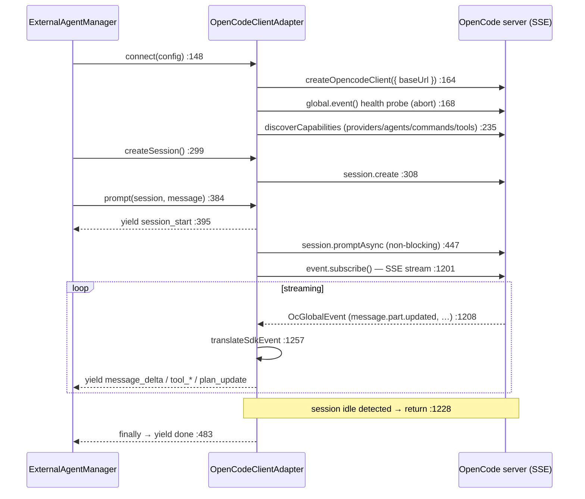

# OpenCode Adapter

<Status variant="stable" />

<TLDR>
  The second protocol. `OpenCodeClientAdapter` (`opencode-client.ts:122`) drives an
  [OpenCode](https://opencode.ai) server through the official `@opencode-ai/sdk/client` — typed HTTP
  calls plus a **Server-Sent Events** stream — rather than ACP's JSON-RPC-over-stdio. It connects to
  `http://127.0.0.1:4096` by default (`:154`), submits a prompt non-blocking with
  `session.promptAsync` (`:447`), and consumes `client.event.subscribe()` SSE
  (`streamSessionEvents` `:1197`), translating each SDK event into the same canonical
  `ExternalAgentEvent` stream ACP produces. Both clients extend `BaseProtocolAdapter`
  (`protocol-adapter.ts:258`) and are looked up by protocol id from `protocolAdapterRegistry`
  (`:523`) — so [the manager](./manager) selects ACP vs OpenCode by a single `registry.create()`
  call and never branches again.
</TLDR>

<StatGrid>
  <Stat label="opencode-client.ts" value="1659 lines" hint="OpenCodeClientAdapter — the only export" />
  <Stat label="protocol-adapter.ts" value="523 lines" hint="ProtocolAdapter + BaseProtocolAdapter + registry" />
  <Stat label="Default endpoint" value="127.0.0.1:4096" hint="opencode-client.ts:154" />
  <Stat label="Transport" value="HTTP + SSE" hint="vs ACP's JSON-RPC / stdio" />
  <Stat label="Submit model" value="promptAsync" hint="non-blocking, then SSE stream :447" />
  <Stat label="Registry select" value="create(protocol)" hint="protocol-adapter.ts:499" />
</StatGrid>

## The ProtocolAdapter Contract

`protocol-adapter.ts` is the abstraction that lets two very different wire protocols look identical
to the manager. Three pieces:

| Symbol | Line | Role |
| --- | --- | --- |
| `ProtocolAdapter` | 32 | The interface every client implements — required `connect`/`disconnect`/`createSession`/`prompt`/`execute`/`respondToPermission`/`cancel`/`healthCheck`, plus **optional** ACP-extension methods (`:112`–`:193`) that non-ACP adapters may omit. |
| `BaseProtocolAdapter` | 258 | Abstract base with shared state (status/capabilities/tools/sessions) and a **concrete `execute()`** (`:310`) that drains the async `prompt()` stream into an `ExternalAgentResult`. |
| `ProtocolAdapterRegistry` | 474 | Factory registry keyed by protocol string; `create(protocol)` (`:499`) instantiates the right adapter. The global singleton is `protocolAdapterRegistry` (`:523`). |

`SessionCreateOptions` (`:223`) is the shared session-setup payload (cwd, mcpServers, permissionMode,
`instructionEnvelope` `:233`, systemPrompt, `briefMode` `:248`).

### Why there is no protocol `switch`

Selection is **registration + lookup**, not branching. The manager registers default factories in
`registerDefaultAdapters` (`manager.ts:563`) and resolves one with
`protocolAdapterRegistry.create(config.protocol)` (`manager.ts:978`). ACP registers under `"acp"`,
OpenCode under `"opencode"` (`opencode-client.ts:123`). Adding a third protocol is a registration,
not an edit to the manager.

### The shared execute() fold

`BaseProtocolAdapter.execute()` (`:310`) is what the headless path calls. It consumes the
protocol-agnostic event stream and folds it into a result — the switch at `:334`:

| Event | Fold action | Line |
| --- | --- | --- |
| `message_delta` | accumulate text / thinking | 335 |
| `tool_use_start` | push pending tool call | 343 |
| `tool_use_end` | set tool input | 352 |
| `tool_result` | set result / status / error | 361 |
| `permission_request` | invoke `onPermissionRequest` → `respondToPermission` | 375 |
| `plan_update` / `progress` | `onProgress` | 382 / 386 |
| `done` | success + token usage | 395 |

Because this lives in the base class, **both** ACP and OpenCode get identical result assembly for
free — only the streaming `prompt()` differs per protocol.

## OpenCode: Connect → Run → Stream

Unlike ACP, OpenCode is a **server SDK**: there is no stdin/stdout framing, and session extensions
are declared supported without probing (`getSessionExtensionSupport` `:609`). The adapter even
**synthesizes** ACP-shaped init metadata (`getAcpInitializationMetadata` `:625`, hard-coding
`protocolVersion: 1`) so the manager's negotiation code works uniformly.

`prompt` (`:384`) resolves system/model/agent overrides (`:418`), wires an `AbortController` to
`options.signal` (`:434`), submits with `session.promptAsync` (`:447`), then streams. If the async
submit throws and the turn wasn't aborted, it **falls back to the synchronous `session.prompt`**
(`:463`) and emits events from the returned message via `emitEventsFromMessage` (`:1446`).

## SDK Event Translation

Two paths converge on the canonical event stream: live SSE via `translateSdkEvent` (`:1257`) and the
sync-fallback via `emitEventsFromMessage` (`:1446`). The SSE switch (`:1261`):

| OpenCode SDK event | → canonical event | Line |
| --- | --- | --- |
| `message.part.updated` · `text` | `message_delta` (text, uses `delta ?? part.text`) | 1284 |
| `message.part.updated` · `reasoning` | `thinking` | 1299 |
| `message.part.updated` · `tool` (pending/running) | `tool_use_start` | 1317 |
| `message.part.updated` · `tool` (completed) | `tool_result` (isError:false) | 1326 |
| `message.part.updated` · `tool` (error) | `tool_result` (isError:true) | 1336 |
| `todo.updated` | `plan_update` (computed progress/step/total) | 1353 |
| `permission.updated` | `permission_request` | 1384 |
| `session.error` | `error` (recoverable:true) | 1407 |
| `server.connected` / `session.*` lifecycle | no-op (parts arrive separately) | 1262 |

The stream loop (`:1197`) detects completion by `session.status.type === "idle"` (`:1224`) or a
`session.idle` event (`:1234`), and **early-returns on `done`** (`:1218`); the `finally` aborts the
SSE controller (`:1243`).

## ACP vs OpenCode at a Glance

| Dimension | ACP (`acp-client.ts`) | OpenCode (`opencode-client.ts`) |
| --- | --- | --- |
| Wire | JSON-RPC 2.0, newline-delimited stdio | Typed SDK over HTTP + SSE |
| Process | Cognia spawns the CLI (Rust bridge) | Connects to a running server |
| Roles | **Inverted** — agent calls back for fs/terminal/permission | Conventional client → server |
| Capability discovery | `initialize` handshake, real negotiation | `discoverCapabilities` fan-out; init metadata synthesized |
| Session extensions | Probed, may be `unsupported` | Declared supported, no probing |
| Permission | `session/request_permission` request | `permission.updated` event + `postSessionIdPermissions…` |
| Submit | `session/prompt` request, streamed via notifications | `session.promptAsync` + SSE subscribe |

Both end at the same place — a stream of `ExternalAgentEvent`s the manager yields and the
[translation layer](./translation) turns into chat parts.
