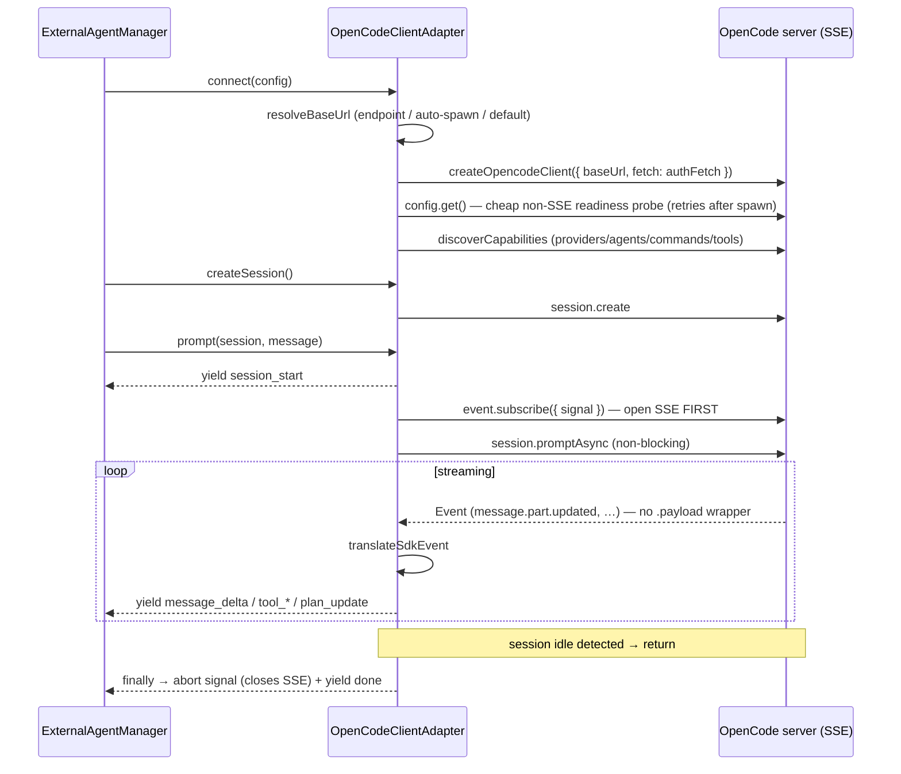

# OpenCode Adapter

<Status variant="stable" />

<TLDR>
  The second protocol. `OpenCodeClientAdapter` drives an
  [OpenCode](https://opencode.ai) server through the official `@opencode-ai/sdk/client` — typed HTTP
  calls plus a **Server-Sent Events** stream — rather than ACP's JSON-RPC-over-stdio. It connects to
  `http://127.0.0.1:4096` by default (or **auto-spawns `opencode serve` on desktop**, or connects to
  a configured endpoint, optionally with auth). It **opens the `client.event.subscribe()` SSE stream
  before** submitting the prompt with `session.promptAsync` (so no early streamed parts are missed),
  then translates each SDK event into the same canonical `ExternalAgentEvent` stream ACP produces.
  Both clients extend `BaseProtocolAdapter` and are looked up by protocol id from
  `protocolAdapterRegistry` — so [the manager](./manager) selects ACP vs OpenCode by a single
  `registry.create()` call and never branches again.
</TLDR>

<StatGrid>
  <Stat label="opencode-client.ts" value="1659 lines" hint="OpenCodeClientAdapter — the only export" />
  <Stat label="protocol-adapter.ts" value="523 lines" hint="ProtocolAdapter + BaseProtocolAdapter + registry" />
  <Stat label="Server" value="endpoint / auto-spawn / 4096" hint="resolveBaseUrl — desktop auto-spawns opencode serve" />
  <Stat label="Transport" value="HTTP + SSE" hint="vs ACP's JSON-RPC / stdio" />
  <Stat label="Submit model" value="subscribe → promptAsync" hint="open SSE first, then non-blocking submit" />
  <Stat label="Auth" value="Basic / Bearer / headers" hint="buildAuthFetch — custom fetch" />
</StatGrid>

## The ProtocolAdapter Contract

`protocol-adapter.ts` is the abstraction that lets two very different wire protocols look identical
to the manager. Three pieces:

| Symbol | Line | Role |
| --- | --- | --- |
| `ProtocolAdapter` | 32 | The interface every client implements — required `connect`/`disconnect`/`createSession`/`prompt`/`execute`/`respondToPermission`/`cancel`/`healthCheck`, plus **optional** ACP-extension methods (`:112`–`:193`) that non-ACP adapters may omit. |
| `BaseProtocolAdapter` | 258 | Abstract base with shared state (status/capabilities/tools/sessions) and a **concrete `execute()`** (`:310`) that drains the async `prompt()` stream into an `ExternalAgentResult`. |
| `ProtocolAdapterRegistry` | 474 | Factory registry keyed by protocol string; `create(protocol)` (`:499`) instantiates the right adapter. The global singleton is `protocolAdapterRegistry` (`:523`). |

`SessionCreateOptions` (`:223`) is the shared session-setup payload (cwd, mcpServers, permissionMode,
`instructionEnvelope` `:233`, systemPrompt, `briefMode` `:248`).

### Why there is no protocol `switch`

Selection is **registration + lookup**, not branching. The manager registers default factories in
`registerDefaultAdapters` (`manager.ts:563`) and resolves one with
`protocolAdapterRegistry.create(config.protocol)` (`manager.ts:978`). ACP registers under `"acp"`,
OpenCode under `"opencode"` (`opencode-client.ts:123`). Adding a third protocol is a registration,
not an edit to the manager.

### The shared execute() fold

`BaseProtocolAdapter.execute()` (`:310`) is what the headless path calls. It consumes the
protocol-agnostic event stream and folds it into a result — the switch at `:334`:

| Event | Fold action | Line |
| --- | --- | --- |
| `message_delta` | accumulate text / thinking | 335 |
| `tool_use_start` | push pending tool call | 343 |
| `tool_use_end` | set tool input | 352 |
| `tool_result` | set result / status / error | 361 |
| `permission_request` | invoke `onPermissionRequest` → `respondToPermission` | 375 |
| `plan_update` / `progress` | `onProgress` | 382 / 386 |
| `done` | success + token usage | 395 |

Because this lives in the base class, **both** ACP and OpenCode get identical result assembly for
free — only the streaming `prompt()` differs per protocol.

## OpenCode: Connect → Run → Stream

Unlike ACP, OpenCode is a **server SDK**: there is no stdin/stdout framing, and session extensions
are declared supported without probing (`getSessionExtensionSupport` `:609`). The adapter even
**synthesizes** ACP-shaped init metadata (`getAcpInitializationMetadata` `:625`, hard-coding
`protocolVersion: 1`) so the manager's negotiation code works uniformly.

`prompt` resolves system/model/agent overrides, wires an `AbortController` to `options.signal`, then
**opens `event.subscribe({ signal })` before** calling `session.promptAsync`. Subscribing first is
load-bearing: the SSE stream has no replay, so opening it after the submit would drop the early
`message.part.updated` parts. If the async submit throws and the turn wasn't aborted, it **falls back
to the synchronous `session.prompt`** and emits events from the returned message via
`emitEventsFromMessage`. The `finally` aborts the controller, which tears down the SSE fetch.

> **Why `event.subscribe()` has no `.payload`.** `client.event.subscribe()` yields `Event` objects
> directly (the `{ type, properties }` discriminated union). Only `client.global.event()` wraps each
> event in a `{ directory, payload }` `GlobalEvent`. The adapter consumes `subscribe()`, so it reads
> `event.type` / `event.properties` straight off the stream.

## Server lifecycle: connect vs. auto-spawn

`resolveBaseUrl` picks the server in priority order:

1. **Explicit endpoint** — `network.endpoint` always wins (connect to an already-running server).
2. **Auto-spawn (desktop)** — when `metadata.autoSpawnServer` is set (or a `process.command` is
   configured), `spawnServer` launches `opencode serve --hostname=127.0.0.1 --port=0` through the
   existing external-agent process bridge (`lib/native/external-agent.ts` →
   `src-tauri/.../external_agent`). It parses the **`opencode server listening on <url>`** stdout
   line to discover the real port, then connects. `disconnect()` kills the spawned process. Requires
   the Tauri runtime; throws a clear error on web.
3. **Default** — `http://127.0.0.1:4096` (or `metadata.hostname`/`metadata.port`).

After resolving, `connect` probes readiness with a cheap **`config.get()`** call (not the persistent
`global.event()` SSE — which the old code leaked). When the server was just auto-spawned, the probe
retries briefly to cover the gap between the "listening" log line and the HTTP server accepting
requests.

## Authentication

`buildAuthFetch` returns a custom `fetch` (passed to `createOpencodeClient`) that injects an
`Authorization` header on every request, including the SSE stream:

| Source | Header |
| --- | --- |
| `metadata.serverPassword` (+ optional `metadata.serverUsername`, default `opencode`) | `Basic base64(user:pass)` — matches `OPENCODE_SERVER_PASSWORD` |
| `network.bearerToken` / `network.apiKey` | `Bearer <token>` |
| `network.headers` | merged verbatim |

No auth configured → `fetch` is `undefined` and the SDK uses the default.

## SDK Event Translation

Two paths converge on the canonical event stream: live SSE via `translateSdkEvent` (`:1257`) and the
sync-fallback via `emitEventsFromMessage` (`:1446`). The SSE switch (`:1261`):

| OpenCode SDK event | → canonical event | Line |
| --- | --- | --- |
| `message.part.updated` · `text` | `message_delta` (text, uses `delta ?? part.text`) | 1284 |
| `message.part.updated` · `reasoning` | `thinking` | 1299 |
| `message.part.updated` · `tool` (pending/running) | `tool_use_start` | 1317 |
| `message.part.updated` · `tool` (completed) | `tool_result` (isError:false) | 1326 |
| `message.part.updated` · `tool` (error) | `tool_result` (isError:true) | 1336 |
| `todo.updated` | `plan_update` (computed progress/step/total) | 1353 |
| `permission.updated` | `permission_request` | 1384 |
| `session.error` | `error` (recoverable:true) | 1407 |
| `server.connected` / `session.*` lifecycle | no-op (parts arrive separately) | 1262 |

The stream loop detects completion by `session.status.type === "idle"` or a `session.idle` event,
and **early-returns on `done`**. The SSE stream is torn down by aborting the `AbortSignal` passed to
`event.subscribe({ signal })` (the adapter aborts it in `prompt`'s `finally`).

## ACP vs OpenCode at a Glance

| Dimension | ACP (`acp-client.ts`) | OpenCode (`opencode-client.ts`) |
| --- | --- | --- |
| Wire | JSON-RPC 2.0, newline-delimited stdio | Typed SDK over HTTP + SSE |
| Process | Cognia spawns the CLI (Rust bridge) | Connects to a running server **or auto-spawns `opencode serve` (desktop)** |
| Roles | **Inverted** — agent calls back for fs/terminal/permission | Conventional client → server |
| Capability discovery | `initialize` handshake, real negotiation | `discoverCapabilities` fan-out; init metadata synthesized |
| Session extensions | Probed, may be `unsupported` | Declared supported, no probing |
| Permission | `session/request_permission` request | `permission.updated` event + `postSessionIdPermissions…` |
| Submit | `session/prompt` request, streamed via notifications | `session.promptAsync` + SSE subscribe |

Both end at the same place — a stream of `ExternalAgentEvent`s the manager yields and the
[translation layer](./translation) turns into chat parts.
