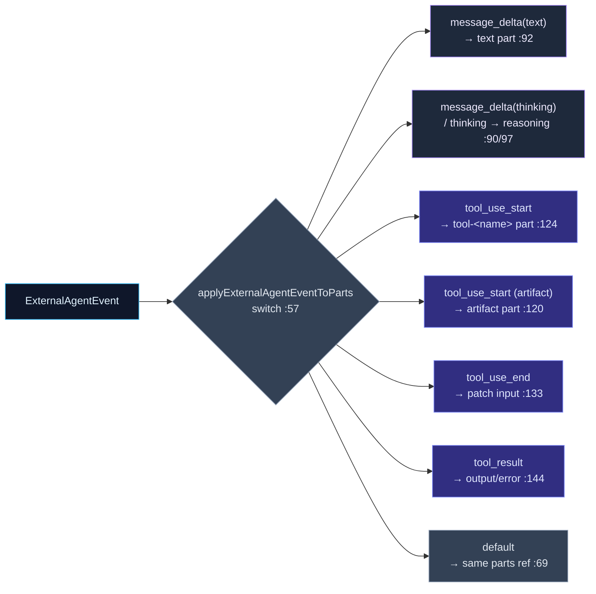

# Event Translation

<Status variant="stable" />

<TLDR>
  Two pure modules sit between the protocol clients and the chat renderer. `translators.ts` does the
  *model* translation: ACP tool definitions → executable `AgentTool`s via a full **JSON-Schema→Zod**
  compiler (`acpToolToAgentTool` `:82`, `jsonSchemaToZod` `:163`), Cognia `ToolCall` ⇄ ACP tool-use,
  `ExternalAgentResult` ⇄ `SubAgentResult` (so external agents can act as Agent-Team members), and a
  set of stream folds that reduce an `ExternalAgentEvent[]` into response text, thinking, tool calls,
  and `ExternalAgentStep[]` (`eventsToSteps` `:721`). `event-to-parts.ts` does the *render*
  translation: a stateless reducer (`applyExternalAgentEventToParts` `:53`) that applies one event to
  the current `parts[]` and returns the next — `message_delta` → `text`/`reasoning` parts,
  `tool_use_start` → a `tool-<name>` part (or an `artifact` part), `tool_result` → output/error on
  that part. The renderer then treats an external turn exactly like a built-in one.
</TLDR>

<StatGrid>
  <Stat label="translators.ts" value="981 lines" hint="model translation + JSON-Schema→Zod + event folds" />
  <Stat label="event-to-parts.ts" value="208 lines" hint="pure event → UIMessage.parts reducer" />
  <Stat label="Schema compiler" value="jsonSchemaToZod :163" hint="strings/numbers/arrays/objects/enum/const/oneOf/allOf/$ref" />
  <Stat label="Event→step folds" value="8 cases" hint="eventsToSteps switch :727" />
  <Stat label="Part kinds emitted" value="3" hint="text · reasoning · tool-<name> (+ artifact)" />
  <Stat label="No-op default" value="same ref" hint="unhandled events return parts unchanged :69" />
</StatGrid>

## translators.ts — Model Translation

The file is organized into banner-delimited concern groups: message translators (`:25`), tool
translators (`:72`), result translators (`:547`), event translators (`:637`), permission translators
(`:829`), and content helpers (`:859`). It produces neither the canonical validity snapshot (that's
[canonical-contract](./canonical-readiness)) nor UIMessage parts (that's event-to-parts) — it
converts *models*.

### The JSON-Schema → Zod tool bridge

When an ACP agent advertises a tool, its parameters arrive as JSON Schema. To make the tool callable
as an `AgentTool` (with runtime validation), `acpToolToAgentTool` (`:82`) compiles that schema to a
Zod validator via `jsonSchemaToZod` (`:163`). `acpToolsToAgentTools` (`:103`) maps many and prefixes
keys with `external_<name>`.

The compiler dispatches in `convertSchemaNode` (`:196`):

| Schema construct | Handling | Line |
| --- | --- | --- |
| `$ref` | `z.lazy()` with circular protection; local `#/` refs only | 206 / 506 |
| `const` / `enum` | literal / enum | 211 / 216 |
| `oneOf` / `anyOf` | `z.union` | 221 |
| `allOf` | `z.intersection` | 227 |
| `type: [..]` (nullable array) | union incl. null | 232 |
| typed node (string/number/integer/boolean/null/array/object) | `convertTypedNode` switch | 278 |
| string formats (email/uri/uuid/date-time/ipv4/ipv6) | Zod refinements | 318 |

This is the same pattern the in-app agent uses, so an external tool and a built-in tool validate
identically.

### Result ⇄ SubAgentResult

So an external agent can be a **member of an Agent Team**, `externalResultToSubAgentResult` (`:554`)
maps an `ExternalAgentResult` into the `SubAgentResult` shape (steps → numbered steps, tool calls →
tool results, token usage mapped via `externalTokenUsageToSubAgent` `:595`). `subAgentResultToExternal`
(`:606`) is the inverse.

### Event folds

For non-streaming consumers, several helpers reduce an event array:

| Helper | Line | Produces |
| --- | --- | --- |
| `extractResponseFromEvents` | 644 | concatenated `message_delta` text |
| `extractThinkingFromEvents` | 659 | concatenated thinking |
| `extractToolCallsFromEvents` | 676 | tool calls folded by `toolUseId` |
| `eventsToSteps` | 721 | `ExternalAgentStep[]` — the main state machine |

`eventsToSteps` (switch at `:727`) is the canonical event→step machine: `message_start` opens a
message step (`:728`), `message_delta` appends (`:741`), `message_end` closes it (`:755`),
`tool_use_start`/`tool_use_end`/`tool_result` build and complete a tool step (`:765`/`:782`/`:788`),
`thinking` pushes a standalone step (`:803`), `error` marks the current step failed (`:816`). The
result is what populates `ExternalAgentResult.steps`.

Permission display is `formatPermissionRequest` (`:836`), which turns an `AcpPermissionRequest` into a
UI-friendly `{title, description, riskLevel, …}` with risk labels (`:843`).

## event-to-parts.ts — Render Translation

This is the pure reducer that lets the chat renderer treat external turns like built-in ones. It is
deliberately stateless and decoupled from the ACP subprocess so it can be unit-tested without one
(header `:1`).

| Event | Resulting part mutation | Line |
| --- | --- | --- |
| `message_delta` `{text}` | append/create a `text` part (`state: "done"`) | 92 |
| `message_delta` `{thinking}` / `thinking` | append/create a `reasoning` part | 90 / 97 |
| `tool_use_start` (artifact tool) | an `artifact` part — when `artifact_create`/`artifact_update` with valid id+title | 120 / 187 |
| `tool_use_start` (other) | a new `tool-<toolName>` part (`state: "input-available"`) | 124 |
| `tool_use_end` | patch the matching tool part's `input` | 133 |
| `tool_result` | patch to `output-available` / `output-error` with `output`/`errorText` | 144 |
| everything else | parts returned **unchanged** (same reference) | 69 |

Two design choices matter:

- **Returning the same reference** when an event has no parts effect lets callers cheaply detect "no
  change" — important because the manager streams many control events
  (`permission_request`/`plan_update`/`commands_update`) that have their own UI channels and
  shouldn't churn the message.
- **Artifact promotion.** A tool named `artifact_create`/`artifact_update` becomes an
  [`ArtifactPart`](../built-in-agent/runtime-loop) rather than a generic tool part, with its `kind`
  clamped to the allowed set (`ARTIFACT_KIND_ALLOWED` `:176`, fallback `"code"`).

`buildPartsFromExternalAgentEvents` (`:77`) folds a whole stream at once for tests and non-streaming
callers. The plain `text` / `reasoning` / `tool-<name>` parts it emits are AI-SDK-native UIMessage
parts; the [parts-extensions](../built-in-agent/runtime-loop) module defines the richer Cognia parts
(`A2UIPart`, `ArtifactPart`, …) that share the same `UIMessage`.
