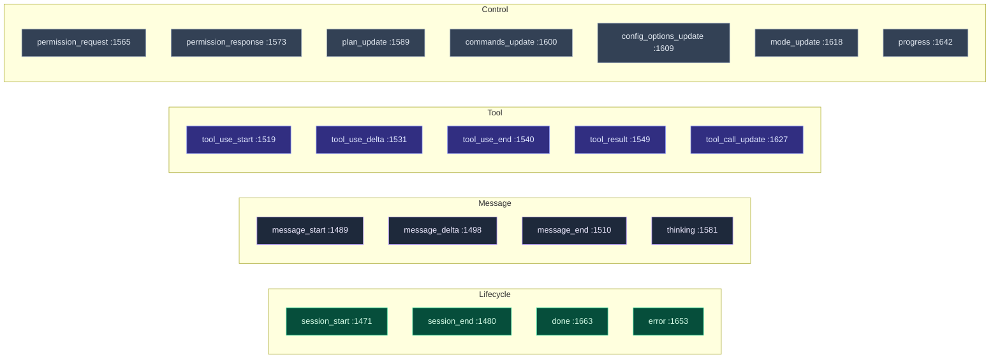

# Type & Contract

<Status variant="stable" />

<TLDR>
  `types/agent/external-agent.ts` is the contract the whole runtime is typed against — 2168 lines,
  zero runtime logic beyond serialization helpers and type guards. It declares **six** type
  families: the **protocol/transport taxonomy** (`ExternalAgentProtocol`, `:16`), the **canonical
  diagnostics model** (`ExternalAgentBranchReasonCode` `:36`, `ExternalAgentBranchOutcome` `:59`,
  `ExternalAgentValiditySnapshot` `:255`), the **ACP wire types** (`Acp*`, `:325`–`:1032`), the
  **configuration model** (`ExternalAgentConfig` `:1122`), the **session/message model**
  (`ExternalAgentSession` `:1233`), and the **streaming event union** (`ExternalAgentEvent` `:1673`,
  21 variants). Everything downstream — manager, clients, translators, UI — imports from here and
  nowhere else for these shapes.
</TLDR>

<StatGrid>
  <Stat label="File size" value="2168 lines" hint="types/agent/external-agent.ts — types + guards + serializers only" />
  <Stat label="Protocols / transports" value="6 / 4" hint="ExternalAgentProtocol :16 · ExternalAgentTransport :27" />
  <Stat label="Branch reason codes" value="18" hint="ExternalAgentBranchReasonCode :36" />
  <Stat label="Event variants" value="21" hint="ExternalAgentEvent union :1673" />
  <Stat label="ACP session updates" value="10" hint="AcpSessionUpdate :964" />
  <Stat label="Type guards" value="9" hint="isTextContent … isPermissionEvent :2080-2168" />
</StatGrid>

## The Protocol/Transport Taxonomy

Two orthogonal axes describe *how* Cognia reaches an agent. They are declared first because every
other type keys off them.

| Type | Line | Members | Notes |
| --- | --- | --- | --- |
| `ExternalAgentProtocol` | 16 | `acp` · `opencode` · `a2a` · `http` · `websocket` · `custom` | Only `acp` and `opencode` are executable today (see [readiness](./canonical-readiness)); the rest are reserved. |
| `ExternalAgentTransport` | 27 | `stdio` · `http` · `websocket` · `sse` | `stdio` is desktop-only (needs the Tauri spawn bridge). |
| `ExternalAgentStatus` | 305 | `idle` · `initializing` · `ready` · `executing` · `waiting_permission` · `paused` · `completed` · `failed` · `cancelled` · `timeout` | Drives `EXTERNAL_AGENT_STATUS_CONFIG` (`:1931`) for UI label/color/icon. |
| `ExternalAgentConnectionStatus` | 295 | `disconnected` · `connecting` · `connected` · `reconnecting` · `error` | Drives `EXTERNAL_AGENT_CONNECTION_STATUS_CONFIG` (`:1955`). |

## The Canonical Diagnostics Model

This is the load-bearing part of the file: the vocabulary the manager uses to explain *what happened
and why*. The [canonical contract](./canonical-readiness) module is the logic that fills these in;
here are the shapes.

| Type | Line | Role |
| --- | --- | --- |
| `ExternalAgentBranchReasonCode` | 36 | 18 machine-readable reason codes — from `ok` through `agent_not_found`, `protocol_unsupported`, `transport_blocked`, `ecosystem_prerequisite_missing`, `health_check_failed`, `extension_unsupported`, `permission_denied`, `execution_failed`, to `strict_failure` / `fallback_to_builtin`. |
| `ExternalAgentBranchOutcome` | 59 | The 5 terminal outcomes: `external` · `fallback` · `strict_failure` · `builtin` · `blocked`. |
| `ExternalAgentLifecycleCompletenessStage` | 69 | `config` · `connect` · `session_extensions` · `execution` · `fallback` · `recovery` — how far the lifecycle got. |
| `ExternalAgentExecutionEligibility` | 80 | `eligible` · `blocked`. |
| `ExternalAgentValiditySnapshot` | 255 | The **aggregate runtime fact** — `executable`, `lifecycleStage`, `blockedStage`, `executionEligibility`, `blockingReasonCode`, `healthStatus`, `sessionExtensions`, `negotiation`, `capabilitySnapshot`, `ecosystem`, `branchOutcome`, `recoveryHints`. Carried on both the live instance and the persisted config. |
| `ExternalAgentLastRunSnapshot` | 145 | Durable last-run outcome (`terminalOutcome`, `branchReasonCode`, `branchOutcome`, linked session/trace ids) — survives transient error banners. |
| `ExternalAgentEcosystemReadinessSnapshot` | 120 | Projected readiness facts (support tier, exec mode, prerequisites, recommended actions). |
| `ExternalAgentSessionExtensionSupport` | 246 | Per-method support map for `session/list`, `session/fork`, `session/resume`. |

### Support-tier and ecosystem vocabulary

The product-surface layer (see [Ecosystem & presets](./ecosystem-presets)) is typed here too:
`ExternalAgentEcosystemSupportTier` (`:85`, `executable | guided | documented-only`),
`ExternalAgentEcosystemExecutionMode` (`:90`, `direct | guided | external`),
`ExternalAgentEcosystemPrerequisiteState` (`:95`), and the projected
`ExternalAgentEcosystemPrerequisiteStatus` (`:104`, `ready | action-required | unknown | not-applicable`).

## The ACP Wire Surface

Lines 325–1032 mirror the [Agent Client Protocol](https://agentclientprotocol.com) spec one-to-one,
so [`acp-client.ts`](./acp-client) can stay a thin transport. The major groups:

| Group | Lines | Key types |
| --- | --- | --- |
| Permission modes & stop reasons | 325 / 336 | `AcpPermissionMode` (`default`/`acceptEdits`/`bypassPermissions`/`plan`/`dontAsk`), `AcpStopReason` |
| Plan & slash commands | 347 / 360 | `AcpPlanEntry`, `AcpAvailableCommand` |
| Session model / modes / config options | 373 / 387 / 753 | `AcpSessionModelState`, `AcpSessionModesState`, `AcpConfigOption` |
| MCP server config | 401–443 | `AcpMcpServerStdio` / `Http` / `Sse` union (`AcpMcpServerConfig`) |
| Initialization | 449 / 467 / 498 | `AcpClientCapabilities`, `AcpAgentCapabilities`, `AcpImplementationInfo` |
| Session updates | 560 / 964 | `AcpSessionUpdateType` (10), the `AcpSessionUpdate` union |
| Tool calls | 575 / 817 | `AcpToolCallStatus`, `AcpToolCallKind`, `AcpToolCallContent` (`content`/`diff`/`terminal`) |
| File system & terminals | 836 / 851 | `AcpReadTextFileParams`, `AcpTerminalCreateParams`, `AcpTerminalOutputResult` |
| Permission request/response | 1003 / 1024 | `AcpPermissionRequest`, `AcpPermissionResponse`, `AcpPermissionOption` |

The `AcpSessionUpdate` union (`:964`) is the one that matters most downstream — it is the raw stream
[`translators.ts`](./translation) converts into canonical events.

## The Configuration Model

`ExternalAgentConfig` (`:1122`) is what gets persisted and fed to the manager. It is a discriminated
shape: `transport: "stdio"` uses `process?: ExternalAgentProcessConfig` (`:1041`), the network
transports use `network?: ExternalAgentNetworkConfig` (`:1076`).

| Field group | Lines | Notes |
| --- | --- | --- |
| Identity | 1122–1134 | `id`, `name`, `protocol`, `transport`, `enabled` |
| Process spawn | 1041 | `command`, `args`, `env`, `cwd`, `startupTimeout`, `restartOnCrash`, plus convenience flags `bare` (`:1065`, append `--bare`) and `debug` (`:1070`). |
| Network | 1076 | `endpoint`, `rpcEndpoint`, `eventsEndpoint`, auth method/key, proxy. |
| Permissions | 1145–1149 | `defaultPermissionMode`, `autoApprovePatterns`, `requireApprovalFor`. |
| Reliability | 1151–1159 | `timeout`, `retryConfig` (`ExternalAgentRetryConfig` `:1106`), `maxConcurrentSessions`, `sessionIdleTimeout`. |
| Projection | 1166 | `validitySnapshot` — the last known canonical snapshot, persisted alongside the config. |

`CreateExternalAgentInput` (`:1177`) and `UpdateExternalAgentInput` (`:1197`) are the write shapes;
defaults are applied by [`config-normalizer.ts`](./canonical-readiness). The defaults themselves are
constants here: `DEFAULT_EXTERNAL_AGENT_RETRY_CONFIG` (`:1907`, 3 retries / 1s / exponential) and
`DEFAULT_EXTERNAL_AGENT_CONFIG` (`:1917`, 5-minute timeout, 3 concurrent sessions).

## Session, Message & Step Models

| Type | Line | Role |
| --- | --- | --- |
| `ExternalAgentSession` | 1233 | A live session: `status`, `permissionMode`, discovered `tools`, `messages`, `tokenUsage`, expiry. |
| `ExternalAgentContext` | 1271 | What's passed *into* a session — parent task, shared context, working directory, environment facts. |
| `ExternalAgentMessage` | 1412 | A message of `ExternalAgentContent[]` blocks (`text`/`image`/`file`/`tool_use`/`tool_result`/`thinking`/`error`, union `:1400`). |
| `ExternalAgentStep` | 1702 | One execution step (`thinking`/`message`/`tool_call`/`tool_result`/`error`) — produced by `eventsToSteps` in the translators. |
| `ExternalAgentResult` | 1727 | The terminal result: `success`, `finalResponse`, `messages`, `steps`, `toolCalls`, `duration`, `tokenUsage`. |
| `ExternalAgentExecutionOptions` | 1762 | Per-turn knobs: `sessionId`, `systemPrompt`, `permissionMode`, `briefMode` (`:1775`), `instructionEnvelope` (`:1785`), the `onEvent`/`onPermissionRequest`/`onProgress` callbacks, and `traceContext` (`:1804`). |
| `ExternalAgentInstance` | 1823 | The runtime instance the manager holds — `config`, `connectionStatus`, `sessions` map, `validity`, `lastRunSnapshot`, `stats`. |

## The Streaming Event Union

`ExternalAgentEvent` (`:1673`) is the 21-variant discriminated union every protocol collapses into.
It is the seam between *protocol-specific* code (the clients) and *protocol-agnostic* code (the
manager, translators, renderer).

All variants share `ExternalAgentEventBase` (`:1462`: `type`, `sessionId?`, `timestamp`). The
[translation page](./translation) shows which protocol updates map to which variant, and how
[`event-to-parts.ts`](./translation) projects them into the chat renderer.

## Helpers Shipped in This File

Despite being a types file, it carries the pure serialization + guard helpers so they live next to
the shapes:

- **Serializers** — `serializeExternalAgentConfig`/`deserialize…` (`:1983`/`:1994`),
  `…Session` (`:2006`/`:2022`), `…Result` (`:2039`/`:2057`). These handle `Date` ⇄ ISO-string
  round-tripping for `localStorage`/IPC.
- **Type guards** — `isTextContent` (`:2080`) … `isErrorContent` (`:2130`) for content blocks;
  `isStreamingTextEvent` (`:2139`), `isToolUseEvent` (`:2148`), `isPermissionEvent` (`:2164`) for
  events.
- **Delegation** — `ExternalAgentDelegationRule` (`:1865`) and `ExternalAgentDelegationResult`
  (`:1887`) type the rule-based routing the manager evaluates in `checkDelegation`
  (`manager.ts:2095`).
