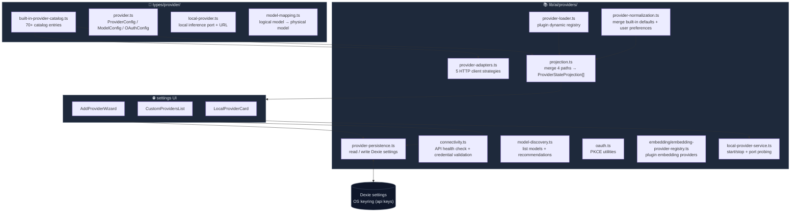
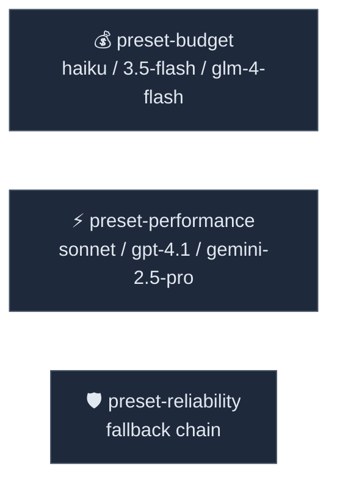

# Provider System

<Status variant="stable">stable</Status>

<TLDR>
  Cognia maintains 70+ built-in providers (OpenAI / Anthropic / Google / DeepSeek / local
  Ollama …) in a static catalog, maps them to 5 adapters across 6 protocol families;
  plugins can dynamically register their own providers; finally, a pure-function projection
  layer merges built-in + custom + local + plugin paths into a flat array for the UI.
</TLDR>

<StatGrid>
  <Stat label="Built-in providers" value="70+" hint="cloud + local combined" />
  <Stat
    label="Adapter id"
    value="5"
    hint="openai-compatible / anthropic / gemini / openrouter / local"
  />
  <Stat
    label="Provider family"
    value="6"
    hint="openai-compatible / anthropic-native / gemini-native / openrouter / local / proxy"
  />
  <Stat label="Routing preset" value="3" hint="budget / performance / reliability" />
</StatGrid>

The Provider System covers five responsibilities:

1. **Catalog** — metadata for 70+ built-in providers (id, display name, protocol, pricing, model list).
2. **Adapter** — maps providers to 5 unified HTTP clients.
3. **Registry** — dynamically registered providers at plugin runtime.
4. **Persistence** — API keys (OS keyring) + user preferences (Dexie `settings`) + verification state.
5. **Projection** — folds all sources into a unified projection for the UI / picker.

The OAuth subscription path has its own subsystem; see [Claude Subscription OAuth](./claude-subscription-oauth).
Embedding-only providers are consumed through [Vector Store](../data/vector-store).

## Architecture Overview



## Catalog — 70+ Built-in Providers

`types/provider/built-in-provider-catalog.ts` is the static catalog. `BUILT_IN_PROVIDER_IDS`
is grouped by theme:

| Group | Example ids |
| ----- | ----------- |
| Flagship | `openai` · `anthropic` · `google` |
| Major Chinese | `deepseek` · `moonshot` · `zhipu` · `qwen` · `doubao` · `glm4` |
| Aggregator / Proxy | `openrouter` · `siliconflow` · `aiproxy` · `ohmygpt` · `cliproxyapi` |
| Local Inference | `ollama` · `lmstudio` · `llamacpp` · `vllm` · `localai` · `jan` |
| Enterprise Platform | `bedrock` · `azure` · `huggingface` · `nvidia` · `replicate` |
| Specialized | `voyage` · `jina` · `cohere` · `fal` |

Each `CATALOG_ENTRIES[id]` is a `BuiltInProviderCatalogEntry`. Key fields:

<TypeTable
  type={{
    id: { type: "BuiltInProviderId", description: "Stable id; used as a foreign key when writing to Dexie." },
    name: { type: "string", description: "Display name." },
    type: { type: '"cloud" | "local"', description: "Determines whether LAN health checks are performed." },
    protocol: {
      type: '"openai" | "anthropic" | "gemini"',
      description: "Determines request schema / error code translation.",
    },
    family: {
      type: "BuiltInProviderFamily",
      description: "One of 6 families; determines which adapter is selected.",
    },
    adapter: {
      type: "BuiltInProviderAdapterId",
      description: "One of 5 adapter ids — the HTTP client implementation.",
    },
    apiKeyRequired: { type: "boolean", description: "When false, keyring write validation is skipped." },
    baseURLRequired: { type: "boolean", description: "Default false — uses the vendor's official domain." },
    defaultModel: { type: "string", description: "Default model id when this provider is first selected." },
    category: {
      type: '"flagship" | "aggregator" | "specialized" | "local" | "enterprise"',
      description: "UI grouping.",
    },
    dashboardUrl: { type: "string?", description: "Target for the Settings 'Open Dashboard' button." },
    docsUrl: { type: "string?", description: "Target for the Settings 'View Docs' button." },
    pricingUrl: { type: "string?", description: "Pricing page link." },
  }}
/>

Quick-add presets (`BUILT_IN_PROVIDER_QUICK_ADD_PRESETS`) are lightweight entries outside the catalog:
they don't need a full catalog entry, only a baseURL + model list — mainly for "add an OpenAI-compatible endpoint"
semi-finished scenarios.

## Adapter — 5 HTTP Clients

`provider-adapters.ts` defines five adapters, each corresponding to a set of wire-protocol behaviors:

| Adapter id | Family | Protocol | Primary Consumers |
| ---------- | ------ | -------- | ----------------- |
| `openai-compatible` | `openai-compatible` | openai | OpenAI itself + almost all compatible endpoints |
| `anthropic` | `anthropic-native` | anthropic | Anthropic direct (API key path) |
| `gemini` | `gemini-native` | gemini | Google Gemini native API |
| `openrouter` | `openrouter` | openai | OpenRouter aggregator (passes through `X-OR-*` headers) |
| `local-openai-compatible` | `local-openai-compatible` | openai | Ollama / LM Studio / vLLM / llama.cpp … |
| `cliproxyapi` | `proxy-openai-compatible` | openai | Local CLI proxy service (special: base URL only) |

Each adapter maintains two default `ProviderAdapterRequirements`:

- `builtInDefaults` — default requirements for built-in catalog entries (usually no base URL required).
- `customDefaults` — default requirements for user-defined entries (usually **requires** base URL).

This way "built-in OpenAI" doesn't need a base URL, while "custom OpenAI-compatible endpoint" must provide one —
both rules derive from the same adapter.

## Dynamic Registry — Plugin Registration

```ts title="lib/ai/providers/provider-loader.ts"
export interface ProviderDefinition {
  id: string
  name: string
  type: "cloud" | "local" | "self-hosted"
  protocol: "openai" | "anthropic" | "google" | "mistral" | "cohere"
  apiKeyRequired: boolean
  baseURLRequired: boolean
  defaultModel: string
  defaultEnabled: boolean
  category: "core" | "specialized" | "experimental"
  description?: string
  models: ProviderModelDefinition[]
}
```

Plugins call `registerProviderDefinition(definition, "plugin")` on activation via the `ai-provider` capability;
on deactivation they call `unregisterProvidersBySource("plugin")` to clean up.

The registry is **in-memory only** — plugins must re-register after restart. This is intentional: it prevents
trust-level plugin data from being written into the catalog, and makes "disable plugin" the authoritative revocation action.

Embedding-only providers go through the independent `lib/ai/embedding/embedding-provider-registry.ts`: because
embedding doesn't need chat tools / streaming / vision fields, the definition structure is more compact.

## Persistence — Three-layer Storage

| Content | Location | Reason |
| ------- | -------- | ------ |
| API key | OS keyring (`api_key` Rust module) | No plaintext on disk; web mode falls back to memory |
| Base URL / custom models / verified state | Dexie `settings.providerSettings[id]` | Used for cross-device sync |
| Selected active provider id | Dexie `settings.activeProviderId` | Shared field with CCSwitch |
| Custom providers list | Dexie `settings.customProviders[]` | User-added endpoints |
| OAuth credentials (Claude) | OS keyring, independent service | See [Claude Subscription OAuth](./claude-subscription-oauth) |

`provider-persistence.ts` handles four things:

1. Reads `UserProviderSettings` and merges with catalog defaults (`provider-normalization.ts`).
2. Strips empty fields on write to avoid repeated diffs in the settings table.
3. Caches "verification state" `ProviderVerificationStatus` — to avoid running connectivity checks every time Settings is opened.
4. Deconstructs legacy fields (pre-v15 schema compatibility path).

## Connectivity & Discovery

- **`connectivity.ts`** — provides `verifyProvider`, sends the cheapest possible request to cloud providers
  (`/models` or `/me`), returns `outcome: "verified" | "failed" | "limited"`. `limited` means
  "credentials valid but endpoint lacks /models"; the UI still marks it green.
- **`model-discovery.ts`** — parses model lists from provider responses, merges with statically declared models in the catalog,
  and tags them with `recommendedFor: "coding"` etc.
- **`local-provider-service.ts`** — local inference (Ollama / vLLM / LM Studio …) port health checks
  - start/stop. Ollama also has a `pull` command hook.

## Routing Presets



`built-in-presets.ts` ships 3 built-in routing presets — they are not providers but _strategies_: a preset references model ids,
and the routing layer (`lib/ai/routing/`) maps requests to the cheapest / strongest / most stable actual provider available under the current account.

## Projection — The UI's Only Entry Point

`projection.buildProviderStateProjections` is the only pure function called by the settings UI. Its input has 4 paths:

```ts title="lib/ai/providers/projection.ts"
interface BuildProviderStateProjectionInput {
  appSettings: AppSettings
  customProviders?: CustomProviderProjectionInput[]
  dynamicProviders?: ProviderConfig[] // from provider-loader registry
  verificationByProviderId?: Record<string, ProviderVerificationStatus>
}
```

The output is `ProviderStateProjection[]` grouped by category. Each entry carries:

- **Full catalog metadata** — name, icon, dashboardUrl, protocol;
- **Current user configuration** — whether API key exists, custom base URL, custom models;
- **Completeness** — `evaluateBuiltInProviderCompleteness` / `evaluateCustomProviderCompleteness`
  encode "missing api key / missing base URL / no model selected" etc. into the `ProviderNextAction` enum;
- **Next-step suggestions** — "Add API key", "Select default model", "Get started" etc. copy keys;
- **Model discovery snapshot** — `ProviderModelDiscoverySnapshot`, recording the most recent model listing result.

The settings UI does not read catalog or registry directly — this fan-in compresses scattered sources into a single unidirectional data stream,
so the add wizard, provider list, CCSwitch picker, and model selector all see a consistent view.

## Data Flow

<Steps>
  <Step>User pastes an API key in Settings → Provider.</Step>
  <Step>
    `AddProviderWizard` writes the key to keyring via `lib/tauri`, and writes other preferences to Dexie `settings`.
  </Step>
  <Step>`SettingsSyncProvider` detects the change and triggers a new round of `buildProviderStateProjections`.</Step>
  <Step>
    The projection injects the new entry into UI state; meanwhile, providers with SDKs like Claude are pushed to the
    sidecar via `setProviderEnv`.
  </Step>
  <Step>
    The first send triggers `verifyProvider`; the result is written back to `providerSettings[id].verificationStatus`, and the dot on the
    provider list turns green.
  </Step>
</Steps>

## Related Subsystems

<Cards>
  <Card
    title="Claude Subscription OAuth"
    href="./claude-subscription-oauth"
    description="OAuth path — mutually exclusive with and takes priority over Anthropic API key."
  />
  <Card title="CCSwitch" href="./ccswitch" description="One-click switching across 50+ Claude third-party endpoints." />
  <Card
    title="Chat & Skills"
    href="./chat-and-skills"
    description="How the provider is selected at send time."
  />
  <Card
    title="Vector Store"
    href="./vector-store"
    description="The embedding provider registry is its primary consumer."
  />
</Cards>

## Extension Points

- **New built-in provider** — add an id to `BUILT_IN_PROVIDER_IDS`, add an entry to `CATALOG_ENTRIES`, pick an adapter; no new code needed.
- **New adapter (rare)** — usually means a new protocol. Add an entry in `provider-adapters.ts`, add an HTTP client strategy in `provider-helpers.tsx`, and if necessary add normalization rules in `provider-normalization.ts`.
- **Plugin-level chat provider** — implement `ProviderDefinition` and call `registerProviderDefinition` in plugin activate.
- **Plugin-level embedding provider** — implement `EmbeddingProvider` and call `registerEmbeddingProvider`; the vector store will automatically pick it up.
- **New local inference engine** — add port/URL constants in `types/provider/local-provider.ts`, and add health check logic in `local-provider-service.ts`.

## Known Limitations

- **Verification cache may be stale** — if a user revokes an API key externally, the UI will still show green until the next explicit health check. The simplest fix is to invalidate the cache to `failed` on every 401 path during send failures.
- **Dynamic registry is not persisted** — plugins must re-register on every activation. This is by design — it prevents plugins from writing data outside their trust level and dirtying the catalog — but it makes "user still sees the provider after disabling the plugin" impossible.
- **OAuth in the catalog is only metadata** — the actual OAuth flow is only wired for Anthropic ([Subscription OAuth](./claude-subscription-oauth)) and special cases like OpenRouter; other `supportsOAuth: true` flags are not yet connected.
- **Model mapping is string-based** — `logical model id → physical provider model id` has no type guarantee; it relies on manual correct entry during catalog editing.
