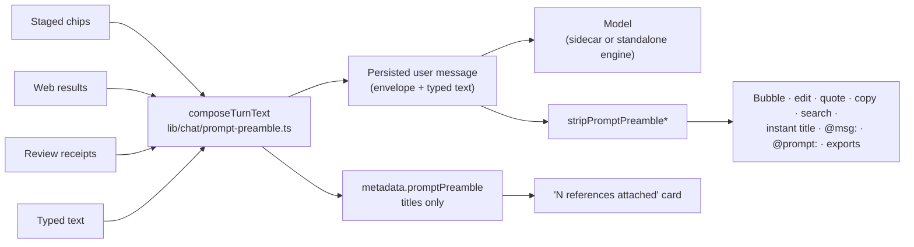
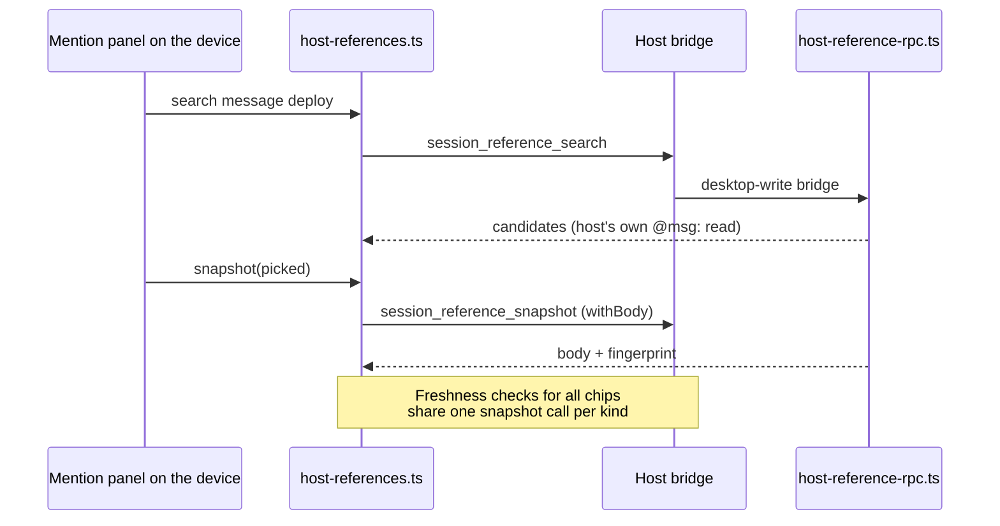

# Bringing things into a conversation

Everything that can be brought into a conversation ends up as a **staged
reference**: a chip above the composer that carries a frozen snapshot of the
record, is sent with the next message, and says when its source has changed.
The ways of getting one differ — typing `@`, selecting a passage, ticking
several messages, long-pressing on a phone — but they all stage through the
same path, so the chip and the text the model reads are identical whichever
way it was made.

<TLDR>
  One registry of referenceable records (`lib/chat/mentions/entity-sources.ts`, [ADR-0157](../adr/0157-references-and-result-reuse))
  and one staging call (`addContextSelection`). Selections in a transcript open a capsule
  (`components/chat/message-selection-toolbar.tsx`); several messages use a selection mode
  and fold into one chip (`lib/chat/selection/message-set-reference.ts`); a phone gets the same
  actions from its long-press sheet. What the app adds to a turn travels in a marked envelope
  (`lib/chat/prompt-preamble.ts`) that every reader of message text strips again. A paired
  device asks its host for history (`session_reference_search` / `session_reference_snapshot`).
  Decisions: [ADR-0181](../adr/0181-what-the-user-staged-is-what-the-model-reads).
</TLDR>

## Ways in

| Starting point            | How                                                                  | What gets staged                                           |
| ------------------------- | -------------------------------------------------------------------- | ---------------------------------------------------------- |
| Any record you can name   | Type `@memory:`, `@issue:`, `@plan:`, `@chat:`, `@artifact:` …       | The record's body                                          |
| A message anywhere        | Type `@msg:` and search by what was said                             | That message, tool output included                         |
| Something you typed before | Type `@prompt:`                                                      | Your words — or put them back in the draft with ⌥↵         |
| A tool result             | Type `^`                                                             | The result's output                                        |
| A passage on screen       | Select it in the transcript, then **Reference** in the capsule       | The passage, linked to its message                         |
| An answer about a passage | Select it, then **Summarize**, **Explain** or **Translate**          | The answer, marked as generated from the passage           |
| Several messages          | **Select messages**, tick them, then **Reference** in the bar        | One chip holding every ticked message in transcript order |
| A message on a phone      | Long-press, then **Select text** or **Select messages**              | The same as above                                          |

⌘K results that name a referenceable record offer the same staging through
their `@` action or `⌘↵`.

## Selecting text in a conversation

Selecting text inside the message list opens a capsule beside the selection.
It listens to `selectionchange`, so a mouse drag, a keyboard selection and a
touch selection all count, and it ignores a selection that runs outside the
list (into the composer, for example).

A selection must be at least three characters, or two when it contains Han,
Kana or Hangul (`MIN_SELECTION_CHARS` and `MIN_DENSE_SCRIPT_SELECTION_CHARS` in
`lib/chat/selection/selection-text.ts`).

| Action                | Result                                                                                                             |
| --------------------- | ------------------------------------------------------------------------------------------------------------------ |
| **Reference**         | Stages the passage as a message reference with an excerpt                                                          |
| **Ask in an aside**   | Opens a workbench aside with the passage quoted in its composer (not offered inside an aside, and not on a phone)  |
| **Summarize**         | Streams a summary into a result panel                                                                              |
| **Explain**           | Streams an explanation into a result panel                                                                         |
| **Translate**         | Streams a translation; the language menu remembers your choice (`selectionToolbar.translateLocale`)                |

The result panel can stop, retry, copy, and **Reference in chat**. Referencing
an answer stages it as an *excerpt* of the passage it came from: the chip is
titled by the passage, and the prompt tells the model the text was generated by
the app from what the user selected (`EXCERPT_LEADS` in
`lib/artifacts/format-selection-context.ts`).

Generation runs on your own model when one is configured and through a
headless turn otherwise (`buildAgentBackedLlmClient`). Long material is
summarized in parts of up to 24 000 characters and then combined
(`lib/ai/generation/summarize-material.ts`), and every part passes the PII gate
before anything is sent. With no model available the panel says
"No model can run here" rather than showing a digest.

## Selecting several messages

**Select messages** — in a message's menu, or the checkbox that appears when
you hover a row — turns the list into a selection mode.

- **Click** ticks or unticks a message; **Shift-click** extends from the last tick.
- **⌘A** selects all (not while typing in a field).
- **Esc**, the **✕** on the bar, unticking the last message, or Android back
  leaves the mode. Esc does not leave it while you are typing in a field that
  already holds text.
- The message still being streamed, compaction boundaries and notices can't be ticked.

The bar floats at the bottom of the list: a pill in a wide pane, a card with
labelled buttons in a narrow one.

| Action             | Result                                                                                                                                       |
| ------------------ | -------------------------------------------------------------------------------------------------------------------------------------------- |
| **Reference**      | One chip for all ticked messages, in transcript order, duplicates dropped, each member clamped to 20 000 characters on its own              |
| **Summarize**      | A summary in the result panel; each message is its own segment, so parts break between messages unless one message is longer than a part   |
| **Copy**           | The messages as text                                                                                                                         |
| **Save as memory** | One memory, each passage labelled by its speaker; a passage from someone else marks the memory untrusted                                    |

A combined chip lists its members, and each can be removed on its own. When
only one readable message is left, the chip is an ordinary message reference —
the same one `@msg:` would make.

The mode is available only in a live conversation. Read-only transcripts (an
Agent SDK session's transcript, a remote session's detail view) render the same messages
without offering it.

## On a phone

Long-pressing a message opens its action sheet. A long press no longer selects
the word under your finger.

- **Select messages** enters the same selection mode as the desktop. A tap ticks
  a message, and the back gesture leaves.
- **Select text** opens the message in a sheet whose text you can select. Below
  it, **Reference**, **Summarize**, **Explain** and **Translate** act on the
  selected passage, or on the whole message when nothing is selected. A
  selection made just before tapping a button is kept for 800 ms, because the
  tap itself collapses the system selection
  (`BAR_PRESS_GRACE_MS` in `components/mobile/chat/message-text-selection-sheet.tsx`).

There is no **Ask in an aside** on a phone: asides open in the desktop
workbench dock.

## What the model receives

Staged references are sent with the turn inside an envelope at the start of the
message text. The same envelope carries review receipts and web search results
when a turn has them.

```text
<cognia_context_3f9a1c07b2d4>
[framing line]

Referenced context:
…

---

[web results, review receipts]
</cognia_context_3f9a1c07b2d4>

what the user typed
```

The tag's suffix is random per turn, so a referenced document that contains a
closing tag cannot end the block early.



The envelope stays in the saved text because the standalone (BYOK) engine
rebuilds its history from saved messages. Everything that shows or reuses the
user's words strips it, and the message bubble shows a collapsed
"N references attached" card built from `metadata.promptPreamble`, which holds
reference titles and never bodies.

Citations travel with the turn, so they are recorded on the message even when
the conversation is created by that same send. Staging the same record twice
replaces the earlier chip in place.

## When a source changes

A chip keeps the body it was staged with. If the source changes before you
send, the chip gets a badge and a refresh control; nothing is re-read silently.

- A record reference compares the source's fingerprint with the one captured at
  staging.
- An excerpt checks whether its quote still appears in the messages it came from:
  **current** if it does, **changed** if it doesn't, **gone** if a message was deleted.
  Reflowed text still counts as present; reworded text doesn't.

## From a paired phone or browser

A paired device syncs only the recent end of each conversation, so on a
companion `@msg:`, `@prompt:` and `^` ask the host instead of searching the
device.



| Situation                          | Search                                                          | Body                                                      | Freshness check                     |
| ---------------------------------- | --------------------------------------------------------------- | --------------------------------------------------------- | ----------------------------------- |
| Desktop, headless host, standalone browser | This database                                                   | This database                                             | This database                       |
| Paired device, host answers        | The host's full history                                         | Read from the host                                        | Checked against the host            |
| Paired device, host unreachable    | The device's copy, with a notice that the list is partial       | The device's copy, only if it holds the record            | Not checked; the chip stays as it was |

Routing follows the host profile (`historyReferencesLiveOnHost` in
`lib/chat/mentions/host-references.ts`). The host answers with the same reads
its own composer runs (`localHistoryReference`), bounded to 12 candidates and to
40 000 characters a body; the device's own 20 000-character clamp then applies
as usual.

## Where it lives

| Path                                                        | Role                                                                                         |
| ----------------------------------------------------------- | -------------------------------------------------------------------------------------------- |
| `lib/chat/mentions/entity-sources.ts`                       | The registry of referenceable kinds; `@msg:`, `@prompt:` and `^` route through `historyReferenceSource` |
| `lib/chat/mentions/prompt-reference.ts`                     | `@prompt:` — the user's own typed words, with `insertText`                                  |
| `lib/chat/mentions/host-references.ts`                      | Paired-device routing, the host client and its fallbacks                                     |
| `lib/chat/mentions/host-reference-rpc.ts`                   | The host's answer to `session_reference_search` / `session_reference_snapshot`              |
| `lib/chat/prompt-preamble.ts`                               | The envelope: compose, strip, locate, summary                                                |
| `lib/chat/selection/message-excerpt.ts`                     | Passage and answer references, excerpt freshness                                             |
| `lib/chat/selection/message-set-reference.ts`               | The combined chip for several messages                                                      |
| `lib/chat/selection/run-selection-action.ts`                | Summarize / explain / translate, with the PII gate                                           |
| `hooks/chat/use-message-selection-actions.ts`               | Actions shared by the desktop capsule and the phone sheet                                   |
| `hooks/chat/use-transcript-selection.ts`                    | Selection mode state                                                                         |
| `components/chat/message-selection-toolbar.tsx`             | The capsule                                                                                  |
| `components/chat/transcript-selection-bar.tsx`              | The multi-select bar                                                                         |
| `components/mobile/chat/message-text-selection-sheet.tsx`   | The phone's Select text sheet                                                                |
| `lib/chat/save-message-as-memory.ts`                        | Saving one or several messages as a memory                                                   |
