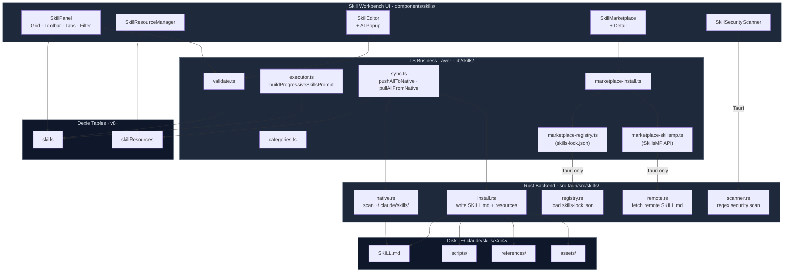
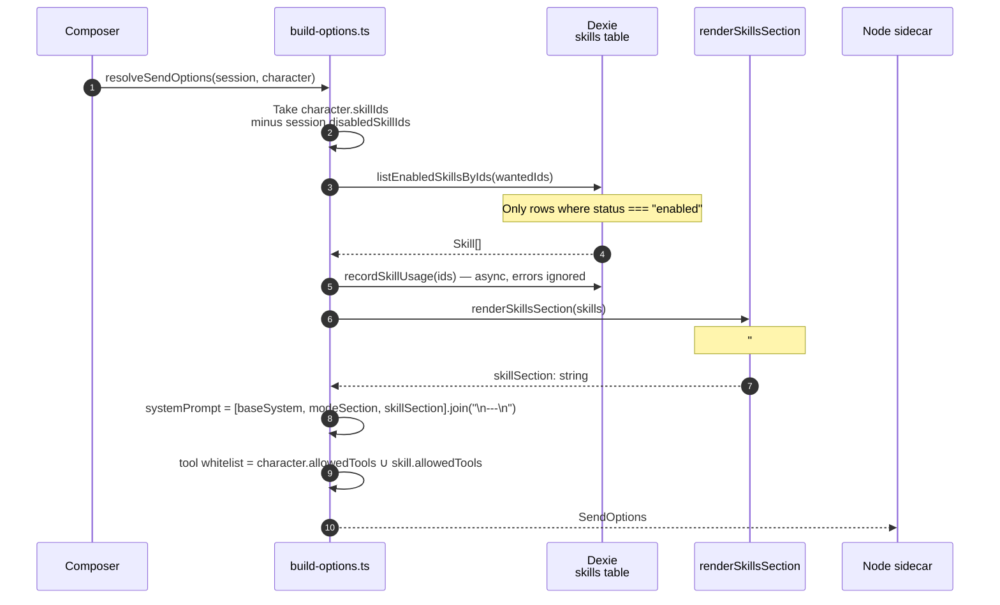
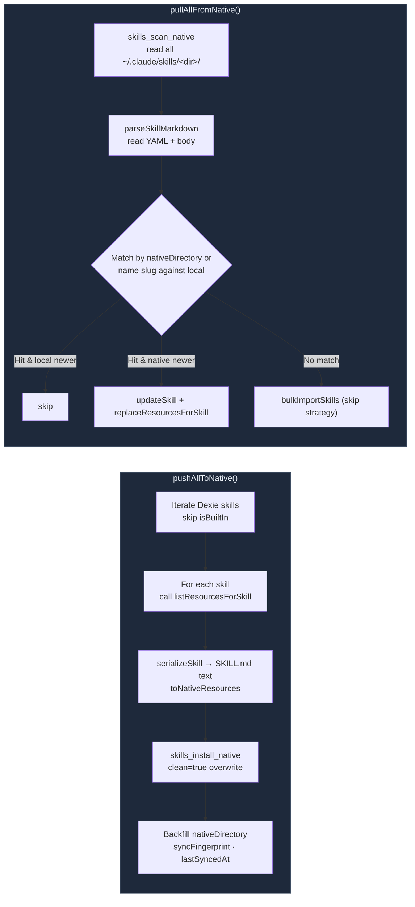
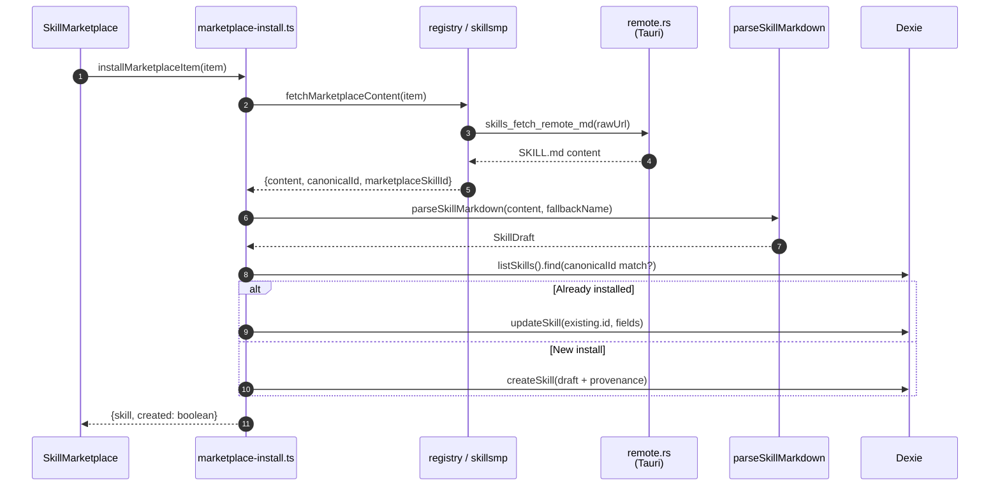

# Skills System

A Skill is the smallest portable capability unit in Cognia — a Markdown snippet, a set of allowed tools, and optional bundled scripts/references/assets. This page is a deep dive into the skills subsystem; if you want to see how skills are enabled in chat first, go back to [Chat, Characters, Skills & Teams](./chat-and-skills).

<TLDR>
Skill = `SKILL.md` (YAML frontmatter + body) + `scripts/` + `references/` + `assets/`. Browser source of truth is Dexie, with optional bidirectional sync to `~/.claude/skills/<dir>/`. Marketplace = `skills-lock.json` registry + SkillsMP API; install goes through `parseSkillMarkdown → createSkill`. Every save path is gated by `validateSkill` + Rust-side `skills_scan_security`.
</TLDR>

## Use Cases

- Overlay a "style guide" or "checklist" onto a character.
- Distill a prompt-engineering template into a reusable asset that works across sessions and characters.
- Pull existing `~/.claude/skills/<dir>/` from external Claude Code into Cognia, or push in the reverse direction.
- Install curated skills from the community marketplace (registry + SkillsMP) with one click, including their scripts/references/assets.
- Run a static security scan on SKILL.md and script resources before saving.

## Architecture Diagram

## Key Modules and File Paths

### TypeScript Business Layer (`lib/skills/`)

| File                      | Role                                                                                                                                                                                                            |
| ------------------------- | --------------------------------------------------------------------------------------------------------------------------------------------------------------------------------------------------------------- |
| `executor.ts`             | `buildProgressiveSkillsPrompt(activeSkills)` — wraps `renderSkillsSection`, serving as the unified entry point for external agent instruction stacks and Claude SDK build pipelines.                            |
| `validate.ts`             | Pure-function validator: name format / max length / required body / resource path-traversal detection / resource path deduplication. Returns `SkillValidationError[]` for per-field highlighting in the editor. |
| `categories.ts`           | 8 built-in categories (`creative-design` / `development` / `enterprise` / `productivity` / `data-analysis` / `communication` / `meta` / `custom`) + icons + i18n keys.                                          |
| `sync.ts`                 | Bidirectional sync engine — `pushAllToNative` / `pullAllFromNative`, identity matching by `nativeDirectory` first and by name second, writing `syncFingerprint` + `lastSyncedAt` for debouncing.                |
| `marketplace-types.ts`    | Shared data structures `MarketplaceItem` / `FetchSkillContent`, normalizing both source types (`registry` / `skillsmp`) into one shape.                                                                         |
| `marketplace-registry.ts` | Adapter for the `skills-lock.json` registry (GitHub repo mirror); Tauri goes through Rust, Web falls back to the bundled JSON.                                                                                  |
| `marketplace-skillsmp.ts` | Adapter for the SkillsMP API (Cognia shared server); reads the base URL from `useSettingsStore`, silently disabled if unconfigured.                                                                             |
| `marketplace-install.ts`  | `installMarketplaceItem` — idempotent: updates in place if `canonicalId` matches, otherwise calls `createSkill`. Optionally projects to disk via `pushAllToNative()`.                                           |
| `ai-prompts.ts`           | AI correction helper ("fix errors" prompt that feeds structured errors from `validateSkill` into the system prompt).                                                                                            |
| `export-toast.ts`         | Toast copy aggregation for export / sync operations (i18n keys).                                                                                                                                                |

### React Workbench (`components/skills/` + `app/skills/page.tsx`)

`app/skills/page.tsx` is a thin route that simply mounts `SkillPanel`. The real UI is composed of:

- **`SkillPanel`** — Grid / Toolbar / Tabs / Filter / Category sidebar / Batch actions bar composite container, sharing filter state through `SkillPanelContext`.
- **`SkillEditor`** — Form + Markdown editing + `SkillEditorAiPopup` (calls `ai-prompts.ts` to have Claude fix errors).
- **`SkillResourceManager`** — Manages three resource types (`script` / `reference` / `asset`), syncing uploads into the Dexie `skillResources` table.
- **`SkillMarketplace`** + `SkillMarketplaceCard` + `SkillMarketplaceDetail` — Browse the marketplace, view details, and install with one click.
- **`SkillSecurityScanner`** — Triggers Rust-side `skills_scan_security`, rendering the `ScanIssue` list grouped by severity.
- **`SkillDiscovery`** / `SkillAnalytics` — Discovery + usage-frequency statistics.

### Rust Backend (`src-tauri/src/skills/`)

| File          | Command / Purpose                                                                                                                                                                                                                            |
| ------------- | -------------------------------------------------------------------------------------------------------------------------------------------------------------------------------------------------------------------------------------------- |
| `mod.rs`      | Module entry; the frontend calls each command via `@/lib/claude/ipc`.                                                                                                                                                                        |
| `native.rs`   | `skills_scan_native()` — walks `~/.claude/skills/<dir>/`, reading SKILL.md + scripts/ + references/ + assets/. Each resource ≤ 2 MiB, max 50 resources per skill.                                                                            |
| `install.rs`  | `skills_install_native(InstallSkillRequest)` — validates `dirName` (ASCII + `-_`, ≤ 64 chars), optional clean, auto-places resources by `kind` into scripts/ / references/ / assets/ subdirectories; base64 resources are decoded to binary. |
| `registry.rs` | `skills_load_registry()` — parses the project-root `skills-lock.json` (production reads bundled resource, dev falls back to relative path).                                                                                                  |
| `remote.rs`   | `skills_fetch_remote_md(url)` — HTTP(S) proxy (browser-side fetch is blocked by CSP), 15 s timeout, 1 MiB cap.                                                                                                                               |
| `scanner.rs`  | `skills_scan_security(content)` / `skills_scan_resources(resources)` — lightweight regex-based scan: `rm -rf /` / fork-bomb / `curl \| sh` / `eval()` / reverse shell / hardcoded keys… all return `ScanIssue[]`.                            |
| `types.rs`    | Wire types (`NativeSkill` / `NativeSkillResource` / `InstallSkillRequest` / `RegistryEntry` / `ScanIssue`), serde camelCase.                                                                                                                 |

## Data Flow / Control Flow

### How Skills Are Injected at Send Time

When a user sends a message in chat, `lib/claude/build-options.ts:resolveSendOptions` processes skills in the following order:

**Tool Whitelist Semantics**: the `allowedTools` declared by the character and by skills are combined with a **union**. If neither declares any, the SDK tool set is unrestricted.

**Twin-Binding Order**: if `Character.twinId` resolves, the twin runtime inserts an identity block + retrieved chunks + style few-shots at the front of the system prompt; the skills section is always appended at the end and is never overwritten by the twin.

### Bidirectional Sync (push / pull native)

**Identity Matching Rules**:

1. Prefer matching by `nativeDirectory` (absolute path).
2. Fall back to matching by `name.toLowerCase()`.
3. `pullAllFromNative` never deletes local rows — it only adds or updates.

**Conflict Resolution**: `TIMESTAMP_FUDGE_MS = 1000`. If a local row's `updatedAt` is older than `Date.now() - 1s`, it is considered stale and the native version is adopted; otherwise it is skipped.

### Marketplace Installation

Idempotency is guaranteed by `canonicalId` (shaped like `registry:ai-elements` or `skillsmp:1234`). Uninstalling simply deletes the Dexie row by `canonicalId` — built-in skills carry no `canonicalId`, so uninstall will never accidentally remove them.

### Security Scan

`skills_scan_security` is a **pre-save** check, not a **pre-run** check — the actual "run" merely appends the skill content into the system prompt; it does not execute any scripts inside it. The scanner is only a hygiene reminder of "what would happen if you or someone else executed these scripts in an external scaffold." Rules are graded by severity:

- **high**: `rm -rf /` / fork-bomb / `curl | sh` / `wget | sh`
- **medium**: `sudo rm` / `eval(` / `DROP TABLE` / hardcoded-key patterns
- **low**: suspicious env-var leaks, unquoted shell variables, etc.

## Database Tables

See [Storage](../data/storage) for details. The skills subsystem uses:

| Table            | Indexes                                                                             | Role                                           |
| ---------------- | ----------------------------------------------------------------------------------- | ---------------------------------------------- |
| `skills`         | `id, name, updatedAt, isBuiltIn, category, source, status, lastUsedAt, canonicalId` | Main table; rich indexes added since v8.       |
| `skillResources` | `id, skillId, [skillId+kind], [skillId+path], updatedAt`                            | Resource bundling (scripts/references/assets). |

Key fields on a `Skill` row (full type in `lib/claude/types.ts`):

- `content`: SKILL.md body.
- `allowedTools?`: tool whitelist.
- `category`: one of 8 preset categories.
- `source`: `builtin` / `custom` / `imported` / `marketplace`.
- `status`: `enabled` / `disabled`; only enabled rows are fetched at send time.
- `canonicalId`: marketplace idempotency key (`<source>:<id>`).
- `nativeDirectory`: absolute path after syncing to disk.
- `syncOrigin`: `frontend` / `native` / `builtin` — determines the winner in sync conflicts.
- `syncFingerprint`: SHA-256 of SKILL.md + resources (Web crypto.subtle or non-cryptographic fallback).

## Configuration and Extension Points

### App Settings

- `settings.skillsMarketplace.baseUrl` — SkillsMP API base; empty string disables this source.

### Built-in Skills

5 built-in skills are seeded on first launch (`lib/db/skills.ts:seedBuiltInSkills`):

- `skill_builtin_concise` — Concise answers
- `skill_builtin_step_by_step` — Step-by-step reasoning
- `skill_builtin_cite` — Cite sources
- `skill_builtin_code_review` — Code review checklist
- `skill_builtin_plain_english` — Plain-English explainer

Built-in skills have `isBuiltIn = true`; backup-clear operations will not delete them. User `status` toggles and `usageCount` are preserved across upgrades.

### Extension Point: Plugin-Contributed Skills

Plugins can declare a `skills` array in their manifest; after installation they are merged into the main table by the plugin manager (`lib/plugin/core/manager.ts`). See [Plugin System](../subsystems/plugin-system) for details.

### Extension Point: Plugin-Contributed Marketplace Sources

`marketplace-types.ts:MarketplaceSourceId` is currently a closed set of `"registry" | "skillsmp"`. To add a new source, extend the union, add a case in `marketplace-install.ts:fetchMarketplaceContent`, and implement a `fetch<Source>Items` + `fetch<Source>SkillContent`.

## Related Subsystems

- [Chat, Characters, Skills & Teams](./chat-and-skills) — the end-to-end flow where skills are referenced by `resolveSendOptions` at send time.
- [Plugin System](../subsystems/plugin-system) — comparison with the plugin sandbox + permission model; plugins can contribute skills.
- [Agent Teams](./agent-teams) — each team member's role inherits from the same `skills` table.
- [Storage](../data/storage) — indexes and version evolution of the `skills` / `skillResources` tables.
- [Sidecar & Claude SDK](../core/sidecar-and-claude-sdk) — where the skill snippet ultimately lands in the SDK `system` field.

## Related ADRs

- [ADR-0002 Scheduler full agent resolution](../adr/0002-scheduler-full-agent-resolution) — the scheduler entry also goes through `resolveSendOptions`, so skills in scheduled tasks are fully equivalent to interactive chat.

## Known Limitations

- `executor.executeSkill` currently returns an empty result — the current model does not treat skills as independently callable "tools"; instead their Markdown is appended to the system prompt. If skills are promoted to first-class tools in the future, a real executor will be added.
- The `maxTokens` parameter in `buildProgressiveSkillsPrompt` is currently **advisory only**; it does not actually truncate by tokenizer. Token-aware pruning will be added when needed.
- `skills_scan_security` is a shallow regex-based scan; it is **meaningless** against a motivated attacker and serves only as a "look before you open the door" hygiene reminder.
- The base64 decoding in `skills_install_native` is a hand-rolled implementation (to avoid adding extra crates); performance on large binary assets is inferior to the standard library.
- If the base URL in `marketplace-skillsmp` is unconfigured, that source is **silently disabled** and the Browse tab will not notify the user.
- Sync conflict "who is newer" is based on local `updatedAt` plus a 1-second fudge — occasional misjudgments can happen across time zones or clock skew. For strict conflict arbitration, explicitly pull or push the whole set.
- In Web mode, `pushAllToNative` / `pullAllFromNative` / `skills_scan_security` are unavailable; related buttons are disabled in the UI with a tooltip.
