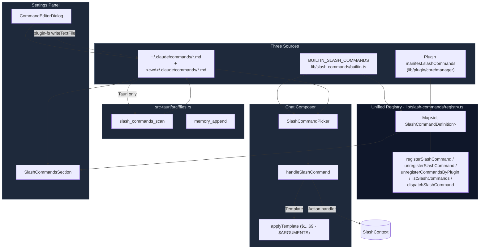
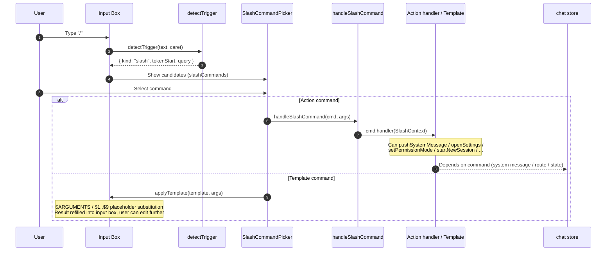

# Slash Commands

Slash commands (`/<name> [args]`) are "quick shortcuts" inside chat. Cognia unifies three sources — built-in Actions, local `.md` templates, and plugin contributions — into a single registry. The composer pops a picker when the user types `/`, and dispatches along one of two paths: Action or Template.

<TLDR>
  Single registry (`lib/slash-commands/registry.ts`) + built-in commands (`builtin.ts`) + custom
  markdown (`custom.ts`, scans `.claude/commands/*.md`) + plugin contributions. Composer shows picker → Action
  executes immediately (`SlashContext`), Template inserts into the text box and supports `$1..$9` / `$ARGUMENTS` placeholder substitution. Rust side
  `slash_commands_scan` parses frontmatter and recursively scans directories.
</TLDR>

## Use Cases

- Add a "quick action" for Cognia (clear session / switch model / open MCP panel …).
- Reuse a prompt template ("code-review the changes …") so the user types `/review` to drop the template into the input box for further editing.
- Let plugins register discoverable commands (e.g. `git-tools.status`) and surface them in the Settings UI with one-click discovery.
- Stay compatible with external Claude Code's existing `~/.claude/commands/<name>.md` / `<cwd>/.claude/commands/<name>.md`.

## Architecture Diagram



## Key Modules and File Paths

### TypeScript

| File | Role |
| --- | --- |
| `lib/slash-commands/registry.ts` | The **only** unified registry + dispatcher for third-party / plugin / settings-panel consumers. `registerSlashCommand` / `unregisterSlashCommand` / `unregisterCommandsByPlugin` / `getSlashCommand` / `listSlashCommands` / `listCommandsByPlugin` / `dispatchSlashCommand`. |
| `lib/slash-commands/builtin.ts` | Built-in Action + Template command list (17+ entries). Exports `BUILTIN_SLASH_COMMANDS` and the `SlashContext` interface; imported for side-effect calling `seedBuiltinSlashCommands(...)` to mirror every entry into the unified registry. Also exports `applyTemplate`. |
| `lib/slash-commands/custom.ts` | Discovery + save + delete for custom markdown commands. `loadCustomSlashCommands(cwd)` goes through `invoke("slash_commands_scan")`; `saveCustomSlashCommand` / `deleteCustomSlashCommand` go through `@tauri-apps/plugin-fs`. |
| `lib/slash-commands/actions/diagnostics.ts` | Handler implementations for `/status` `/cost` `/doctor` `/context`. Reads session + AppSettings + sidecar health, assembling a markdown system message. |
| `lib/slash-commands/actions/sessions.ts` | Handler implementations for `/sessions` `/reset` `/resume`. Goes directly through `lib/db/sessions` to read Dexie. |
| `lib/chat/slash-command-registry.ts` | **Deprecated**; thin re-export for backward compatibility only. New code must import from `@/lib/slash-commands/registry`. |
| `components/chat/composer.tsx` | The real dispatch entry point. Filters `BUILTIN_SLASH_COMMANDS + customCommands` by `hiddenFromPicker` to form `slashCommands`, passes them to the picker; `handleSlashCommand` wraps the Action handler in `SlashContext` and invokes it. |
| `components/chat/message-parts/slash-command-result-chip.tsx` | Inline chip rendered when a system message is triggered by `/command` (shows command name + args + description). |
| `components/settings/slash-commands/slash-commands-section.tsx` | Unified browser inside the Settings panel, shown in three sections: Built-in / Custom / Plugin. Custom rows support Edit / Delete / + New (Tauri only). |

### Rust Backend

| Command | File | Purpose |
| --- | --- | --- |
| `slash_commands_scan(cwd?: string)` | `src-tauri/src/files.rs` | Recursively scans `<cwd>/.claude/commands/**/*.md` and `~/.claude/commands/**/*.md`, up to 8 levels deep, parsing YAML frontmatter and body. |
| `memory_append(scope, content, cwd?)` | `src-tauri/src/files.rs` | Used by the `/memory` command: appends one line to the project or user `CLAUDE.md`. |

## Data Flow / Control Flow

### What Happens When the User Types `/`



`detectTrigger` recognizes the `/` token inside the composer; it only fires at the start of a line or after whitespace, avoiding accidental triggers on URLs or file paths. The `popoverDismissed` state prevents a "closed and immediately reopened" loop.

### Action vs Template Priority

```ts title="lib/slash-commands/builtin.ts"
// A command declaring both handler and template is treated as Action (handler wins)
if (cmd.handler) {
  // Action path — composer clears input box, does not send a turn
  await cmd.handler(ctx)
  return true
}
if (cmd.template) {
  // Template path — applyTemplate then refill input box, waits for user Enter
  return true
}
return false
```

### Template Placeholder Substitution

```ts title="lib/slash-commands/builtin.ts (applyTemplate)"
const positional = args.trim().split(/\s+/).filter(Boolean)
let out = template.replace(/\$ARGUMENTS/g, args.trim())
out = out.replace(/\$([1-9])/g, (_, n) => positional[Number(n) - 1] ?? "")
```

- `$ARGUMENTS` — the entire args string as-is (leading/trailing whitespace trimmed).
- `$1..$9` — the Nth positional argument after splitting on whitespace; unfilled positions collapse to an empty string.
- Unmatched placeholders are **preserved** as literal text.

### Custom Command File Format

```markdown title="~/.claude/commands/git/commit.md"
---
description: Make a Conventional Commit for the current changes.
argument-hint: <focus area?>
allowed-tools: [git, file_read]
model: claude-opus-4
---

Please stage and commit the current changes with a Conventional Commit
message. Focus area: $ARGUMENTS
```

Frontmatter fields:

- `description` — description shown in the picker and settings.
- `argument-hint` — parameter tooltip on hover (e.g. `<file>`).
- `allowed-tools` — tool whitelist for this turn (YAML array).
- `model` — per-command model override.
- `paths` — `additionalDirectories` injection item.
- `disable-model-invocation` — hides from picker when `true` (still callable programmatically from other skills).
- `user-invocable` — hides from picker when `false` (same semantics as above, kept separately for Claude Code compatibility).

`hiddenFromPicker = userInvocable === false || disableModelInvocation === true` folds both fields into a single frontend boolean.

### Registry-to-BUILTIN Bridge

`lib/slash-commands/builtin.ts` calls `seedBuiltinSlashCommands(BUILTIN_SLASH_COMMANDS)` as an **import side-effect**, mirroring every built-in command into the registry, but the handler is a stub:

```ts title="lib/slash-commands/registry.ts:seedBuiltinSlashCommands"
const def: SlashCommandDefinition = {
  id: cmd.name,
  name: cmd.name,
  description: cmd.description,
  shortcut: cmd.argumentHint ?? null,
  source: "builtin",
  handler: () => ({
    message:
      `'/${cmd.name}' is a built-in chat command — run it from the chat composer ` +
      "to access its full context.",
  }),
}
```

The reason is that the real built-in handler depends on `SlashContext` (active session id, `pushSystemMessage`, `openSettings`, etc.) only available from the composer, while the registry itself only provides a lightweight `SlashCommandContext` (`sessionId` + `characterId`). The Settings UI can enumerate all commands from one place without importing the composer.

### Plugin-Contributed Commands

```ts title="plugin manifest example"
{
  "slashCommands": [
    {
      "id": "git-tools.status",
      "name": "git-status",
      "description": "Run git status in the workspace cwd.",
      "handler": "...js entry..."
    }
  ]
}
```

The plugin manager calls `registerSlashCommand({...def, source: "plugin", pluginId})` on enable, and `unregisterCommandsByPlugin(pluginId)` cleans everything up at once on disable.

### Saving Custom Commands

```ts title="lib/slash-commands/custom.ts:saveCustomSlashCommand"
const path = await resolveCommandPath(input.scope, input.name, input.cwd)
const content = buildCommandFile(input) // YAML frontmatter + body
await mkdir(dirname(path), { recursive: true })
await writeTextFile(path, content)
```

- `scope === "user"` → `<home>/.claude/commands/<name>.md`
- `scope === "project"` → `<cwd>/.claude/commands/<name>.md`

File name validation: `/^[A-Za-z0-9][A-Za-z0-9_./-]{0,63}$/`, `..` forbidden. Nesting allowed (`git/commit`). YAML quotes are added only when necessary (disruptive characters, edge whitespace, leading sigils).

## Database Tables

The slash-command subsystem **does not write to Dexie**. Three data sources:

- **Built-in**: source-code constants (`BUILTIN_SLASH_COMMANDS`).
- **Custom**: disk files (`.claude/commands/*.md`), rescanned every time the composer mounts or settings opens.
- **Plugin**: injected into the in-memory registry via `registerSlashCommand`, re-registered by the plugin manager on application restart.

## Built-in Command List (Excerpt)

| Command | Type | Purpose |
| --- | --- | --- |
| `/clear` | Action | Start a new session (archive current). |
| `/help` | Action | List all commands (pushSystemMessage). |
| `/model` | Action | Jump to Settings → General. |
| `/agents` | Action | Jump to Settings → Characters (see [Chat & Characters](./chat-and-skills)). |
| `/mcp` | Action | Jump to Settings → MCP. |
| `/permissions` | Action | Cycle permission mode: `default → acceptEdits → plan → bypassPermissions`. |
| `/permission-mode <mode?>` | Action | Set permission mode directly; without args same as `/permissions`. |
| `/add-dir <absolute path>` | Action | Add `additionalDirectories` read permission to this session. |
| `/init` | Template | "Please analyze this repo and generate / update CLAUDE.md …". |
| `/review <focus area?>` | Template | Prompt Claude to code-review current uncommitted changes. |
| `/reset` | Action | Alias for `/clear` (CLI habit). |
| `/sessions` | Action | List all sessions (sorted by updatedAt descending), markdown table. |
| `/resume <id or title>` | Action | Switch session by id / title substring. |
| `/status` | Action | Show effective config for current session + sidecar / API key / OAuth / MCP server health. |
| `/cost` | Action | Cumulative tokens + estimated cost (USD) for current session. |
| `/context` | Action | Message + token overview for current session. |
| `/doctor` | Action | Run runtime + auth + MCP health checks. |
| `/compact` | Template | `/compact` literal — Claude Agent SDK intercepts and emits `compact_boundary` event; send pipeline passes it through unchanged. |
| `/export` | Action | Open Settings → Data; prompt to use the chat header download button for single-session export. |

## Configuration and Extension Points

### Extension Point: Register Your Own Command

```ts title="my-plugin/entry.ts"
import { registerSlashCommand } from "@/lib/slash-commands/registry"

registerSlashCommand({
  id: "my-plugin.greet",
  name: "greet",
  description: "Say hi.",
  source: "plugin",
  pluginId: "my-plugin",
  handler: async (args, ctx) => ({
    message: `Hi, ${args || "stranger"}!`,
  }),
})
```

Registering a duplicate id **replaces** the old definition and returns `{ replaced: true }`; no error is thrown.

### Extension Point: Contribute a Built-in Action

Create a new handler in `lib/slash-commands/actions/<category>.ts` with signature `(ctx: SlashContext) => void | Promise<void>`; then add an entry to `BUILTIN_SLASH_COMMANDS` specifying `handler`. The `seedBuiltinSlashCommands(BUILTIN_SLASH_COMMANDS)` side-effect at the bottom of the module automatically mirrors it into the unified registry.

### Extension Point: Custom Template Fields

Frontmatter-supported fields are manually aligned between Rust `SlashCommandFile` and TS `SlashCommand`. Adding a new field requires changes in all of:

1. `src-tauri/src/files.rs:SlashCommandFile` (serde)
2. `src-tauri/src/files.rs:collect_command_files` (parsing)
3. `lib/slash-commands/custom.ts:RawCommand` + `toSlashCommand`
4. `lib/slash-commands/builtin.ts:SlashCommand` (consumer side)
5. `components/settings/slash-commands/command-editor-dialog.tsx` (edit UI)

## Related Subsystems

- [Chat, Characters, Skills & Teams](./chat-and-skills) — composer dispatch host; `SlashContext.openSettings` routes directly to the settings panel.
- [Skills System](./skills-system) — `allowedTools` / `paths` and other fields merge with skills at send-time via union.
- [Agent Teams](./agent-teams) — `/agents` command jumps directly to character/team management.
- [Plugin System](../subsystems/plugin-system) — `unregisterCommandsByPlugin` is the standard cleanup path on plugin disable.
- [Sidecar & Claude SDK](../core/sidecar-and-claude-sdk) — `/compact` is intercepted by the SDK; `permissionMode` is applied through the SDK.

## Related ADRs

- No dedicated ADR yet. The design is fully compatible with external Claude Code's `~/.claude/commands/<name>.md`, and evolves following the upstream spec.

## Known Limitations

- **Built-ins in the unified registry are descriptor-only**: calling `dispatchSlashCommand("clear")` directly only returns a hint string; executing a built-in Action for real must go through the composer via `SlashContext`. See explanation above.
- **Custom commands are unavailable in Web mode**: `slash_commands_scan` is a Tauri command; browser calls will reject, and `loadCustomSlashCommands` silently returns an empty array with one `console.debug` line.
- **No forced namespacing**: plugins should voluntarily use `<pluginId>.<name>` style ids to avoid collisions; `registerSlashCommand` currently does not enforce validation.
- **`detectTrigger` only recognizes `/` at line start**: inline mid-line `/<word>` will not trigger the picker (intentional, to avoid accidental triggers).
- **`applyTemplate` does not support escaping**: writing a literal `$ARGUMENTS` inside a template requires a workaround (e.g. change to `$ARG`).
- **`/compact` is SDK-intercepted**: cognia-next cannot change its behavior; override with a synonymous Action command if needed.
- **`memory_append` only appends, does not deduplicate**: pressing `/memory` repeatedly will append duplicate lines to CLAUDE.md; deduplication must be done manually by the user.
- **plugin-fs version compatibility**: `mkdir` throws on older versions when the directory already exists; `saveCustomSlashCommand` tolerates this with `/exists|EEXIST/`.
