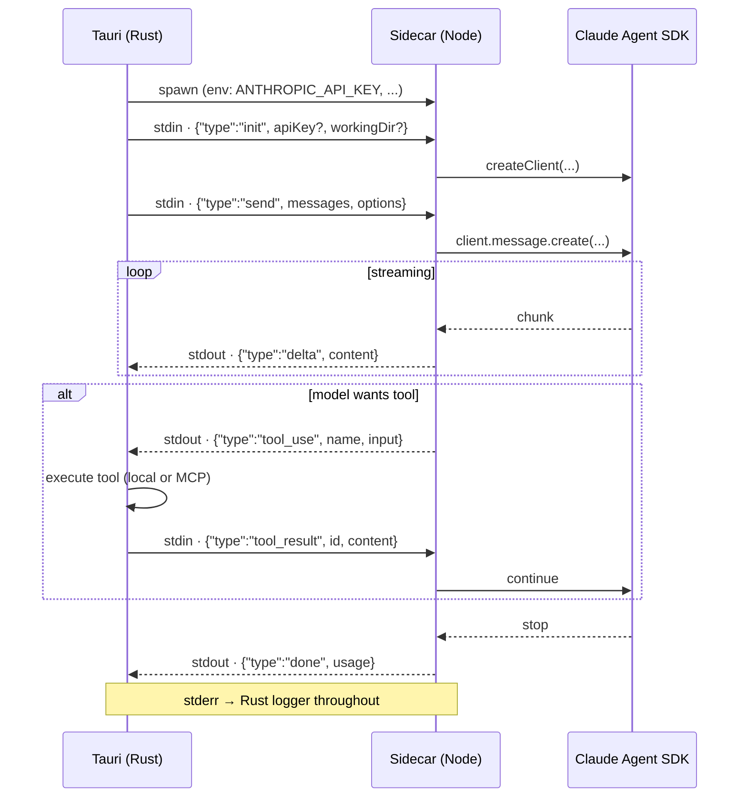

# Sidecar & Claude Agent SDK

Cognia ships a small Node host (the **sidecar**) that wraps the official [`@anthropic-ai/claude-agent-sdk`](https://www.npmjs.com/package/@anthropic-ai/claude-agent-sdk) and exposes it to the Tauri parent process over **stdio with a JSON-lines protocol**. This page covers what the sidecar does, why, and how to extend it.

## Why a separate process

The Agent SDK has Node-only dependencies (filesystem, child_process, native modules) that cannot run inside a webview. Three options were considered:

1. **Pure web** — call Anthropic's REST API directly from React.
   Rejected because we lose the SDK's tool-use loop, hooks, MCP integration, and credential discovery.
2. **Embed in Rust** — talk to Anthropic from Rust.
   Rejected because the SDK is JS-first and we'd need to reimplement substantial logic.
3. **Sidecar** — Tauri spawns a Node process; talk to it over stdio.
   Chosen. The SDK runs unchanged; the Rust side owns lifecycle and credentials.

## What's in `sidecar/`

```
sidecar/
├── claude-host.mjs        # Main entry — wraps the Agent SDK
├── a2ui-mcp.mjs           # Local MCP server for A2UI tool surface
├── builtin-tools/         # First-party tool implementations
├── a2ui-tools/            # A2UI-specific tool definitions
├── package.json           # Node deps (NOT in pnpm workspace)
├── pnpm-lock.yaml         # Sidecar's own lockfile
└── README.md              # Quick reference for sidecar maintainers
```

The sidecar is **outside** the root pnpm workspace because:

- It needs Node-only deps that conflict with the browser bundle.
- It ships as a Tauri **resource** (see `tauri.conf.json` → `bundle.resources`) — the entire `node_modules/` is shipped to users.
- Versioning is independent of the main app.

## Protocol: JSON-lines over stdio

The Tauri side spawns the sidecar with `tauri::api::process::Command`. Communication:

- **Each message is one JSON object on its own line**, terminated by `\n`.
- **Parent → sidecar** writes go to the sidecar's `stdin`.
- **Sidecar → parent** writes go to `stdout`.
- `stderr` is reserved for sidecar-side logs and is mirrored into the Rust logger.



The full protocol is specified in the comment block at the top of `claude-host.mjs`. The high-level shape:

| Direction | Type          | Payload                                                             |
| --------- | ------------- | ------------------------------------------------------------------- |
| →         | `init`        | `{ type: "init", apiKey?, workingDir? }` — set credentials and CWD. |
| →         | `send`        | `{ type: "send", messages, options }` — start a new turn.           |
| ←         | `delta`       | `{ type: "delta", content }` — streaming token chunks.              |
| ←         | `tool_use`    | `{ type: "tool_use", name, input }` — model wants to call a tool.   |
| →         | `tool_result` | `{ type: "tool_result", id, content }` — tool output.               |
| ←         | `done`        | `{ type: "done", usage }` — turn finished.                          |
| ←         | `error`       | `{ type: "error", message }` — fatal error; sidecar exits.          |
| →         | `kill`        | `{ type: "kill" }` — graceful shutdown.                             |

`options` (in `send`) carries the active `Character` system prompt, the resolved skill list, MCP server config, model choice, max tokens, etc. — all assembled by `lib/claude/build-options.ts`.

## Lifecycle (Rust side)

`src-tauri/src/claude/sidecar.rs` owns the child process handle:

```rust
pub struct SidecarState {
    inner: Arc<Mutex<Option<CommandChild>>>,
    // ...
}
```

Triggers that affect the sidecar:

- **First `claude_send`** — lazy-spawn. Subsequent calls reuse the same process.
- **`claude_set_api_key`** — store the new key in `ApiKeyState` (in-process, never written to disk).
- **`claude_restart_sidecar`** — kill the running sidecar so the next send forks a new one (the SDK reads the env at init time).
- **App exit** — the `RunEvent::ExitRequested` handler calls `kill_sidecar` to avoid orphaned Node processes.

The sidecar is killed with SIGTERM on Unix and `TerminateProcess` on Windows. If it's stuck, the parent escalates to SIGKILL after 5s.

## Build options assembly

`lib/claude/build-options.ts` is the single place that converts UI state into a sidecar `send` payload. It composes:

1. **Character system prompt** — the active character's `Character.systemPrompt`.
2. **Skill resolution** — `lib/skills/executor.ts` materialises each skill's prompts, MCP servers, and tool allow-lists.
3. **Twin context** (opt-in) — `lib/twin/runtime/apply-twin-context.ts` wraps the messages with retrieved chunks + style few-shot when the active character has `twinId` set.
4. **MCP config** — merges built-in MCP servers (`lib/claude/builtin-mcp/`) with user servers (`lib/db/mcp-servers.ts`).
5. **Model + token limits** — `lib/ai/model-limits.ts` resolves token caps per model.

`resolveSendOptions(...)` is the public function. It is called from the chat send action in `lib/chat/`.

## Hooks

`lib/claude/hooks.ts` defines lifecycle hooks the user can wire in:

- `onSend(payload)` — called before the parent → sidecar `send`.
- `onResponse(content, usage)` — called after a turn completes.
- `onError(err)` — called when the sidecar reports an error.

Hooks run as user-defined code (snippets stored in Dexie or shell commands). They are **not** for Cognia internals — those live in `lib/chat/`. The Rust counterpart (`src-tauri/src/hooks/`) lets hooks run shell commands without going through the main webview.

## A2UI MCP sidecar

`sidecar/a2ui-mcp.mjs` is a second sidecar — a local MCP server that exposes the A2UI tool surface (interactive cards, forms, lists) to the Claude Agent SDK. It is spawned the same way as the main sidecar but communicates via the MCP stdio protocol (different from the JSON-lines protocol above).

A2UI surfaces are routed through:

- `src-tauri/src/a2ui_bridge/` — Rust bridge that mediates between webview and MCP sidecar.
- `lib/a2ui/` — frontend dispatch + rendering.
- `components/a2ui/` — React components that render A2UI nodes.

## Authentication

The sidecar reads credentials from the same sources Claude Code uses:

<TypeTable
  type={{
    ANTHROPIC_API_KEY: {
      description: "Direct API key. Highest priority — overrides OAuth token if set.",
      type: "env var",
    },
    "~/.claude/ token": {
      description: "OAuth token written by `claude login`. The standard path for end users.",
      type: "OAuth token",
    },
    "AWS_BEDROCK_*, GCP_VERTEX_*": {
      description: "Cloud-provider credentials for Anthropic on Bedrock / Vertex.",
      type: "env vars",
    },
  }}
/>

<Callout type="warn" title="Never plaintext">
  The Rust side never reads `~/.claude/` directly — it just spawns the sidecar with the right env.
  API keys entered in the UI are stored in `ApiKeyState` (memory) and the OS keyring (`keyring`
  crate); they are passed to the sidecar via env at spawn time, **never written to a config file**.
</Callout>

## Adding a new tool

<Tabs groupId="tool-path" persist items={["Built-in (sidecar)", "MCP server"]}>
  <Tab value="Built-in (sidecar)">
    For tools that should ship with Cognia and always be available:

    <Steps>
      <Step>
        ### Add the implementation

        Create a new file under `sidecar/builtin-tools/<name>.mjs`:

        ```js
        export const definition = {
          name: "my_tool",
          description: "...",
          input_schema: { /* JSON Schema */ },
        }

        export async function execute(input, ctx) {
          // ctx exposes log, fs, etc.
          return { content: [{ type: "text", text: "..." }] }
        }
        ```
      </Step>
      <Step>
        ### Register it in `claude-host.mjs`

        Add the import + registration in the loader at the top of `sidecar/claude-host.mjs`.
      </Step>
      <Step>
        ### Write the test

        Co-locate the test as `sidecar/builtin-tools/__tests__/<name>.test.mjs` and run with `pnpm sidecar:test`.
      </Step>
    </Steps>

    <Callout type="warn" title="Bundle size">
      Built-in tools ship with every Cognia release. Avoid heavy dependencies —
      prefer MCP for anything specialised.
    </Callout>

  </Tab>
  <Tab value="MCP server">
    For most third-party integrations, MCP is the right path because it doesn't require modifying the sidecar.

    <Steps>
      <Step>
        ### Decide built-in vs user-configurable

        - **Built-in** — add config to `lib/claude/builtin-mcp/`; always loaded.
        - **User-configurable** — let users add via the UI (`lib/db/mcp-servers.ts`).
      </Step>
      <Step>
        ### Add a preset (optional)

        Add an entry to `lib/claude/mcp-presets.ts` so users see a one-click install.
      </Step>
      <Step>
        ### Test the round-trip

        Run a chat against a character that includes the server. The MCP client
        in the sidecar discovers it automatically; tool calls round-trip via
        `tool_use` / `tool_result`.
      </Step>
    </Steps>

  </Tab>
</Tabs>

## Debugging the sidecar

Run it standalone:

```bash
cd sidecar
node claude-host.mjs           # Reads JSON lines from stdin
node claude-host.mjs --smoke   # One-shot smoke test
```

Pipe a sample `init` + `send` payload to verify it responds:

```bash
echo '{"type":"init"}\n{"type":"send","messages":[{"role":"user","content":"hi"}],"options":{}}' | node claude-host.mjs
```

In the running app, sidecar `stderr` is mirrored to the Rust logger and surfaces in `app/logs/`.

## Tests

- TS unit tests live next to the source — e.g., `lib/claude/build-options.test.ts`, `lib/claude/sync.test.ts`.
- Sidecar unit tests use the Node test runner: `pnpm sidecar:test`.
- Integration tests that spawn the actual sidecar live in `src-tauri/tests/`.

## Next

<Cards>
  <Card title="Chat & Skills" href="../chat/chat-and-skills" description="The user-facing surfaces that call claude_send." />
  <Card title="Plugin system" href="../subsystems/plugin-system" description="How plugins extend the sidecar via MCP." />
  <Card title="Runtime & Tauri" href="./runtime-and-tauri" description="The Rust side that owns the sidecar lifecycle." />
</Cards>
