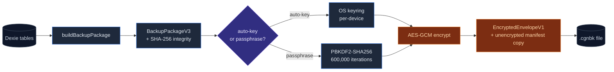
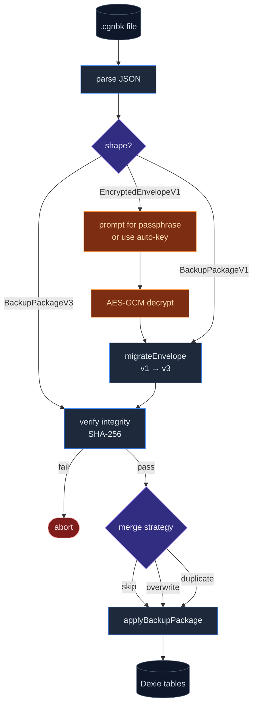

# Backup & data transfer

<Status variant="stable">schema v3</Status>

<TLDR>
  AES-GCM-encrypted, integrity-checked backups in package format **v3**. Auto-key per-device (no
  passphrase) or user passphrase for portability. Six per-domain transfers (skills, MCP, presets,
  characters, teams, theme) let you move just one slice. ChatGPT / Claude / Gemini imports map
  external exports into Cognia's chat shape.
</TLDR>

<StatGrid>
  <Stat label="Schema" value="v3" hint="v1 migrated on import" />
  <Stat label="KDF iterations" value="600k" hint="PBKDF2-SHA256" />
  <Stat label="Domain transfers" value="6" hint="per-domain export/import" />
  <Stat label="External importers" value="3" hint="ChatGPT · Claude · Gemini" />
</StatGrid>

Cognia ships a complete backup / restore / transfer system under `lib/data/`. The package format is **v3** (`BackupPackageV3`); v1 files import through the `migrateEnvelope` boundary so legacy users keep working.

The full design rationale is in [ADR-0001](../adr/0001-backup-schema-v3).

## Where it lives

```
lib/data/
  types.ts                   # BackupPackageV3, EncryptedEnvelopeV1, …
  build-package.ts           # Build snapshot from Dexie → BackupPackageV3
  apply-package.ts           # Apply BackupPackageV3 to Dexie
  crypto.ts                  # AES-GCM encrypt / decrypt
  backup-key.ts              # Auto-key derivation (PBKDF2-SHA256-600000)
  migrate.ts                 # v1 → v3 migration on import
  export.ts / import.ts      # Top-level orchestrators
  export-schema.ts           # Domain export schemas
  scheduler.ts               # Scheduled-backup driver
  domain/                    # Per-domain transfer (skills, MCP, presets, …)
  importers/                 # External imports (ChatGPT, Claude, Gemini)
  import-registry.ts         # Dispatch external imports
  sync-projection.ts         # Project Dexie state for sync
  snapshots/                 # Snapshot test fixtures
  clear.ts                   # Wipe Dexie tables (debug)

components/settings/data/    # Settings UI (Overview / Backup / Domain / Maintenance)
lib/db/backup-history.ts     # backupHistory table (capped at 50)
```

## Backup package (schema v3)

`BackupPackageV3` is a JSON object with three top-level fields:

```ts
interface BackupPackageV3 {
  manifest: {
    schemaVersion: 3
    createdAt: string // ISO-8601
    appVersion: string
    integrity: string // SHA-256 of payload
    flags: {
      includesSessions: boolean
      includesApiKey: boolean
    }
  }
  payload: {
    sessions?: ChatSession[]
    messages?: StoredMessage[]
    characters: Character[]
    skills: Skill[]
    teams: Team[]
    promptPresets: SystemPromptPreset[]
    mcpServers: McpServer[]
    twin?: TwinExport // sources + profile (chunks excluded by default)
    canvas?: CanvasExport
    settings: AppSettings
  }
  // unencrypted at this level
}
```

### Manifest fields

<TypeTable
  type={{
    schemaVersion: {
      description: "Always `3` for the current format. Older files (`1`) are migrated on import.",
      type: "3",
      required: true,
    },
    createdAt: {
      description: "ISO-8601 timestamp when the snapshot was built.",
      type: "string",
      required: true,
    },
    appVersion: {
      description: "Cognia version that produced this backup (from `package.json`).",
      type: "string",
      required: true,
    },
    integrity: {
      description: "SHA-256 of canonical-JSON `payload`. Validated on import — tamper-proof.",
      type: "string",
      required: true,
    },
    "flags.includesSessions": {
      description: "Whether `sessions` and `messages` are in the payload.",
      type: "boolean",
      required: true,
    },
    "flags.includesApiKey": {
      description: "Whether the API key reference is included (default false).",
      type: "boolean",
      required: true,
    },
  }}
/>

## End-to-end backup flow



## Encryption (AES-GCM, PBKDF2-SHA256-600000)

Wrapping a `BackupPackageV3` in an `EncryptedEnvelopeV1`:

```ts
interface EncryptedEnvelopeV1 {
  schemaVersion: 1
  encryption: "aes-gcm"
  kdf: {
    algorithm: "pbkdf2"
    hash: "sha256"
    iterations: 600_000
    salt: string // base64
  }
  iv: string // base64
  ciphertext: string // base64
  manifest: BackupPackageV3["manifest"] // unencrypted manifest copy
}
```

The manifest is duplicated outside the ciphertext so the user can see _what_ the file contains (timestamp, schema version, flags) without entering the passphrase.

`encryptBackupPackage(pkg, passphrase, manifest)` derives a key from the passphrase via PBKDF2-SHA256 with 600,000 iterations (OWASP 2023 recommendation), then AES-GCM-encrypts the canonical-JSON `pkg`.

## Auto-key

Most users don't want to memorise a backup passphrase. `lib/data/backup-key.ts` derives a per-device "auto key" stored in the OS keyring (Tauri only). Auto-encrypted backups are decryptable only on the same device — they are not portable.

If the user explicitly sets a passphrase, that takes precedence and the backup is portable.

## Build a snapshot

```ts
import { buildBackupPackage } from "@/lib/data/build-package"

const pkg = await buildBackupPackage({
  includeSessions: true,
  includeApiKey: false,
})
// pkg.manifest.integrity is set
```

Built-in characters / skills / teams are filtered out of the payload — they re-seed on import. Only user-created data is included.

## Apply a snapshot

`applyBackupPackage(pkg, opts)` writes the payload to Dexie under one of three merge strategies:

| Strategy    | Behaviour                             |
| ----------- | ------------------------------------- |
| `skip`      | Skip rows that already exist (by ID). |
| `overwrite` | Replace existing rows.                |
| `duplicate` | Re-key conflicting rows to fresh IDs. |

Built-in rows are always preserved (the importer skips them).

## Restore / import flow



## Migrate-on-import

`migrateEnvelope(parsed)` accepts:

- v1 backup → migrated to v3 in-memory.
- v3 backup → returned as-is.
- Encrypted envelope → throws `IsEncryptedError` so the caller can prompt for a passphrase.

The migration is **idempotent**: running it twice on a v1 file produces the same v3 result.

## Scheduled backups

`BackupSchedulerProvider` (mounted in `app/layout.tsx`) drives encrypted auto-key writes every `intervalDays` to the user's configured folder.

**Tauri only.** Web users see a reminder banner instead because the browser can't write to a fixed folder unattended.

The scheduler:

1. Reads `settings.backupSchedule` — `{ enabled, intervalDays, folder }`.
2. Computes the next run from `lastSuccessfulBackup`.
3. On wakeup (every 30 min), if `now ≥ nextRun`, builds a snapshot, encrypts with the auto-key, writes `cognia-backup-<ISO>.cgnbk` to the folder, and records to `backupHistory`.
4. On failure, logs to `backupHistory` with `status: "failed"` and the error message; retries on the next wakeup.

## Backup history

`lib/db/backup-history.ts` exposes:

- `recordBackupSuccess(meta)` / `recordBackupFailure(error)` — append to the table.
- `getRecentBackups(limit)` — paginated list, indexed by `completedAt` desc.
- `pruneBackupHistory()` — capped at 50 newest rows; old rows are evicted automatically.

The Maintenance tab in settings shows the history.

## Per-domain transfers

`lib/data/domain/index.ts` exports `DOMAIN_TRANSFERS` — a registry of transfer modules, one per domain:

| Domain         | File                       | Notes                                               |
| -------------- | -------------------------- | --------------------------------------------------- |
| Skills         | `domain/skills.ts`         | Single skill or full library                        |
| MCP servers    | `domain/mcp.ts`            | Useful for sharing tool configs                     |
| Prompt presets | `domain/prompt-presets.ts` |                                                     |
| Characters     | `domain/characters.ts`     | Twin binding is preserved by ID                     |
| Teams          | `domain/teams.ts`          | Team members re-resolve by character name on import |
| Theme          | `domain/theme.ts`          | Custom theme JSON                                   |

API:

```ts
const blob = await buildDomainExport("skills") // → Blob
await applyDomainImport("skills", file, "overwrite") // strategy
```

Each domain transfer has its own `<key>.test.ts` next to the source.

## External imports

`lib/data/import-registry.ts` dispatches third-party export files to the right importer:

| Importer            | Source                                    |
| ------------------- | ----------------------------------------- |
| `chatgpt-import.ts` | ChatGPT export ZIP (`conversations.json`) |
| `claude-import.ts`  | Claude.ai chat export                     |
| `gemini-import.ts`  | Google Gemini takeout                     |

Each importer:

1. Parses the source-specific JSON.
2. Maps to Cognia's `ChatSession` / `StoredMessage` types.
3. Uses `applyBackupPackage` with `strategy: "duplicate"` so imports never clobber existing data.

Adding a new importer is a matter of writing a new module and registering it in `import-registry.ts`.

## Settings UI

`components/settings/data/data-section.tsx` is a tabbed shell:

- **Overview** — current backup status, vector backend, twin counts.
- **Backup & restore** — manual export / import, schedule controls, passphrase setup.
- **Domain transfer** — per-domain export / import.
- **Maintenance** — clear database, view backup history, integrity check.

The active tab is reflected in the URL (`?dataTab=...`) so the user can deep-link.

## Sync projection

`lib/data/sync-projection.ts` produces a stable, sortable projection of Dexie state for sync use cases. Not currently wired into a sync product, but the projection is what such a product would consume.

## Per-session export

Every chat header has a `SingleExportTrigger` (`components/chat/dialogs/single-export-trigger.tsx`) for **per-session** exports — Markdown / JSON / Plain text / Beautiful HTML / Animated HTML. This is separate from the backup system; it doesn't go through `lib/data/`.

## Where to start contributing

| Goal                        | Files                                                                             |
| --------------------------- | --------------------------------------------------------------------------------- |
| Add a new domain transfer   | `lib/data/domain/<name>.ts`, register in `index.ts`                               |
| Add a new external importer | `lib/data/importers/<name>.ts`, register in `import-registry.ts`                  |
| Tweak schedule cadence      | `lib/data/scheduler.ts`                                                           |
| Bump backup schema          | New `BackupPackageV4` type, update `migrate.ts` v3→v4, bump in `build-package.ts` |

## Tests

- `apply-package.test.ts`, `build-package.test.ts`, `crypto.test.ts`, `migrate.test.ts` — backup core.
- `scheduler.test.ts` — fake-timers based; covers cadence + failure handling.
- One snapshot per major version under `lib/data/snapshots/` to detect accidental schema drift.

## Next

<Cards>
  <Card title="Storage" href="./storage" description="The underlying Dexie schema." />
  <Card
    title="Scheduler"
    href="../subsystems/scheduler"
    description="The scheduling primitives the backup scheduler builds on."
  />
  <Card
    title="ADR-0001"
    href="../adr/0001-backup-schema-v3"
    description="Why schema v3 looks like this."
  />
</Cards>
