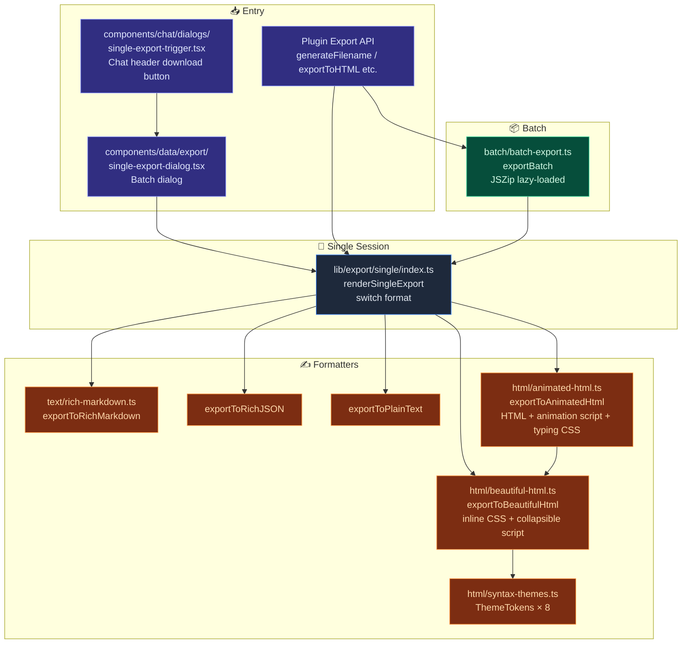
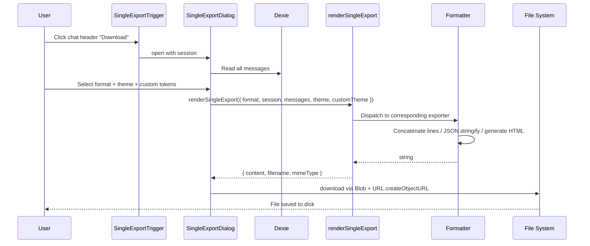
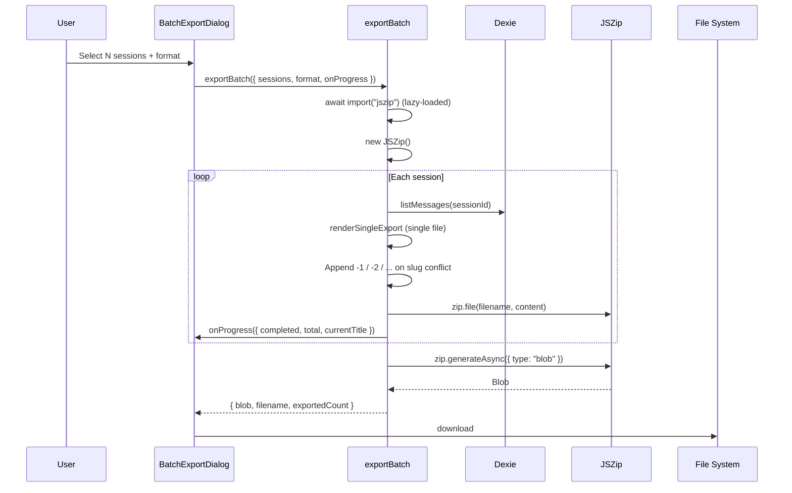

# Export System

<Status variant="stable" />

<TLDR>
  The unified entry point `renderSingleExport({ format, session, messages })` dispatches to 5 formats:
  rich Markdown, rich JSON, plain text, beautiful HTML (8 themes + custom tokens), and
  animated HTML (fade-in + character-by-character typing effect). Batch export (`exportBatch`) packages multiple sessions into a ZIP,
  with JSZip lazy-loaded. All HTML is self-contained — inline styles + inline scripts + zero external requests.
</TLDR>

<StatGrid>
  <Stat label="Single-session formats" value="5" hint="markdown · json · text · html · animated" />
  <Stat
    label="HTML themes"
    value="8"
    hint="light · dark · sepia · github · dracula · nord · solarized · monokai"
  />
  <Stat label="Customizable" value="Yes" hint="11 ThemeTokens, editable inline in the dialog" />
  <Stat label="Batch" value="ZIP" hint="lazy-loaded jszip" />
</StatGrid>

## Use Cases

| Scenario | Format |
| ------------------------------------------- | ------------------------------------------------------------------- |
| Submit to GitHub / Obsidian / other markdown readers | Rich Markdown (preserves tool call blocks, reasoning fenced blocks) |
| Programmatic processing / API integration | Rich JSON (preserves original `UIMessage.parts` structure) |
| Copy into email / simple document | Plain text (unformatted) |
| Offline sharing with non-technical readers | Beautiful HTML (self-contained, beautifully themed) |
| Presentation, cinematic playback | Animated HTML (fade-in + typing effect, like terminal replay) |
| Historical archiving | Batch ZIP (per-session filenames use unique slugs) |
| Custom brand colors | Beautiful / Animated HTML + `customTheme: ThemeTokens` to override default theme |

For **full-database snapshots (multi-device migration + encryption)**, use the `BackupPackageV3` pipeline from [Backup & Data](./backup-and-data) — a separate, encrypted export path that covers all Dexie tables. This page's export system focuses on "single-session / multi-session readable copies".

## Architecture Diagram



## Key Modules and File Paths

### Public API

| File | Purpose |
| --------------------- | ------------------------------------------------------------------------------------- |
| `lib/export/index.ts` | Barrel export + `generateFilename(title, ext)`; stable API aliases expected by plugins (`exportToHTML` etc.) |

```ts
// Recommended pattern for plugins / UI
import { renderSingleExport, exportToHTML, generateFilename } from "@/lib/export"
```

### Single-Session Orchestration

| File | Purpose |
| --------------------------------- | ------------------------------------------------------------ |
| `lib/export/single/index.ts` | `renderSingleExport(opts) → { content, filename, mimeType }` |
| `lib/export/single/index.test.ts` | Tests for five formats + slug + mime boundaries |

### Text Writers

| File | Function |
| ---------------------------------- | ----------------------------------------------------------------- |
| `lib/export/text/rich-markdown.ts` | `exportToRichMarkdown` / `exportToRichJSON` / `exportToPlainText` |

Each writer accepts `RichExportData = { session, messages, exportedAt, includeMetadata?, includeTokens? }`. Markdown output renders directly in GitHub / Obsidian / VS Code (tool calls use `` ``` `` fenced blocks, reasoning uses collapsible notes).

### HTML Writers

| File | Purpose |
| ----------------------------------- | --------------------------------------------------------------------------------------------------------- |
| `lib/export/html/beautiful-html.ts` | Inline `<style>` block (built from `ThemeTokens`) + `<details>` collapsible tool/reasoning + compact readable layout |
| `lib/export/html/animated-html.ts` | Wraps beautiful; injects a `<style>` and `<script>` before `</body>` to achieve fade-in + character-by-character typing (default 12 ms/char) |
| `lib/export/html/syntax-themes.ts` | `ThemeId × 8` (light / dark / sepia / github / dracula / nord / solarized / monokai) + `ThemeTokens` interface |

`ThemeTokens` has 11 tokens: `bg` / `surface` / `text` / `muted` / `border` / `accent` / `userBg` / `assistantBg` / `codeBg` / `codeText` / `detailBg`. The "Custom Theme" editor in the dialog (`components/data/export/custom-theme-editor.tsx`) modifies tokens in real time to override defaults.

### Batch

| File | Purpose |
| ---------------------------------- | ------------------------------------------------------------------------------------------------------------ |
| `lib/export/batch/batch-export.ts` | `exportBatch({ sessions, format, theme?, customTheme?, onProgress? })` — JSZip lazy-loaded; slug conflicts auto-appended with `-N` |

### UI Triggers

| File | Purpose |
| --------------------------------------------------- | -------------------------------------------------------------- |
| `components/chat/dialogs/single-export-trigger.tsx` | Chat header download icon button; `variant: "icon" \| "labeled"`; opens `SingleExportDialog` |
| `components/data/export/single-export-dialog.tsx` | Format picker + theme picker + custom theme editor + preview + download button |
| `components/data/export/batch-export-dialog.tsx` | Batch selection + progress bar |
| `components/data/export/custom-theme-editor.tsx` | Color picker for 11 tokens, real-time preview |
| `components/data/export/schedule-card.tsx` | Binds batch export to scheduler tasks ("Export last week every Sunday") |

## Data Flow: Single-Session Export



## Data Flow: Batch Export



## Database Tables

The export system **does not introduce new Dexie tables**:

- Reads: existing `sessions` / `messages` tables.
- Writes: directly to the local file system (Blob + `URL.createObjectURL` + `<a download>` click; in Tauri mode, `tauri-plugin-dialog` lets the user choose the save location).

Scheduled batch exports go through the scheduler (see [Scheduler](../subsystems/scheduler)); task metadata is stored in the `scheduledTasks` table, while the export output itself is not persisted.

## Configuration and Extension Points

### Single-Session Options

```ts
interface SingleExportOptions {
  format: "markdown" | "json" | "text" | "html" | "animated"
  session: ChatSession
  messages: StoredMessage[]
  exportedAt?: Date
  theme?: ThemeId // HTML formats only
  customTheme?: ThemeTokens // Override theme
  includeMetadata?: boolean
  includeTimestamps?: boolean
  includeTokens?: boolean // Whether markdown writer shows tool token counts
}
```

### Beautiful HTML Options

```ts
interface BeautifulHtmlOptions {
  session
  messages
  exportedAt
  theme?: ThemeId
  customTheme?: ThemeTokens
  includeMetadata?: boolean // Default true
  includeTimestamps?: boolean // Default true
  expandDetails?: boolean // Tool/reasoning collapsible defaults to expanded
}
```

### Animated HTML Options

Inherits all Beautiful HTML options, plus:

```ts
typingSpeedMs?: number // Milliseconds per character, default 12
```

### Filename Generation

```ts
generateFilename(title: string, extension: string): string
```

Slugify rules: `toLowerCase` → non-alphanumeric characters replaced with `-` → truncated to 60 characters → falls back to `"conversation"` if empty.

### Plugin Stable API Aliases

```ts
export { exportToBeautifulHtml as exportToHTML } from "./html/beautiful-html"
export { exportToAnimatedHtml as exportToAnimatedHTML } from "./html/animated-html"
```

Historical casing preserved for convenient third-party plugin calls.

## Related Subsystems

<Cards>
  <Card title="Chat & Skills" href="./chat-and-skills" description="The source of exports is chat sessions + messages" />
  <Card
    title="Backup & Data"
    href="./backup-and-data"
    description="Encrypted full-database snapshots follow a separate BackupPackageV3 pipeline"
  />
  <Card title="Scheduler" href="./scheduler" description="Batch exports can be attached to scheduled tasks" />
</Cards>

## Related ADR

This subsystem was established before the ADR system and has no dedicated ADR. Design principles:

- Output files are **self-contained with zero runtime dependencies** — theme tokens are fully inlined into the `<style>` block.
- Built-in JSZip is **lazy-loaded** — not bundled until the batch dialog is opened.
- **Public API is stable** — `generateFilename` / `exportToHTML` and others are guaranteed backward-compatible for plugins.

## Known Limitations

- **HTML does not render Mermaid / Math** — current Beautiful / Animated HTML outputs raw code blocks; if you need Mermaid rendering, use markdown and then a renderer that supports Mermaid (GitHub README, Obsidian, etc.).
- **Batch ZIP memory model**: JSZip holds all content in memory; fine for hundreds of MB, but for GB-level exports please export sessions individually.
- **Simple slug conflict fallback**: the 2nd+ file with the same title gets `-1` / `-2` / … appended; no timestamp is added.
- **Animated HTML is unfriendly for large files**: typing effects on tens of thousands of characters simultaneously may cause lag in low-end browsers; narrow the scope for presentation scenarios.
- **Attachments / artifacts are not exported**: attachment / artifact blobs are not packaged into the export file — currently only text / Markdown / JSON reference paths. Including attachments is Phase 2 work.
- **Plain text loses structure**: tool calls, reasoning, citations, etc. are flattened. Use Markdown / JSON to preserve structure.
- **Full-database migration goes through the backup system**: this subsystem does not export characters / skills / teams / twin / settings, etc. — that is the job of `BackupPackageV3` (see [Backup & Data](./backup-and-data)).
