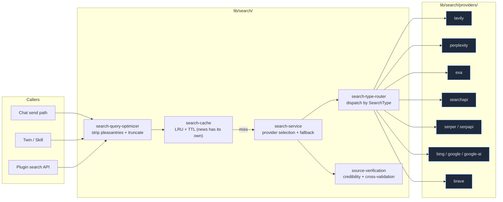

# Search System

Cognia abstracts "letting AI search the web" into a provider bus: the upper layer only sees `search(query, options)`, while ten providers (Tavily / Perplexity / Exa / SearchAPI / Serper / SerpAPI / Bing / Google / Google AI / Brave) hang underneath, each supporting general / news / images / videos / academic capabilities. All providers conform to the same `SearchResponse` shape, so callers always receive a consistent result format.

<TLDR>
  Unified search entry `lib/search/search-service.ts:search()`, automatically selects provider based
  on settings + failure fallback. Before querying, `optimizeSearchQuery` strips pleasantries and
  redundant prefixes; hits on the LRU cache (`search-cache.ts`) return immediately; misses are
  routed by `SearchType` (`search-type-router.ts`) to the specific provider; results optionally pass
  through `source-verification.ts` for credibility scoring. Provider interfaces live in
  `lib/search/providers/`, one file per provider, with connection test functions exported alongside
  the main search function.
</TLDR>

## Overview



## Data Types

All providers fold their native responses into the same `SearchResponse`, defined in `lib/search/types.ts`:

```ts title="lib/search/types.ts"
export type SearchProviderType =
  | "tavily"
  | "perplexity"
  | "exa"
  | "searchapi"
  | "serper"
  | "serpapi"
  | "bing"
  | "google"
  | "google-ai"
  | "brave"

export type SearchDepth = "basic" | "advanced" | "deep"
export type SearchType = "general" | "news" | "academic" | "images" | "videos"
export type SearchRecency = "day" | "week" | "month" | "year" | "any"

export interface SearchResult {
  title: string
  url: string
  content: string
  score: number
  publishedDate?: string
  source?: string
  favicon?: string
  thumbnail?: string
}

export interface SearchResponse {
  provider: SearchProviderType
  query: string
  answer?: string
  results: SearchResult[]
  responseTime: number
  totalResults?: number
  images?: SearchImage[]
}
```

`SearchOptions` is the common input parameter for providers: `maxResults` / `searchDepth` / `searchType` / `includeAnswer` / `includeRawContent` / `includeDomains` / `excludeDomains` / `recency` / `country` / `language`. Provider-specific fields do not enter the common layer — for example, Tavily's deep search and SerpAPI's SerpAPI-only parameters are handled by their respective provider functions, while the unified layer only exposes ten shared knobs.

## Unified Search Entry

```ts title="lib/search/search-service.ts"
export async function search(
  query: string,
  options: UnifiedSearchOptions = {}
): Promise<SearchResponse> {
  const { provider, fallbackEnabled = true, providerSettings, ...searchOptions } = options
  // 1. Retrieve the list of enabled providers
  // 2. If a provider is specified, place it at the head, with the rest as fallback
  // 3. Try in order, return the first success, accumulate failures into lastError
  // 4. Each attempt writes back usage stats via recordUsage() to the settings store
}
```

Four public facades:

- `search(query, opts)` — Main entry; allows failure fallback even when a provider is specified.
- `autoSearch(query, providerSettings, opts)` — No provider passed; automatically picks by priority.
- `searchWithProvider(provider, query, apiKey, opts)` — One-off call; does not read global settings.
- `aggregateSearch(query, providerSettings, opts)` — Parallel calls to all enabled providers; results are deduplicated by URL, re-sorted by `score`, and top 20 retained.

Failure fallback semantics are simple: catch an error and try the next provider; if all fail, throw `lastError`. `recordUsage()` avoids circular dependencies via dynamic `import("@/stores/settings")` — the main path is unaffected when the store is not ready in test / SSR environments.

## Query Optimization

User messages often contain pleasantries like "please help me look at" or "I'd like to know about"; feeding these directly to search engines hurts recall. `search-query-optimizer.ts` does four things:

1. **Filler stripping** — Leading/trailing please / 帮我 / 谢谢 etc. in Chinese and English are removed by regex.
2. **Intent preservation** — Detects `what/how/why/?/什么/如何/?` etc. and preserves the interrogative form.
3. **Truncation** — `MAX_QUERY_LENGTH = 300`; tries extracting the core sentence first, then falls back to the first sentence, then to word-boundary truncation.
4. **Whitespace cleanup** — Collapses multiple spaces.

```ts title="lib/search/search-query-optimizer.ts"
export function optimizeSearchQuery(message: string): string {
  if (!message || message.trim().length === 0) return ""
  const query = message.trim()
  if (query.length <= MAX_QUERY_LENGTH) return cleanQuery(query)
  // Long query three-level degradation: core sentence → first sentence → word-boundary truncation
}
```

Callers generally invoke `optimizeSearchQuery(userMessage)` before passing to `search()`; scenarios that don't need it (program-generated queries) can bypass directly.

## Cache

`search-cache.ts` implements LRU + TTL result caching:

- Default `defaultTTL = 5 min`; `searchType === "news"` shrinks to `newsTTL = 1 min`.
- Key is a combined hash of query / provider / maxResults / type / depth / recency / answer / rawContent / language / country / domain filter — any change counts as a cache miss.
- `CacheStats` exposes `hits / misses / hitRate`, visible during debugging.

The cache layer is optional; the current `search()` main path does not force caching — it is mounted on demand by upper layers (chat send path, twin runtime).

## Type Routing

Not all providers support every `SearchType`:

```ts title="lib/search/search-type-router.ts"
const PROVIDER_CAPABILITIES: Record<SearchProviderType, ProviderCapabilities> = {
  brave: { general, news, images, videos },
  bing: { general, news, images },
  google: { general, images },
  searchapi: { general, news, images, academic },
  serper: { general, news, images, videos, academic },
  serpapi: { general, news, images },
  exa: { general },
  tavily: { general },
  perplexity: { general },
  "google-ai": { general },
}
```

`routeSearch()` looks up the capability table by `options.searchType`; if the current provider does not support it, falls back to `general`. This lets the upper UI not worry about provider differences — when the user switches to "image search", unavailable providers are automatically hidden from the selectable list.

## Provider Integration

Each provider follows the same file structure:

```
lib/search/providers/<name>.ts
├── searchWith<Name>(query, apiKey, options)        // general
├── searchNewsWith<Name>(...)                       // optional
├── searchImagesWith<Name>(...)                     // optional
├── searchVideosWith<Name>(...)                     // optional
├── searchScholarWith<Name>(...)                    // optional
└── test<Name>Connection(apiKey)                    // connectivity button on the settings page
```

Corresponding test files `<name>.test.ts` use `vi.mock(global.fetch)` to verify HTTP call shapes + response parsing. All providers skip `playwright-scraper` (depends on Node-only Puppeteer, unsuitable for `output: "export"` + Tauri webview).

### Provider Overview

| Provider     | Best For                                        | API Key Form   | Notes                                           |
| ------------ | ----------------------------------------------- | -------------- | ----------------------------------------------- |
| `tavily`     | Default main search; deep search + AI answer    | `tvly-...`     | `searchWithTavily / extractContent / getAnswer` |
| `perplexity` | Built-in LLM summary                            | `pplx-...`     | Single general, no type splitting               |
| `exa`        | Semantic search + similar links + content fetch | `exa_...`      | Good for related discovery                      |
| `searchapi`  | SerpAPI alternative                             | hex            | Includes scholar                                |
| `serper`     | Google search results proxy                     | hex            | Includes scholar / videos                       |
| `serpapi`    | Classic SerpAPI                                 | hex            | No academic                                     |
| `bing`       | Microsoft Bing                                  | Ocp-Apim form  | No videos                                       |
| `google`     | Google Custom Search                            | api key + `cx` | Requires cx; tests need both present            |
| `google-ai`  | Google AI Search (Gemini grounding)             | api key        | Only one that uses LLM grounding                |
| `brave`      | Brave Search                                    | API token      | Most complete type coverage                     |

### Provider Fetch Wrapper

`proxy-search-fetch.ts` is currently a thin shell around `fetch`, reserving a hook for the project-level proxy layer. In development mode, `createSearchProviderFetch(providerName)` prints request/response timing to help pinpoint slow calls.

## Source Credibility and Cross-Validation

Search results are not always trustworthy — `source-verification.ts` scores each `SearchResult` individually:

```ts title="lib/search/source-verification.ts"
export type CredibilityLevel = "high" | "medium" | "low" | "unknown"

export type SourceType =
  | "government"
  | "academic"
  | "news"
  | "encyclopedia"
  | "official"
  | "social"
  | "blog"
  | "forum"
  | "ecommerce"
  | "unknown"

export interface SourceVerificationResult {
  url: string
  domain: string
  credibilityLevel: CredibilityLevel
  credibilityScore: number // 0..1
  sourceType: SourceType
  isHttps: boolean
  domainAge?: string
  trustIndicators: string[]
  warningIndicators: string[]
}
```

Classification criteria:

- **Domain suffix** — `.gov` / `.edu` / `.gov.cn` / `.ac.uk` directly map to `high`; `.com` depends on the specific domain; social platforms (twitter / reddit) map to `social` + `low`.
- **Protocol** — HTTPS adds points.
- **trust indicators** — Known whitelist (Wikipedia, Nature, MIT) maps to `high`.
- **warning indicators** — Known low-quality domains (content farm, expired SSL) map to `low`.

`CrossValidationResult` cross-checks multiple results, finding supporting / opposing / neutral evidence, and yields a `consensusLevel` (`strong / moderate / weak / conflicting`). This layer mainly serves skills with fact-checking needs; not all callers are required to use it.

## Usage Statistics

Every provider call in `search-service.ts` triggers:

```ts
void recordUsage(providerConfig.providerId, Date.now() - startTime, true /* or false */)
```

`recordUsage` writes statistics back to `useSettingsStore`'s `incrementSearchUsage` action (if present) via dynamic import. If the store is not ready, the main path is not blocked. This data is later surfaced in Settings → Search Provider list as "request count / failure rate / average response time".

## Integration with Upper Layers

The search system is not a standalone UI surface; it is consumed by these locations:

- **Chat send path** — `lib/claude/build-options.ts` may trigger web search before send, appending the summary as an additional system prompt segment.
- **Twin runtime** — `lib/twin/runtime/apply-twin-context.ts` uses its own vector search, but when a skill triggers "web search" it also goes through this system. See [Vector Store](./vector-store) and [Employee Digital Twin](../subsystems/employee-twin).
- **Plugin search API** — Plugins can request the `search` permission; when calling `searchWithProvider`, the plugin runtime injects a restricted API key table.

The settings UI is under Settings → Search Provider, with one card per provider + enable / priority / default parameters + test connection button.

## Related Documentation

<Cards>
  <Card title="Storage" href="./storage" description="Where search settings live in the Dexie schema" />
  <Card title="Vector Store" href="./vector-store" description="Division of labor between vector retrieval and web search" />
  <Card title="Chat and Skills" href="../chat/chat-and-skills" description="How the send path assembles search results" />
  <Card title="Document Processing" href="./document-processing" description="Local document parsing; complementary to web search" />
</Cards>

## Where to Start

| Goal                          | Files                                                                                                                                                                    |
| ----------------------------- | ------------------------------------------------------------------------------------------------------------------------------------------------------------------------ |
| Add a new provider            | `lib/search/providers/<name>.ts` + export in `providers/index.ts` + `testProviderConnection` switch in `search-service.ts` + capability table in `search-type-router.ts` |
| Change default fallback order | Adjust priority comparison in `getEnabledProviders` (in `lib/search/types.ts`)                                                                                           |
| Add a new SearchType          | Expand union in `types.ts` + add dispatch in `search-type-router.ts` + check provider support                                                                            |
| Tune cache TTL                | Default values in `search-cache.ts:SearchCacheOptions`                                                                                                                   |
| Adjust credibility scoring    | Domain tables + scoring functions in `source-verification.ts`                                                                                                            |
