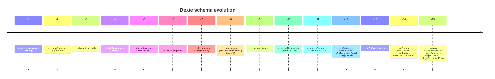

# Storage (Dexie schema)

<Status variant="stable">v150</Status>

<TLDR>
All browser-side state lives in IndexedDB via Dexie under the database name `cognia-claude`. Schema versions are append-only — every release adds new `.version(n)` blocks; old ones are never edited. Migrations are idempotent and run on every database open.
</TLDR>

<StatGrid>
  <Stat label="Schema version" value="150" hint="current" />
  <Stat label="Governed tables" value="234" hint="catalog coverage" />
  <Stat label="Database name" value="cognia-claude" hint="historical, kept stable" />
  <Stat label="Singletons" value="1" hint="settings table" />
</StatGrid>

All browser-side state is persisted in **IndexedDB via Dexie**. The schema is defined in `lib/db/schema.ts` and is currently at **v150**. Schema versions are append-only — never mutate an existing `.version(n).stores({...})` block.

The machine-readable governance authority is `lib/data-governance/table-catalog.ts`. Its generated summary is `docs/data-governance.generated.json`; `pnpm audit:data-governance` blocks schema/catalog, TypeScript/Rust sync, version-order, or generated-document drift.

## Database identity

```ts
super("cognia-claude")
```

The Dexie database name is `cognia-claude` (the original codename — kept stable to avoid migrating existing installations). Don't change it. If you ever absolutely must, write a migration that copies from `cognia-claude` to the new name on first run, then deletes the old database.

## Tables — original v15 baseline

| Table                 | Type                      | Indexed columns                                    | Purpose                                     |
| --------------------- | ------------------------- | -------------------------------------------------- | ------------------------------------------- |
| `sessions`            | `ChatSession`             | `id`, `updatedAt`, `createdAt`                     | Chat sessions                               |
| `messages`            | `StoredMessage`           | `id`, `sessionId`, `[sessionId+createdAt]`         | Chat messages                               |
| `settings`            | `AppSettings` (singleton) | `id` (always `"singleton"`)                        | App-wide settings                           |
| `promptPresets`       | `SystemPromptPreset`      | `id`, `category`, `updatedAt`                      | Reusable prompt snippets                    |
| `mcpServers`          | `McpServer`               | `id`, `enabled`, `updatedAt`                       | MCP server definitions                      |
| `characters`          | `Character`               | `id`, `name`, `isBuiltIn`, `updatedAt`             | Character personas                          |
| `skills`              | `Skill`                   | `id`, `name`, `category`, `isBuiltIn`, `updatedAt` | Skill definitions                           |
| `skillResources`      | `SkillResource`           | `id`, `skillId`, `[skillId+name]`                  | Skill attachments (files, URLs)             |
| `teams`               | `Team`                    | `id`, `name`, `updatedAt`                          | Multi-character teams                       |
| `trustedWorkspaces`   | `TrustedWorkspace`        | `id`, `path`, `lastUsedAt`                         | Workspaces allowed for shell-tool execution |
| `backupHistory`       | `BackupHistoryRow`        | `id`, `completedAt`, `status`                      | Capped at 50 newest                         |
| `canvasDocuments`     | `CanvasDocumentRow`       | `id`, `sessionId`, `updatedAt`                     | Long-form artifacts                         |
| `canvasVersions`      | `CanvasVersionRow`        | `id`, `documentId`, `[documentId+createdAt]`       | Version history                             |
| `canvasComments`      | `CanvasCommentRow`        | `id`, `documentId`, `createdAt`                    | Legacy Canvas compatibility projection      |
| `canvasSessions`      | `CanvasSessionRow`        | `id`, `documentId`, `updatedAt`                    | Per-session canvas state                    |
| `a2uiApps`            | `A2UIAppRow`              | `id`, `name`, `updatedAt`                          | A2UI app instances                          |
| `a2uiSurfaces`        | `A2UISurfaceRow`          | `id`, `appId`, `[appId+createdAt]`                 | A2UI rendered surfaces                      |
| `a2uiTemplates`       | `A2UITemplateRow`         | `id`, `category`, `updatedAt`                      | A2UI surface templates                      |
| `a2uiEventHistory`    | `A2UIEventHistoryRow`     | `id`, `surfaceId`, `[surfaceId+createdAt]`         | A2UI event audit log                        |
| `twinSources`         | `TwinSource`              | `id`, `twinId`, `[twinId+status]`, `updatedAt`     | Raw user-supplied twin sources              |
| `twinChunks`          | `TwinChunk`               | `id`, `sourceId`, `[sourceId+chunkIdx]`, `twinId`  | Embedded chunks                             |
| `twinProfile`         | `TwinProfile`             | `id`, `twinId`                                     | Distilled profile (one per twin)            |
| `twinDrafts`          | `TwinDraft`               | `id`, `twinId`, `status`, `[twinId+createdAt]`     | Pending Character/Skill drafts              |
| `twinJobs`            | `TwinJob`                 | `id`, `twinId`, `kind`, `status`, `createdAt`      | Ingest + distill job queue                  |
| `plugins`             | `PluginRow`               | `id`, `enabled`, `updatedAt`                       | Installed plugins                           |
| `pluginPermissions`   | `PluginPermissionRow`     | `[pluginId+permission]` (composite key)            | Granted permissions                         |
| `pluginReviews`       | `PluginReviewRow`         | `[pluginId+rating]` (composite key)                | Marketplace review cache                    |
| `pluginAnalytics`     | `PluginAnalyticsRow`      | `[pluginId+day]` (composite key)                   | Per-day plugin stats                        |

## Version history



Every `.version(n)` block in `lib/db/schema.ts`:

| Version | Adds                                                                                                            |
| ------- | --------------------------------------------------------------------------------------------------------------- |
| **v1**  | `sessions`, `messages`, `settings`. Original baseline.                                                          |
| **v2**  | `promptPresets`, `mcpServers`.                                                                                  |
| **v3**  | `characters`, `skills`.                                                                                         |
| **v4**  | `skillResources`, `teams`.                                                                                      |
| **v5**  | Adds index `name` to `characters`. (Has upgrade hook to backfill.)                                              |
| **v6**  | `trustedWorkspaces`.                                                                                            |
| **v7**  | Adds index `category` to `skills`; backfill upgrade.                                                            |
| **v8**  | Schema-only upgrade for `messages`; backfill `[sessionId+createdAt]` index.                                     |
| **v9**  | `backupHistory`.                                                                                                |
| **v10** | `canvasDocuments`, `canvasVersions`.                                                                            |
| **v11** | `canvasComments`, `canvasSessions`.                                                                             |
| **v12** | A2UI tables (`a2uiApps`, `a2uiSurfaces`, `a2uiTemplates`); upgrade hook seeds the built-in MCP A2UI bridge row. |
| **v13** | `a2uiEventHistory`; index reshuffle.                                                                            |
| **v14** | Twin tables — `twinSources`, `twinChunks`, `twinProfile`, `twinDrafts`, `twinJobs`.                             |
| **v15** | Plugin tables — `plugins`, `pluginPermissions`, `pluginReviews`, `pluginAnalytics`, `pluginScheduledJobs`.      |
| **v113** | Retired the unused `pluginScheduledJobs` table; plugin schedules are `type: "plugin"` tasks in SchedulerDB. |
| **v16–v112** | Subsequent additions: workflow tables, goal tracker, OCR results, subscription usage, sync cursors, share links, agent-team persistence, character pack overlays, GitHub delivery state, ext. agent configs, mobile sync, perf samples, terminal sessions, etc. Read `lib/db/schema.ts` for the exact diffs. |
| **v115** | Adds `contextComments` as the writable cross-resource comment table and idempotently backfills Canvas comments. Existing historical version blocks remain unchanged. |
| **v116–v150** | Sites, execution journals, memory governance, account/runtime-target isolation, template platform, Knowledge Bases, single-Agent tasks, immutable workflow deployments, replayable workflow event sequences, and the global agent-trace time index. Exact policy and counts are generated from the catalog. |

### Resource comments (v115)

`contextComments` indexes resource kind/id, parent, resolution, creation time, and project scope. It stores resource-level, text/line-range, and workflow node/edge anchors plus revision and stale-anchor metadata. Canvas stores, plugin APIs, legacy Canvas UI, and backup/import compatibility use adapters over this table so there is one writable source of truth.

<Callout type="info" title="Idempotent upgrades">
Each version is idempotent — opening an old database upgrades it through every intermediate version automatically. Dexie applies them in order. **Never modify a previous `.version(n)` block.**
</Callout>

## Upgrade hooks

Some versions have a `.upgrade(tx => { ... })` hook. The hook runs once during the migration to that version. Common patterns:

- **Backfill an index** — read every existing row, write a derived field, re-put.
- **Seed built-in rows** — insert built-in characters/skills/MCP servers if missing.
- **Migrate a row shape** — translate old fields to new.

Hooks must be:

- **Idempotent** — running them twice is safe (in case the user clears + re-imports).
- **Synchronous-ish** — Dexie wraps them in a transaction; long async work is OK but blocks other writes.
- **Tested** — every upgrade hook has a sibling test (see `seed.test.ts`, `schema.test.ts`).

## Settings table

`settings` is a singleton — exactly one row, keyed `"singleton"`. The shape is `AppSettings` (`lib/claude/types.ts`). It includes:

- API key references (the actual keys live in the OS keyring; this table holds metadata).
- Default character / model / skill IDs.
- UI preferences (theme, locale, font size, density).
- Scheduler enable flags.
- Backup schedule + folder.
- Vector backend choice + connection.
- Twin runtime defaults.
- Telemetry consent.
- …

`SettingsSyncProvider` is the React provider that mounts the row, caches it in memory, and exposes an updater that batch-writes back to Dexie.

## Adding a new table

<Steps>
  <Step>
    ### Define the row type

    Create a new file under `lib/db/<name>.ts` and export the row type:

    ```ts
    export interface MyNewRow {
      id: string
      indexedField: string
      otherField: number
      // ...
    }
    ```

  </Step>
  <Step>
    ### Import into schema.ts

    Add `import type { MyNewRow } from "./<name>"` near the top of `lib/db/schema.ts`.

  </Step>
  <Step>
    ### Add a Table field

    Add `myNewTable!: Table<MyNewRow, string>` inside the `CogniaDB` class.

  </Step>
  <Step>
    ### Bump the schema version

    ```ts
    // Use the next free integer; check the latest `.version(n)` in schema.ts
    this.version(55).stores({
      myNewTable: "id, indexedField, [indexedField+otherField]",
      // include only the NEW table; existing tables are inherited
    })
    ```

  </Step>
  <Step>
    ### (Optional) Add an upgrade hook

    If you need to seed built-in rows or backfill from existing tables:

    ```ts
    this.version(55).stores({...}).upgrade(async tx => {
      // idempotent migration
    })
    ```

  </Step>
  <Step>
    ### Write the test

    `lib/db/<name>.test.ts` covering insert / update / delete / query, plus
    upgrade idempotence if you added a hook.

  </Step>
  <Step>
    ### Update this docs page

    Add the table to the table list above.

  </Step>
</Steps>

<Callout type="error" title="Never modify a previous version block">
  If you realise an existing index is wrong, add a **new** version that re-declares the table with
  the corrected index list. Mutating an old block would orphan users who already migrated past that
  version.
</Callout>

## Composite keys

Dexie supports composite primary keys via array syntax. Cognia uses them for the plugin permissions / reviews / analytics tables:

```ts
pluginPermissions: "[pluginId+permission], pluginId"
//                   ^ primary key      ^ secondary index
```

This makes "the user revoked permission X on plugin Y" a single `delete([pluginId, permission])` operation — no scan needed.

## Capped tables

Some tables are capped to prevent unbounded growth:

| Table              | Cap                       | Pruning                                        |
| ------------------ | ------------------------- | ---------------------------------------------- |
| `backupHistory`    | 50 newest                 | `pruneBackupHistory()` runs after every insert |
| `a2uiEventHistory` | per-surface cap (~200)    | Trim on insert when over cap                   |
| `canvasVersions`   | unbounded but compactable | Manual "compact history" action in canvas UI   |

When you add a new high-write table, decide upfront whether it needs a cap.

## Querying tips

- Prefer indexed queries — `db.messages.where("[sessionId+createdAt]").between([sid, 0], [sid, Date.now()])`.
- Avoid `Collection.toArray()` on large tables; use `.each(callback)` to stream.
- Wrap multi-table writes in `db.transaction("rw", tableA, tableB, async () => {...})` so a partial failure rolls back.
- Live queries (`useLiveQuery` from `dexie-react-hooks`) automatically re-render when the underlying data changes.

## Clearing data

`lib/data/clear.ts` exposes:

- `clearAll()` — wipe every Dexie table. Used by the Maintenance tab "Reset" action.
- `clearTables(names)` — wipe specific tables.

Both run in a single Dexie transaction so the database stays consistent.

## Tests

- `lib/db/schema.test.ts` — opens the DB, runs every upgrade, verifies row counts.
- `lib/db/seed.test.ts` — built-in seeding is idempotent.
- Per-table tests (`messages.test.ts`, `characters.test.ts`, …) — CRUD coverage.

## Next

<Cards>
  <Card title="Backup & data transfer" href="./backup-and-data" description="Builds backup payloads from these tables." />
  <Card title="Plugin system" href="../subsystems/plugin-system" description="Uses the v15 plugin tables." />
  <Card title="Employee Digital Twin" href="../subsystems/employee-twin" description="Uses the v14 twin tables." />
</Cards>
