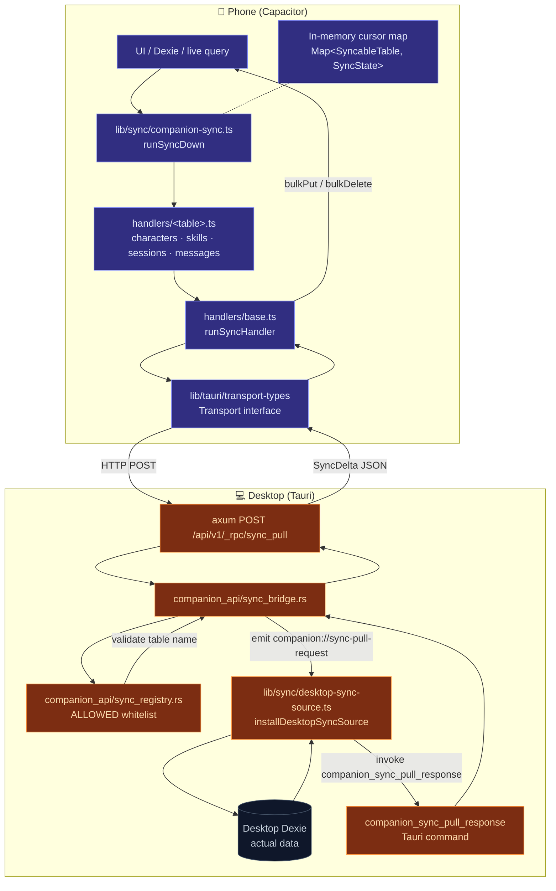

# Sync System

<Status variant="beta" />

<TLDR>
  The desktop is the source of truth; the phone is a read-only cache. The phone pulls deltas via `POST /api/v1/_rpc/sync_pull`, the desktop Rust layer forwards the request to the webview, the webview queries Dexie and returns a `SyncDelta`, which goes back through Rust to the phone. 9 mirrorable tables, each with an independent cursor, three trigger modes (manual / foreground / WS event-driven). V1 has no tombstones — deletions rely on the V2 `deletedAt` index.
</TLDR>

<StatGrid>
  <Stat
    label="Syncable Tables"
    value="9"
    hint="characters · skills · sessions · messages · workflows · twinProfile · plugins · adapterInstances · settings"
  />
  <Stat label="Trigger Modes" value="3" hint="manual · foreground · event-driven" />
  <Stat label="messages limit" value="200" hint="Max 200 latest rows per pull (chronological)" />
  <Stat label="V1 tombstone" value="No" hint="V2 adds deletedAt index" />
</StatGrid>

## Applicable Scenarios

| Scenario | Tables & Strategy |
| -------- | ----------------- |
| Browse historical sessions on mobile | `sessions` + `messages` (latest 200) |
| Switch twin / character on mobile | `characters` + `twinProfile` |
| View workflow definitions on mobile | `workflows` (read-only view) |
| Toggle plugins on mobile | `plugins` (read → settings outbound upload in V2) |
| View connector policies on mobile | `adapterInstances` (mode / quietHours read-only view) |
| Sync user preferences | `settings` single-row `"singleton"` — full snapshot when `since === 0`, then delta by `updatedAt` |

## Architecture Diagram



## Key Modules & File Paths

### Client (Phone)

| File | Purpose |
| ---- | ------- |
| `lib/sync/types.ts` | `SyncableTable` / `SyncCursor` / `SyncDelta` / `SyncOutcome` / `SyncFailure` |
| `lib/sync/companion-sync.ts` | Top-level orchestration: `runSyncDown` / `installForegroundSync` / `installEventDrivenSync` |
| `lib/sync/handlers/base.ts` | `runSyncHandler<TRow>` — single RPC round-trip + `bulkPut` + `bulkDelete` + error classification |
| `lib/sync/handlers/characters.ts` | `syncCharacters` — `rowFilter: row => !row.isBuiltIn` (prevents overwriting local built-ins) |
| `lib/sync/handlers/skills.ts` | `syncSkills` |
| `lib/sync/handlers/sessions.ts` | `syncSessions` |
| `lib/sync/handlers/messages.ts` | `syncMessages` — latest 200 rows only |

### Desktop Responder

| File | Purpose |
| ---- | ------- |
| `lib/sync/desktop-sync-source.ts` | `installDesktopSyncSource` — listens for `companion://sync-pull-request`; queries Dexie; invokes `companion_sync_pull_response` |
| `lib/sync/desktop-sync-source.test.ts` | Full table + boundary coverage |

### Rust Bridge (Companion API)

| File | Purpose |
| ---- | ------- |
| `src-tauri/src/companion_api/sync_bridge.rs` | `_rpc/sync_pull` HTTP handler — forwards request to webview, awaits response |
| `src-tauri/src/companion_api/sync_registry.rs` | `ALLOWED` whitelist — prevents the phone from forging requests for non-allowed tables |
| `src-tauri/src/companion_api/rpc.rs` | RPC router — `"sync_pull"` routes to `sync_bridge` |
| `src-tauri/src/companion_api/commands.rs` | `companion_sync_pull_response` — webview sends delta back through this command |

## Data Flow: One sync_pull

```mermaid
sequenceDiagram
  participant App as Phone UI
  participant Orch as runSyncDown
  participant H as handlers/&lt;table&gt;
  participant B as handlers/base
  participant T as Transport
  participant R as Rust _rpc/sync_pull
  participant Reg as sync_registry
  participant Br as sync_bridge
  participant S as desktop-sync-source
  participant D as Desktop Dexie

  App->>Orch: runSyncDown()
  loop Each table (sequential)
    Orch->>H: syncXxx(transport, { since: cursor })
    H->>B: runSyncHandler<TRow>(opts, transport, cursor)
    B->>T: transport.call("sync_pull", { table, since })
    T->>R: HTTP POST /api/v1/_rpc/sync_pull
    R->>Reg: validateTable(table)
    alt Table not in whitelist
      Reg-->>T: 404 Not Implemented
    else
      Reg->>Br: enqueue pull
      Br->>S: emit companion://sync-pull-request<br/>{ request_id, table, since }
      S->>D: Read corresponding table where updatedAt > since
      D-->>S: Row set
      S->>S: finalizeDelta (compute next_since)
      S->>Br: invoke companion_sync_pull_response<br/>{ requestId, delta }
      Br-->>T: SyncDelta JSON
    end
    T-->>B: SyncDelta
    B->>B: rowFilter (optional)
    B->>App: Local Dexie bulkPut(rows) + bulkDelete(deleted_ids)
    B-->>H: SyncOutcome
    H-->>Orch: SyncOutcome
    Orch->>Orch: Update cursor + lastSyncAt
  end
```

## Three Trigger Modes

| Trigger | Implementation |
| ------- | -------------- |
| Manual | UI "Sync now" button calls `runSyncDown()` |
| Foreground | `installForegroundSync` listens for `document.visibilitychange`; runs when becoming `visible` |
| WS Event-driven | `installEventDrivenSync` subscribes to `transport.subscribe("sync://invalidate", ...)`; pulls when server notifies |

`runSyncDown` is re-entrant: a second concurrent call reuses the in-flight promise instead of spawning four concurrent RPCs.

## Tables & Cursor Strategy

| Table | rowFilter | Cursor Field | Notes |
| ----- | --------- | ------------ | ----- |
| `characters` | `!row.isBuiltIn` | `updatedAt` | Also filtered on desktop; client-side second filter for safety |
| `skills` | — | `updatedAt` | — |
| `sessions` | — | `updatedAt` | — |
| `messages` | — | `createdAt` (latest 200 only) | Table only has `[sessionId+createdAt]` index; full table scan then sort and truncate to latest 200 |
| `workflows` | — | `updatedAt` | Read-only view (phone does not write) |
| `twinProfile` | — | `updatedAt` (nullable) | Old rows without `updatedAt` stabilize after one sync |
| `plugins` | — | `updatedAt` (nullable) | Same as above |
| `adapterInstances` | — | `updatedAt` | mode / quietHours read-only |
| `settings` | — | `singleton` single row; full snapshot when `since===0`; otherwise `updatedAt > since` | No per-row updatedAt; cursor is document-level |

## Database Tables

The sync system **does not introduce new Dexie tables**:

- It uses the existing `updatedAt` / `createdAt` fields on the 9 desktop tables as incremental cursors.
- The phone reuses tables with the same names, with row data in 1:1 format.
- The cursor map is **in-memory** (V1 limitation) — cursor resets to 0 on app restart, meaning a cold start pulls a full snapshot. V2 plans to add a `_syncCursors` table for persistence.

## Configuration & Extension Points

### `SyncableTable` Union

To add a new table:

1. Add the type literal in `lib/sync/types.ts:SyncableTable`;
2. Add a new branch in `lib/sync/desktop-sync-source.ts:readDexieDelta`;
3. Add `syncXxx` in `lib/sync/handlers/`;
4. Register it in `lib/sync/companion-sync.ts:DEFAULT_HANDLERS`;
5. Add the table name to the `ALLOWED` whitelist in Rust `companion_api/sync_registry.rs`.

Any missing step fails safely: missing whitelist → 404 Not Implemented → client classifies as `reason: "not_implemented"`, UI shows "not yet supported on server" instead of a red error.

### Transport Abstraction

Uses `lib/tauri.ts:transport`:

- **Tauri Desktop**: no-op (same machine local Dexie, no sync needed)
- **Capacitor (Phone)**: HTTP implementation, calls the desktop axum app
- **Web**: no-op (no paired desktop)

The underlying interface is in `lib/tauri/transport-types.ts`.

### Error Classification

`classifyTransportError` distinguishes:

- `not_implemented` — 404 / "command not found" / "not implemented" → UI silent
- `transport` — network issues → UI red
- `schema` — Dexie `bulkPut` error → UI red + hint to upgrade
- `unknown` — fallback

## Related Subsystems

<Cards>
  <Card title="Storage" href="./storage" description="The source of the Dexie tables targeted by sync" />
  <Card
    title="Backup & Data"
    href="./backup-and-data"
    description="Another form of cross-device data transfer — offline, full, encrypted snapshots"
  />
</Cards>

## Related ADRs

- [ADR 0014 — Capacitor Mobile Shell](../adr/0014-capacitor-mobile-shell)
- [ADR 0015 — Mobile V2 Completion](../adr/0015-mobile-v2-completion)
- [ADR 0012 — Transport Abstraction](../adr/0012-transport-abstraction)

## Known Limitations

- **V1 does not support tombstones**: deletion operations are not synced. V2 plans to add a `deletedAt` index to each table; for now, use `applyDomainImport` full replacement to handle deletions.
- **Cursor is in-memory**: resets on app restart; cold start pulls a full snapshot. V2 will add a `_syncCursors` table for persistence.
- **Phone is read-only only**: write operations do not go through sync; writes use the outbound queue (`mobile-outbound-queue.ts` is already schema-reserved).
- **messages only pulls latest 200**: scrolling history to the boundary requires V2's "pull history by sessionId" extension.
- **`settings` single-row sync semantics**: `since === 0` pulls a full snapshot; afterwards `updatedAt > since`; old settings rows lacking `updatedAt` sync once and never trigger again until the row is actually modified.
- **Sequential pull, not concurrent**: avoids hitting the desktop with four simultaneous RPCs. Slower but safer.
- **Built-in double filter**: both server and client filter `isBuiltIn`, preventing the phone's local built-ins from being overwritten if the desktop filter ever leaks.
