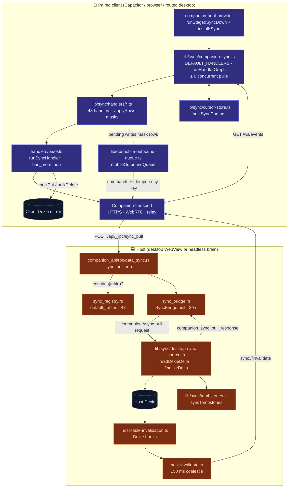

# Sync System

<Status variant="beta" />

<TLDR>
  The Host (desktop or headless) is the source of truth; a paired client keeps a Dexie mirror. The
  client pulls deltas via `POST /api/_rpc/sync_pull`, the Host's Rust layer forwards the request to
  the webview, the webview reads Dexie and returns a `SyncDelta`. 48 tables are registered
  (`COMPANION_SYNC_PROTOCOL_TABLE_NAMES`), pulled in three stages (`critical` → `interactive` →
  `background`) with up to 6 concurrent pulls. Cursors persist in `hostSyncCursors`, deletions travel
  as tombstones, and client writes go back through the outbound queue, not through sync.
</TLDR>

<StatGrid>
  <Stat
    label="Syncable Tables"
    value="48"
    hint="COMPANION_SYNC_PROTOCOL_TABLE_NAMES in lib/data-governance/table-catalog.ts"
  />
  <Stat label="Pull Stages" value="3" hint="critical · interactive · background" />
  <Stat label="Concurrent pulls" value="6" hint="SYNC_MAX_CONCURRENT_PULLS" />
  <Stat label="Message catch-up" value="500" hint="Newest 500 on a fresh client, then paged" />
</StatGrid>

## Applicable Scenarios

Every scenario reads the Host through the same `sync_pull` command.
Tables differ in the stage at which the client retrieves them.
That stage determines how soon the client receives a table after pairing or resume.

| Scenario | Tables | Stage |
| --- | --- | --- |
| Open the app and see the session list | `settings`, `characters`, `sessions`, `sessionState`, `sessionFolders`, `conversationOverrides` | `critical` |
| Read a conversation and its runs | `messages` (paged), `executionRuns`, `executionRunBindings`, `workflowRuns`, `plans`, `goals`, `goalEvents` (paged), `agentTasks`, `agentTaskAttempts`, `agentTeamBoard` | `interactive` |
| Triage the inbox | `connectorDrafts`, `outboundQueue`, `connectorHeartbeats`, `projects`, `botInstallations`, `botEventDeliveries` | `interactive` |
| Browse issues | `labels`, `issueProjects`, `issues`, `issueEvents`, `issueRuns`, `issueCycles` | `background` |
| Twins, characters and templates | `twinProfile`, `twins`, `twinDrafts`, `chatTemplates`, `templateDefinitions`, `templatePackages`, `templateInstances` | `background` |
| Capabilities and connectors | `skills`, `plugins`, `mcpServers`, `memories`, `workflows`, `adapterInstances`, `platformIdentities`, `connectorCallbackBindings`, `workflowDeployments`, `terminalHistory` | `background` |
| Agent teams and bots | `agentTeams`, `agentTeammates`, `agentTeamTasks`, `botDefinitions` | `background` |
| Change something from the client | none: writes go through `mobileOutboundQueue`, and the next pull brings the Host's result back | n/a |

The client is a Capacitor phone, a browser paired to a Host, or a Tauri desktop routed to a remote
Host. The Host is either the desktop app (its WebView answers) or the headless brain (its Node
runtime answers from its own Dexie).

## Architecture Diagram

```mermaid
flowchart TB
  subgraph Client["📱 Paired client (Capacitor / browser / routed desktop)"]
    direction TB
    Boot[companion-boot-provider<br/>runStagedSyncDown + install*Sync]
    Orch[lib/sync/companion-sync.ts<br/>DEFAULT_HANDLERS · runHandlerGraph<br/>≤ 6 concurrent pulls]
    Handlers[lib/sync/handlers/*.ts<br/>48 handlers · applyRows masks]
    Base[handlers/base.ts<br/>runSyncHandler · has_more loop]
    CursorStore[lib/sync/cursor-store.ts<br/>hostSyncCursors]
    Outbound[lib/db/mobile-outbound-queue.ts<br/>mobileOutboundQueue]
    Transport[CompanionTransport<br/>HTTPS · WebRTC · relay]
    Mirror[(Client Dexie mirror)]
  end

  subgraph Host["💻 Host (desktop WebView or headless brain)"]
    direction TB
    RPC[companion_api/rpc/data_sync.rs<br/>sync_pull arm]
    Registry[sync_registry.rs<br/>default_tables · 48]
    Bridge[sync_bridge.rs<br/>SyncBridge.pull · 30 s]
    Source[lib/sync/desktop-sync-source.ts<br/>readDexieDelta · finalizeDelta]
    Tomb[lib/sync/tombstones.ts<br/>syncTombstones]
    Hooks[host-table-invalidation.ts<br/>Dexie hooks]
    Inval[host-invalidate.ts<br/>150 ms coalesce]
    HostDexie[(Host Dexie)]
  end

  Boot --> Orch --> Handlers --> Base --> Transport
  Orch <--> CursorStore
  Base -- "bulkPut / bulkDelete" --> Mirror
  Handlers -. "pending writes mask rows" .- Outbound
  Outbound -- "commands + Idempotency-Key" --> Transport
  Transport -- "POST /api/_rpc/sync_pull" --> RPC
  RPC -- "contains(table)?" --> Registry
  RPC --> Bridge
  Bridge -- "companion://sync-pull-request" --> Source
  Source --> HostDexie
  Source --> Tomb
  Source -- "companion_sync_pull_response" --> Bridge
  HostDexie --> Hooks --> Inval
  Inval -- "sync://invalidate" --> Transport
  Transport -- "GET /ws/events" --> Orch

  classDef phone fill:#312e81,stroke:#818cf8,color:#e0e7ff
  classDef desk fill:#7c2d12,stroke:#fb923c,color:#fed7aa
  classDef storage fill:#0f172a,stroke:#475569,color:#cbd5e1
  class Boot,Orch,Handlers,Base,CursorStore,Outbound,Transport phone
  class RPC,Registry,Bridge,Source,Tomb,Hooks,Inval desk
  class Mirror,HostDexie storage
```

## Key Modules & File Paths

### Client

| File | Purpose |
| --- | --- |
| `lib/sync/types.ts` | `SyncableTable` (derived from `COMPANION_SYNC_PROTOCOL_TABLE_NAMES`), `PAGED_SYNC_TABLES`, `SyncCursor`, `SyncDelta`, `SyncOutcome`, `SyncFailure`, `SyncCursorRow`, `SyncTombstoneRow` |
| `lib/sync/companion-sync.ts` | `DEFAULT_HANDLERS` (table, stage, `after` edges), `runSyncDown`, `runStagedSyncDown`, the pull budget, cursor hydration, every `install*Sync` trigger, `COMPANION_SYNC_DOMAINS` |
| `lib/sync/handlers/base.ts` | `runSyncHandler`: one table's pull, the `has_more` page loop, sliced `bulkPut` / `bulkDelete`, `classifyTransportError` |
| `lib/sync/handlers/*.ts` | One handler per table (38 files, 48 syncers); per-table `rowFilter`, `applyRows` merges and pending-write masks |
| `lib/sync/handlers/app-settings.ts` | The `settings` merge over `CROSS_PLATFORM_SETTING_KEYS` |
| `lib/sync/cursor-store.ts` | `loadCursors` / `saveCursor` / `clearCursorsForServer` over `hostSyncCursors` |
| `lib/sync/scheduling.ts` | `whenIdle` / `yieldToMain`, used between stages and pages |
| `lib/db/mobile-outbound-queue.ts` | The durable write queue: enqueue, claim, retry, dead-letter |
| `components/providers/companion-boot-provider.tsx` | Mobile wiring: critical stage first, then the triggers |
| `components/providers/web-companion-boot-provider.tsx` | The same for a browser paired to a Host |

### Host responder

| File | Purpose |
| --- | --- |
| `lib/sync/desktop-sync-source.ts` | `installDesktopSyncSource`: answers `companion://sync-pull-request` from Dexie; `readDexieDelta` (one branch per table), `readCursorDelta` (paged tables), `finalizeDelta` (tombstones and `next_since`) |
| `lib/sync/tombstones.ts` | `recordTombstones`, `readTombstonesSince`, `pruneTombstones` (90-day retention) |
| `lib/sync/host-table-invalidation.ts` | `SYNC_TABLE_SOURCES` and the Dexie hooks that announce a change to any synced table |
| `lib/sync/host-invalidate.ts` | `publishSyncInvalidate`: per-table 150 ms coalescing of `sync://invalidate` |
| `lib/headless/runtimes/desktop-sync-source.ts` | The headless brain's registration: the same source with the socket bridge |
| `components/providers/desktop-sync-source-provider.tsx` | Desktop (Tauri) installation of the source and the invalidation hooks |

### Rust

| File | Purpose |
| --- | --- |
| `src-tauri/src/companion_api/rpc/data_sync.rs` | The `sync_pull` and `sync_list_tables` arms: argument checks, tenant, registry, bridge selection |
| `crates/cognia-companion-bus/src/sync_registry.rs` | `SyncTableRegistry`, `default_tables()` (48 descriptors: `name`, `description`, `has_tombstones`) |
| `crates/cognia-companion-bus/src/sync_bridge.rs` | `SyncBridge.pull`: emits the request, awaits the response, 30 s timeout |
| `src-tauri/src/companion_api/commands.rs` | `companion_sync_pull_response`, the WebView's reply path |
| `crates/cognia-companion/src/ws_bridge.rs` | The brain socket: the headless Host's reply path and the `sync://invalidate` publish topic |

## Data Flow: One sync_pull

```mermaid
sequenceDiagram
  participant O as runSyncDown
  participant H as handlers/&lt;table&gt;
  participant B as runSyncHandler
  participant T as CompanionTransport
  participant R as data_sync.rs sync_pull
  participant Br as SyncBridge
  participant S as desktop-sync-source
  participant D as Host Dexie
  participant M as Client Dexie

  O->>O: hydrate cursors from hostSyncCursors (once per Host)
  O->>O: withPullBudget (≤ 6 per transport + Host)
  O->>H: run(transport, since, cursor)
  loop while has_more (≤ 100 pages)
    H->>B: runSyncHandler
    B->>T: call("sync_pull", table, since, content_protocol_version, cursor?)
    T->>R: POST /api/_rpc/sync_pull
    R->>R: tenant check · validate_content_protocol · registry.contains(table)
    alt table not registered
      R-->>T: not exposed to mobile sync
    else
      R->>Br: pull (brain socket first, else WebView)
      Br->>S: companion://sync-pull-request
      S->>S: account check against the unlocked account
      S->>D: readDexieDelta / readCursorDelta
      S->>D: readTombstonesSince(table, since)
      S-->>Br: companion_sync_pull_response (delta)
      Br-->>T: SyncDelta: rows, deleted_ids, next_since, next_cursor?, has_more?
    end
    T-->>B: SyncDelta
    B->>B: validate delta; cursor must advance
    B->>M: rowFilter → applyRows or bulkPut (slices of 200) → bulkDelete(deleted_ids)
  end
  B-->>O: SyncOutcome
  O->>O: advance cursor if nextSince did not go backwards
  O->>M: saveCursor(serverKey, table, since, cursor, lastSyncAt, lastError)
```

A failure after some pages carries `progress`, so the cursor still advances past the pages that
applied. `rate_limited` failures wait (`retryAfterMs`, else 1 s, at most 30 s) and retry up to three
times per table, resuming from that progress.

## Trigger Modes

| Trigger | Implementation |
| --- | --- |
| Pairing / boot | `companion-boot-provider` awaits `runStagedSyncDown(...).critical`, then installs the triggers below. `interactive` and `background` follow when the main thread is idle (`whenIdle`, 500 ms deadline) |
| Manual | The sync status card (`components/settings/companion/sync-status-card.tsx`) runs a full pull or `only: [table]`; `use-dexie-first-query` and host orchestration also call `runSyncDown` |
| Foreground | `installForegroundSync` on `visibilitychange`, gated by `claimForegroundSync`: the app must have been away 5 s, and runs are at least 30 s apart |
| Resume | `installResumeSync` (native resume), same gate. Not installed on web |
| Network | `installNetworkSync`: a full pull when connectivity comes back |
| Push | `installEventDrivenSync` subscribes to `sync://invalidate` and pulls the named table, coalesced per table for 100 ms; a payload without a table pulls every handler table |
| Workflow run status | `installWorkflowRunStatusSync` patches the `workflowRuns` row from `workflow://run-status`, or pulls `workflowRuns` |
| Event gap | `remoteEventResyncCoordinator` runs `runSyncDown` when the event stream reports a gap |

`runSyncDown` is re-entrant: a full run joins the in-flight promise when the Host, config generation
and database match. Targeted runs (`only` or `stages`) bypass that, but each table keeps at most one
active pull and one queued behind it (`scheduleTablePull`). A Host change mid-run fails the remaining
pulls with `Sync host changed` instead of writing one Host's rows under another's cursor.

### The push half

On the Host, `installHostTableInvalidation` hooks `creating` / `updating` / `deleting` on the source
table of every synced table (`SYNC_TABLE_SOURCES`, typed so a new protocol table without a source is
a compile error). Each change calls `publishSyncInvalidate(table, conversationKey?)`, which keeps one
150 ms timer per table and publishes `{ table }` once per window; the `conversationKey` survives only
if every write in the window named the same one. `publishHostEvent` sends it through the headless
bridge when one is registered, else through Tauri `emit`, and the companion server forwards it to
clients on `GET /ws/events`. It is a no-op while this device is itself routed to a remote Host.
Workflow run events publish directly and skip the coalescer.

## Tables & Cursor Strategy

The 48 tables are `COMPANION_SYNC_PROTOCOL_TABLE_NAMES` in `lib/data-governance/table-catalog.ts`,
and the same set is `default_tables()` in `sync_registry.rs`. Three wire names differ from their Dexie
table: `goals` is `chatGoals`, `goalEvents` is `chatGoalEvents`, `plans` is `agentPlans`.

### Stages and dependencies

| Stage | Tables | `after` edges |
| --- | --- | --- |
| `critical` (6) | settings, characters, sessions, conversationOverrides, sessionState, sessionFolders | sessions → characters |
| `interactive` (16) | messages, agentTasks, agentTaskAttempts, plans, goals, goalEvents, agentTeamBoard, executionRuns, workflowRuns, connectorDrafts, outboundQueue, projects, botInstallations, botEventDeliveries, executionRunBindings, connectorHeartbeats | agentTaskAttempts → agentTasks; goalEvents → goals; botEventDeliveries → botInstallations; executionRunBindings → executionRuns |
| `background` (27) | skills, workflows, twinProfile, twins, twinDrafts, labels, issueProjects, issues, issueEvents, issueRuns, issueCycles, plugins, adapterInstances, platformIdentities, connectorCallbackBindings, workflowDeployments, memories, mcpServers, terminalHistory, chatTemplates, templateDefinitions, templatePackages, templateInstances, agentTeams, agentTeammates, agentTeamTasks, botDefinitions | twins → twinProfile; twinDrafts → twins; issueProjects → labels; issues → issueProjects; issueEvents, issueRuns, issueCycles → issues; platformIdentities, connectorCallbackBindings, workflowDeployments → adapterInstances; templateInstances → templateDefinitions + templatePackages; agentTeammates, agentTeamTasks → agentTeams |

`runHandlerGraph` starts a table once the tables it names in `after` have finished, with at most
`SYNC_MAX_CONCURRENT_PULLS = 6` pulls in flight per transport and Host (`withPullBudget`). An edge
to a table outside the current run is ignored, and a cycle is broken at the earliest-registered
handler. Results come back in registry order.

### Cursors

| Kind | Tables | How it advances |
| --- | --- | --- |
| Watermark | 44 tables | `since` is the highest `updatedAt` (else `createdAt`) seen, or the newest tombstone's `deletedAt`, whichever is later. The Host returns rows above it |
| Opaque, paged | `messages`, `executionRuns`, `workflowRuns`, `connectorHeartbeats`, `goalEvents` (`PAGED_SYNC_TABLES`) | The client sends `cursor` (empty string to start); the Host returns `next_cursor` and `has_more`. The cursor is JSON of version, table, position, id and tombstone watermark, capped at 4096 bytes |

Paged tables, as read by `readCursorDelta`:

- **`messages`**: a fresh client gets the newest `MESSAGES_PAGE_SIZE = 500` by `[createdAt+id]`,
  pinned to the message clock's revision. After that it pages over `[syncRevision+id]` in pages of
  500, so an edit to an old message is still delivered. A cursor from the older version is reset and
  drained again.
- **`executionRuns`**: pages of 200 by `updatedAt` and id.
- **`workflowRuns`**: pages of 200 by `[syncActivityAt+id]`; the first sync looks back 30 days, and
  rows are projected for sync.
- **`connectorHeartbeats`**: pages of 500 by `at`; the first sync looks back one hour. The client
  sweeps mirrored heartbeats older than 48 hours.
- **`goalEvents`**: pages of 500 by `ts` and event id, full history (the Host keeps the newest 5000
  events per goal). It records no tombstones: a deleted goal's `goals` tombstone removes its events
  on the client, which also trims each goal to the same 5000. `judge_parse_failed.raw` is emptied.

`memories` also starts with the newest 500 on a cold client, and requires
`content_protocol_version: 1`. The handler keeps pulling while `has_more` is set, yielding to the main
thread between pages, up to 100 pages per run; a page whose cursor does not advance is a `schema`
failure.

### Tombstones

`finalizeDelta` folds `readTombstonesSince(table, since)` into every delta as `deleted_ids`, for
every table. A Host deletion therefore reaches the client exactly when the delete path called
`recordTombstones` (the session cascade records sessions, messages and session state with one
timestamp). The registry's `has_tombstones` flag does not gate this; it is metadata returned by
`sync_list_tables`. The client applies `deleted_ids` with `bulkDelete` after the rows.

### Per-table behavior

| Table | Behavior |
| --- | --- |
| `settings` | The Host projects its singleton to the cross-platform keys (`projectMirroredSettings`). The client merges those keys onto its own singleton, keeping device-local fields, and skips any key with an `app_settings_update` still pending or sending in the outbound queue |
| `characters`, `workflows` | `rowFilter: !row.isBuiltIn` on the client; the Host also drops built-in characters |
| `sessions` | Merges the portable part of `executionContext` |
| `sessionState` | Pending `session_mark_read` / `session_mark_unread` jobs override the incoming unread count |
| `conversationOverrides`, `botInstallations` | Rows with a pending write are skipped |
| `connectorDrafts` | A locally decided draft is not regressed to `pending` by an older Host row |
| `outboundQueue` | The Host projects jobs (no segments, marked `syncedFromHost`); rows mirrored from another Host are excluded |
| `plugins` | Plugin `storage` is not sent |
| `mcpServers` | Read from `mcpServerSummaries`, never from the config that holds secrets |
| `chatTemplates` | Calls `notifyChatTemplatesChanged` when rows applied |

## Database Tables

Sync reads the Host's existing tables and adds three of its own:

- `hostSyncCursors` (`&[serverKey+table]`): the client's persisted cursor per Host and table, so a
  restart resumes where it stopped instead of pulling a full snapshot. `serverKey` namespaces the
  cursor by account and Host, so one phone paired to several Hosts keeps them apart.
- `syncTombstones` (`[table+id]`): the Host records one row per genuine user deletion, in the same
  transaction as the delete (`lib/sync/tombstones.ts`), and folds them into each delta as
  `deleted_ids`. Rows are pruned after 90 days.
- `mobileOutboundQueue`: the client's durable write queue (see Known Limitations).

## Configuration & Extension Points

### Cursor namespace

`serverKey` is `companionCursorNamespace(config)`: the URI-encoded account namespace and Host id
(`targetId`, else `deviceId`) joined by `:`. Cursors load once per Host, database and config
generation. If `hostSyncCursors` holds another Host's key, the client clears every mirrored table
except `settings` before pulling, so two Hosts never share one mirror. Cursors saved under the old
device-id key are adopted.

### Adding a table

1. Add the wire name to `COMPANION_SYNC_PROTOCOL_TABLE_NAMES` in `lib/data-governance/table-catalog.ts`.
   `SyncableTable` follows, and the typed maps below stop compiling until they have an entry.
2. Add a descriptor to `default_tables()` in `crates/cognia-companion-bus/src/sync_registry.rs`.
3. Add a branch to `readDexieDelta` in `lib/sync/desktop-sync-source.ts`, and a source table to
   `SYNC_TABLE_SOURCES` in `lib/sync/host-table-invalidation.ts`.
4. Write `lib/sync/handlers/<table>.ts` and register it in `DEFAULT_HANDLERS` with a stage and any
   `after` edges; add its `COMPANION_SYNC_DOMAINS` entry (sensitivity, cursor kind, deletion policy).
5. Record tombstones in the table's delete path if deletions must reach clients.
6. Update the `sync_pull` table enum in `protocol/companion-request-schemas.json`.

`pnpm audit:data-governance` fails if the catalog, `DEFAULT_HANDLERS` and the Rust registry
disagree, and `lib/data-governance/table-catalog.test.ts` pins the catalog against the protocol
enum.

### Transport

`lib/tauri/transport-instance.ts` picks the transport:

- **Capacitor**: `CompanionTransport`. `sync_pull` is `POST {baseUrl}/api/_rpc/sync_pull`; off the
  LAN it can ride the WebRTC data channel or the relay, falling back to HTTPS. Events arrive on
  `GET /ws/events`.
- **Browser paired to a Host**: `CompanionTransport`.
- **Tauri desktop**: `RoutingTransport` over the local transport; it syncs only when routed to a
  remote Host.
- **Web without a Host**: `WebStubTransport`.

On the Host, `sync_pull` goes to the connected brain socket first and the desktop WebView otherwise;
with neither it answers 503.

### Error Classification

A failed pull carries a `SyncFailure.reason`. `classifyTransportError` (`handlers/base.ts`) maps
transport errors; `runSyncHandler` raises `schema` and `upgrade_required` itself:

- `no_host`: not paired, or no Host transport. No cursor or error is recorded
- `upgrade_required`: the Host or client is too old for the other (for example a saved paged cursor
  and a Host that does not return `next_cursor`)
- `rate_limited`: 429, with `retryAfterMs`
- `not_implemented`: not found, unknown command, 404
- `schema`: a malformed delta, or a page cursor that did not advance
- `transport`: everything else, including hitting the page cap
- `unknown`: the fallback for errors that are not transport errors

## Related Subsystems

<Cards>
  <Card
    title="Storage"
    href="./storage"
    description="The source of the Dexie tables targeted by sync"
  />
  <Card
    title="Backup & Data"
    href="./backup-and-data"
    description="Another form of cross-device data transfer — offline, full, encrypted snapshots"
  />
</Cards>

## Related ADRs

- [ADR 0014 — Capacitor Mobile Shell](../adr/0014-capacitor-mobile-shell)
- [ADR 0015 — Mobile V2 Completion](../adr/0015-mobile-v2-completion)
- [ADR 0012 — Transport Abstraction](../adr/0012-transport-abstraction)
- [ADR 0027 — Mobile Offline Tolerance & Server Discovery](../adr/0027-mobile-offline-and-discovery)

## Known Limitations

- **Tombstones are per table, and not every table records them.** A deletion reaches the client
  only when the Host's delete path calls `recordTombstones`; sessions, messages, workflows,
  characters, issues and most tables marked `has_tombstones: true` do. `botDefinitions` and
  `botInstallations` are marked but their delete paths record nothing. Skills, memories, MCP servers, plugins and the template tables do not record a tombstone
  on user delete yet, so a row deleted on the Host stays on the client. See
  `docs/plans/2026-09-30-collaboration-multi-device-gap-analysis.md`, gap B2.
- **The client writes through the outbound queue, not through sync.** Commands in
  `MOBILE_OUTBOUND_COMMANDS` are queued durably (`pending → sending → sent | deadlettered |
  rejected | conflicted`) and deduplicated by the Host's 24-hour idempotency ledger. Pending writes
  mask incoming rows until they settle.
- **The Host wins.** An incoming row overwrites the mirror (`bulkPut`); only `settings` merges an
  allowlisted set of cross-platform keys. There is no field-level merge on this plane.
- **Message history is paged.** A fresh client receives the newest 500 messages; older history comes
  from transcript pagination, not from the sync pull.
- **About 48 of the Host's tables sync.** Artifacts, canvas, knowledge bases, drafts, media and
  provider profiles are not mirrored.
- **No background sync on mobile.** Pulls run on foreground, resume, network change and
  `sync://invalidate`; there is no BGTask or WorkManager job.
- **Built-in double filter**: both server and client filter `isBuiltIn`, preventing the phone's local
  built-ins from being overwritten if the desktop filter ever leaks.
