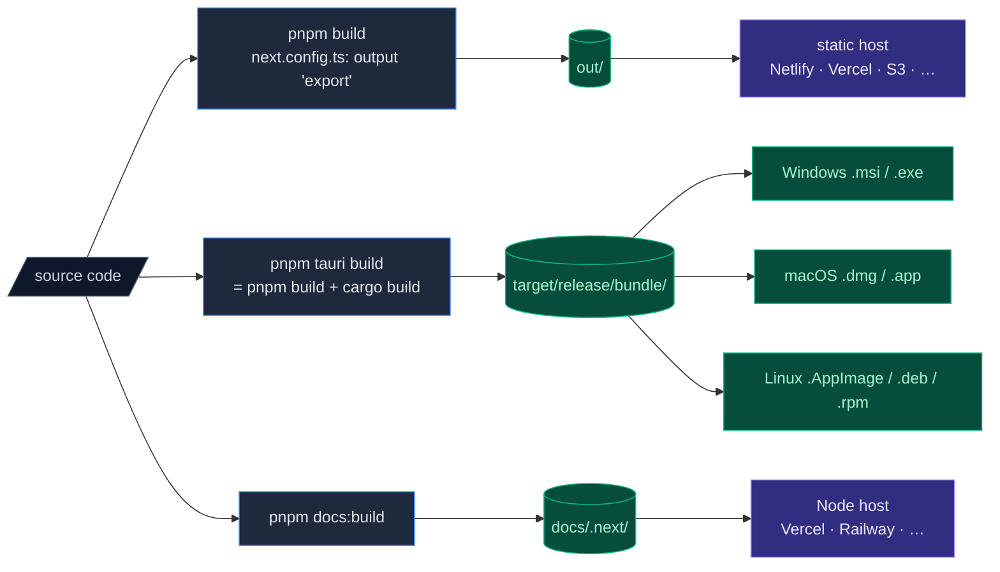

# Deployment

Cognia ships in three forms:

1. **Web** — a static export deployable to any static host.
2. **Desktop** — Tauri-bundled installers for Windows, macOS, and Linux.
3. **Docs** — Fumadocs Next.js server, deployed independently.



Each form has its own build pipeline.

## Web build

```bash
pnpm build
```

`next.config.ts` has `output: "export"`, so the build emits a fully static site to `out/`. There is **no Node.js server** — every page is pre-rendered or client-rendered.

What this means:

- API routes are not supported in the main app (use the Rust backend or external services).
- `next/image` runs in unoptimised mode (configured in `next.config.ts`).
- Routing is filesystem-based; the host needs to serve `index.html` for unknown paths (or use trailing-slash mode).

Deploy to:

- **Netlify / Cloudflare Pages / GitHub Pages** — point at `out/`.
- **Static Nginx / Apache** — copy `out/` to the document root; configure SPA fallback to `index.html`.
- **S3 / CloudFront** — sync `out/` to a bucket; set the index document.

Web mode hides desktop-only features (native vector store, scheduled backups, native scheduler promotion) at the UI level via `isTauri()` checks.

### Environment variables

Only `NEXT_PUBLIC_*` vars are exposed to the browser. Set them at build time on the host:

```bash
NEXT_PUBLIC_APP_NAME="Cognia" \
NEXT_PUBLIC_API_URL="https://api.example.com" \
pnpm build
```

`lib/env.ts` validates required vars at first access.

### Headers

For best caching, configure your host with:

```
out/_next/static/**/*  →  Cache-Control: public, max-age=31536000, immutable
out/**/*.html          →  Cache-Control: no-cache
```

Tailwind v4's emitted CSS is hashed; long-cache it.

## Desktop build (Tauri)

```bash
pnpm tauri build
```

This:

1. Runs `beforeBuildCommand` → `pnpm build` → emits `out/`.
2. Compiles the Rust crate in release mode.
3. Bundles the `out/` directory + `sidecar/` resources + Rust binary into a platform installer.

### Output paths

<Tabs groupId="os" persist items={["Windows", "macOS", "Linux"]}>
  <Tab value="Windows">
    ```
    src-tauri/target/release/bundle/
      msi/Cognia_<version>_x64_en-US.msi
      nsis/Cognia_<version>_x64-setup.exe   # if configured
    ```

    Distribute the `.msi` (preferred for enterprise rollouts) or the NSIS `.exe`
    (smaller; user-friendlier first-run UX).

  </Tab>
  <Tab value="macOS">
    ```
    src-tauri/target/release/bundle/
      dmg/Cognia_<version>_<arch>.dmg
      macos/Cognia.app
    ```

    Distribute the `.dmg`. Apple Silicon users should get the `aarch64` build;
    Intel users the `x86_64` build. Build a universal binary with `lipo` if you
    want a single file.

  </Tab>
  <Tab value="Linux">
    ```
    src-tauri/target/release/bundle/
      appimage/cognia_<version>_amd64.AppImage
      deb/cognia_<version>_amd64.deb        # if configured
      rpm/cognia-<version>.x86_64.rpm        # if configured
    ```

    AppImage is the most portable. Users `chmod +x` and run.

  </Tab>
</Tabs>

### Build flags

```bash
pnpm tauri build --target x86_64-pc-windows-msvc   # Specific target triple
pnpm tauri build --debug                            # Debug symbols (much larger; slower)
pnpm tauri build --bundles none                     # Skip installer creation (just the binary)
pnpm tauri build --bundles deb,rpm,appimage         # Specific bundle types
```

### Cross-compilation

Tauri supports cross-compilation only with significant setup (Docker images, sysroots). For day-to-day:

- Build for each platform on a native CI runner of that platform.
- GitHub Actions matrix is the standard pattern; see `.github/workflows/release.yml`.

### Resources

`tauri.conf.json` → `bundle.resources` lists files copied into the app bundle:

```jsonc
"resources": [
  "../sidecar/claude-host.mjs",
  "../sidecar/a2ui-mcp.mjs",
  "../sidecar/package.json",
  "../sidecar/node_modules/**/*"
]
```

The entire sidecar `node_modules/` is shipped because the sidecar runs as a separate Node process and needs its deps. Production users do not need Node installed — the bundled Node binary (or the host system's, if available) runs the sidecar.

## Code signing

Distributing unsigned Cognia builds will trigger SmartScreen / Gatekeeper / Linux trust warnings on first run. For wide distribution:

<Tabs groupId="os" persist items={["Windows", "macOS", "Linux"]}>
  <Tab value="Windows">
    - Acquire an EV or OV code-signing certificate from a CA (DigiCert, Sectigo, …).
    - Set `bundle.windows.certificateThumbprint` in `tauri.conf.json` (or pass via env in CI).
    - Tauri uses `signtool.exe`; ensure the Windows SDK is on PATH in CI.
  </Tab>
  <Tab value="macOS">
    - Apple Developer Account + Developer ID Application certificate.
    - Notarisation: set `APPLE_ID`, `APPLE_PASSWORD` (app-specific), `APPLE_TEAM_ID` env vars; Tauri runs `notarytool` automatically.
    - Universal binaries: build separately for `aarch64-apple-darwin` and `x86_64-apple-darwin`, then `lipo` them.
  </Tab>
  <Tab value="Linux">
    Code signing is uncommon for AppImage / DEB / RPM. Instead:

    - Distribute via flathub or snapcraft for trust.
    - Sign your release tags with GPG and publish detached signatures.

  </Tab>
</Tabs>

Cognia's repo includes a `.github/workflows/release.yml` that runs the Tauri build on a matrix of OS runners and uploads installers as release assets. Code signing env vars are referenced behind comments — uncomment when you have the certificates.

## In-app updater

`tauri-plugin-updater` is **disabled** by default (`tauri.conf.json` → `plugins.updater.active = false`). Cognia ships with the plumbing in place but expects the maintainer to opt in.

To enable:

<Steps>
  <Step>
    ### Generate a signing key pair

    ```bash
    pnpm tauri signer generate -w ~/.tauri/cognia-next.key
    ```

    <Callout type="error" title="Never commit the private key">
      Keep `cognia-next.key` private (never commit, never share).
      Distribute only `cognia-next.key.pub`.
    </Callout>

  </Step>
  <Step>
    ### Wire the public key into `tauri.conf.json`

    ```jsonc
    "plugins": {
      "updater": {
        "active": true,
        "endpoints": [
          "https://github.com/MaxQian888/cognia-next/releases/latest/download/latest.json"
        ],
        "pubkey": "<paste public key here>"
      }
    }
    ```

  </Step>
  <Step>
    ### Set CI secrets

    - `TAURI_PRIVATE_KEY` — base64-encoded contents of the private key file.
    - `TAURI_KEY_PASSWORD` — the password (or empty string if you skipped one).

  </Step>
  <Step>
    ### Tag a release

    Tauri's GitHub Action publishes a `latest.json` manifest that the updater
    plugin polls on app start.

  </Step>
</Steps>

The full guide is in `src-tauri/UPDATER.md`.

### `latest.json` shape

```jsonc
{
  "version": "0.2.0",
  "notes": "Release notes",
  "pub_date": "2026-05-03T12:00:00Z",
  "platforms": {
    "darwin-aarch64": {
      "signature": "<base64>",
      "url": "https://github.com/.../Cognia_0.2.0_aarch64.dmg",
    },
    "windows-x86_64": {
      /* ... */
    },
    "linux-x86_64": {
      /* ... */
    },
  },
}
```

## Docs site build

```bash
pnpm docs:build
```

Output: `docs/.next/`. This is a **full Next.js server build** (not a static export) because Fumadocs uses route handlers for full-text search.

Deploy to:

- **Vercel** — set the project root to `docs/` when importing. Vercel auto-detects Next.js.
- **Railway / Render / Fly.io** — push the `docs/` directory; run `pnpm install && pnpm build && pnpm start`.
- **Self-hosted Node** — `cd docs && pnpm install --prod && pnpm build && pnpm start`. Default port 3001.

The docs build is independent of the main app build — there is no shared output directory. Both can be deployed at the same time without conflict.

### Search index

Fumadocs uses Orama for in-browser full-text search. The index is generated at build time from the MDX content and shipped to the client. No external service is needed.

## CI/CD

The repo includes `.github/workflows/`:

| Workflow                 | Triggers                  | What it does                                                  |
| ------------------------ | ------------------------- | ------------------------------------------------------------- |
| `ci.yml` (or equivalent) | PR, push                  | Lint, typecheck, test, web build, sometimes Tauri smoke build |
| `release.yml`            | Tag matching `v*.*.*`     | Tauri build matrix → upload installers as release assets      |
| `docs.yml`               | Push to `main`, docs/\*\* | Build + deploy docs site                                      |

If you fork Cognia and want to ship binaries, fork these workflows too — they encode the matrix targets and signing wiring.

## Versioning

Cognia uses **semver** in `package.json` and `Cargo.toml`. They are kept in sync manually.

`tauri.conf.json` → `version` is the user-facing version (shown in About dialog and used by the updater). It must match the npm/Cargo version.

For releases:

1. Bump version in `package.json`, `src-tauri/Cargo.toml`, `src-tauri/tauri.conf.json`.
2. Update `CHANGELOG.md`.
3. `git tag v0.2.0 && git push --tags`.
4. The release workflow does the rest.

## Smoke tests

Before publishing a release, run a smoke test on each platform:

| Surface | Smoke test                                                                                               |
| ------- | -------------------------------------------------------------------------------------------------------- |
| Web     | `pnpm build && npx serve out` — open in browser, send a message                                          |
| Desktop | `pnpm tauri build` — install and launch the produced installer; send a message; promote a scheduler task |
| Sidecar | `node sidecar/claude-host.mjs --smoke`                                                                   |
| Updater | Install N-1 version, set `latest.json` to N, verify auto-update works                                    |

## Where to start contributing

| Goal                   | Files                                                                  |
| ---------------------- | ---------------------------------------------------------------------- |
| Add a new build target | `src-tauri/Cargo.toml` (target deps), `tauri.conf.json`                |
| Tweak release pipeline | `.github/workflows/release.yml`                                        |
| Customise installers   | `tauri.conf.json` → `bundle.windows` / `bundle.macOS` / `bundle.linux` |
| Add a runtime env var  | `lib/env.ts`, `.env.example`, deployment docs                          |

## End of the English docs

<Cards>
  <Card title="Overview" href="./" description="Jump back to the language landing." />
  <Card
    title="ADR-0001 · Backup schema v3"
    href="../adr/0001-backup-schema-v3"
    description="Why backup looks the way it does."
  />
  <Card
    title="ADR-0002 · Scheduler"
    href="../adr/0002-scheduler-full-agent-resolution"
    description="In-app vs native split."
  />
  <Card
    title="ADR-0003 · Employee Digital Twin"
    href="../adr/0003-employee-digital-twin"
    description="The deepest design doc in the repo."
  />
  <Card
    title="ADR-0004 · Vector backend"
    href="../adr/0004-vector-native-backend"
    description="Why sqlite-vec is the default on desktop."
  />
</Cards>

<Callout type="info" title="Made it this far?">
  If you spot anything inaccurate against the actual code, please open a PR or issue. Documentation
  drift is a bug class — these pages are kept in sync with the implementation, not aspirational.
</Callout>
