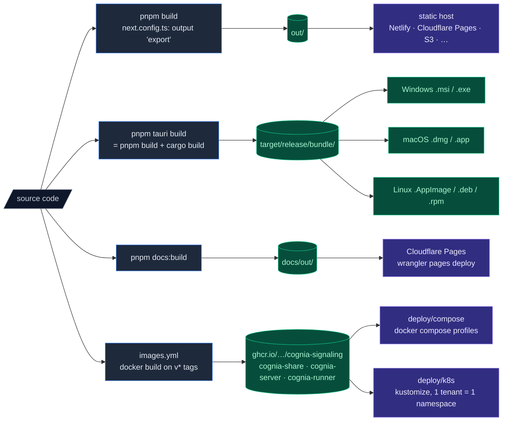

# Deployment

Cognia ships in four forms:

1. **Web** — a static export deployable to any static host.
2. **Desktop** — Tauri-bundled installers for Windows, macOS, and Linux.
3. **Docs** — Fumadocs **static export**, deployed to Cloudflare Pages.
4. **Self-host cloud suite** — the ADR-0059 services (signaling, share, headless cognia-server) as GHCR container images with a compose suite and a k8s kustomize tree.



Each form has its own build pipeline.

## Web build

```bash
pnpm build
```

`next.config.ts` has `output: "export"`, so the build emits a fully static site to `out/`. There is **no Node.js server** — every page is pre-rendered or client-rendered.

What this means:

- API routes are not supported in the main app (use the Rust backend or external services).
- `next/image` runs in unoptimised mode (configured in `next.config.ts`).
- Routing is filesystem-based; the host needs to serve `index.html` for unknown paths (or use trailing-slash mode).

Deploy to:

- **Netlify / Cloudflare Pages / GitHub Pages** — point at `out/`.
- **Static Nginx / Apache** — copy `out/` to the document root; configure SPA fallback to `index.html`.
- **S3 / CloudFront** — sync `out/` to a bucket; set the index document.

Web mode hides desktop-only features (native vector store, scheduled backups, native scheduler promotion) at the UI level via `isTauri()` checks.

### Environment variables

Only `NEXT_PUBLIC_*` vars are exposed to the browser. Set them at build time on the host:

```bash
NEXT_PUBLIC_APP_NAME="Cognia" \
NEXT_PUBLIC_API_URL="https://api.example.com" \
pnpm build
```

`lib/env.ts` validates required vars at first access.

### Headers

For best caching, configure your host with:

```
out/_next/static/**/*  →  Cache-Control: public, max-age=31536000, immutable
out/**/*.html          →  Cache-Control: no-cache
```

Tailwind v4's emitted CSS is hashed; long-cache it.

## Desktop build (Tauri)

```bash
pnpm tauri build
```

This:

1. Runs `beforeBuildCommand` → `pnpm build` → emits `out/`.
2. Compiles the Rust crate in release mode.
3. Bundles the `out/` directory + `sidecar/` resources + Rust binary into a platform installer.

### Output paths

<Tabs groupId="os" persist items={["Windows", "macOS", "Linux"]}>
  <Tab value="Windows">
    ```
    target/release/bundle/
      msi/Cognia_<version>_x64_en-US.msi
      nsis/Cognia_<version>_x64-setup.exe   # if configured
    ```

    Distribute the `.msi` (preferred for enterprise rollouts) or the NSIS `.exe`
    (smaller; user-friendlier first-run UX).

  </Tab>
  <Tab value="macOS">
    ```
    target/release/bundle/
      dmg/Cognia_<version>_<arch>.dmg
      macos/Cognia.app
    ```

    Distribute the `.dmg`. Apple Silicon users should get the `aarch64` build;
    Intel users the `x86_64` build. Build a universal binary with `lipo` if you
    want a single file.

  </Tab>
  <Tab value="Linux">
    ```
    target/release/bundle/
      appimage/cognia_<version>_amd64.AppImage
      deb/cognia_<version>_amd64.deb        # if configured
      rpm/cognia-<version>.x86_64.rpm        # if configured
    ```

    AppImage is the most portable. Users `chmod +x` and run.

  </Tab>
</Tabs>

### Build flags

```bash
pnpm tauri build --target x86_64-pc-windows-msvc   # Specific target triple
pnpm tauri build --debug                            # Debug symbols (much larger; slower)
pnpm tauri build --bundles none                     # Skip installer creation (just the binary)
pnpm tauri build --bundles deb,rpm,appimage         # Specific bundle types
```

### Cross-compilation

Tauri supports cross-compilation only with significant setup (Docker images, sysroots). For day-to-day:

- Build for each platform on a native CI runner of that platform.
- GitHub Actions matrix is the standard pattern; see `.github/workflows/release.yml`.

### Resources

`tauri.conf.json` → `bundle.resources` lists files copied into the app bundle (abridged — the real list has ~17 entries, including `vscode-ext-host/`, `webclone/`, terminal shell-integration scripts, and `hooks/builtin/`):

```jsonc
"resources": [
  "../sidecar/claude-host.mjs",
  "../sidecar/a2ui-mcp.mjs",
  "../sidecar/package.json",
  "../sidecar/node_modules/**/*",
  "../sidecar/webclone/package.json",
  // … see tauri.conf.json for the full set
]
```

The entire sidecar `node_modules/` is shipped because the sidecar runs as a separate Node process and needs its deps. Production users do not need Node installed — the bundled Node binary (or the host system's, if available) runs the sidecar.

<Callout type="warn" title="tauri-build validates these paths at compile time">
  Every plain-file path in `bundle.resources` must exist wherever the Rust crate compiles — including the headless `Dockerfile.cognia-server` build. Adding a resource without extending the Dockerfile's COPY set breaks the container image; `images.yml`'s PR paths cover the compile inputs so this fails in CI, not at tag time.
</Callout>

## Code signing

Distributing unsigned Cognia builds will trigger SmartScreen / Gatekeeper / Linux trust warnings on first run. For wide distribution:

<Tabs groupId="os" persist items={["Windows", "macOS", "Linux"]}>
  <Tab value="Windows">
    - Acquire an EV or OV code-signing certificate from a CA (DigiCert, Sectigo, …).
    - Set `bundle.windows.certificateThumbprint` in `tauri.conf.json` (or pass via env in CI).
    - Tauri uses `signtool.exe`; ensure the Windows SDK is on PATH in CI.
  </Tab>
  <Tab value="macOS">
    - The repository configures Tauri's ad-hoc `bundle.macOS.signingIdentity: "-"` baseline so Apple Silicon accepts builds downloaded from GitHub. Users may still need to approve the app in Privacy & Security.
    - Apple Developer Account + Developer ID Application certificate.
    - Notarisation: set `APPLE_ID`, `APPLE_PASSWORD` (app-specific), `APPLE_TEAM_ID` env vars; Tauri runs `notarytool` automatically.
    - Universal binaries: build separately for `aarch64-apple-darwin` and `x86_64-apple-darwin`, then `lipo` them.
  </Tab>
  <Tab value="Linux">
    Code signing is uncommon for AppImage / DEB / RPM. Instead:

    - Distribute via flathub or snapcraft for trust.
    - Sign your release tags with GPG and publish detached signatures.

  </Tab>
</Tabs>

Cognia's repo runs the Tauri build matrix via `release.yml` → `build-tauri.yml` (OS runners, installers uploaded to the published release). Updater signing is live through the `TAURI_SIGNING_*` secrets; macOS has an ad-hoc signing baseline, while authenticated OS trust signing (SmartScreen/notarization) remains opt-in per platform as above.

## In-app updater

`tauri-plugin-updater` is **enabled**: `tauri.conf.json` carries the release endpoints, a real public key, and `createUpdaterArtifacts: true`, so every release build emits signed updater artifacts. `release.yml` (tag `v*`) calls `build-tauri.yml` with inherited secrets and publishes the signed `latest.json` manifest the updater polls on app start.

The renderer has one shared update client (`lib/tauri/updater.ts`) for Settings, the command palette, tray actions, and background checks. It deduplicates concurrent fetches, closes stale native resources, applies the configured timeout and active network proxy, and keeps download and install separate. Settings → About exposes the automatic check interval, optional background download, post-install relaunch, request timeout, and proxy behavior. Tauri capabilities grant only `allow-check`, `allow-download`, `allow-install`, and process restart; combined download-and-install and process exit are not exposed.

CI signing secrets (Tauri **v2** names — the v1 names `TAURI_PRIVATE_KEY` / `TAURI_KEY_PASSWORD` are ignored):

- `TAURI_SIGNING_PRIVATE_KEY` — contents of the private key file.
- `TAURI_SIGNING_PRIVATE_KEY_PASSWORD` — its password (empty string if none).

<Callout type="error" title="Never commit the private key">
  Only the public key lives in `tauri.conf.json`. Rotating the key orphans every installed build's update path — treat the private key like a root credential.
</Callout>

Forks: generate your own pair with `pnpm tauri signer generate -w ~/.tauri/cognia-next.key`, replace `plugins.updater.pubkey` + `endpoints`, and set the two secrets. Local unsigned builds: override `createUpdaterArtifacts` to `false` (see the build-and-package notes) instead of deleting the key.

The full guide is in `src-tauri/UPDATER.md`.

### `latest.json` shape

```jsonc
{
  "version": "0.2.0",
  "notes": "Release notes",
  "pub_date": "2026-05-03T12:00:00Z",
  "platforms": {
    "darwin-aarch64": {
      "signature": "<base64>",
      "url": "https://github.com/.../Cognia_0.2.0_aarch64.dmg",
    },
    "windows-x86_64": {
      /* ... */
    },
    "linux-x86_64": {
      /* ... */
    },
  },
}
```

## Docs site build

```bash
pnpm docs:build
```

Output: `docs/out/` — the docs site is a **static export** (`docs/next.config.ts` → `output: "export"`), same as the main app. There is no Node server to run; `docs/package.json`'s `next start` does not apply to the exported site.

Deploy to:

- **Cloudflare Pages** (the wired path) — `deploy.yml`'s `deploy-docs` job runs `wrangler pages deploy docs/out`.
- **Any static host** — point it at `docs/out/`.

The docs build is independent of the main app build — there is no shared output directory. Both can be deployed at the same time without conflict.

### Search index

Fumadocs uses Orama for in-browser full-text search. The index is generated at build time from the MDX content and shipped as static assets — no route handler, no external service.

## Self-hosting the cloud services (ADR-0059)

The cloud footprint — `signaling` (WebRTC rendezvous, 7892), `share` (public share links, 8787), and the headless `cognia-server` brain host (**27890**, HTTPS) — ships as GHCR images built by `images.yml` on `v*` tags:

```
ghcr.io/maxqian888/cognia-signaling
ghcr.io/maxqian888/cognia-share
ghcr.io/maxqian888/cognia-server        # -slim / -full variants
ghcr.io/maxqian888/cognia-runner        # T2 per-agent runner image
```

- **Compose suite** — `deploy/compose/` with profiles for the phase ladder (`server`, `tls` Caddy/ACME front door, `observability` Prometheus, `logto` self-hosted OIDC IdP) and a T2 override that moves external agents into per-agent runner containers. Start at [`deploy/compose/README.md`](https://github.com/MaxQian888/cognia-next/blob/master/deploy/compose/README.md).
- **Kubernetes** — `deploy/k8s/` kustomize tree, one tenant = one namespace; see `deploy/k8s/README.md` for the kind smoke and production notes (gVisor runtime class, mandatory `publicUrl`, per-tenant Logto wiring).
- **Smoke** — `scripts/smoke/compose-smoke.mjs` drives a running stack in tiers (`services` / `server` / `tls`); `compose-e2e.yml` runs it in CI on every PR touching the suite.
- Full architecture and the isolation/topology ladder: [ADR-0059](../adr/0059-cloud-deployment-headless-brain).

## CI/CD

`.github/workflows/` as it actually exists:

| Workflow               | Triggers                                        | What it does                                                                                         |
| ---------------------- | ----------------------------------------------- | ---------------------------------------------------------------------------------------------------- |
| `ci.yml`               | push/PR on `master`/`develop`                   | Orchestrates `quality.yml` + `test.yml` (lint, typecheck, Jest shards, coverage gate, E2E)           |
| `build-tauri.yml`      | `workflow_call` / manual                        | Desktop build matrix; updater signing via `TAURI_SIGNING_*` secrets                                  |
| `release.yml`          | tag `v*`                                        | Calls `build-tauri.yml` with inherited secrets → draft release + signed `latest.json`                |
| `images.yml`           | tag `v*` / manual / PR on container inputs      | Builds+publishes the four GHCR images; PRs get a `cargo check` compile gate for `cognia-server`      |
| `deploy.yml`           | **manual dispatch** / `workflow_call` only      | Gated by GitHub Environments + `DEPLOY_ENABLED`: Workers (`wrangler`), Fly axum twins, docs Pages    |
| `compose-e2e.yml`      | PR on `deploy/compose/**`, services, smoke      | Boots the compose suite in CI and runs the tiered smoke                                              |
| `signaling-server.yml` | push `master`/`dev` + PR on the service         | Service CI: clippy + tests + coverage + worker-build parity                                          |
| `share-server.yml`     | push `master`/`dev` + PR on the service         | Service CI: clippy + tests + core↔Worker constants parity                                            |

Nothing deploys on plain pushes — `deploy.yml` is deliberately opt-in (forks stay green with no secrets).

## Versioning

Cognia is versioned as **one unit** through [Changesets](https://github.com/changesets/changesets) — the root `package.json` version is the source of truth.

For releases:

1. During development, every user-facing change lands with a `pnpm changeset` entry.
2. `pnpm release:version` — runs `changeset version` (consumes pending entries, bumps the root version, updates `CHANGELOG.md`) then `pnpm version:sync`, which propagates to `src-tauri/tauri.conf.json`, the `Cargo.toml`s, `cli/`, `sidecar/`, `mobile/`, and `docs/`.
3. Commit, `git tag v0.2.0 && git push --tags`.
4. `release.yml` + `images.yml` do the rest (installers + container images).

## Smoke tests

Before publishing a release, run a smoke test on each platform:

| Surface | Smoke test                                                                                               |
| ------- | -------------------------------------------------------------------------------------------------------- |
| Web     | `pnpm build && npx serve out` — open in browser, send a message                                          |
| Desktop | `pnpm tauri build` — install and launch the produced installer; send a message; promote a scheduler task |
| Sidecar | `node sidecar/claude-host.mjs --smoke`                                                                   |
| Updater | Install N-1 version, set `latest.json` to N, verify auto-update works                                    |

## Where to start contributing

| Goal                   | Files                                                                  |
| ---------------------- | ---------------------------------------------------------------------- |
| Add a new build target | `src-tauri/Cargo.toml` (target deps), `tauri.conf.json`                |
| Tweak release pipeline | `.github/workflows/release.yml`                                        |
| Customise installers   | `tauri.conf.json` → `bundle.windows` / `bundle.macOS` / `bundle.linux` |
| Add a runtime env var  | `lib/env.ts`, `.env.example`, deployment docs                          |

## End of the English docs

<Cards>
  <Card title="Overview" href="./" description="Jump back to the language landing." />
  <Card
    title="ADR-0001 · Backup schema v3"
    href="../adr/0001-backup-schema-v3"
    description="Why backup looks the way it does."
  />
  <Card
    title="ADR-0002 · Scheduler"
    href="../adr/0002-scheduler-full-agent-resolution"
    description="In-app vs native split."
  />
  <Card
    title="ADR-0003 · Employee Digital Twin"
    href="../adr/0003-employee-digital-twin"
    description="The deepest design doc in the repo."
  />
  <Card
    title="ADR-0004 · Vector backend"
    href="../adr/0004-vector-native-backend"
    description="Why sqlite-vec is the default on desktop."
  />
</Cards>

<Callout type="info" title="Made it this far?">
  If you spot anything inaccurate against the actual code, please open a PR or issue. Documentation
  drift is a bug class — these pages are kept in sync with the implementation, not aspirational.
</Callout>
