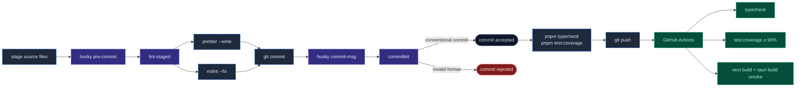

# Development workflow

<Status variant="stable" />

<TLDR>
  Use **pnpm** from the repo root. <Kbd>pnpm dev</Kbd> for web,
  <Kbd>pnpm tauri dev</Kbd> for desktop. Tests live next to source with a ≥90% coverage gate.
  Pre-commit hooks (Husky + lint-staged + commitlint) keep the tree clean.
</TLDR>

<StatGrid>
  <Stat label="Coverage gate" value="90%" hint="lines · branches · functions" />
  <Stat label="shadcn/ui components" value="57" hint="all pre-installed" />
  <Stat label="Path aliases" value="6" hint="@/components, @/lib, @/ui, …" />
  <Stat label="Locales" value="2" hint="en + zh-CN" />
</StatGrid>

This page covers everything you need to know to be productive in the Cognia codebase: daily scripts, conventions, hooks, and tests.

## Daily-loop scripts

```bash
# Frontend (main app — port 3000)
pnpm dev              # Next.js dev server
pnpm build            # Static export → out/  (used by Tauri prod build)
pnpm start            # Next.js production server (post-build)
pnpm lint             # ESLint (eslint.config.mjs flat config)
pnpm lint:fix         # ESLint with auto-fix
pnpm format           # Prettier write
pnpm format:check     # Prettier check (no write)
pnpm typecheck        # TypeScript --noEmit (strict mode)

# Testing
pnpm test             # Jest
pnpm test:watch       # Jest watch mode
pnpm test:coverage    # Jest with coverage report (≥90% gate)
pnpm sidecar:test     # Node test runner for sidecar/builtin-tools/

# Desktop (Tauri)
pnpm tauri dev        # Hot-reload desktop dev mode
pnpm tauri build      # Production installer for current platform
pnpm tauri info       # Toolchain diagnosis
pnpm tauri icon       # Generate desktop icons from a source PNG

# Docs site (port 3001)
pnpm docs:dev         # Fumadocs dev (also generates docs/.source/)
pnpm docs:build       # Build docs for production
pnpm docs:start       # Docs production server

# Monaco editor (auto-runs via predev / prebuild)
pnpm monaco:copy      # Copy Monaco assets into public/
```

### What runs implicitly

- `predev` and `prebuild` invoke `node scripts/copy-monaco-assets.mjs` so Monaco is ready before Next.js starts.
- `prepare` (run after `pnpm install`) installs Husky git hooks.
- `tauri build`'s `beforeBuildCommand` runs `pnpm build` so you don't have to run them in sequence.

## Project structure at a glance

<Files>
  <Folder name="cognia-next" defaultOpen>
    <Folder name="app">
      <File name="layout.tsx" />
      <File name="page.tsx" />
      <File name="globals.css" />
      <Folder name="twin">
        <File name="page.tsx" />
      </Folder>
      <Folder name="scheduler">
        <File name="page.tsx" />
      </Folder>
      <Folder name="agent-teams" />
      <Folder name="canvas" />
      <Folder name="skills" />
      <Folder name="a2ui" />
      <Folder name="logs" />
    </Folder>
    <Folder name="components">
      <Folder name="ui">— vendored shadcn (no tests)</Folder>
      <Folder name="ai-elements">— vendored (no tests)</Folder>
      <Folder name="chat" />
      <Folder name="twin" />
      <Folder name="settings" />
      <Folder name="scheduler" />
      <Folder name="plugin" />
      <Folder name="providers" />
    </Folder>
    <Folder name="lib">
      <File name="tauri.ts">— single invoke() point</File>
      <File name="utils.ts" />
      <Folder name="claude">— Agent SDK glue</Folder>
      <Folder name="twin">— ingest / distill / runtime</Folder>
      <Folder name="vector">— sqlite-vec + 5 cloud backends</Folder>
      <Folder name="data">— backup schema v3</Folder>
      <Folder name="scheduler" />
      <Folder name="plugin" />
      <Folder name="db">— Dexie schema v15</Folder>
      <Folder name="ai" />
      <Folder name="i18n" />
      <Folder name="themes" />
    </Folder>
    <Folder name="hooks">— shared React hooks</Folder>
    <Folder name="i18n">
      <Folder name="messages">
        <File name="en.json" />
        <File name="zh-CN.json" />
      </Folder>
    </Folder>
    <Folder name="types" />
    <Folder name="sidecar">
      <File name="claude-host.mjs" />
      <File name="a2ui-mcp.mjs" />
      <Folder name="builtin-tools" />
    </Folder>
    <Folder name="src-tauri">
      <Folder name="src">
        <File name="lib.rs" />
        <File name="commands.rs" />
        <Folder name="claude" />
        <Folder name="scheduler" />
        <Folder name="vector" />
        <Folder name="tts" />
      </Folder>
      <File name="tauri.conf.json" />
      <File name="Cargo.toml" />
    </Folder>
    <Folder name="docs">— Fumadocs site (this site)</Folder>
    <File name="package.json" />
    <File name="pnpm-workspace.yaml" />
    <File name="next.config.ts" />
    <File name="tsconfig.json" />
    <File name="components.json" />
    <File name="jest.config.ts" />
  </Folder>
</Files>

## Path aliases

| Alias          | Maps to          | Common use                               |
| -------------- | ---------------- | ---------------------------------------- |
| `@/*`          | repo root        | catch-all (e.g., `@/types`, `@/scripts`) |
| `@/components` | `components/`    | UI                                       |
| `@/lib`        | `lib/`           | logic                                    |
| `@/ui`         | `components/ui/` | shadcn primitives                        |
| `@/hooks`      | `hooks/`         | shared hooks                             |
| `@/utils`      | `lib/utils.ts`   | the `cn()` helper                        |

Configured in `tsconfig.json` and `components.json`. Add a new alias in **both** files when introducing one.

In docs (`docs/`):

| Alias                | Maps to               | Notes                          |
| -------------------- | --------------------- | ------------------------------ |
| `@/*`                | `docs/`               | docs-package-local             |
| `collections/server` | `docs/.source/server` | auto-generated by fumadocs-mdx |

## Code conventions

### TypeScript

- Strict mode is on (`tsconfig.json`).
- Avoid `any`; use `unknown` + type guards or proper types.
- Discriminated unions for state machines (e.g., `ScheduledTask.trigger`).
- Use `import type { ... }` for type-only imports — keeps the bundle leaner.

### React

- Function components only.
- Hooks at the top, never conditional.
- Co-locate types with components: `components/foo/foo.tsx` defines `FooProps` next to `Foo`.
- For RSC vs client: prefer server components for routes; opt into `"use client"` only when needed (state, effects, browser APIs, Tauri).

### Naming

| Kind             | Convention           | Example                       |
| ---------------- | -------------------- | ----------------------------- |
| Components       | PascalCase           | `UserProfile.tsx`             |
| Component files  | kebab-case           | `user-profile.tsx`            |
| Hooks            | `use*` camelCase     | `useTwinProfile()`            |
| Utilities        | camelCase            | `formatDate()`                |
| Types/Interfaces | PascalCase           | `UserData`                    |
| Constants        | SCREAMING_SNAKE_CASE | `MAX_RETRIES`                 |
| Tauri commands   | snake_case           | `claude_send`, `vector_query` |

shadcn/ui components follow shadcn's naming (kebab-case files, PascalCase exports — `components/ui/button.tsx` exports `Button`).

### Styling

- Tailwind utility-first; avoid `style={{...}}` except for dynamic values that can't be expressed in classes.
- Use the `cn()` helper from `@/lib/utils` to merge classes safely:

  ```tsx
  cn("base-classes", condition && "conditional", className)
  ```

- Prefer theme tokens (`bg-background`, `text-foreground`) over hard-coded colours.
- For dark-mode variants: `dark:bg-foo` (the `dark` variant is class-based).

### State management

- **Local state** — React `useState` / `useReducer`.
- **Cross-component ephemeral state** — Zustand stores (`stores/...`).
- **Persistent state** — Dexie tables (`lib/db/`); access via `useLiveQuery` from `dexie-react-hooks` so React re-renders on changes.
- **Settings** — go through `SettingsSyncProvider`, not Dexie directly.
- **Cross-tab state** — broadcast via Tauri events (Rust side) or `BroadcastChannel` (web mode); never rely on Dexie polling.

### Imports order

ESLint enforces:

1. Built-in / external modules (`react`, `next`, third-party).
2. Aliased internal modules (`@/components/...`).
3. Relative modules (`./...`, `../...`).
4. Style imports last.

Run `pnpm lint:fix` to auto-sort.

## Testing standards



### Coverage gate

Every source file must reach **≥90% coverage** (lines, branches, functions). Run:

```bash
pnpm test:coverage
```

The Jest config (`jest.config.ts`) enforces the threshold per file with `coverageThreshold`. CI rejects PRs below the bar.

### Where tests live

- **TypeScript / TSX** — co-located as `xxx.test.ts(x)` next to the source. `lib/avatar.ts` ↔ `lib/avatar.test.ts`. **No** `__tests__/` or `tests/` folders.
- **Rust** — inline `#[cfg(test)] mod tests {}` at the bottom of the same `.rs` file. Integration tests are still allowed under `src-tauri/tests/`.
- **Sidecar** — `sidecar/builtin-tools/__tests__/*.test.mjs`, run with `pnpm sidecar:test` (Node test runner).

### Excluded from coverage

- `components/ui/` — vendored shadcn/ui (re-test the source repo, not these copies).
- `components/ai-elements/` — vendored ai-elements components.
- Type-only files (`types/...` with no runtime code).

### Test patterns

| Need                | Tool                                          |
| ------------------- | --------------------------------------------- |
| Render React        | `@testing-library/react`                      |
| User interaction    | `@testing-library/user-event`                 |
| jest-dom matchers   | `@testing-library/jest-dom`                   |
| IndexedDB / Dexie   | `fake-indexeddb`                              |
| Mock fetch          | Jest's built-in `jest.spyOn(global, "fetch")` |
| Mock Tauri `invoke` | mock `@tauri-apps/api/core` per-test          |
| Fake timers         | Jest's modern fake timers                     |
| Snapshot tests      | OK for pure-render; not for behaviour         |

### Test layout

```ts
import { render, screen } from "@testing-library/react"
import userEvent from "@testing-library/user-event"
import { Button } from "./button"

describe("Button", () => {
  it("renders children", () => {
    render(<Button>Click me</Button>)
    expect(screen.getByRole("button", { name: "Click me" })).toBeInTheDocument()
  })

  it("calls onClick", async () => {
    const onClick = jest.fn()
    render(<Button onClick={onClick}>X</Button>)
    await userEvent.click(screen.getByRole("button"))
    expect(onClick).toHaveBeenCalledTimes(1)
  })
})
```

For Rust:

```rust
#[cfg(test)]
mod tests {
    use super::*;

    #[test]
    fn cron_parser_handles_wildcard() {
        let p = CronParser::parse("* * * * *").unwrap();
        // ...
    }
}
```

## shadcn/ui usage

All 57 components are pre-installed under `components/ui/`. Import them directly:

```tsx
import { Button } from "@/components/ui/button"
import { Dialog, DialogContent, DialogHeader } from "@/components/ui/dialog"
```

**Do not** run `pnpm dlx shadcn@latest add <name>` for components already in the list (it overwrites local edits).

`TooltipProvider` is already mounted in `app/layout.tsx` — no extra wrapping needed.

When you need a brand-new component (not in shadcn's catalog), build it under `components/<feature>/` rather than adding it to `components/ui/`.

## Git hooks

Husky installs:

| Hook                 | Tool        | What it does                                  |
| -------------------- | ----------- | --------------------------------------------- |
| `pre-commit`         | lint-staged | Prettier write + ESLint --fix on staged files |
| `commit-msg`         | commitlint  | Validates Conventional Commits                |
| `prepare-commit-msg` | (none)      | —                                             |

If a hook fires on every commit and slows you down, profile with `lint-staged --debug`.

The hooks are auto-installed by `pnpm install` (the `prepare` script). To re-install manually: `pnpm exec husky`.

## Conventional Commits

```
<type>(<scope>): <description>
```

Types accepted: `feat`, `fix`, `docs`, `style`, `refactor`, `perf`, `test`, `build`, `ci`, `chore`, `revert`.

Examples:

```
feat(twin): add per-source re-embed action
fix(scheduler): handle DST transitions in cron next()
docs(adr): add 0004 vector backend
chore(deps): bump tauri to 2.9.1
```

<Callout type="warn" title="The hook rejects malformed messages">
  The commit-msg hook rejects messages that don't match Conventional Commits. If you need to bypass
  during a rebase, prefer `git commit --amend` (which re-runs the hook) over `--no-verify`.
</Callout>

## Linting

`eslint.config.mjs` is a flat config extending `eslint-config-next`. Key rules:

- React 19 / Next.js 16 conventions.
- TypeScript-aware rules (`@typescript-eslint/*`).
- `react-hooks/exhaustive-deps` errors (not warnings).
- Prettier integration (formatting issues fail lint).

Run `pnpm lint` before committing; `pnpm lint:fix` auto-fixes most issues.

## Type checking

```bash
pnpm typecheck
```

Runs `tsc --noEmit` against the entire repo. Use this in CI; `pnpm test` does not type-check.

## Debugging

| Surface                   | Tool                                                                    |
| ------------------------- | ----------------------------------------------------------------------- |
| Browser layer             | DevTools (F12) — same as any web app                                    |
| Rust layer                | `RUST_LOG=debug pnpm tauri dev` then check console + `app/logs/`        |
| Sidecar                   | sidecar `stderr` is mirrored into the Rust log; `app/logs/`             |
| Dexie                     | DevTools → Application → IndexedDB → `cognia-claude`                    |
| Native logging            | OS-native log viewer (Event Viewer / Console.app / `journalctl --user`) |
| Vector store (sqlite-vec) | `sqlite3 <app_data>/cognia/vectors.sqlite` then `.tables`               |

## Common refactoring patterns

| If you want to...                            | Then...                                                                   |
| -------------------------------------------- | ------------------------------------------------------------------------- |
| Extract a shared hook                        | Move to `hooks/` and update imports                                       |
| Add a Tauri command                          | Follow [Runtime & Tauri](./runtime-and-tauri) §"Adding a new IPC command" |
| Bump the Dexie schema                        | Follow [Storage](./storage) §"Adding a new table"                         |
| Add an executor / importer / domain transfer | Add a registry entry; existing patterns                                   |
| Localise a string                            | See [Theming & i18n](./theming-and-i18n) §"Adding a new translation key"  |

## Where to start contributing

If you're new to the codebase:

1. Pick something small — a translation key, an ESLint warning, a test gap.
2. Run `pnpm test:coverage` to find under-tested files; pick one and bring it to ≥90%.
3. Read the ADR for the subsystem you'll touch first.
4. Open a draft PR early; reviewers can steer before you go far.

## Next

<Cards>
  <Card
    title="Deployment"
    href="./deployment"
    description="Building for web, desktop, and the docs site."
  />
  <Card
    title="Architecture"
    href="./architecture"
    description="The layered design that informs all conventions."
  />
</Cards>
