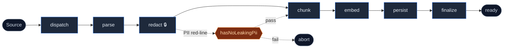
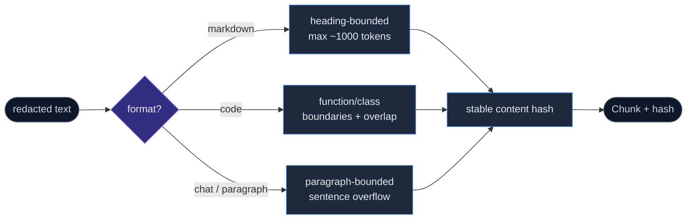
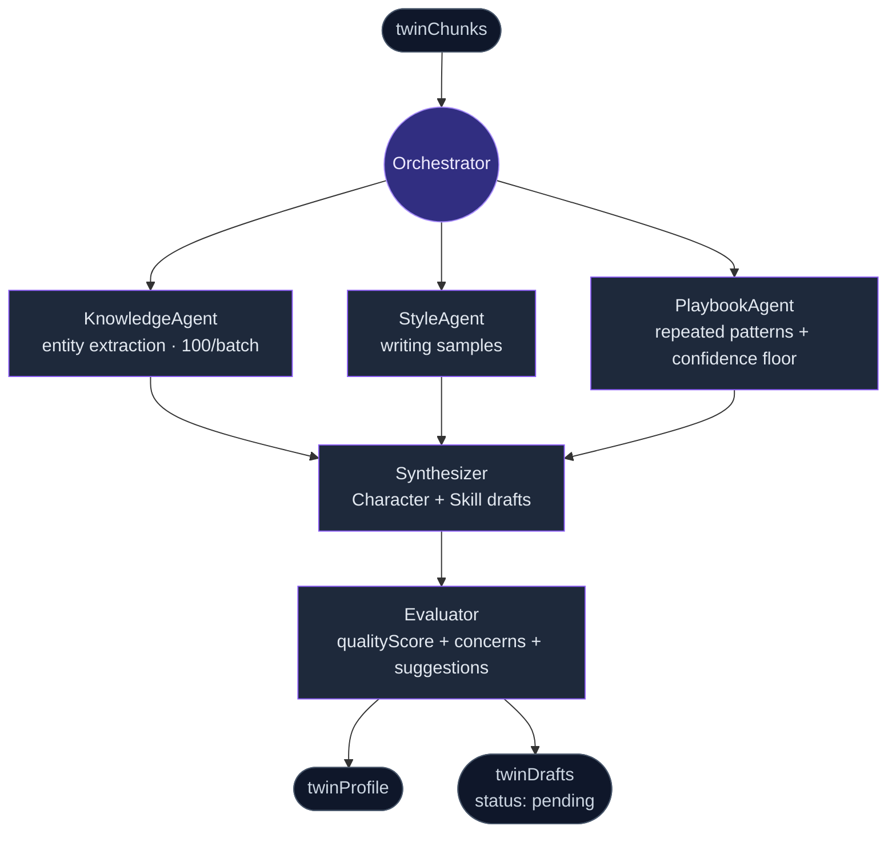
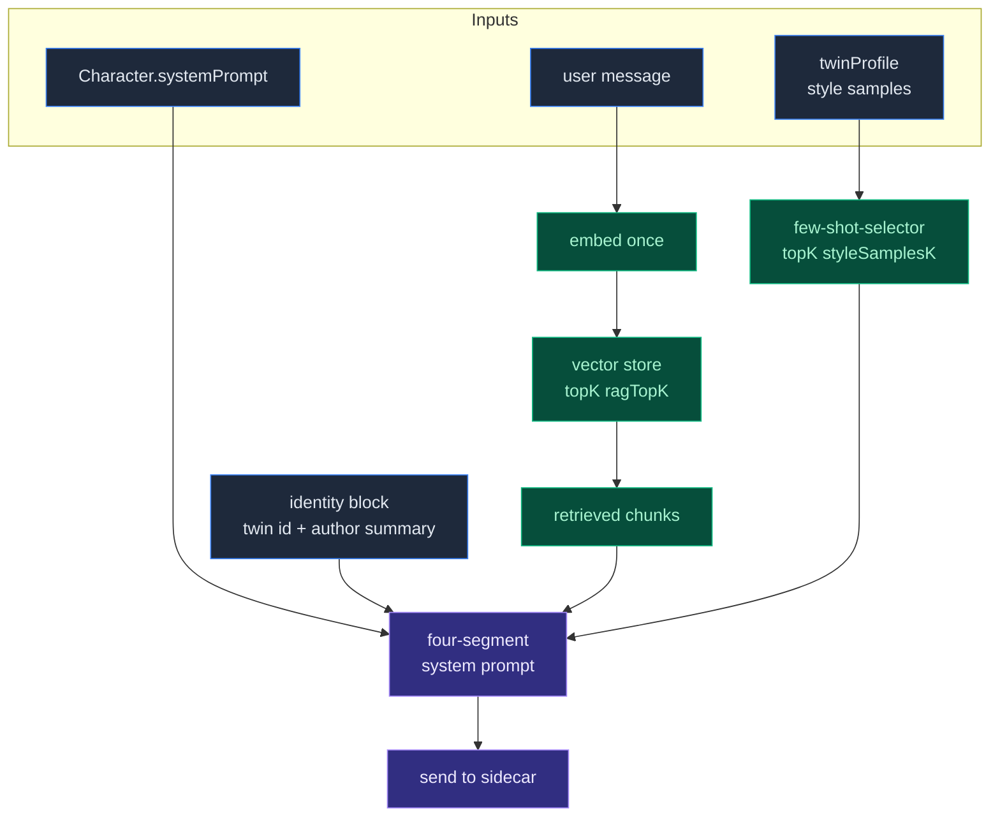

# Employee Digital Twin

<Status variant="beta">Beta · phase 8</Status>

<TLDR>
  Distil documents, chat exports and code into a chat-ready twin. Send time pulls the top-K relevant
  chunks and style few-shot samples to keep the assistant faithful to the author's voice. PII is
  replaced with placeholders **before** any embedding or LLM call — the redaction map is encrypted
  on disk.
</TLDR>

<StatGrid>
  <Stat label="Pipeline stages" value="7" hint="ingest" />
  <Stat label="Distill agents" value="5" hint="under one orchestrator" />
  <Stat label="Dexie tables" value="5" hint="schema v14" />
  <Stat label="Workbench tabs" value="4" hint="Sources / Jobs / Drafts / Settings" />
</StatGrid>

The **Employee Digital Twin** is Cognia's deepest customisation surface. It distils a user's documents, chat exports, and code into:

- A **knowledge index** (RAG) — retrieve relevant chunks at send time.
- A **style profile** — sample the user's prose tone for few-shot prompting.
- A **playbook library** — repeated work patterns (extracted by the distill agents).
- **Character + Skill drafts** — auto-synthesised, queued for user review.

This page summarises the implementation. The full design rationale is in [ADR-0003](../adr/0003-employee-digital-twin).

## Where it lives

```
lib/twin/
  ingest/        # 7-stage ingest pipeline
  distill/       # 5-agent distill pipeline
  runtime/       # send-time RAG + style few-shot
  job-worker.ts  # drains the twinJobs queue
  importers/     # third-party export → TwinSource

types/twin/      # shared types
components/twin/ # workbench UI
app/twin/        # workbench route
lib/db/twin-*.ts # 5 Dexie tables (added at schema v14)
```

Five Dexie tables (schema v14):

- `twinSources` — raw user-supplied source (text, format hint, redaction map)
- `twinChunks` — chunked and embedded fragments (one row per chunk)
- `twinProfile` — distilled profile (style samples, playbooks, entity dictionary)
- `twinDrafts` — auto-synthesised character/skill drafts pending review
- `twinJobs` — ingest + distill job queue

## Soft binding

A "twin" is just a string id. Characters opt in via `Character.twinId` and tune via `Character.twinSettings`:

<TypeTable
  type={{
    enableRag: {
      description: "Whether to retrieve chunks from the bound twin at send time.",
      type: "boolean",
      default: "true",
    },
    ragTopK: {
      description: "How many chunks to fetch from the vector store per send.",
      type: "number",
      default: "5",
    },
    enableStyleFewShot: {
      description: "Whether to include style few-shot samples in the system prompt.",
      type: "boolean",
      default: "true",
    },
    styleSamplesK: {
      description: "How many style samples to include (ranked by topical similarity).",
      type: "number",
      default: "3",
    },
  }}
/>

Multiple characters can share a twin (e.g., a "personal" twin and a "work" twin both bound to the same user-character). Multiple twins can co-exist in one Dexie database.

## Ingest pipeline (7 stages)

Implementation: `lib/twin/ingest/`. Orchestrator: `runIngestJob()` (`job-runner.ts`).



<Callout type="warn" title="Privacy red-line">
  Stage 3 (`redact`) is the privacy red-line — `hasNoLeakingPii(text)` is the post-redact assertion.
  If it fails, the pipeline aborts with a clear error. No embedding or LLM call ever sees unredacted
  text.
</Callout>

### 1. dispatch

Decides which downstream parser to invoke based on `TwinSource.format`. Supported formats: `markdown`, `text`, `json`, `code`, `chat-export`, `html`, `pdf`, `office`. Code: `dispatch.ts`.

### 2. parse

Delegates to `lib/document/document-processor`. Outputs a normalised text + metadata structure:

- Markdown: heading tree preserved.
- Code: structured by AST (Babel for JS/TS, language servers for others).
- Chat exports: per-turn structure preserved (messages array).
- Office documents: `mammoth` + `pdfjs-dist` for DOCX/PDF.

### 3. redact

**This is the privacy red-line.** `lib/twin/ingest/redact.ts` replaces PII with `<KIND_NNN>` placeholders **before any embed or LLM call**:

| Kind        | Detection                                                            |
| ----------- | -------------------------------------------------------------------- |
| `EMAIL`     | RFC-loose regex                                                      |
| `PHONE`     | E.164 + China mobile patterns                                        |
| `CN_ID`     | Chinese national ID (province code + birthdate + Luhn-like checksum) |
| `BANK_CARD` | Luhn-valid 13–19 digit numbers                                       |
| `NAME`      | Hint-driven (preceded by "name:", "by", "—", "from", etc.)           |

The reverse map is encrypted on disk (`twinSources.redactionMapEnc`) using AES-GCM with a key derived from the user's master key. The runtime never persists the unredacted text.

`hasNoLeakingPii(text)` is the post-redact assertion. If it fails, the pipeline aborts with a clear error.

### 4. chunk

Format-aware strategy in `chunk.ts`:



The stable hash is what powers deduplication on re-ingest — same chunk content → same hash → no duplicate row.

### 5. embed

`lib/ai/embedding/embedding.ts` is the embedding client. Default provider is OpenAI text-embedding-3 (configurable). Embeds in batches of 100, with retries on rate limit.

### 6. persist

Double-write:

- Local — `twinChunks` Dexie table (the chunks + embeddings + metadata).
- Remote — the active vector store (`lib/vector/`) for similarity search at runtime.

If the remote write fails, the chunk is still saved locally and re-tried by the job worker.

### 7. finalize

Updates the source row's `status: "ready"` and emits a completion event the workbench listens to.

Throughout the pipeline, `TwinJob.phase` and `progress` are updated so the Jobs tab can show live progress.

## Distill pipeline (5 agents)

Implementation: `lib/twin/distill/`. Orchestrator: `orchestrator.ts`. Each agent goes through the `LlmClient` interface (`llm.ts`) so production wires `createAnthropicLlmClient` while tests use mocks.



### KnowledgeAgent

Walks chunks in batches of 100 and extracts entities (people, projects, terms, decisions). Output: an entity dictionary keyed by canonical name.

### StyleAgent

Samples representative writing — short, medium, and long form — preserving the user's prose voice. Output: `StyleSample[]` stored in `twinProfile.styleSamples`.

### PlaybookAgent

Looks for repeated work patterns ("how does X handle Y?"). Each playbook gets a confidence score; below the floor, it is dropped.

### Synthesizer

Takes the outputs of the previous three agents and drafts:

- One or more **Character drafts** — system prompts that adopt the user's persona.
- One or more **Skill drafts** — capability bundles for repeated tasks.

Drafts are written to `twinDrafts` with `status: "pending"`.

### Evaluator

Reviews drafts from a "newcomer's perspective" — would a teammate understand this character's intent and style? Outputs a `qualityScore`, plus `concerns` and `suggestions` arrays. Visible in the Drafts tab.

## Runtime (send-time)

Implementation: `lib/twin/runtime/`. Single entry: `applyTwinContext(messages, twinId, settings)` (`apply-twin-context.ts`).

<Steps>
  <Step>
    ### Embed the user message

    Embed the most recent user message **once** through `lib/ai/embedding/embedding.ts`.

  </Step>
  <Step>
    ### Retrieve top-K chunks

    Run RAG via the active vector store; take top `ragTopK` (default 5).
    See [Vector store](./vector-store) for backend choices.

  </Step>
  <Step>
    ### Select style samples

    Pull top `styleSamplesK` (default 3) style samples from `twinProfile.styleSamples`,
    ranked by topical similarity to the current message via `few-shot-selector.ts`.

  </Step>
  <Step>
    ### Assemble four-segment system prompt

    | # | Segment | Source |
    | --- | --- | --- |
    | 1 | Character system prompt | already in `messages` |
    | 2 | Identity block | twin ID + author summary |
    | 3 | Retrieved chunks | step 2 |
    | 4 | Style examples | step 3, formatted as few-shot |

  </Step>
</Steps>

<Callout type="info" title="Graceful degradation">
  `applyTwinContext` **always returns** — never throws. A vector-store outage degrades gracefully to
  a "no context" send rather than breaking the chat.
</Callout>



> **Phase 8 note** — the integration with `lib/claude/build-options.ts:resolveSendOptions` is left **opt-in**. Call sites that want the runtime injection invoke `applyTwinContext` explicitly rather than getting it for free. This was an intentional choice to make the costly path (embed + RAG) discoverable.

The few-shot selector (`few-shot-selector.ts`) ranks samples by topical similarity to the current message, not just tone, so the prompt stays focused.

## Workbench UI

Route: `app/twin/`. Components: `components/twin/`. Four tabs:

| Tab          | Purpose                                                                                                                 |
| ------------ | ----------------------------------------------------------------------------------------------------------------------- |
| **Sources**  | Paste / drag text. Format picker, status badges, ingest button. Lists existing sources with size + status.              |
| **Jobs**     | Live progress for ingest and distill jobs. Shows `phase` and `progress` from `twinJobs`. Manual queue / cancel / retry. |
| **Drafts**   | Pending drafts sorted first. Accept flow writes a real `Character` / `Skill` row + stamps the draft as accepted.        |
| **Settings** | Read-only profile stats (chunk count, style sample count, last distill timestamp, vector backend).                      |

The workbench is the primary surface for the twin lifecycle; everything happens through it.

## Job worker

`lib/twin/job-worker.ts` drains the `twinJobs` queue for both `ingest` and `distill` jobs. Phase 4 (ADR-0003) ships **immediate-execute** semantics:

- A new job is processed as soon as the worker is idle.
- Failed jobs retry with exponential backoff (3 attempts, then `status: "failed"`).
- The worker is single-tenant per browser tab (`lib/scheduler/tab-lock.ts` ensures only one tab runs the worker).

Cron-driven retries (e.g., "re-ingest weekly") via the scheduler executor are a later add.

## Privacy summary

| Concern       | Where mitigated                                                                  |
| ------------- | -------------------------------------------------------------------------------- |
| PII in chunks | `redact.ts` replaces with placeholders before embed/LLM call                     |
| Reverse map   | Encrypted on disk (`twinSources.redactionMapEnc`)                                |
| API keys      | `keyring` crate; never written to disk plaintext                                 |
| Cloud egress  | Off by default — vector backend is sqlite-vec on desktop unless user opts in     |
| Audit         | Every embed call logs to `lib/observability/`; can be inspected in the logs view |

## Tests

<Callout type="error" title="Safety-critical: redaction tests">
  `lib/twin/ingest/redact.test.ts` is the most safety-critical test in the whole repo — it asserts
  `hasNoLeakingPii` on a corpus of synthetic PII strings. Treat changes there with extreme care; add
  fixtures, never remove them.
</Callout>

`lib/twin/runtime/apply-twin-context.test.ts` asserts the graceful-degrade contract (a vector-store outage must not throw).

## Where to start contributing

| Goal                              | Files                                                                           |
| --------------------------------- | ------------------------------------------------------------------------------- |
| Add a new ingest format           | `lib/twin/ingest/dispatch.ts`, `lib/document/document-processor.ts`, `parse.ts` |
| Tighten redaction                 | `lib/twin/ingest/redact.ts` (and its tests!)                                    |
| Add a new distill agent           | `lib/twin/distill/agents/`, register in `orchestrator.ts`                       |
| Tweak runtime context shape       | `lib/twin/runtime/system-prompt-template.ts`                                    |
| Wire runtime into a new send path | call `applyTwinContext` from your build-options helper                          |

## Related

<Cards>
  <Card title="Vector store" href="./vector-store" description="How RAG is actually executed." />
  <Card
    title="Backup & data transfer"
    href="./backup-and-data"
    description="Twin tables are part of the backup payload."
  />
  <Card title="Storage" href="./storage" description="The five Dexie twin tables in detail." />
  <Card
    title="Chat & Skills"
    href="./chat-and-skills"
    description="The character / skill bindings that activate the twin."
  />
</Cards>
