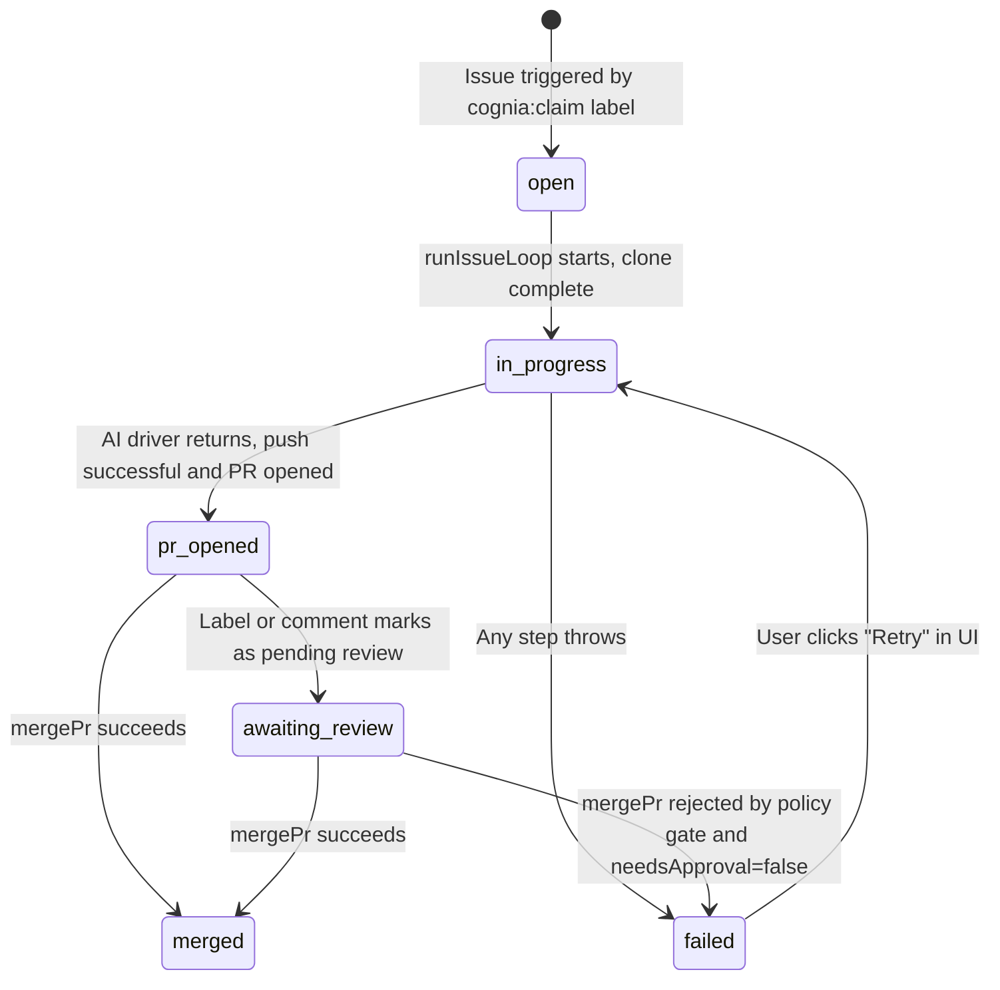

# Audit & Work Orders

<TLDR>
  GitHub Delivery writes every policy decision (allow + deny) to the namespaced `audit` table; the
  table is capped at 5000 rows, and when it overflows the oldest rows are pruned in ascending order
  by `at`. The Issue → PR loop state machine is reflected in the `workOrders` table, displayed as a
  6-column kanban on the standalone `/github-delivery` page. Both tables are stored via the M0
  "Plugin Dexie Tables" mechanism, so their actual full names carry the `github-delivery:` prefix.
</TLDR>

## `audit` Table

### Schema

```ts title="plugins/github-delivery/plugin.json"
{
  "name": "audit",
  "schema": "++id, [repoFullName+at], runId, &[runId+stepId+at]"
}
```

| Index                         | Purpose                                                                                   |
| ----------------------------- | ----------------------------------------------------------------------------------------- |
| `++id`                        | Auto-incrementing primary key                                                             |
| `[repoFullName+at]`           | Audit Tab fetches by repository + time in descending order                                |
| `runId`                       | Workflow Run detail page filters by runId                                                 |
| `&[runId+stepId+at]` (unique) | Prevents duplicate rows for the same step at the same timestamp (overwritten on re-write) |

### Row Structure (`GhAuditEntry`)

| Field          | Type             | Required | Description                                                                                |
| -------------- | ---------------- | -------- | ------------------------------------------------------------------------------------------ |
| `id`           | `number`         | No       | Auto-incrementing primary key                                                              |
| `repoFullName` | `string`         | Yes      | `owner/name`                                                                               |
| `runId`        | `string`         | No       | The workflow run id that triggered this action; `undefined` when called outside a workflow |
| `stepId`       | `string`         | No       | Node id; `undefined` when called outside a workflow                                        |
| `action`       | `GhAction`       | Yes      | One of 6 discriminants (`merge` / `push` / `release` / `comment` / `label` / `close`)      |
| `decision`     | `PolicyDecision` | Yes      | `{ allow: true }` or `{ allow: false, reason, mustWait?, needsApproval? }`                 |
| `reason`       | `string`         | No       | Free text (provider response / error code / "HITL approved (draft xxx)", etc.)             |
| `at`           | `number`         | Yes      | Wall-clock milliseconds                                                                    |

### Write Path

The only write entry point is `requireGithubRuntime().recordAudit(row)`, whose internal
implementation is `plugins/github-delivery/src/index.ts:persistAudit`:

```ts title="persistAudit behavior"
1. table.put(row)                        // upsert by ++id
2. const count = await table.count()
3. if (count > 5000):
     const overflow = count - 5000
     const oldest = await table.orderBy("at").limit(overflow).primaryKeys()
     await table.bulkDelete(oldest)      // FIFO capped delete
```

Convention: **every `checkPolicy` call must write one row** (handled uniformly by `guardedExecutor`).
The HITL flow writes two rows (one deny marking `needsApproval`, and one allow/deny based on the
user's decision).

### Read Paths

| Entry Point                            | Query                                                                                                                                                            |
| -------------------------------------- | ---------------------------------------------------------------------------------------------------------------------------------------------------------------- |
| Settings → GitHub Delivery → Audit Tab | `table.where("[repoFullName+at]").between(...).reverse().toArray()`                                                                                              |
| Workflow run detail page               | `table.where("runId").equals(runId).toArray()`                                                                                                                   |
| Safety: `maxDailyMerges` count         | `audit.where("[repoFullName+at]").between([repo, startOfUtcDay], [repo, Number.MAX_SAFE_INTEGER])` → filter `action.kind === "merge" && decision.allow === true` |

### Audit Tab UI

`components/settings/github-delivery/tabs/audit-tab.tsx` is a `useLiveQuery` table with the
following columns:

| Column     | Source                                                                                    |
| ---------- | ----------------------------------------------------------------------------------------- |
| Time       | `at` (local timezone)                                                                     |
| Repo       | `repoFullName`                                                                            |
| Action     | `action.kind` + details (merge → `#42`, release → `tag`, comment → `pr/#n` or `issue/#n`) |
| Decision   | `decision.allow ? Allow : Deny`, reason highlighted on deny                               |
| Run / Step | `runId.slice(-6)` + `stepId` (clickable to jump to run details)                           |
| Reason     | Gray subtext row                                                                          |

Filters: repository dropdown, `decision.allow` toggle, `action.kind` multi-select, time window.
All filtering goes through Dexie indexes; the UI does not perform a second table scan.

## `workOrders` Table

### Schema

```ts title="plugins/github-delivery/plugin.json"
{
  "name": "workOrders",
  "schema": "++id, [status+repoFullName], issueNumber, prNumber, createdAt, updatedAt"
}
```

| Index                     | Purpose                                                      |
| ------------------------- | ------------------------------------------------------------ |
| `++id`                    | Auto-incrementing primary key                                |
| `[status+repoFullName]`   | Efficient kanban column query grouped by status + repository |
| `issueNumber`             | Reverse lookup by issue for the Issue → PR loop              |
| `prNumber`                | Reverse lookup by PR                                         |
| `createdAt` / `updatedAt` | Sorting                                                      |

### Row Structure (`GhWorkOrder`)

| Field          | Type              | Description                                                                    |
| -------------- | ----------------- | ------------------------------------------------------------------------------ |
| `id`           | `number`          | Auto-incrementing primary key                                                  |
| `repoFullName` | `string`          | `owner/name`                                                                   |
| `issueNumber`  | `number`          | The issue that triggered this work order                                       |
| `status`       | `WorkOrderStatus` | `open` / `in_progress` / `pr_opened` / `awaiting_review` / `merged` / `failed` |
| `worktreePath` | `string?`         | Local path or sandbox id                                                       |
| `branch`       | `string?`         | Working branch (default `cognia/issue-<n>`)                                    |
| `prNumber`     | `number?`         | PR number (populated from `pr_opened` onward)                                  |
| `aiDriver`     | `string?`         | `claude-code` is the only driver currently                                     |
| `lastError`    | `string?`         | Last failure reason (written when entering `failed`)                           |
| `createdAt`    | `number`          | Wall-clock                                                                     |
| `updatedAt`    | `number`          | Wall-clock                                                                     |

### State Machine



All write paths enter through `requireGithubRuntime().upsertWorkOrder(...)`, whose internal
`plugins/github-delivery/src/index.ts:upsertWorkOrder` performs an atomic "find existing + merge + put".
Updates never fail the main business flow — `runIssueLoop` wraps `safeUpdateWorkOrder` in a
try/catch layer, and any Dexie error is only logged to the console.

### `/github-delivery` Kanban Page

Source: `app/github-delivery/page.tsx`. Client component that directly accesses the table by its
full namespaced name:

```ts
const NAMESPACED_TABLE = "github-delivery:workOrders"
const t = db.table<GhWorkOrder, number>(NAMESPACED_TABLE)
const orders = useLiveQuery(() => t.orderBy("updatedAt").reverse().toArray())
```

Six columns from left to right: `open / in_progress / pr_opened / awaiting_review / merged / failed`.
Each card displays:

- `#<issueNumber>` + `<repoFullName>` (truncated)
- `aiDriver` badge
- `failed` column: `<AlertTriangleIcon/>` + `lastError` (truncated)
- `prNumber` row (if present)

When the plugin is not enabled (`getDb()` throws `Table not found`), the page shows an onboarding
card directing the user to Settings → Plugins to enable it.

## `events` Table

Although not part of the audit subsystem, it forms the "event chain" together with `audit` and
`workOrders`. Schema:

```ts title="plugins/github-delivery/plugin.json"
{
  "name": "events",
  "schema": "&deliveryId, [repoFullName+seenAt], kind, source"
}
```

| Field                   | Description                                                                                                |
| ----------------------- | ---------------------------------------------------------------------------------------------------------- |
| `deliveryId`            | Unique deduplication key: webhook uses `x-github-delivery`, polling uses sha1(kind‖repoFullName‖primaryId) |
| `[repoFullName+seenAt]` | Sorting for the Audit Tab "Recent Events" section                                                          |
| `kind`                  | `NormalizedGhEventKind` (11 variants)                                                                      |
| `source`                | `"webhook"` or `"polling"`                                                                                 |

Every webhook / polling event first attempts an "upsert by deliveryId" on `events`. If an existing
`deliveryId` is hit, the event is skipped — this is why enabling both webhook and polling at the
same time will not double-trigger workflows.

## Retention & Cleanup

| Table        | Limit         | Policy                                                                                                         |
| ------------ | ------------- | -------------------------------------------------------------------------------------------------------------- |
| `audit`      | 5000 rows     | `persistAudit` checks count after every write; overflow rows are deleted in ascending order by `at`            |
| `events`     | No hard limit | Webhook payloads are small and typically grow slowly over years; can be manually cleaned up from the Usage Tab |
| `workOrders` | No hard limit | After leaving `merged` / `failed` status, users can manually archive (post-M4); currently not auto-deleted     |
| `repos`      | No hard limit | Repositories are manually added/removed by the user                                                            |

<Callout type="warn">
  **On plugin uninstall.** Per M0 retention rules, all data is kept by default
  (`removePluginTables(..., "keep")`). If "Delete data" is selected during uninstall in Settings →
  Plugins, all 4 tables are dropped — including audit. Export audit data first via "Export CSV" in
  the Audit Tab.
</Callout>

## Source Index

| File                                                          | Purpose                                                    |
| ------------------------------------------------------------- | ---------------------------------------------------------- |
| `plugins/github-delivery/plugin.json`                         | 4-table schema declaration                                 |
| `plugins/github-delivery/src/index.ts`                        | `persistAudit` (capped delete), `upsertWorkOrder`          |
| `plugins/github-delivery/src/workflow/shared.ts`              | All `guardedExecutor` call sites that invoke `recordAudit` |
| `plugins/github-delivery/src/workflow/issue-loop.ts`          | `safeUpdateWorkOrder` state machine transitions            |
| `plugins/github-delivery/src/github-poll.ts`                  | Shared `events` deduplication for webhook + polling        |
| `plugins/github-delivery/src/connector/inbox-bridge.ts`       | `events` → Inbox messages (read-only)                      |
| `components/settings/github-delivery/tabs/audit-tab.tsx`      | Audit Tab UI                                               |
| `components/settings/github-delivery/tabs/audit-tab.test.tsx` | Audit Tab tests                                            |
| `app/github-delivery/page.tsx`                                | 6-column kanban standalone page                            |
| `lib/plugin/dexie/namespace.ts`                               | `toNamespacedTableName("github-delivery", "audit")`        |
