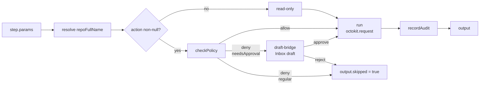

# GitHub Delivery — Overview

<TLDR>
  GitHub Delivery is a built-in plugin that injects 13 `action.github.*` nodes and 8 built-in
  templates into the workflow editor. It consists of a thin core layer `lib/github/` + a plugin
  shell `plugins/github-delivery/`. Credentials go to the OS keyring, events arrive via webhook or
  ETag polling, and every write operation is intercepted by `lib/github/policy-gate.ts` with the
  decision written to the namespaced `audit` table. The full architecture is in
  [ADR-0012](/en/adr/0012-github-delivery).
</TLDR>

## What It Solves

cognia already has workflows, plugins, schedulers, and connectors, but no way to
act directly on GitHub: open PRs, review, merge, or cut releases — these actions
rely on GitHub Actions or manual operation. GitHub Delivery moves those actions
into the same visual editor, letting users:

- Have AI write reviews when a PR is opened or pushed, choosing `APPROVE` /
  `COMMENT` / `REQUEST_CHANGES` based on confidence.
- Classify and auto-label Issues as bug / feature / question on open.
- After an Issue is tagged `cognia:claim`, clone the repo, run Claude Code,
  push a branch, and open a PR.
- Auto-generate a Conventional Commits changelog, tag, and release after every
  merge to main.
- Have AI explain CI failures and post the conclusion as a comment on the
  corresponding PR.

All write operations first pass through the [policies](./policies) gate: is CI
green, has someone approved, daily merge quota, branch-protection regex,
author allowlist, quiet hours.

## Sub-page Index

<Cards>
  <Card title="Setup & Credentials" href="/en/github-delivery/setup">
    GitHub App vs PAT, webhook URL (one-click expose via cloudflared), polling fallback, first-time
    plugin activation.
  </Card>
  <Card title="Policy Reference" href="/en/github-delivery/policies">
    Full `GhPolicy` fields, decision paths for 6 action kinds, HITL approval branch, quiet-hours
    algorithm.
  </Card>
  <Card title="13 action.github.* Nodes" href="/en/github-delivery/nodes">
    Parameter tables, output shapes, policy actions, error surfaces, and Inspector examples for each
    node.
  </Card>
  <Card title="8 Built-in Templates" href="/en/github-delivery/templates">
    PR auto-review, Issue triage, full Release suite (three modes), CI failure diagnosis.
  </Card>
  <Card title="Audit & Work Orders" href="/en/github-delivery/audit">
    `audit` table schema, card fields, `workOrders` 6-column kanban, recent event stream.
  </Card>
  <Card title="Usage & Quotas" href="/en/github-delivery/usage">
    Octokit throttling / retry plugins, `GET /rate_limit` history, safe rate-limit recommendations.
  </Card>
  <Card title="FAQ" href="/en/github-delivery/faq">
    Common errors, signature verification failures, App vs PAT trade-offs, cloudflared
    troubleshooting, web-mode degradation.
  </Card>
</Cards>

## Key Concepts

<Callout type="info">
  **Core layer vs plugin shell.** All "generic GitHub knowledge" (types, Octokit factory, HMAC
  verification, Conventional Commits parser) lives in `lib/github/`. Everything that
  "runtime-connects to the current cognia instance" (Dexie table reads/writes, secrets API,
  connector adapters) lives in `plugins/github-delivery/`. This way the core layer can be reused by
  any plugin, and the plugin shell can be swapped / multi-instanced.
</Callout>

### NormalizedGhEvent

Both webhook and polling entry points are normalized into the same
`NormalizedGhEvent` (see [`lib/github/types.ts`](https://github.com/) line 161);
downstream only faces a single shape.

```ts title="11 supported event types"
type NormalizedGhEventKind =
  | "pull_request.opened"
  | "pull_request.synchronize"
  | "pull_request.closed"
  | "pull_request.review_requested"
  | "issues.opened"
  | "issues.closed"
  | "issues.assigned"
  | "issues.labeled"
  | "issue_comment.created"
  | "check_run.completed"
  | "release.published"
```

### guardedExecutor

All 13 nodes are thin wrappers around `guardedExecutor` (see
`plugins/github-delivery/src/workflow/shared.ts`). It uniformly handles: repo
resolution, Octokit acquisition, policy-gate invocation, HITL approval branch,
audit write, and error playback. Authors only write the Octokit request itself.



### Dexie Namespace

Per the ADR-0011 + M0 "plugin Dexie tables" convention, all tables are stored
as `github-delivery:<name>`. Plugin code accesses them via
`ctx.dexie.table<T>(name)`; external code (e.g. the `/github-delivery` kanban)
accesses them directly by full name as `db.table("github-delivery:workOrders")`.

| Namespaced name | Full name                    | Primary key + indexes                                                      |
| --------------- | ---------------------------- | -------------------------------------------------------------------------- |
| `repos`         | `github-delivery:repos`      | `&fullName, credentialMode, createdAt`                                     |
| `workOrders`    | `github-delivery:workOrders` | `++id, [status+repoFullName], issueNumber, prNumber, createdAt, updatedAt` |
| `events`        | `github-delivery:events`     | `&deliveryId, [repoFullName+seenAt], kind, source`                         |
| `audit`         | `github-delivery:audit`      | `++id, [repoFullName+at], runId, &[runId+stepId+at]`                       |

## UI Entry Points

| Location                                                  | Purpose                                                                                                               |
| --------------------------------------------------------- | --------------------------------------------------------------------------------------------------------------------- |
| `Settings → GitHub Delivery` (`?section=github-delivery`) | 5 tabs: Repos / Credentials / Policies / Audit / Usage (`?ghTab=...`)                                                 |
| `/github-delivery` standalone page                        | 6-column kanban backed by the `workOrders` table (Open / In progress / PR opened / Awaiting review / Merged / Failed) |
| Inbox (`/inbox/...`)                                      | `pull_request.opened` / `review_requested` and other events appear as InboundMessages                                 |
| Workflow editor                                           | Type "github" in the node search bar to see 13 `action.github.*` + 1 `trigger.github.webhook`                         |

## Web-mode Degradation

| Capability                   | Desktop (Tauri)              | Web                                                |
| ---------------------------- | ---------------------------- | -------------------------------------------------- |
| Node execution (Octokit)     | Full support                 | Full support (browser fetch)                       |
| Webhook trigger              | Full support (Rust receiver) | **Unavailable** (no Rust); UI shows "desktop only" |
| Polling trigger              | Supported                    | Supported (only runs while webview is alive)       |
| Credential storage           | OS keyring + Dexie           | Dexie encrypted blob                               |
| cloudflared one-click expose | Desktop only                 | Unavailable                                        |

## Source Index

| File                                                       | Purpose                                                     |
| ---------------------------------------------------------- | ----------------------------------------------------------- |
| `lib/github/types.ts`                                      | All subsystem types (shared by lib/, plugin/, UI)           |
| `lib/github/octokit-factory.ts`                            | App / PAT routing, with throttling + retry plugins          |
| `lib/github/auth-app.ts`                                   | Installation token cache, refreshes 5 min early             |
| `lib/github/auth-pat.ts`                                   | PAT auth wrapper                                            |
| `lib/github/webhook-verify.ts`                             | Constant-time HMAC comparison for `x-hub-signature-256`     |
| `lib/github/event-normalizer.ts`                           | webhook + polling → `NormalizedGhEvent`                     |
| `lib/github/policy-gate.ts`                                | Unified policy gate for 6 action kinds + HITL needsApproval |
| `lib/github/workspace.ts`                                  | simple-git worktree (local + e2b backend)                   |
| `lib/github/changelog.ts`                                  | Conventional Commits → semver + notes                       |
| `lib/github/cloudflared-tauri.ts`                          | One-click webhook expose on desktop                         |
| `plugins/github-delivery/plugin.json`                      | Plugin manifest + 4 Dexie tables + 1 connector              |
| `plugins/github-delivery/src/index.ts`                     | Entry: wire runtime + adapters                              |
| `plugins/github-delivery/src/github-poll.ts`               | ETag polling scheduler task                                 |
| `plugins/github-delivery/src/workflow/runtime.ts`          | `GithubRuntime` singleton (getRepo / getOctokit etc.)       |
| `plugins/github-delivery/src/workflow/shared.ts`           | `guardedExecutor` factory                                   |
| `plugins/github-delivery/src/workflow/nodes.ts`            | 13 `action.github.*` executors                              |
| `plugins/github-delivery/src/workflow/issue-loop.ts`       | Issue → PR main flow                                        |
| `plugins/github-delivery/src/workflow/review-pr-inline.ts` | LLM line-level PR review                                    |
| `plugins/github-delivery/src/approval/draft-bridge.ts`     | HITL approval bridge (uses `connectorDrafts` table)         |
| `plugins/github-delivery/src/drivers/sidecar-driver.ts`    | Claude sidecar driver (M5)                                  |
| `plugins/github-delivery/src/adapter/github-adapter.ts`    | `PlatformAdapter` implementation + Inbox outbound           |
| `plugins/github-delivery/src/adapter/conversation-key.ts`  | `gh:owner/repo/<kind>-<n>` routing key codec                |
| `plugins/github-delivery/src/connector/inbox-bridge.ts`    | `NormalizedGhEvent` → `NormalizedInboundEvent`              |
| `lib/workflow/definition/seed-github.ts`                   | 8 built-in templates                                        |
| `components/settings/github-delivery/`                     | 5-tab Settings UI                                           |
| `app/github-delivery/page.tsx`                             | 6-column kanban standalone page                             |
| `src-tauri/src/workflow/triggers/webhook_router.rs`        | `SignatureMode { Cognia \| Github }` header switch          |
