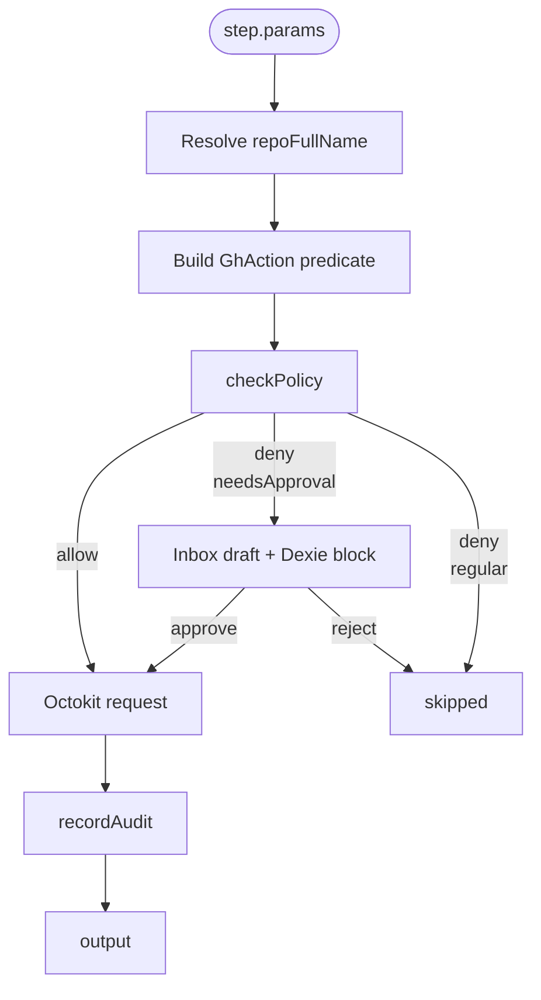

# Node Reference

<TLDR>
GitHub Delivery injects **13 `action.github.*` nodes** into workflows, all registered in
`plugins/github-delivery/src/workflow/nodes.ts` and processed through `guardedExecutor`
for unified repo resolution, Octokit acquisition, policy gating, HITL approval, and audit
writing. Every node accepts two common fields: `repoFullName` (`owner/name`) and an
optional `policyOverride` (`Partial<GhPolicy>`). Except for `generateChangelog` (read-only),
`reviewPrInline` (which includes its own LLM call), and `runIssueLoop` (long-running task),
all other nodes are thin wrappers around single Octokit requests.
</TLDR>

## Common Conventions

### Shared Fields

| Field            | Type                  | Required | Description                                                                          |
| ---------------- | --------------------- | -------- | ------------------------------------------------------------------------------------ |
| `repoFullName`   | `string`              | Yes      | `owner/name`. Expression `{{ $trigger.payload.body.repository.full_name }}` is common. |
| `policyOverride` | `Partial<GhPolicy>?`  | No       | Node-level override, deeply merged into repo-level or global policy. See [policies](./policies) |

### Output Structure

| Shape                                                     | When                                                                                |
| --------------------------------------------------------- | ----------------------------------------------------------------------------------- |
| `{ ...nodeSpecific }`                                     | Successful Octokit call                                                             |
| `{ skipped: true, reason, mustWait? }`                    | Policy gate denied and not HITL soft rejection                                      |
| `{ skipped: true, reason: "HITL rejected: ...", draftId }` | HITL draft was manually rejected                                                    |
| Throws                                                    | Octokit returned non-2xx; orchestrator records error and retries per workflow retry policy |

### Common Pre-execution Flow



For read-only nodes (`generateChangelog`), the `action` function returns `null`, skipping
policy entirely while still writing a `"[read-only]"` audit entry.

---

## `action.github.openPr`

**Purpose.** Open a new PR in a repository.

**Policy action.** `{ kind: "push", repo: <repoFullName>, branch: <head> }` — determined by branch protection rules.

**Parameters.**

| Field            | Type       | Required | Description                                                            |
| ---------------- | ---------- | -------- | ---------------------------------------------------------------------- |
| `head`           | `string`   | Yes      | Source branch (e.g. `cognia/feature-xxx`). Blocked if `branchProtection` matches. |
| `base`           | `string`   | Yes      | Target branch (e.g. `main`).                                           |
| `title`          | `string`   | Yes      | PR title.                                                              |
| `body`           | `string?`  | No       | PR description, Markdown supported.                                    |
| `draft`          | `boolean?` | No       | Defaults to `false`.                                                   |

**Output.** `{ number: number, htmlUrl: string }`

**Octokit.** `POST /repos/{owner}/{repo}/pulls`

```ts title="Example — Opening a PR on cognia/issue-42"
{
  "kind": "action.github.openPr",
  "params": {
    "repoFullName": "{{ $trigger.payload.body.repository.full_name }}",
    "head": "cognia/issue-42",
    "base": "main",
    "title": "Resolves #42",
    "body": "AI-generated PR. See workflow run `{{ $runId }}`."
  }
}
```

---

## `action.github.closePr`

**Purpose.** Close (without merging) a PR.

**Policy action.** `{ kind: "close", target: { repo, prNumber } }` — checks `allowedAuthors`.

**Parameters.**

| Field       | Type     | Required | Description |
| ----------- | -------- | -------- | ----------- |
| `prNumber`  | `number` | Yes      | PR number.  |

**Output.** `{ number: number, state: string }` (`state` should be `"closed"`)

**Octokit.** `PATCH /repos/{owner}/{repo}/pulls/{pull_number}` `{ state: "closed" }`

---

## `action.github.mergePr`

**Purpose.** Merge a PR. **Most restrictive** node — by default requires green CI, human approval, and not exceeding daily merge limit.

**Policy action.** `{ kind: "merge", pr: { repo, prNumber }, mergeMethod? }`

**Parameters.**

| Field            | Type                              | Required | Description                                                  |
| ---------------- | --------------------------------- | -------- | -------------------------------------------------------------|
| `prNumber`       | `number`                          | Yes      | PR number.                                                   |
| `mergeMethod`    | `"merge" \| "squash" \| "rebase"` | No       | Defaults to `"merge"`.                                       |
| `commitTitle`    | `string?`                         | No       | Merge commit title (writable for squash/merge modes).        |
| `commitMessage`  | `string?`                         | No       | Merge commit body.                                           |

**Output.** `{ merged: boolean, sha: string }`

**Octokit.** `PUT /repos/{owner}/{repo}/pulls/{pull_number}/merge`

<Callout type="warn">
**HITL soft rejection.** When `requireHumanApproval` matches, returns `needsApproval: true`, routed to Inbox draft.
User must Approve in `<DraftEditor/>` before merge proceeds.
</Callout>

---

## `action.github.reviewPr`

**Purpose.** Submit a review (`APPROVE` / `COMMENT` / `REQUEST_CHANGES`) on a PR, optionally with
per-line inline comments (legacy field `position`, must be a position in the diff).

**Policy action.** `{ kind: "comment", pr: { repo, prNumber }, body }` — checks `allowedAuthors`.

**Parameters.**

| Field        | Type                                                          | Required | Description                                          |
| ------------ | ------------------------------------------------------------- | -------- | ---------------------------------------------------- |
| `prNumber`   | `number`                                                      | Yes      | PR number.                                           |
| `event`      | `"APPROVE" \| "REQUEST_CHANGES" \| "COMMENT"`                | Yes      | Review type.                                         |
| `body`       | `string`                                                      | Yes      | Overall review body, Markdown supported.             |
| `comments`   | `Array<{ path: string; position: number; body: string }>?`    | No       | Legacy line-level comments (based on diff `position`). |

**Output.** `{ id: number, state: string }`

**Octokit.** `POST /repos/{owner}/{repo}/pulls/{pull_number}/reviews`

<Callout type="info">
**Prefer `reviewPrInline`.** New workflows should use `action.github.reviewPrInline` — it accepts
`line` + `side` (more stable) and includes its own LLM call for structured comments. `reviewPr` is for manually assembled scenarios.
</Callout>

---

## `action.github.reviewPrInline`

**Purpose.** Have an LLM directly generate a structured review on a PR's diff, with line-level comments. One call completes "read diff → LLM → POST review".

**Policy action.** `{ kind: "comment", pr: { repo, prNumber }, body: "[inline review]" }`

**Parameters.**

| Field           | Type       | Required | Description                                                                |
| --------------- | ---------- | -------- | -------------------------------------------------------------------------- |
| `prNumber`      | `number`   | Yes      | PR number.                                                                 |
| `provider`      | `string`   | Yes      | LLM provider id, e.g. `anthropic` / `openrouter` / `ollama`.               |
| `model`         | `string`   | Yes      | Model id, e.g. `claude-sonnet-4-6`.                                        |
| `apiKey`        | `string`   | Yes      | Provider credentials (can bind expression `{{ $static.anthropicKey }}`).   |
| `baseURL`       | `string?`  | No       | Custom endpoint (common for OpenAI-compatible).                            |
| `maxFiles`      | `number?`  | No       | Defaults to 5, hard limit 30.                                              |
| `focus`         | `string?`  | No       | Free text, e.g. `"security"` / `"performance"`.                          |

**Output.**

| Field               | Type      | Description                                                                  |
| ------------------- | --------- | ---------------------------------------------------------------------------- |
| `reviewId`          | `number`  | GitHub review id.                                                            |
| `body`              | `string`  | High-level summary submitted to GitHub (falls back to full LLM output if JSON parsing fails). |
| `commentCount`      | `number`  | Number of line-level comments (LLM limit 8).                                 |
| `filesAnalysed`     | `number`  | Number of files actually fetched patch from (≤ `maxFiles`).                  |
| `parsedStructured`  | `boolean` | Whether LLM produced parseable JSON.                                         |

**Octokit.**
- `GET /repos/{owner}/{repo}/pulls/{pull_number}/files` (fetch patch)
- `POST /repos/{owner}/{repo}/pulls/{pull_number}/reviews`

**Implementation key.** `plugins/github-delivery/src/workflow/review-pr-inline.ts:runPRReviewAgent`.
LLM is instructed to output strict JSON `{ body, comments: [{ path, line, side, body }] }`, with
lenient fence stripping + missing field tolerance. Each file's diff is truncated to 1500 characters.

---

## `action.github.commentPr`

**Purpose.** Post a regular comment on a PR's comment thread (the Issue comments endpoint).

**Policy action.** `{ kind: "comment", pr: { repo, prNumber }, body }`

**Parameters.**

| Field       | Type      | Required | Description               |
| ----------- | --------- | -------- | ------------------------- |
| `prNumber`  | `number`  | Yes      | PR number.                |
| `body`      | `string`  | Yes      | Markdown comment body.    |

**Output.** `{ id: number, htmlUrl: string }`

**Octokit.** `POST /repos/{owner}/{repo}/issues/{issue_number}/comments`
(GitHub model: a PR is a kind of Issue; comments use the issues endpoint)

---

## `action.github.commentIssue`

**Purpose.** Post a comment on an Issue's comment thread.

**Policy action.** `{ kind: "comment", issue: { repo, issueNumber }, body }`

**Parameters.**

| Field          | Type      | Required | Description               |
| -------------- | --------- | -------- | ------------------------- |
| `issueNumber`  | `number`  | Yes      | Issue number.             |
| `body`         | `string`  | Yes      | Markdown comment body.    |

**Output.** `{ id: number, htmlUrl: string }`

**Octokit.** `POST /repos/{owner}/{repo}/issues/{issue_number}/comments`

---

## `action.github.labelIssue`

**Purpose.** Add / remove labels on an Issue / PR (GitHub treats PR as a subtype of Issue, same endpoint).

**Policy action.** `{ kind: "label", target: { repo, issueNumber }, labels: [...add, ...remove] }`

**Parameters.**

| Field          | Type        | Required | Description                                           |
| -------------- | ----------- | -------- | ----------------------------------------------------- |
| `issueNumber`  | `number`    | Yes      | Issue or PR number.                                   |
| `add`          | `string[]?` | No       | Labels to add (array, order irrelevant).              |
| `remove`       | `string[]?` | No       | Labels to remove.                                     |

**Output.** `{ added: string[], removed: string[] }`

**Octokit.**
- If `add` is non-empty: `POST /repos/{owner}/{repo}/issues/{issue_number}/labels`
- For each label in `remove`: `DELETE /repos/{owner}/{repo}/issues/{issue_number}/labels/{name}`

---

## `action.github.closeIssue`

**Purpose.** Close an Issue, optionally with `reason` (`completed` / `not_planned`).

**Policy action.** `{ kind: "close", target: { repo, issueNumber } }` — checks `allowedAuthors`.

**Parameters.**

| Field          | Type                                | Required | Description                                                      |
| -------------- | ----------------------------------- | -------- | ---------------------------------------------------------------- |
| `issueNumber`  | `number`                            | Yes      | Issue number.                                                    |
| `reason`       | `"completed" \| "not_planned"?`     | No       | GitHub UI "Close as ..." option.                                  |

**Output.** `{ number: number, state: string }`

**Octokit.** `PATCH /repos/{owner}/{repo}/issues/{issue_number}` `{ state: "closed", state_reason }`

---

## `action.github.createRelease`

**Purpose.** Create a GitHub Release (defaults to `draft: true`, only generates in draft state, not public).

**Policy action.** `{ kind: "release", repo, tag, draft }` — non-draft with `requireHumanApproval` returns `needsApproval: true`.

**Parameters.**

| Field              | Type       | Required | Description                                                                  |
| ------------------ | ---------- | -------- | ---------------------------------------------------------------------------- |
| `tag`              | `string`   | Yes      | Release tag (e.g. `v1.2.3` or `1.2.3`). Tag must exist.                      |
| `targetCommitish`  | `string?`  | No       | If tag doesn't exist, GitHub will create it from commitish (branch name or SHA). |
| `name`             | `string?`  | No       | Release display name (defaults to tag).                                      |
| `body`             | `string?`  | No       | Markdown release notes. Usually fed `generateChangelog.markdown`.            |
| `draft`            | `boolean?` | No       | Defaults to `true` (draft, safe).                                            |
| `prerelease`       | `boolean?` | No       | Defaults to `false`.                                                         |

**Output.** `{ id: number, htmlUrl: string, tag: string }`

**Octokit.** `POST /repos/{owner}/{repo}/releases`

---

## `action.github.generateChangelog`

**Purpose.** **Read-only.** Use GitHub compare endpoint to fetch commits → parse by Conventional Commits →
calculate semver bump → output Markdown notes.

**Policy action.** `null` (completely skips policy gate; only writes a `"[read-only]"` audit).

**Parameters.**

| Field              | Type      | Required | Description                                                  |
| ------------------ | --------- | -------- | -------------------------------------------------------------|
| `since`            | `string`  | Yes      | Starting tag or SHA (e.g. `v1.0.0`, `abc1234`).              |
| `currentVersion`   | `string?` | No       | Current version string (for `applyBump`). Defaults to `"0.0.0"`. |

**Output.**

| Field           | Type                                            | Description                                                                  |
| --------------- | ----------------------------------------------- | ---------------------------------------------------------------------------- |
| `bump`          | `"major" \| "minor" \| "patch" \| "none"`       | Determined by `feat` / `fix` / `breaking`.                                   |
| `nextVersion`   | `string`                                        | Version after applyBump (no `v` prefix).                                     |
| `markdown`      | `string`                                        | Categorized Markdown notes (grouped by Features / Bug Fixes / …).            |
| `commitCount`   | `number`                                        | Number of successfully parsed commits (non-conventional ones are dropped).   |

**Octokit.** `GET /repos/{owner}/{repo}/compare/{basehead}` (basehead format: `since...HEAD`)

**Conventional Commits implementation.** `lib/github/changelog.ts`. Grammar: `<type>(<scope>)!:
<subject>` + optional body + `BREAKING CHANGE:` footer. `!` or footer match triggers major bump;
`feat` → minor, `fix` → patch, others → none.

---

## `action.github.pushTag`

**Purpose.** Push a git tag on a repository (point tag to a SHA).

**Policy action.** `{ kind: "push", repo, branch: "refs/tags/<tag>" }` — goes through `branchProtection`
regex, can protect `^refs/tags/release/` style tags.

**Parameters.**

| Field   | Type     | Required | Description                       |
| ------- | -------- | -------- | --------------------------------- |
| `tag`   | `string` | Yes      | Tag name (without `refs/tags/`).  |
| `sha`   | `string` | Yes      | Commit SHA to tag.                |

**Output.** `{ tag: string, sha: string }`

**Octokit.** `POST /repos/{owner}/{repo}/git/refs` `{ ref: "refs/tags/<tag>", sha }`

---

## `action.github.runIssueLoop`

**Purpose.** Issue → PR loop. Clone code → call Claude sidecar for AI (modify files in worktree)
→ commit + push → open PR. **Long-running task**, writes checkpoints via `lib/workflow/runtime/long-step-runner.ts`,
recoverable after process crash.

**Policy action.** `{ kind: "push", repo, branch: <branchTemplate.replace("{n}", issueNumber)> }`

**Parameters.**

| Field              | Type                  | Required | Description                                                                  |
| ------------------ | --------------------- | -------- | ---------------------------------------------------------------------------- |
| `issueNumber`      | `number`              | Yes      | Triggering issue number.                                                     |
| `worktreeMode`     | `"local" \| "e2b"`    | No       | Defaults to `local`. `e2b` requires `e2b-sandbox` plugin and API key.        |
| `branchTemplate`   | `string?`             | No       | Defaults to `cognia/issue-{n}`, `{n}` placeholder replaced with issueNumber. |

**Output.** `RunIssueLoopResult`

```ts
{
  status: "pr_opened" | "skipped" | "failed",
  branch?: string,
  prNumber?: number,
  prUrl?: string,
  durationMs?: number,
  reason?: string,
}
```

**Implementation key.** `plugins/github-delivery/src/workflow/issue-loop.ts:runIssueLoop`.
60-minute hard timeout (`HARD_TIMEOUT_MS`); AI injected via `IssueLoopDriver` interface;
driver configured as `SidecarIssueLoopDriver` (connected to Claude sidecar) at plugin activate time.
Checkpoints written to `workflowRunEvents`, phase `running` → `completed`, resume reuses `summary` directly.

<Callout type="warn">
**Prerequisite.** Claude provider must be configured (Settings → Providers). Otherwise driver throws inside `run`,
node returns `{ status: "failed", reason: "No issue-loop AI driver is registered. ..." }`.
</Callout>

---

## Error Replay and Retry

`guardedExecutor` internally `try / catch` records any thrown error to `step.log("error", msg)`, then **re-throws**.
The orchestrator decides based on the node's `retryPolicy`:

| retryPolicy                     | Behavior                                                                  |
| ------------------------------- | ------------------------------------------------------------------------- |
| `none` (default)                | One failure = step error, entire run goes to error branch                 |
| `fixed { times, delayMs }`      | Wait → retry                                                              |
| `exponential { times, baseMs }` | Exponential backoff                                                       |

Idempotent verbs (GET / HEAD / PUT / DELETE) already have up to 3 automatic retries inside Octokit. POST / PATCH
are **not** retried by Octokit — this is to prevent duplicate `mergePr` / `createRelease` calls. If you do want
to retry POST, configure retryPolicy on the workflow node; audit will record each attempt.

## Dry-run Behavior

In the workflow editor's "Run" button "Dry run" mode, `guardedExecutor` returns `{ skipped: true }` on all
deny / HITL paths without actually calling Octokit. For allow paths, Octokit calls proceed normally — because
GitHub's "do something" actions have no official dry-run interface, **dry-run mainly validates policy gating
and wiring**, and cannot fully simulate "what happens after actually clicking merge".

## Source Index

| File                                                          | Purpose                                                  |
| ------------------------------------------------------------- | -------------------------------------------------------- |
| `plugins/github-delivery/src/workflow/nodes.ts`               | Registration point for all 13 executors (single file)    |
| `plugins/github-delivery/src/workflow/shared.ts`              | `guardedExecutor` factory                                |
| `plugins/github-delivery/src/workflow/issue-loop.ts`          | `runIssueLoop` long-running task implementation          |
| `plugins/github-delivery/src/workflow/review-pr-inline.ts`    | `runPRReviewAgent` LLM agent                             |
| `plugins/github-delivery/src/workflow/runtime.ts`             | `GithubRuntime` singleton interface                      |
| `plugins/github-delivery/src/index.ts`                        | Registration path (`setGithubRuntime` + `setIssueLoopDriver`) |
| `lib/github/octokit-factory.ts`                               | Octokit instance configuration for nodes                 |
| `lib/github/policy-gate.ts`                                   | `checkPolicy` — every node goes through this             |
| `lib/github/changelog.ts`                                     | `generateChangelog` actual parsing and rendering         |
| `lib/github/workspace.ts`                                     | `runIssueLoop` clone / commit / push                     |
| `lib/workflow/runtime/long-step-runner.ts`                    | `runIssueLoop` checkpoint resume mechanism               |
| `plugins/github-delivery/src/approval/draft-bridge.ts`        | HITL draft bridge (merge / non-draft release)            |
