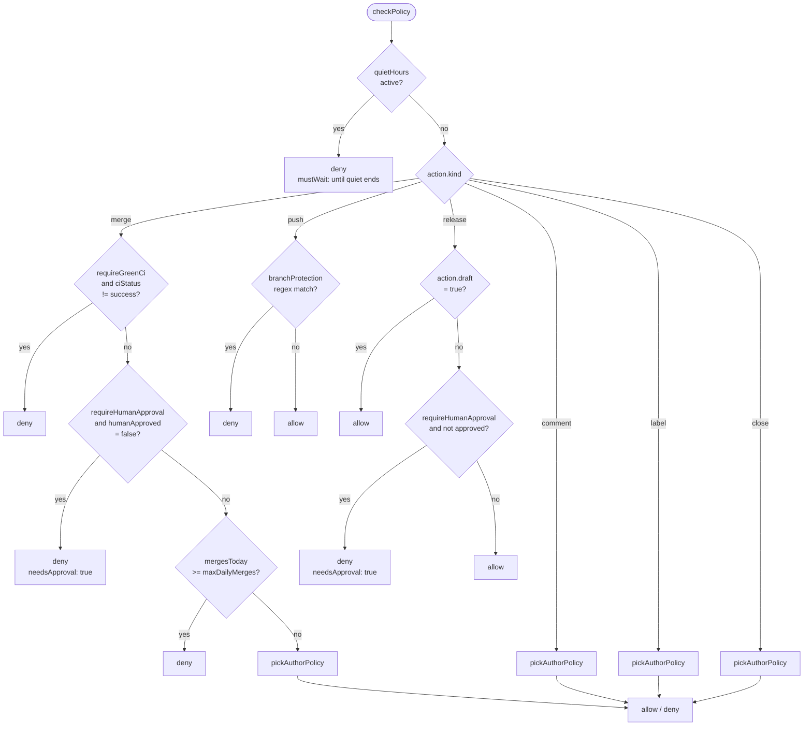

# Policy Gate

<TLDR>
`lib/github/policy-gate.ts:checkPolicy(action, ctx)` is the unified policy gate for GitHub Delivery.
It receives a `GhAction` discriminant and a `GhPolicyContext`, returning a `PolicyDecision` (`{ allow: true }`
or `{ allow: false, reason, mustWait?, needsApproval? }`). A rejection with `needsApproval: true` is a
"soft rejection" — `guardedExecutor` routes it to an Inbox HITL draft; all other rejections are "hard rejections",
and the executor skips immediately. The default policy is `DEFAULT_GH_POLICY`, overridable at the repository or node level.
</TLDR>

## `GhPolicy` Fields

<TypeTable
  type={{
    allowedLabels: {
      description: "Required label set. A PR or Issue must contain at least one. Optional.",
      type: "string[] | undefined",
      default: "undefined",
    },
    requireGreenCi: {
      description:
        "CI must be success before merge. This field only affects action.kind === 'merge'.",
      type: "boolean",
      default: "true",
    },
    requireHumanApproval: {
      description:
        "merge / non-draft release must go through human approval. On rejection, returns needsApproval: true and routes to HITL draft.",
      type: "boolean",
      default: "true",
    },
    maxDailyMerges: {
      description:
        "Maximum number of merges per UTC day by the bot. The daily count is scanned from the audit table using the [repoFullName+at] index.",
      type: "number",
      default: "5",
    },
    quietHours: {
      description:
        "Quiet-hours window. Reuses the isInQuietHours algorithm from lib/connectors/outbound-runner. Optional.",
      type: "QuietHoursWindow | undefined",
      default: "undefined",
    },
    branchProtection: {
      description:
        "List of branch regex patterns that prohibit direct pushes. A match rejects push-type actions.",
      type: "string[]",
      default: '["^main$", "^master$", "^release/"]',
    },
    allowedAuthors: {
      description:
        "Set of authors the bot is allowed to act on for PRs/Issues. Three kinds: collaborators / members / explicit (explicit logins array).",
      type: "AllowedAuthors",
      default: '{ kind: "collaborators" }',
    },
  }}
/>

```ts title="lib/github/types.ts (excerpt)"
export interface QuietHoursWindow {
  from: string // "HH:MM" 24h
  to: string // "HH:MM" 24h
  tz: string // IANA tz, e.g. "Asia/Shanghai"
}

export type AllowedAuthors =
  | { kind: "collaborators" }
  | { kind: "members" }
  | { kind: "explicit"; logins: string[] }

export const DEFAULT_GH_POLICY: GhPolicy = {
  requireGreenCi: true,
  requireHumanApproval: true,
  maxDailyMerges: 5,
  branchProtection: ["^main$", "^master$", "^release/"],
  allowedAuthors: { kind: "collaborators" },
}
```

## Decision Paths for the 6 `GhAction` Types

`checkPolicy` first runs a "global pre-flight" check (quiet hours), then branches by `action.kind`:



### `merge`

| Check                  | On Failure                                                                               |
| ---------------------- | ---------------------------------------------------------------------------------------- |
| `requireGreenCi`       | `deny("merge requires CI=success but got '<status>'")`                                   |
| `requireHumanApproval` | `denyAwaitingApproval("merge requires explicit human approval")` — `needsApproval: true` |
| `maxDailyMerges`       | `deny("daily merge cap of N reached (M today)")`                                         |
| `allowedAuthors`       | See below                                                                                |

### `push`

| Check                    | On Failure                                                     |
| ------------------------ | -------------------------------------------------------------- |
| `branchProtection` regex | `deny("branch '<branch>' matches protection regex '<regex>'")` |

Example: `action.github.openPr` treats `head` as the push branch, so if `head` matches a protection regex, it is rejected.
`action.github.pushTag` treats `refs/tags/<tag>` as the push branch — if you want to protect `release/v*` style tags,
you can add a `^refs/tags/release/` regex.

### `release`

| Check                                                              | On Failure                                                                      |
| ------------------------------------------------------------------ | ------------------------------------------------------------------------------- |
| `action.draft === true`                                            | Always allow (drafts can be created freely, not visible externally)             |
| `requireHumanApproval && humanApproved !== true` (and draft=false) | `denyAwaitingApproval("publishing a release requires explicit human approval")` |

### `comment` / `label` / `close`

Only `allowedAuthors` is checked (handled by `pickAuthorPolicy`):

```ts title="lib/github/policy-gate.ts"
function pickAuthorPolicy(policy, ctx, authorLogin) {
  if (!authorLogin) return ALLOW // no author info, allow immediately
  switch (policy.allowedAuthors.kind) {
    case "explicit":
      return logins.includes(authorLogin)
        ? ALLOW
        : deny(`author "${authorLogin}" is not in the explicit allow-list`)
    case "collaborators":
    case "members":
      // upstream step passes the collaborator/member list via ctx.knownAllowedLogins;
      // no additional requests are made here, only set membership check.
      if (!ctx.knownAllowedLogins)
        return deny(`cannot evaluate "<kind>" policy: caller did not pass knownAllowedLogins`)
      return ctx.knownAllowedLogins.includes(authorLogin)
        ? ALLOW
        : deny(`author "${authorLogin}" is not in the <kind> list`)
  }
}
```

## HITL Approval Branch

Only `merge` and "non-draft release" produce a soft rejection with `needsApproval: true`.
When `guardedExecutor` (`plugins/github-delivery/src/workflow/shared.ts`) receives such a decision:

<Steps>
<Step>
**Write an audit entry.** `decision.allow === false`, `reason` = the reason from `denyAwaitingApproval`.
</Step>
<Step>
**Call `requestHitlApproval(...)`**. Writes a pending draft row in the `connectorDrafts` table, with
`actionSummary` (default `<action.kind> <repoFullName>`, overridable via `describe`) and `proposedBody`
(passed by comment / review nodes). The user then clicks Approve / Reject in the Inbox `<DraftEditor/>`.
</Step>
<Step>
**Dexie polling block.** The bridge uses `liveQuery` to wait for the `connectorDrafts` row to change to `approved` or `rejected`.
This wait responds to cancellation via `step.signal` (orchestrator calls `abort`).
</Step>
<Step>
**Decide next step based on outcome.**

- `approve`: Writes another allow audit entry `HITL approved (draft <id>)`, then proceeds with the Octokit call;
  `approval.editedBody` is passed through by `guardedExecutor` to `run`, and the executor prefers the edited body.
- `reject`: Writes a deny audit entry "user rejected HITL approval", and the executor returns
  `{ output: { skipped: true, reason: "HITL rejected: ...", draftId } }`.
    </Step>
</Steps>

<Callout type="info">
  **Restart-safe.** Drafts remain in Dexie. After a process crash, when the workflow is resumed by
  the `resume-controller`, the bridge first checks whether a pending row for `(runId, stepId)`
  already exists in `connectorDrafts` — if so, it reuses it instead of creating a new draft.
  `runIssueLoop` uses `long-step-runner` for a similar checkpoint-resume behavior.
</Callout>

## Quiet Hours Algorithm

Reuses two utility functions from `lib/connectors/outbound-runner`:

| Function                              | Purpose                                                                                             |
| ------------------------------------- | --------------------------------------------------------------------------------------------------- |
| `isInQuietHours(nowMs, from, to, tz)` | Determines whether nowMs falls within the [from, to] interval. Handles midnight-crossing scenarios. |
| `msUntilQuietEnd(nowMs, to, tz)`      | Returns the number of milliseconds until `to`. Used for `mustWait.until = now + msUntilQuietEnd`.   |

```ts title="lib/github/policy-gate.ts"
function checkQuietHours(policy, now) {
  const qh = policy.quietHours
  if (!qh) return ALLOW
  if (!isInQuietHours(now, qh.from, qh.to, qh.tz)) return ALLOW
  const until = msUntilQuietEnd(now, qh.to, qh.tz)
  return deny("quiet hours active", { until: now + until })
}
```

After rejection, the workflow editor displays "Quiet hours active — will retry after hh:mm" on the audit row.
Combined with cron triggers, this is a cheap way to implement "no releases at night".

## Node-Level Override

Every `action.github.*` node's Inspector form has an optional `policyOverride` field.
It is deep-merged as a `Partial<GhPolicy>` onto the repository-level or global policy via `mergePolicy(base, override)`:

```ts title="lib/github/policy-gate.ts:mergePolicy"
export function mergePolicy(base: GhPolicy, override?: Partial<GhPolicy>): GhPolicy {
  if (!override) return base
  return {
    ...base,
    ...override,
    quietHours: override.quietHours ?? base.quietHours,
    allowedLabels: override.allowedLabels ?? base.allowedLabels,
    branchProtection: override.branchProtection ?? base.branchProtection,
    allowedAuthors: override.allowedAuthors ?? base.allowedAuthors,
  }
}
```

Array fields (`allowedLabels` / `branchProtection`) are **replaced**, not merged — if you want a "slightly more lenient"
override, copy the base array in and add to it.

Typical usage:

| Scenario                                            | `policyOverride` expression                                                    |
| --------------------------------------------------- | ------------------------------------------------------------------------------ |
| Emergency release skipping human approval           | `{ requireHumanApproval: false }`                                              |
| Temporarily bypass quiet hours for a node           | `{ quietHours: undefined }` (note: because of ??, must clear in the form)      |
| Only allow release branch                           | `{ branchProtection: ["^main$", "^master$"] }`                                 |
| Allow non-collaborator PRs to receive auto-comments | `{ allowedAuthors: { kind: "explicit", logins: ["all"] } }` (use with caution) |

## Audit Writes

Every `checkPolicy` call is logged as an audit entry by `guardedExecutor`:

| Field              | Value                                                     |
| ------------------ | --------------------------------------------------------- |
| `repoFullName`     | Extracted from action (`pr.repo` / `issue.repo` / `repo`) |
| `runId` / `stepId` | Current workflow run / step                               |
| `action`           | `GhAction` discriminant (stored as-is)                    |
| `decision`         | `PolicyDecision` discriminant                             |
| `reason`           | The decision's reason field ("policy allowed" when allow) |
| `at`               | Wall-clock milliseconds                                   |

The HITL flow writes **two** audit entries (one deny + one allow / final deny), and the workflow editor's audit tab
automatically merges them for display. See [audit](./audit) for details.

## Source Index

| File                                                        | Purpose                                         |
| ----------------------------------------------------------- | ----------------------------------------------- |
| `lib/github/types.ts`                                       | `GhPolicy` / `PolicyDecision` / `GhAction`      |
| `lib/github/policy-gate.ts`                                 | `checkPolicy` + `mergePolicy` implementation    |
| `lib/connectors/outbound-runner.ts`                         | Shared `isInQuietHours` / `msUntilQuietEnd`     |
| `plugins/github-delivery/src/workflow/shared.ts`            | `guardedExecutor` — calls policy + writes audit |
| `plugins/github-delivery/src/approval/draft-bridge.ts`      | HITL draft bridge                               |
| `components/settings/github-delivery/tabs/policies-tab.tsx` | Repository-level policy UI                      |
