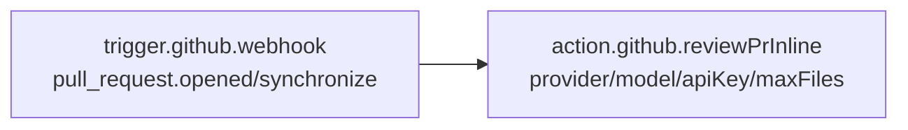
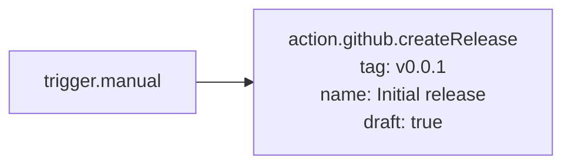

# Template Reference

<TLDR>
  GitHub Delivery ships with **8 built-in workflow templates**
  (`lib/workflow/definition/seed-github.ts`), all marked `isBuiltIn: true` + `isTemplate: true`.
  When a user clicks "Use template" in the workflow library, a forked editable copy is created with
  a regenerated id, but the node / edge structure is preserved as-is. All templates use only
  registered executors and run out of the box.
</TLDR>

## Quick Reference

| #   | Template id                          | Name                                   | Trigger                                    | Main Flow                                    |
| --- | ------------------------------------ | -------------------------------------- | ------------------------------------------ | -------------------------------------------- |
| 1   | `wf_builtin_gh_pr_auto_review`       | [GitHub] PR auto-review                | webhook(`pull_request.opened/synchronize`) | AI prompt → submit review                    |
| 2   | `wf_builtin_gh_pr_inline_review`     | [GitHub] PR inline AI review           | webhook(`pull_request.opened/synchronize`) | reviewPrInline(LLM with line-level comments) |
| 3   | `wf_builtin_gh_issue_triage`         | [GitHub] Issue smart triage            | webhook(`issues.opened`)                   | AI classify → apply labels                   |
| 4   | `wf_builtin_gh_issue_pr_loop`        | [GitHub] Issue → PR loop               | webhook(`issues.labeled`)                  | runIssueLoop(Claude sidecar)                 |
| 5   | `wf_builtin_gh_release_conventional` | [GitHub] Release: Conventional Commits | `trigger.cron`(`0 18 * * *`)               | generateChangelog → createRelease(draft)     |
| 6   | `wf_builtin_gh_release_continuous`   | [GitHub] Release: continuous           | webhook(`pull_request.closed`)             | changelog → pushTag → release(final)         |
| 7   | `wf_builtin_gh_release_manual`       | [GitHub] Release: manual               | `trigger.manual`                           | direct createRelease(draft)                  |
| 8   | `wf_builtin_gh_ci_diagnose`          | [GitHub] CI failure diagnosis          | webhook(`check_run.completed`)             | AI diagnose → commentPr                      |

The export order of `buildGithubDeliveryTemplates()` is 1 → 8, but the UI library list is usually sorted by "theme group".

## Expression Quick Reference

All `{{ ... }}` occurrences in the templates are workflow expression language (see
[Workflows → Expression language](/docs/workflows/expression-language), written in M2).
Common anchors in GitHub Delivery templates:

| Expression                                                | Content                                                        |
| --------------------------------------------------------- | -------------------------------------------------------------- |
| `$trigger.payload.body.repository.full_name`              | `"owner/name"`                                                 |
| `$trigger.payload.body.pull_request.number`               | PR number                                                      |
| `$trigger.payload.body.pull_request.title`                | PR title                                                       |
| `$trigger.payload.body.pull_request.body`                 | PR description                                                 |
| `$trigger.payload.body.pull_request.merge_commit_sha`     | Commit SHA after merge                                         |
| `$trigger.payload.body.issue.number`                      | Issue number                                                   |
| `$trigger.payload.body.issue.title` / `.body`             | Issue title / description                                      |
| `$trigger.payload.body.check_run.name` / `.conclusion`    | CI check info                                                  |
| `$trigger.payload.body.check_run.pull_requests[0].number` | PR associated with the check                                   |
| `$node['<id>'].out.<field>`                               | Upstream node output                                           |
| `$static.<key>`                                           | Workflow-level static variable (configured in editor Settings) |

---

## 1. PR auto-review

**id.** `wf_builtin_gh_pr_auto_review`

**Purpose.** When a PR is opened or receives new commits, have AI read the title + description and output a summary review. This template is the **fast-track** version — it does not read diffs, make line-level comments, or anything else; it only posts a single `COMMENT`-level review.

**Node graph.**

```mermaid
flowchart LR
    T[trigger.github.webhook<br/>pull_request.opened/synchronize] --> A[ai.prompt<br/>'You are a senior reviewer...']
    A --> R[action.github.reviewPr<br/>event: COMMENT<br/>body: {{ ai.completion }}]
```

**Parameter configuration.**

| Node        | Field          | Template default                                                                                                              |
| ----------- | -------------- | ----------------------------------------------------------------------------------------------------------------------------- |
| `n_trigger` | `events`       | `["pull_request.opened", "pull_request.synchronize"]`                                                                         |
| `n_ai`      | `systemPrompt` | `"You are a senior reviewer. Read the PR title + body + diff summary. Decide APPROVE / COMMENT / REQUEST_CHANGES. Be terse."` |
| `n_ai`      | `userPrompt`   | `{{ $trigger.payload.body.pull_request.title }}\n\n{{ $trigger.payload.body.pull_request.body }}`                             |
| `n_review`  | `event`        | `"COMMENT"`                                                                                                                   |
| `n_review`  | `body`         | `{{ $node['n_ai'].out.completion }}`                                                                                          |

**Required credentials.**

- GitHub App or PAT (`reviewPr` uses the `comment` strategy action).
- AI provider (LLM) API key — configured in the `n_ai` node Inspector, or introduced via `$static.anthropicKey`.

**Customization tips.**

- **Switch to real `APPROVE` / `REQUEST_CHANGES` branching.** Add a `flow.switch` node after the AI output,
  branching based on keywords in the AI text.
- **Read diffs.** Use `action.github.reviewPrInline` (template 2) instead — no need to chain another `ai.prompt`.

---

## 2. PR inline AI review

**id.** `wf_builtin_gh_pr_inline_review`

**Purpose.** An upgraded version of PR auto-review. Have the LLM read the diff directly, output structured JSON, and comment line-by-line.

**Node graph.**



**Parameter configuration.**

| Node        | Field          | Template default                                        |
| ----------- | -------------- | ------------------------------------------------------- |
| `n_trigger` | `events`       | `["pull_request.opened", "pull_request.synchronize"]`   |
| `n_review`  | `repoFullName` | `{{ $trigger.payload.body.repository.full_name }}`      |
| `n_review`  | `prNumber`     | `{{ $trigger.payload.body.pull_request.number }}`       |
| `n_review`  | `provider`     | `"anthropic"`                                           |
| `n_review`  | `model`        | `"claude-sonnet-4-6"`                                   |
| `n_review`  | `apiKey`       | `""` (template leaves blank; must be filled after fork) |
| `n_review`  | `maxFiles`     | `5`                                                     |

**Required credentials.** GitHub + LLM provider.

**Customization tips.**

- **Specify focus areas.** Add `focus: "security"` or `focus: "performance"`, and the LLM will see an extra "specific focus" hint in the systemPrompt.
- **Longer inputs.** Raise `maxFiles` to 10–20 (hard cap is 30).
- **Change model.** The default is sonnet; switch to haiku for cheaper runs, or opus for deeper analysis.
  Just change the `model` field in the Inspector.

---

## 3. Issue smart triage

**id.** `wf_builtin_gh_issue_triage`

**Purpose.** When an issue is opened, have AI classify it as `bug` / `feature` / `question`, and automatically apply the label.

**Node graph.**

```mermaid
flowchart LR
    T[trigger.github.webhook<br/>issues.opened] --> C[ai.classify<br/>categories: bug/feature/question]
    C --> L[action.github.labelIssue<br/>add: [{{ category }}]]
```

**Parameter configuration.**

| Node         | Field        | Template default                                                                    |
| ------------ | ------------ | ----------------------------------------------------------------------------------- |
| `n_trigger`  | `events`     | `["issues.opened"]`                                                                 |
| `n_classify` | `text`       | `{{ $trigger.payload.body.issue.title }}\n\n{{ $trigger.payload.body.issue.body }}` |
| `n_classify` | `categories` | `["bug", "feature", "question"]`                                                    |
| `n_label`    | `add`        | `["{{ $node['n_classify'].out.category }}"]`                                        |

**Required credentials.** GitHub + LLM provider (the `ai.classify` node uses the default provider configured in cognia).

**Customization tips.**

- **More categories.** Just write more in `categories`. The `labelIssue` `add` field is an array, and can only apply one at a time. If you want multiple labels, add a `data.transform` node after `ai.classify` to map `out.category` to `["bug", "needs-triage"]`.
- **Keyword-based fallback.** Use `flow.switch` to apply `needs-human-triage` when the AI returns empty / low confidence.

---

## 4. Issue → PR loop

**id.** `wf_builtin_gh_issue_pr_loop`

**Purpose.** When an issue is labeled `cognia:claim` (or any label you agree on) → call `runIssueLoop` for an AI closed loop.

**Node graph.**

```mermaid
flowchart LR
    T[trigger.github.webhook<br/>issues.labeled] --> L[action.github.runIssueLoop<br/>issueNumber: {{ payload.issue.number }}]
```

**Parameter configuration.**

| Node        | Field          | Template default                                   |
| ----------- | -------------- | -------------------------------------------------- |
| `n_trigger` | `events`       | `["issues.labeled"]`                               |
| `n_loop`    | `repoFullName` | `{{ $trigger.payload.body.repository.full_name }}` |
| `n_loop`    | `issueNumber`  | `{{ $trigger.payload.body.issue.number }}`         |

**Required credentials.**

- GitHub App or PAT (for clone + push + open PR).
- Claude provider (Settings → Providers, driver is `SidecarIssueLoopDriver`).

**Customization tips.**

- **Filter by label.** The default subscribes to all `issues.labeled`, which can be noisy. Add a `flow.switch` node
  that only proceeds when `$trigger.payload.body.label.name === "cognia:claim"`.
- **Specify worktree mode.** Write `worktreeMode: "e2b"`, which requires the `e2b-sandbox` plugin to be enabled.
- **Specify branch template.** Default is `cognia/issue-{n}`; the `{n}` placeholder is replaced with issueNumber.

<Callout type="warn">
  **Long task reminder.** `runIssueLoop` may run for tens of minutes.
  `lib/workflow/runtime/long-step-runner.ts` writes checkpoints to `workflowRunEvents`; after a
  process crash, resume continues from the latest checkpoint without re-running the LLM.
</Callout>

---

## 5. Release: Conventional Commits

**id.** `wf_builtin_gh_release_conventional`

**Purpose.** Every day at 18:00 (local time), calculate the semver bump from Conventional Commits, generate a changelog,
and open a **draft** release.

**Node graph.**

```mermaid
flowchart LR
    T[trigger.cron<br/>0 18 * * *] --> C[action.github.generateChangelog<br/>since: v1.0.0]
    C --> R[action.github.createRelease<br/>tag: {{ nextVersion }}<br/>body: {{ markdown }}<br/>draft: true]
```

**Parameter configuration.**

| Node          | Field            | Template default                                                         |
| ------------- | ---------------- | ------------------------------------------------------------------------ |
| `n_trigger`   | `cron`           | `"0 18 * * *"`                                                           |
| `n_changelog` | `repoFullName`   | `"owner/repo"` (template placeholder; change to real value after fork)   |
| `n_changelog` | `since`          | `"v1.0.0"` (template placeholder; change to the tag of the last release) |
| `n_changelog` | `currentVersion` | `"1.0.0"`                                                                |
| `n_release`   | `tag`            | `{{ $node['n_changelog'].out.nextVersion }}`                             |
| `n_release`   | `body`           | `{{ $node['n_changelog'].out.markdown }}`                                |
| `n_release`   | `draft`          | `true`                                                                   |

**Required credentials.** GitHub (no LLM calls).

**Customization tips.**

- **Change cron.** Change the trigger frequency in the Inspector; the `scheduler` subsystem supports full 5-field cron.
- **Auto-detect `since` from git tag.** Add a step before `action.github.generateChangelog` that calls Octokit `GET /repos/.../tags`, and feed the latest tag into `since`.
- **Remove draft.** Change `draft` to `false` for non-draft releases; but first make sure you can accept `requireHumanApproval` (it will soft-reject by default).
- **Add `skipIfNoBump`.** Add a `flow.switch` after `n_changelog`; if `out.bump === "none"`, skip the release (to avoid creating "empty releases").

---

## 6. Release: continuous

**id.** `wf_builtin_gh_release_continuous`

**Purpose.** After every PR merge to main, automatically bump, tag, and publish a **final** release. Suitable for projects that release per-PR.

**Node graph.**

```mermaid
flowchart LR
    T[trigger.github.webhook<br/>pull_request.closed] --> C[action.github.generateChangelog]
    C --> Tag[action.github.pushTag<br/>tag: v{{ nextVersion }}<br/>sha: {{ merge_commit_sha }}]
    Tag --> R[action.github.createRelease<br/>tag: v{{ nextVersion }}<br/>draft: false]
```

**Parameter configuration.**

| Node          | Field            | Template default                                                                   |
| ------------- | ---------------- | ---------------------------------------------------------------------------------- |
| `n_trigger`   | `events`         | `["pull_request.closed"]`                                                          |
| `n_changelog` | `since`          | `{{ $static.lastTag }}` (expects `static.lastTag` configured in workflow Settings) |
| `n_changelog` | `currentVersion` | `{{ $static.currentVersion }}`                                                     |
| `n_tag`       | `tag`            | `v{{ $node['n_changelog'].out.nextVersion }}`                                      |
| `n_tag`       | `sha`            | `{{ $trigger.payload.body.pull_request.merge_commit_sha }}`                        |
| `n_release`   | `tag`            | `v{{ $node['n_changelog'].out.nextVersion }}`                                      |
| `n_release`   | `body`           | `{{ $node['n_changelog'].out.markdown }}`                                          |
| `n_release`   | `draft`          | `false`                                                                            |

**Required credentials.** GitHub (no LLM calls).

**Key caveats.**

- `pull_request.closed` includes "closed without merge". **The template does not filter for merged**; in practice you must
  add a `flow.switch`: `$trigger.payload.body.pull_request.merged === true`.
- `merge_commit_sha` only has a value on merged PRs, so this filter is required.
- Because `draft: false`, `createRelease` will be intercepted and soft-rejected by the policy gate (`requireHumanApproval`),
  routing to Inbox HITL. For fully automatic: `policyOverride: { requireHumanApproval: false }`
  (node-level; audit is still recorded).

---

## 7. Release: manual

**id.** `wf_builtin_gh_release_manual`

**Purpose.** Click "Run" on the workflow panel to create a release. The simplest template, suitable for manually driving a new version release.

**Node graph.**



**Parameter configuration.**

| Node        | Field       | Template default           |
| ----------- | ----------- | -------------------------- |
| `n_trigger` | (no params) | —                          |
| `n_release` | `tag`       | `"v0.0.1"`                 |
| `n_release` | `name`      | `"Initial release"`        |
| `n_release` | `body`      | `"Initial release notes."` |
| `n_release` | `draft`     | `true`                     |

**Required credentials.** GitHub.

**Customization tips.**

- **Add manual params.** `trigger.manual` supports declaring params (version / notes / tag); a form pops up at workflow execution time for the user to fill in, then `{{ $trigger.params.version }}` is fed to downstream nodes.

---

## 8. CI failure diagnosis

**id.** `wf_builtin_gh_ci_diagnose`

**Purpose.** When a CI check fails, have AI read the check name + conclusion and write a three-point diagnosis, commenting on the associated PR.

**Node graph.**

```mermaid
flowchart LR
    T[trigger.github.webhook<br/>check_run.completed] --> A[ai.prompt<br/>'You are a CI failure analyst...']
    A --> C[action.github.commentPr<br/>prNumber: {{ check_run.pull_requests[0].number }}<br/>body: {{ ai.completion }}]
```

**Parameter configuration.**

| Node        | Field          | Template default                                                                                                                   |
| ----------- | -------------- | ---------------------------------------------------------------------------------------------------------------------------------- |
| `n_trigger` | `events`       | `["check_run.completed"]`                                                                                                          |
| `n_ai`      | `systemPrompt` | `"You are a CI failure analyst. Read the check name + conclusion + logs and write a 3-bullet diagnosis of the likely root cause."` |
| `n_ai`      | `userPrompt`   | `"Check: {{ check_run.name }} — {{ check_run.conclusion }}"`                                                                       |
| `n_comment` | `prNumber`     | `{{ $trigger.payload.body.check_run.pull_requests[0].number }}`                                                                    |
| `n_comment` | `body`         | `{{ $node['n_ai'].out.completion }}`                                                                                               |

**Required credentials.** GitHub + LLM provider.

**Key caveats.**

- `check_run.completed` fires for **all** completed checks, **including successes**. The template does not filter by conclusion;
  in practice you must add a `flow.switch`: `$trigger.payload.body.check_run.conclusion === "failure"`.
- `pull_requests[0]` takes the first PR in the array. A check_run is usually associated with only one PR, but if you receive fork PRs in the base repo, the array may be empty — add a `data.transform` check for length.
- **Read logs.** The template only feeds the check name to the AI, without reading actual logs. To pull logs you need to call `GET /repos/.../actions/jobs/{job_id}/logs` first (not among the 13 nodes yet; use `ai.callMcpTool` or `data.http` to request it yourself), slice the logs, and feed them into the LLM userPrompt.

---

## Forking and Reentrancy

After clicking "Use template" in the workflow library:

1. A new workflow row is inserted into the `workflows` Dexie table, with `id` regenerated by `crypto.randomUUID()`.
2. `isBuiltIn: false`, `isTemplate: false`, editable.
3. Node / edge arrays are deep-copied; ids are preserved (`n_trigger` / `n_review`, etc.), so the orchestrator will not conflict.
4. Settings take `DEFAULT_WORKFLOW_SETTINGS`.

**Forking the same template multiple times** has no side effects — a new workflow id is generated each time.

## Templates vs. DIY

| Dimension                     | Use templates                                                                  | Build from scratch                                                                |
| ----------------------------- | ------------------------------------------------------------------------------ | --------------------------------------------------------------------------------- |
| Onboarding cost               | Low — click + change two or three fields                                       | High — assemble pieces yourself, debug connections                                |
| Track official updates        | No — forked copies are independent                                             | No (always self-maintained)                                                       |
| Expression anchor correctness | High — templates use proven paths                                              | Medium — need to check [Expression language](/docs/workflows/expression-language) |
| Edge case coverage            | Low — templates are intentionally minimal; users often need to add flow.switch | Free, but costly                                                                  |

**Recommended approach:** Fork the closest template first, then add `flow.switch` / `data.transform` yourself to filter edge cases.

## Source Index

| File                                          | Purpose                                                                  |
| --------------------------------------------- | ------------------------------------------------------------------------ |
| `lib/workflow/definition/seed-github.ts`      | Builder functions for all 8 templates                                    |
| `lib/workflow/definition/seed-github.test.ts` | Structural tests + id uniqueness for all 8 templates                     |
| `lib/workflow/definition/seed.ts`             | Wires `buildGithubDeliveryTemplates()` into the overall template library |
| `types/workflow/visual.ts`                    | `VisualWorkflow` / `isTemplate` / `isBuiltIn` definitions                |
| `components/workflow/library/`                | Template library UI ("Use template" entry)                               |
| `lib/workflow/runtime/orchestrator.ts`        | Actual execution path after a template is forked and run                 |
