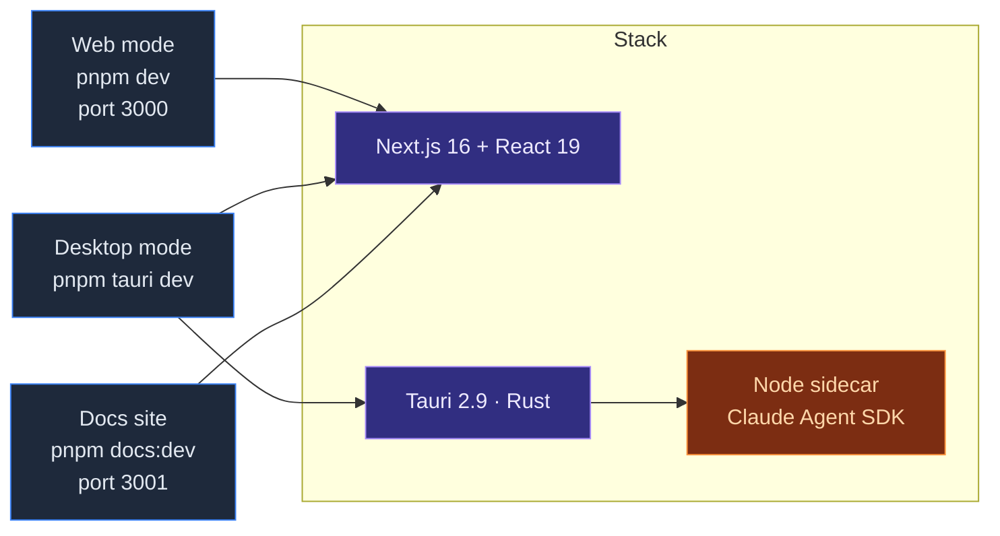

# Cognia · Overview

**Cognia** (codebase: `cognia-next`) is a desktop client for [Claude Code](https://claude.com/claude-code). It runs as a Tauri 2.9 application on Windows, macOS, and Linux, with a Next.js 16 + React 19 frontend and a Rust backend that hosts native subsystems (scheduler, vector store, file IO, TTS, deep links, …). A Node sidecar bundles the official `@anthropic-ai/claude-agent-sdk` and bridges it to the parent process over stdio.

This documentation reflects the **actual implementation** in the repo — every subsystem documented here corresponds to a directory under `lib/`, `components/`, or `src-tauri/src/` that you can read and modify.

## Why "not a starter"

Many `Next.js + Tauri` repos are templates to fork. cognia-next is the opposite — it is a full product that happens to use Next.js + Tauri. Concretely:

- The Dexie schema is at **v15** with 25+ tables (chat, characters, skills, teams, twin, plugins, A2UI, canvas, …).
- The Rust crate (`cognia-next`) registers ~16 modules: `claude` sidecar, `scheduler` (Windows Task Scheduler / launchd / systemd), `vector` (sqlite-vec), `tts`, `hooks`, `agents`, `external_agent`, `a2ui_bridge`, `canvas`, `skills`, `files`, `shell`, `settings`, `api_key`, `logging`, `tray`/`menu`, plus single-instance, deep-link, autostart, global-shortcut, store, updater plugins.
- The Node sidecar (`sidecar/claude-host.mjs`, `sidecar/a2ui-mcp.mjs`) ships with its own `pnpm install` because it has Node-only deps and is bundled as a Tauri resource.
- The frontend wires nine top-level providers in `app/layout.tsx` (locale gate, Tauri runtime, scheduler initializer, backup scheduler, canvas bridge, A2UI dispatch, data adapter, settings sync, theme, …).

If you are reading this to "learn the starter", you are in the wrong repo — pick a smaller example. If you are working on or contributing to Cognia, this is the entry point.

## At a glance

## What's inside

| Subsystem | Where |
| --- | --- |
| Multi-character / skill / team chat | `app/`, `components/chat/`, `lib/chat/`, `lib/character/` (via `lib/claude/types.ts`), `lib/skills/`, `lib/db/{characters,skills,teams,sessions,messages}.ts` |
| Claude Agent SDK + Node sidecar | `sidecar/claude-host.mjs`, `lib/claude/`, `src-tauri/src/claude/` |
| Employee Digital Twin (RAG + style few-shot) | `lib/twin/{ingest,distill,runtime}/`, `components/twin/`, `app/twin/`, `types/twin/` |
| Native vector store (sqlite-vec) | `src-tauri/src/vector/`, `lib/vector/` |
| Encrypted backup / import (schema v3) | `lib/data/`, `components/settings/data/` |
| Cross-platform scheduler | `src-tauri/src/scheduler/`, `lib/scheduler/`, `components/scheduler/` |
| Plugin system | `lib/plugin/`, `lib/db/plugins.ts`, `components/plugin/` |
| A2UI / Canvas / Artifacts surfaces | `lib/a2ui/`, `lib/canvas/`, `lib/artifacts/`, `components/{a2ui,canvas,artifacts}/` |
| TTS (Edge / OpenAI / Azure / ElevenLabs / native) | `src-tauri/src/tts/`, `lib/tts/` |
| MCP servers + presets | `lib/claude/mcp-presets.ts`, `lib/db/mcp-servers.ts` |
| Theming (oklch + custom themes) | `lib/themes/`, `lib/theme/`, `app/globals.css` |
| i18n (next-intl) | `lib/i18n/`, `i18n/messages/{en,zh-CN}.json` |

Read the [Architecture](./architecture) page for how these layers fit together.

## Quick navigation

<Cards>
  <Card title="Getting Started" href="./getting-started" description="Install deps, run web mode, run desktop mode." />
  <Card title="Architecture" href="./architecture" description="Four-layer view: frontend → IPC → Rust → sidecar." />
  <Card title="Runtime & Tauri" href="./runtime-and-tauri" description="Dual web/desktop runtime, IPC pattern, CSP, identifiers." />
  <Card title="Sidecar & Claude Agent SDK" href="./sidecar-and-claude-sdk" description="Node host protocol, lifecycle, hooks." />
  <Card title="Chat & Skills" href="./chat-and-skills" description="Sessions, characters, skills, teams, MCP presets." />
  <Card title="Employee Digital Twin" href="./employee-twin" description="Ingest / distill / runtime pipelines." />
  <Card title="Vector store" href="./vector-store" description="Native sqlite-vec + 5 cloud backends." />
  <Card title="Backup & data transfer" href="./backup-and-data" description="Schema v3, scheduled writes, imports." />
  <Card title="Scheduler" href="./scheduler" description="Cron parsing, native promotion, task templates." />
  <Card title="Plugin system" href="./plugin-system" description="Manifest, permissions, marketplace, scheduled jobs." />
  <Card title="Storage" href="./storage" description="Dexie schema v15, settings table, migration discipline." />
  <Card title="Theming & i18n" href="./theming-and-i18n" description="Tailwind v4, oklch theme tokens, locale switching." />
  <Card title="Development" href="./development" description="Workflow, scripts, conventions, testing standards." />
  <Card title="Deployment" href="./deployment" description="Building for web, desktop, and the docs site." />
</Cards>

<Callout type="info" title="ADRs">
  The four [Architecture Decision Records](../adr/0001-backup-schema-v3) are referenced
  from the relevant pages and explain **why** each subsystem looks the way it does.
</Callout>
