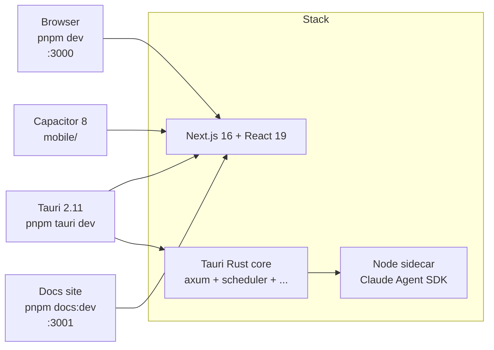

# Overview

**Cognia** (codebase: `cognia-next`) is an AI client for [Claude Code](https://claude.com/claude-code). One Next.js 16 static export feeds three shells — browser, Tauri 2.11 desktop, Capacitor 8 mobile — sharing one UI, one i18n catalog, and one set of business logic. A Rust core hosts long-lived services (HTTP server, scheduler, vector store, automation, OCR, MCP), and a bundled Node sidecar runs the official Claude Agent SDK.

These docs reflect the **actual implementation** — every page corresponds to code under `lib/`, `components/`, `src-tauri/src/`, or `sidecar/` that you can read and modify.

## At a glance



Two standalone services live alongside the monorepo:

- `services/signaling-server/` — WebRTC rendezvous (axum + workers-rs).
- `services/share-server/` — Cloudflare Worker + Vite viewer for zero-knowledge share links.

## Quick navigation

<Cards>
  <Card title="Getting Started" href="./getting-started" description="Install deps, run web mode, run desktop mode." />
  <Card title="Architecture" href="./core/architecture" description="Four-layer view: frontend, IPC, Rust, sidecar." />
  <Card title="Runtime & Tauri" href="./core/runtime-and-tauri" description="Dual web/desktop runtime, IPC, CSP." />
  <Card title="Sidecar & Claude Agent SDK" href="./core/sidecar-and-claude-sdk" description="Node host protocol, lifecycle, hooks." />
  <Card title="Chat & Skills" href="./chat/chat-and-skills" description="Sessions, characters, skills, teams, MCP." />
  <Card title="Storage" href="./data/storage" description="Dexie schema (v149), governance, settings, migrations." />
  <Card title="Vector store" href="./data/vector-store" description="Native sqlite-vec + cloud backends." />
  <Card title="Backup & data transfer" href="./data/backup-and-data" description="Schema v3, scheduled writes, imports." />
  <Card title="Plugin system" href="./subsystems/plugin-system" description="Manifest, permissions, marketplace, scheduled jobs." />
  <Card title="Theming & i18n" href="./ui/theming-and-i18n" description="Tailwind v4, oklch tokens, locale switching." />
  <Card title="Development" href="./dev/development" description="Workflow, scripts, conventions, testing." />
  <Card title="Deployment" href="./dev/deployment" description="Building for web, desktop, mobile, and docs." />
</Cards>

<Callout type="info" title="ADRs">
  Architecture Decision Records live under [`docs/content/docs/en/adr/`](./adr/0001-backup-schema-v3) — one
  ADR per major decision. They are immutable historical records; if a doc page contradicts an ADR, the ADR wins.
</Callout>

## Pick your runtime mode

<Tabs items={["Web", "Desktop", "Mobile", "Docs site"]}>
  <Tab value="Web">
    ```bash
    pnpm install
    pnpm dev    # → http://localhost:3000
    ```
    Browser-only. Tauri-only features (scheduler, native vector store, connectors, MCP servers, computer use) no-op behind `isTauri()` guards.
  </Tab>
  <Tab value="Desktop">
    ```bash
    pnpm install
    pnpm tauri dev
    ```
    Full-featured. The Tauri shell starts the Next.js dev server, spawns the Node sidecar, and registers the Rust core.
  </Tab>
  <Tab value="Mobile">
    ```bash
    pnpm build
    pnpm mobile:sync
    pnpm mobile:open:ios       # or :android
    ```
    Capacitor 8 wraps `out/` and talks to a headless `cognia-server` over LAN/HTTPS or WebRTC.
  </Tab>
  <Tab value="Docs site">
    ```bash
    pnpm docs:dev   # → http://localhost:3001
    ```
    This site. Fumadocs — MDX edits hot-reload instantly.
  </Tab>
</Tabs>

## First contribution in 4 steps

<Steps>
  <Step>
    ### Read the architecture overview
    [Architecture](./core/architecture) introduces the four-layer model (Browser → IPC → Rust → sidecar) and where each subsystem lives.
  </Step>
  <Step>
    ### Pick a subsystem
    Each page links back to its source folder under `lib/`, `components/`, or `src-tauri/src/`, and cross-references the relevant ADR.
  </Step>
  <Step>
    ### Run with hot reload
    `pnpm tauri dev` reloads React instantly; Rust changes recompile on save.
  </Step>
  <Step>
    ### Add tests
    Coverage gate is ≥90%. Co-locate tests as `<file>.test.ts(x)` and run `pnpm test:coverage`.
  </Step>
</Steps>
