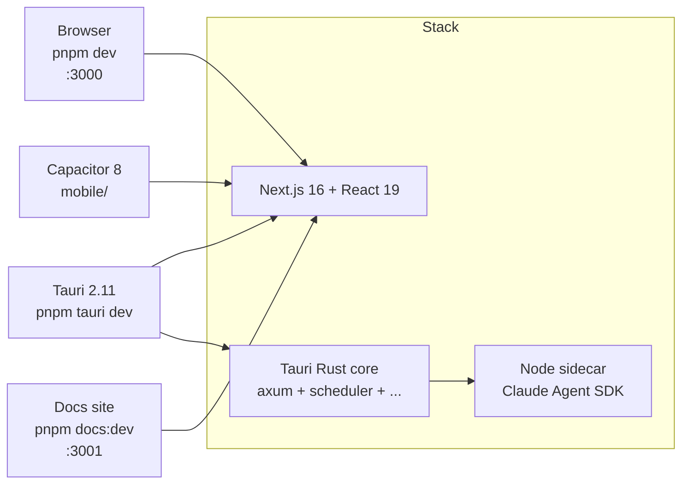

# Overview

**Cognia** (codebase: `cognia-next`) is an AI client for [Claude Code](https://claude.com/claude-code).
One Next.js 16 static export serves the browser, Tauri 2.11 desktop, and Capacitor 8 mobile shells.
All three share the UI, i18n catalog, and business logic.
A Rust core hosts long-lived services: an HTTP server, scheduler, vector store, automation, OCR, and MCP.
A bundled Node sidecar runs the official Claude Agent SDK.

These docs describe the **actual implementation**.
Each page refers to code under `lib/`, `components/`, `src-tauri/src/`, or `sidecar/` that you can read and modify.

## At a glance


```mermaid
flowchart LR
  Web[Browser<br/>pnpm dev<br/>:3000]
  Desktop[Tauri 2.11<br/>pnpm tauri dev]
  Mobile[Capacitor 8<br/>mobile/]
  Docs[Docs site<br/>pnpm docs:dev<br/>:3001]

  subgraph Stack[Stack]
    Next[Next.js 16 + React 19]
    Rust[Tauri Rust core<br/>axum + scheduler + ...]
    Sidecar[Node sidecar<br/>Claude Agent SDK]
  end

  Web --> Next
  Desktop --> Next
  Desktop --> Rust
  Mobile --> Next
  Rust --> Sidecar
  Docs --> Next
```

Two standalone services live alongside the monorepo:

- `services/signaling-server/` — WebRTC rendezvous (axum + workers-rs).
- `services/share-server/` — Cloudflare Worker + Vite viewer for zero-knowledge share links.

## Quick navigation

<Cards>
  <Card title="Getting Started" href="./getting-started" description="Install deps, run web mode, run desktop mode." />
  <Card title="Architecture" href="./core/architecture" description="Four-layer view: frontend, IPC, Rust, sidecar." />
  <Card title="Runtime & Tauri" href="./core/runtime-and-tauri" description="Dual web/desktop runtime, IPC, CSP." />
  <Card title="Sidecar & Claude Agent SDK" href="./core/sidecar-and-claude-sdk" description="Node host protocol, lifecycle, hooks." />
  <Card title="Chat & Skills" href="./chat/chat-and-skills" description="Sessions, characters, skills, teams, MCP." />
  <Card title="Storage" href="./data/storage" description="Dexie schema (v149), governance, settings, migrations." />
  <Card title="Vector store" href="./data/vector-store" description="Native sqlite-vec + cloud backends." />
  <Card title="Backup & data transfer" href="./data/backup-and-data" description="Schema v3, scheduled writes, imports." />
  <Card title="Plugin system" href="./subsystems/plugin-system" description="Manifest, permissions, marketplace, scheduled jobs." />
  <Card title="Theming & i18n" href="./ui/theming-and-i18n" description="Tailwind v4, oklch tokens, locale switching." />
  <Card title="Development" href="./dev/development" description="Workflow, scripts, conventions, testing." />
  <Card title="Deployment" href="./dev/deployment" description="Building for web, desktop, mobile, and docs." />
</Cards>

<Callout type="info" title="ADRs">
  Architecture Decision Records are in the [ADR catalogue](./adr). They explain the reasons for decisions.
  The implementation and tests determine current behavior.
  When an ADR differs from the implementation, these docs describe the implementation and identify the difference.
</Callout>

## Pick your runtime mode

<Tabs items={["Web", "Desktop", "Mobile", "Docs site"]}>
  <Tab value="Web">
    ```bash
    pnpm install
    pnpm dev    # → http://localhost:3000
    ```
    This mode runs only in the browser.
    Tauri-only features (scheduler, native vector store, connectors, MCP servers, computer use) perform no action because of `isTauri()` guards.
  </Tab>
  <Tab value="Desktop">
    ```bash
    pnpm install
    pnpm tauri dev
    ```
    This mode supports the full feature set.
    The Tauri shell starts the Next.js dev server, starts the Node sidecar, and registers the Rust core.
  </Tab>
  <Tab value="Mobile">
    ```bash
    pnpm build
    pnpm mobile:sync
    pnpm mobile:open:ios       # or :android
    ```
    Capacitor 8 wraps `out/` and talks to a headless `cognia-server` over LAN/HTTPS or WebRTC.
  </Tab>
  <Tab value="Docs site">
    ```bash
    pnpm docs:dev   # → http://localhost:3001
    ```
    This mode runs the documentation site. Fumadocs reloads MDX edits immediately.
  </Tab>
</Tabs>

## First contribution in 4 steps

<Steps>
  <Step>
    ### Read the architecture overview
    [Architecture](./core/architecture) introduces the four-layer model (Browser → IPC → Rust → sidecar) and where each subsystem lives.
  </Step>
  <Step>
    ### Pick a subsystem
    Each page links back to its source folder under `lib/`, `components/`, or `src-tauri/src/`, and cross-references the relevant ADR.
  </Step>
  <Step>
    ### Run with hot reload
    `pnpm tauri dev` reloads React immediately. Rust changes recompile when you save them.
  </Step>
  <Step>
    ### Add tests
    The coverage gate is ≥90%. Co-locate tests as `<file>.test.ts(x)`.
    Run `pnpm test:coverage`.
  </Step>
</Steps>
