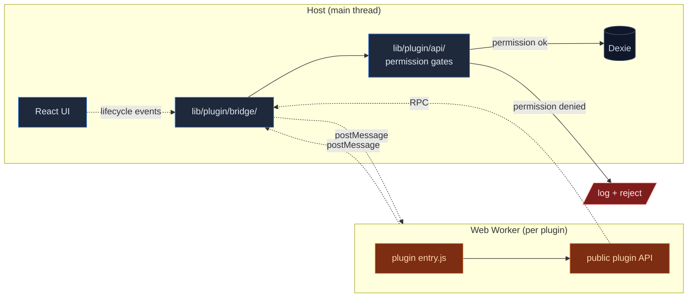
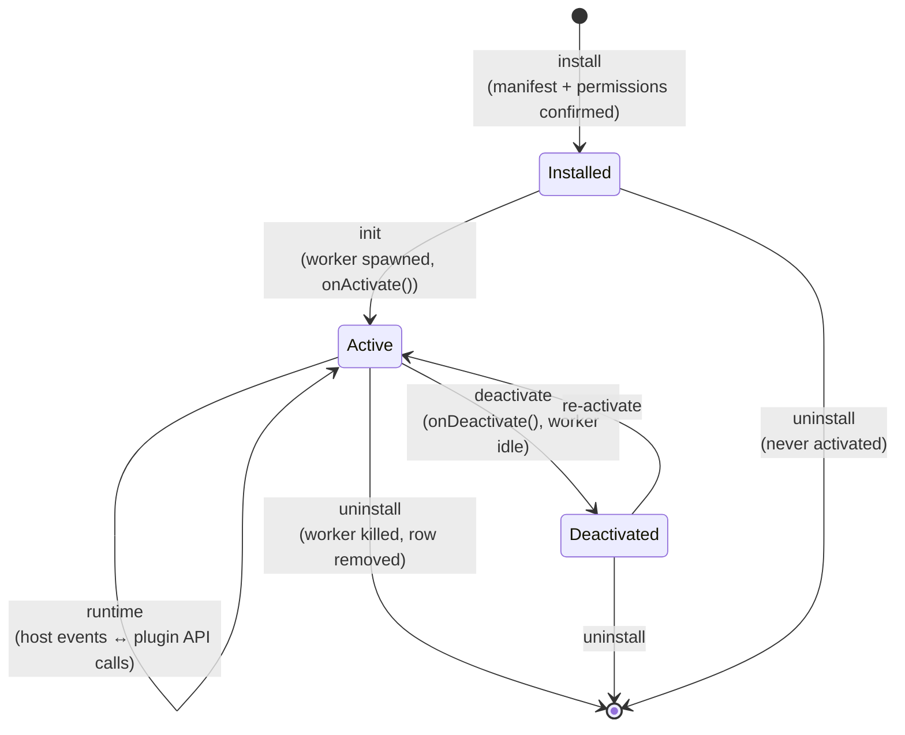

# Plugin system

<Status variant="experimental" />

<TLDR>
  Sandboxed Web Worker per plugin, declared-and-consented permissions, an RPC bridge to a versioned
  API, and a marketplace for distribution. Plugins ship as signed `.cognia-plugin` archives and run
  isolated from the host DOM.
</TLDR>

<StatGrid>
  <Stat label="Dexie tables" value="5" hint="plugins · permissions · reviews · analytics · jobs" />
  <Stat label="API namespaces" value="11" hint="chat · twin · vector · scheduler · …" />
  <Stat label="Manifest version" value="v1" hint="Zod-validated" />
  <Stat label="Sandbox" value="Worker" hint="postMessage RPC bridge" />
</StatGrid>

Cognia exposes a sandboxed plugin runtime so third-party code can extend the app without forking it. Plugins can:

- Add menu items, panels, and chat surfaces.
- Register MCP servers and skill resources.
- Declare scheduled jobs that run via the [Scheduler](./scheduler).
- Listen to lifecycle events (chat send, response, twin ingest, …).

All under explicit per-permission user consent.

## Where it lives

```
lib/plugin/
  index.ts               # Public API + registry
  api/                   # The API surface plugins call into
  bridge/                # postMessage bridge between plugin worker and host
  contracts/             # JSON Schemas for manifests, permissions, jobs
  core/                  # Lifecycle (load, init, dispose)
  devtools/              # Dev-only debugging surface
  lifecycle/             # Event hooks (onSend, onResponse, …)
  messaging/             # Plugin ↔ host RPC
  package/               # Manifest parsing, packaging
  scheduler/             # Plugin-side scheduled-job registration
  security/              # Permission gating, code signing
  utils/
  icon.ts

lib/db/
  plugins.ts             # plugins table (installed plugins)
  plugin-permissions.ts  # plugin_permissions table (granted permissions)
  plugin-reviews.ts      # plugin_reviews (marketplace reviews cache)
  plugin-analytics.ts    # plugin_analytics (telemetry per install)
  plugin-scheduled-jobs.ts  # plugin_scheduled_jobs (jobs registered by plugins)
  plugin-bridge.ts       # plugin_bridge (host ↔ plugin message log)
  plugin-types.ts        # row types

components/plugin/       # Settings UI + marketplace
```

## Manifest format

A plugin ships a `cognia-plugin.json` manifest:

```jsonc
{
  "schemaVersion": 1,
  "id": "com.example.my-plugin",
  "name": "My Plugin",
  "version": "0.1.0",
  "description": "...",
  "author": "...",
  "icon": "icon.svg",
  "entry": "main.js", // ES module entry point
  "permissions": [
    "chat.read",
    "chat.send",
    "twin.read",
    "scheduler.register",
    "fs.read:$DOWNLOADS", // scoped FS permission
  ],
  "surfaces": [
    { "kind": "panel", "id": "main", "title": "My Plugin" },
    { "kind": "chat-action", "id": "summarize", "label": "Summarize" },
  ],
  "scheduledJobs": [
    { "id": "daily-sync", "trigger": { "type": "cron", "expression": "0 9 * * *" } },
  ],
}
```

Schema validation: `lib/plugin/contracts/manifest-schema.ts` (a Zod schema). Manifests fail to install if any field is missing or malformed.

### Manifest fields

<TypeTable
  type={{
    schemaVersion: {
      description: "Manifest format version. Currently `1`.",
      type: "1",
      required: true,
    },
    id: {
      description: "Reverse-DNS identifier; must be unique across the user's installs.",
      type: "string",
      required: true,
    },
    name: {
      description: "Display name shown in the marketplace and settings.",
      type: "string",
      required: true,
    },
    version: { description: "Plugin version (semver).", type: "string", required: true },
    description: { description: "Short description shown in install dialog.", type: "string" },
    author: { description: "Free-form author label.", type: "string" },
    icon: { description: "Path to an SVG icon, relative to manifest.", type: "string" },
    entry: {
      description: "ES module entry path; loaded into the worker.",
      type: "string",
      required: true,
    },
    permissions: {
      description: "List of capabilities the plugin requests at install time.",
      type: "string[]",
      required: true,
    },
    surfaces: {
      description: "UI surfaces (panels, chat actions) the plugin contributes.",
      type: "Surface[]",
    },
    scheduledJobs: {
      description: "Jobs the plugin wants to register with the scheduler at activation.",
      type: "ScheduledJob[]",
    },
  }}
/>

## Permission model

`lib/plugin/security/` enforces:

- **Declared up-front** — every API the plugin calls must be declared in `permissions[]`.
- **User-consented** — the install dialog shows a plain-language permission summary; the user approves each before install.
- **Scoped** — file system, network, and resource permissions are scoped (e.g., `fs.read:$DOWNLOADS` not `fs.read:*`).
- **Revocable** — the user can disable any permission post-install in **Settings → Plugins → `<plugin>` → Permissions**.
- **Audited** — every API call is logged to `plugin_bridge` (capped). The Maintenance tab shows the log.

## Sandbox



Plugins run in a **dedicated Web Worker** spawned per plugin install. The worker:

- Has no DOM access (it talks to the host over `postMessage`).
- Has no direct network access — `fetch` calls go through the bridge and are gated by the `network.fetch:<origin>` permission.
- Cannot import host code; only the public plugin API.
- Is killed when the plugin is uninstalled or disabled.

`lib/plugin/bridge/` is the host side of the postMessage channel; it serialises typed messages back to the worker.

## Lifecycle



`core/lifecycle.ts` is the orchestrator. `index.ts:registerHostHooks(...)` wires lifecycle events into the rest of the app.

## API surface

Plugins call into a versioned API exposed via `lib/plugin/api/`:

| Namespace        | Capabilities                                                               |
| ---------------- | -------------------------------------------------------------------------- |
| `chat.*`         | Read sessions/messages, send a templated message, register a chat action   |
| `character.*`    | Read characters, propose a new character draft                             |
| `skill.*`        | Read skills, propose a new skill                                           |
| `twin.*`         | Enumerate twins, read a twin profile (no chunk content), trigger an ingest |
| `vector.*`       | Query the active vector store (no upsert; that's privileged)               |
| `scheduler.*`    | Register a scheduled job; only the plugin's own jobs                       |
| `notification.*` | Show a toast / native notification                                         |
| `surface.*`      | Render a panel, render a chat surface                                      |
| `storage.*`      | Per-plugin key-value store (small, capped)                                 |
| `network.fetch`  | HTTPS fetch, gated by origin-scoped permission                             |
| `fs.*`           | Scoped FS access (read/write under user-approved roots)                    |

Host-side implementations live alongside the namespace files. Each is responsible for permission gating before performing the action.

## Scheduled jobs

Plugins register jobs via `scheduler.register({ id, trigger })`. The plugin scheduler (`lib/plugin/scheduler/`):

1. Validates the trigger.
2. Inserts a row into `plugin_scheduled_jobs`.
3. Forwards to the [Scheduler](./scheduler) with `Executor.type === "plugin"`.
4. On fire, the scheduler invokes the plugin's `onJob({ id, … })` handler.

If the plugin is disabled or uninstalled, its jobs are tombstoned; no fire happens until re-enabled.

## Marketplace

`lib/plugin/index.ts` contains a marketplace client. Plugins are distributed as signed `.cognia-plugin` archives (zip with manifest + source + signature).

- The catalog is a static JSON feed (configurable URL).
- Reviews are fetched from the catalog; cached in `plugin_reviews`.
- Install flow: download → verify signature → parse manifest → show permission dialog → unpack → register.

The marketplace UI lives in `components/plugin/`.

## Devtools

`lib/plugin/devtools/` is a dev-only inspector:

- Live message log between host and worker.
- Permission decisions ("granted", "denied", "denied — permission missing").
- Triggered scheduled jobs and their results.
- Performance: time spent in each API call.

Toggled by an env var in dev (`NEXT_PUBLIC_PLUGIN_DEVTOOLS=1`), hidden in production.

## Built-in plugin runtime hooks

The host wires plugins into:

- **Chat send** — `lifecycle/onSend.ts` — plugins can mutate / cancel.
- **Chat response** — `lifecycle/onResponse.ts` — plugins can post-process.
- **Twin ingest** — fired when a twin source completes ingestion.
- **Scheduler events** — fired on every scheduled-task run.

Plugins subscribe in their `onActivate()`.

## Where to start contributing

| Goal                    | Files                                                                       |
| ----------------------- | --------------------------------------------------------------------------- |
| Add a new permission    | `lib/plugin/contracts/permissions.ts`, gating in the relevant API namespace |
| Add a new API namespace | `lib/plugin/api/<name>.ts`, register in `api/index.ts`                      |
| Improve sandbox         | `lib/plugin/security/`, `lib/plugin/bridge/`                                |
| Tweak marketplace UX    | `components/plugin/`, `lib/plugin/index.ts` (catalog client)                |

## Tests

- `lib/plugin/index.test.ts` — registry and lifecycle integration.
- `lib/plugin/icon.test.ts` — icon parsing (SVG sanitiser).
- Schema tests in `lib/plugin/contracts/`.

## Next

<Cards>
  <Card
    title="Scheduler"
    href="./scheduler"
    description="The engine plugin scheduled jobs run on."
  />
  <Card title="Storage" href="./storage" description="The plugin tables (v15) in detail." />
  <Card
    title="Sidecar & Claude SDK"
    href="./sidecar-and-claude-sdk"
    description="Plugins extend the sidecar via MCP."
  />
</Cards>
