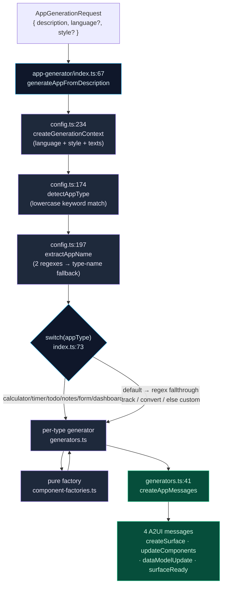
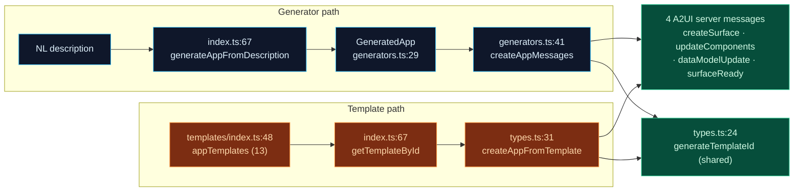

# App Generator & Templates

<Status variant="experimental" />

<TLDR>
  The **app generator** turns a one-line description into a full A2UI component tree **without ever
  calling a model** — it is pure keyword/regex rule matching. A short pipeline
  (`createGenerationContext` → `detectAppType` → `extractAppName` → a `switch`) routes to one of ten
  per-type generators, which assemble surfaces from **13 pure component factories**. Separately, a
  registry of **13 hardcoded built-in templates** (`appTemplates`) supplies ready-made apps. Both the
  generator and the templates emit the **same 4-message A2UI sequence**. The
  [A2UI Hub page](#hub-vs-workspace) (`app/a2ui/page.tsx`) is the front door: `?app=<id>` switches to
  the Workspace, otherwise it renders the Hub with Flash-generate, a searchable library, and
  template gallery.
</TLDR>

<StatGrid>
  <Stat label="LLM calls" value="0" hint="pure keyword + regex matching, zero model dependency" />
  <Stat label="Per-type generators" value="10" hint="generators.ts — calculator/timer/todo/notes/form/tracker/converter/custom/dashboard" />
  <Stat label="Component factories" value="13" hint="component-factories.ts — pure A2UIComponent[] builders" />
  <Stat label="Built-in templates" value="13" hint="appTemplates registry — NOT 14" />
</StatGrid>

## The No-LLM Premise

<Callout type="warn">
  The app generator does **not** call any model. There are zero LLM, embedding, or network calls in
  the entire generation path. It is **pure keyword/regex rule matching**: a lowercase substring scan
  of the description (`detectAppType`) picks an app type, two regexes (`extractAppName`) pull a name,
  and a `switch` dispatches to a deterministic per-type generator. The same description always yields
  the same tree. This is what makes Flash-generate instant and offline-safe.
</Callout>

This subsystem has two cooperating halves:

| Half | Entry | What it does |
| --- | --- | --- |
| **Generator** | `app-generator/index.ts:67` `generateAppFromDescription` | NL string → `GeneratedApp` (components + dataModel + name) via rules |
| **Template registry** | `templates/index.ts:48` `appTemplates` | 13 hardcoded `A2UIAppTemplate` entries, looked up by id/category/search |

Both terminate in the **same 4-message A2UI sequence** (`createSurface` · `updateComponents` ·
`dataModelUpdate` · `surfaceReady`) — the generator via `createAppMessages` (`generators.ts:41`),
templates via `createAppFromTemplate` (`types.ts:31`). Both mint ids through
`generateTemplateId` (`types.ts:24`).

<Files>
- lib/a2ui/
  - app-generator.ts — back-compat barrel shim (re-exports `./app-generator/`)
  - app-generator/
    - index.ts — barrel + **MAIN ENTRY** `generateAppFromDescription` (67)
    - config.ts — localization, styles, `appPatterns`, detection helpers
    - generators.ts — 10 per-type generators → `GeneratedApp`
    - component-factories.ts — 13 pure `A2UIComponent[]` factories
  - templates/
    - index.ts — **THE REGISTRY** `appTemplates` (48) + lookup helpers
    - types.ts — `A2UIAppTemplate`, `generateTemplateId`, `createAppFromTemplate`
    - productivity.ts · utility.ts · form.ts · data.ts · social.ts — 13 template defs
- app/a2ui/
  - page.tsx — Hub vs Workspace dual-mode (914)
  - layout.tsx — metadata + pass-through (11)
</Files>

## Generation Pipeline

`generateAppFromDescription` (`index.ts:67`) is the single entry point. It resolves a generation
context, classifies the description, extracts a name, then dispatches through a `switch` to a
per-type generator that calls one or more factories and wraps the result into the 4-message sequence.

### The dispatch switch

`switch(appType)` at `index.ts:73` maps a detected type to a generator. Types with no explicit case
fall to `default` (88), where two regexes catch tracker/converter intents before the
`generateCustomApp` catch-all.

| `appType` | Routes to | Generator line |
| --- | --- | --- |
| `calculator` | `generateCalculatorApp` | `generators.ts:58` |
| `timer` | `generateTimerApp` | `generators.ts:104` |
| `todo` | `generateTodoApp` | `generators.ts:143` |
| `notes` | `generateNotesApp` | `generators.ts:175` |
| `survey` | `generateFormApp(…, "survey")` | `generators.ts:203` |
| `contact` | `generateFormApp(…, "contact")` | `generators.ts:203` |
| `dashboard` | `generateDashboardApp` | `generators.ts:552` |
| *default* `/追踪|track|记录|log|打卡/i` (89) | `generateTrackerApp` | `generators.ts:227` |
| *default* `/转换|换算|convert/i` (92) | `generateUnitConverterApp` | `generators.ts:274` |
| *default* else (95) | `generateCustomApp` | `generators.ts:452` |

## Intent Detection (`appPatterns`)

`detectAppType` (`config.ts:174`) lowercases the description and iterates
`Object.entries(appPatterns)` (`config.ts:136`) — **first match wins**, in insertion order. Each
pattern carries bilingual keywords and a `templateId` (the matching built-in template, used by the
Hub when offering a template instead of a generated app).

| Intent | Line | Keywords (zh / en) | `templateId` |
| --- | --- | --- | --- |
| `calculator` | 137 | 计算 · 计算器 · calculator · calc · 算 | `calculator` |
| `timer` | 141 | 计时 · 倒计时 · timer · countdown · 秒表 | `timer` |
| `todo` | 145 | 待办 · 任务 · todo · task · 清单 | `todo-list` |
| `notes` | 149 | 笔记 · 记事 · notes · memo · 便签 | `notes` |
| `survey` | 153 | 问卷 · 调查 · survey · form · 表单 · feedback | `survey-form` |
| `contact` | 157 | 联系 · contact · 留言 · message | `contact-form` |
| `weather` | 161 | 天气 · weather · 气温 · 温度 | `weather` |
| `dashboard` | 165 | 仪表盘 · dashboard · 数据 · 统计 · analytics · 图表 | `data-dashboard` |

Supporting helpers in `config.ts`: `detectLanguage` (189) maps any CJK char (`/[一-鿿]/`) to `zh`,
else `en`; `extractAppName` (197) tries two name regexes (198–201), then a type-name fallback table
(214–223), then a default. `getLocalizedTexts` (101, default `zh`) and `getStyleConfig`
(108, default `colorful`) feed `createGenerationContext` (234).

<Callout type="warn">
  **The weather gotcha.** `weather` is a valid detected type in `appPatterns` (`config.ts:161`), but
  the dispatch `switch` (`index.ts:73`) has **no `case "weather"`**. A "weather" description therefore
  falls through `default` and lands in `generateCustomApp`. Weather is only reachable as a finished
  app via its **template** (`utility.ts:235`), never via the generator.
</Callout>

## Factory Layer (13 Pure Factories)

`component-factories.ts` holds 13 pure functions, each returning `A2UIComponent[]` (every one ends
`] as A2UIComponent[]`). Strings are hardcoded zh with emoji headers; bindings use `{ path: "/foo" }`.
The calculator, timer, todo, notes, form, and tracker generators **delegate** to these factories;
the converter, custom, and dashboard generators **build their trees inline** instead.

| Family | Factory | Line | Notable widgets |
| --- | --- | --- | --- |
| Calculator | `createBasicCalculatorComponents` | 8 | 4×4 keypad (`num_N` / `op_*` / `calculate` / `clear` / `delete`) |
| Calculator | `createTipCalculatorComponents` | 74 | Slider `tipPercent` |
| Calculator | `createBMICalculatorComponents` | 140 | Sliders height/weight, Badge |
| Calculator | `createAgeCalculatorComponents` | 193 | DatePicker |
| Calculator | `createLoanCalculatorComponents` | 223 | loan inputs |
| Timer | `createTimerComponents(isPomodoro)` | 305 | pomodoro presets (374) vs 1/5/10-min (398) |
| Productivity | `createTodoComponents(hasCategories, hasPriority, hasDueDate)` | 412 | conditional `dueDate` (437) |
| Productivity | `createNotesComponents` | 505 | notes list |
| Form | `createSurveyComponents` | 559 | TextField / RadioGroup / TextArea |
| Form | `createContactComponents` | 609 | contact fields |
| Tracker | `createExpenseTrackerComponents` | 679 | Progress budget, Select |
| Tracker | `createHealthTrackerComponents` | 759 | steps / water Progress |
| Tracker | `createHabitTrackerComponents` | 841 | streak Flame, List |

### Generators that build inline

Three generators do **not** delegate to a factory — they assemble components directly:

| Generator | Line | Inline range | Note |
| --- | --- | --- | --- |
| `generateUnitConverterApp` | 274 | 356–429 | unit-type routing: temperature (291) / weight (304) / currency (319) / length |
| `generateCustomApp` | 452 | 471–535 | feature flags input (461) / button (462) / list (463) / chart (464) |
| `generateDashboardApp` | 552 | 559–606 | ComparisonCards / WidgetStatus / Chart + canned dataModel (608–628) |

Delegating generators carry sub-routes too: `generateCalculatorApp` (58) branches tip (66) / BMI (67)
/ age (68) / loan (69) / basic; `generateTimerApp` (104) detects pomodoro (112) and a `(\d+)分钟`
preset (115); `generateTodoApp` (143) sets the categories/priority/dueDate flags (150–152);
`generateTrackerApp` (227) sub-routes expense (234) / health (236) / habit. All ids come from
`generateTemplateId(prefix)` imported from `../templates` (`generators.ts:7`).

## The 13 Built-In Templates

`appTemplates` (`templates/index.ts:48`, entries L49–61) is the registry. It is **13 templates, not
14**. Distribution: productivity ×4, utility ×4, form ×2, data ×2, social ×1.

| id | Name | Category | Def (`file:line`) |
| --- | --- | --- | --- |
| `todo-list` | Todo List | productivity | `productivity.ts:12` |
| `notes` | Quick Notes | productivity | `productivity.ts:95` |
| `habit-tracker` | Habit Tracker | productivity | `productivity.ts:178` |
| `shopping-list` | Shopping List | productivity | `productivity.ts:251` |
| `calculator` | Calculator | utility | `utility.ts:12` |
| `timer` | Timer | utility | `utility.ts:147` |
| `weather` | Weather Widget | utility | `utility.ts:235` |
| `unit-converter` | Unit Converter | utility | `utility.ts:335` |
| `survey-form` | Survey Form | form | `form.ts:12` |
| `contact-form` | Contact Form | form | `form.ts:130` |
| `data-dashboard` | Data Dashboard | data | `data.ts:12` |
| `expense-tracker` | Expense Tracker | data | `data.ts:147` |
| `profile-card` | Profile Card | social | `social.ts:12` |

Registry helpers in `index.ts`: `getTemplateById` (67), `getTemplatesByCategory` (74), and
`searchTemplates` (81) — the last scans name/description/tags and powers the Hub search box.

### The `A2UIAppTemplate` shape and the two parallel builders

`A2UIAppTemplate` (`types.ts:10`) carries `id` · `name` · `description` · `icon` · `category`
(`productivity` | `data` | `form` | `utility` | `social`) · `components` · `dataModel` · `tags`.
`templateCategories` (`types.ts:66`) holds the 5 category metadata entries.

There are **two parallel message builders** that emit the identical 4-message A2UI sequence:

| Builder | Line | Used by |
| --- | --- | --- |
| `createAppMessages` | `generators.ts:41` | generated apps (wraps components + data into the 4 msgs at 48–51) |
| `createAppFromTemplate` | `types.ts:31` | templates (template → 4 server messages) |

Both call `generateTemplateId` (`types.ts:24`, `${prefix}-${crypto.randomUUID()}`) to mint surface
ids — shared between the generator and the template paths.

## Hub vs Workspace

`app/a2ui/page.tsx` (914) is a **dual-mode hub** keyed off the URL. `appIdFromUrl =
searchParams.get("app")` (107) drives the mode switch (329–331): if `appIdFromUrl` is present it
returns `<A2UIWorkspace surfaceId={appIdFromUrl} />`, otherwise it renders the Hub (333+).
Because it uses `useSearchParams` (101), the default export wraps everything in
`<Suspense fallback={<PageLoading/>}>` (907–913). `app/a2ui/layout.tsx` (11) only sets metadata
(`"A2UI Mini-Apps - Cognia"`, line 3) and passes children through.

### Flash generate

The hero prompt drives instant generation: `heroPrompt` (114), with `QUICK_SUGGESTIONS` (79–86) and
`promptRef` (104). `handleFlashGenerate` (205) calls
`generateAppFromDescription({ description: heroPrompt })` (209), then
`appBuilder.createCustomApp(result.name, result.components, result.dataModel)` (210). Enter submits
(790–795); the submit Button (799) is disabled while `isGenerating`.
`handleSuggestionClick` (220) fills the prompt; `handleTemplateSelect` (227) calls
`appBuilder.createFromTemplate(template.id)`. `handleOpenWorkspace` (322) does
`router.push('/a2ui?app=<id>')`. A `?action=create` effect (196–203) focuses the create prompt then
`router.replace("/a2ui")`.

### Hub sections

| Section | Line | Highlights |
| --- | --- | --- |
| Header | 335 | counts `allApps.length` (350) + `appTemplates.length` (353) |
| Continue-working card | 385 | renders `<A2UIInlineSurface>` (418) |
| All-apps library | 505 | search (515), sort Select (533–547), grid/list `viewMode` (549–566), category filter via `CATEGORY_KEYS` + `CATEGORY_I18N_MAP` (578–593), app-card DropdownMenu |
| Template library | 734 | `filteredTemplates.map → <TemplateCard>` (753–759) |
| Create-studio aside | 766 | the Flash-generate composer |
| Dialogs | 873 | `DeleteConfirmDialog` (873), preview Dialog + `A2UIInlineSurface` (879), `AppDetailDialog` (895) |

Derived state: `filteredApps` memo (131) and `filteredTemplates` memo (166, composing
`searchTemplates` / `getTemplatesByCategory` / `appTemplates`). Export/import: `handleExport` (268),
`handleExportAll` (287), `downloadJson` (88), `handleImportFile` (302).

## Related

<Cards>
  <Card title="A2UI System" href="./index" description="Protocol overview, the canonical round-trip, five server messages, the three dispatch paths" />
  <Card title="Catalog & rendering" href="./catalog-rendering" description="The type→React registry the generated/template component trees render through" />
  <Card title="State & persistence" href="./state-persistence" description="The Zustand store, undo/redo, localStorage LRU, and the 4 Dexie tables backing the Hub library" />
</Cards>
