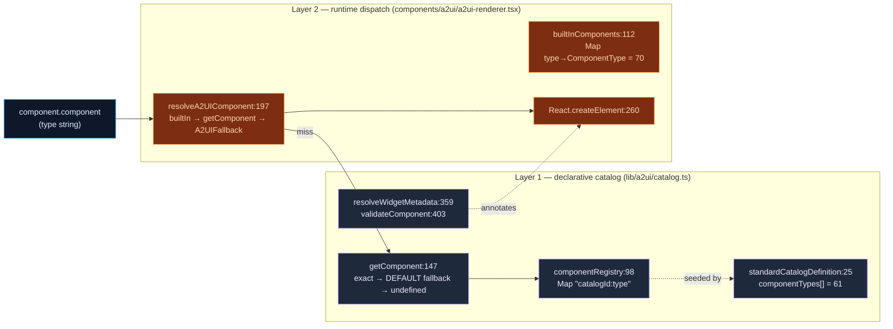
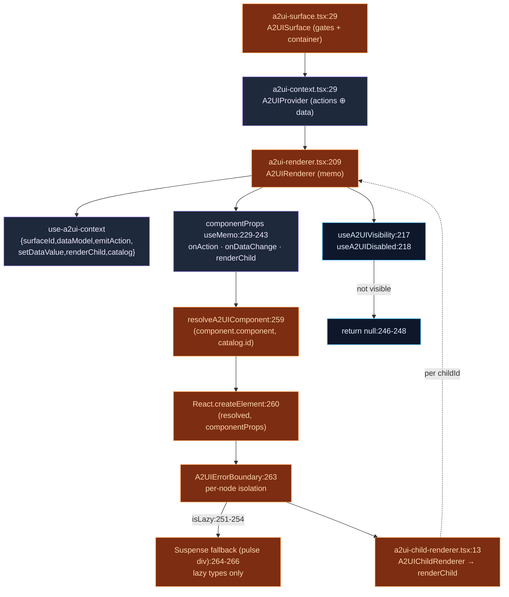
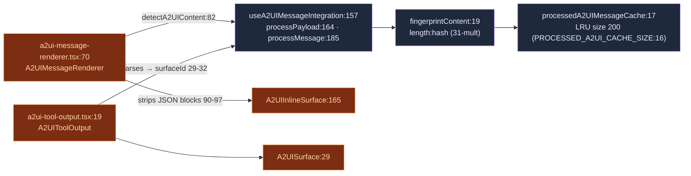

# Catalog & Rendering

<Status variant="experimental" />

<TLDR>
  A2UI turns a `component` **type string** (`"Button"`, `"Chart"`, …) into a real React node through
  **two stacked registries**. The lightweight `lib/a2ui/catalog.ts` holds the declarative list of
  **61** standard types plus metadata and validation; the heavyweight
  `components/a2ui/a2ui-renderer.tsx` holds the **70-entry** `builtInComponents` dispatch map that is
  the *real* runtime registry. A container (`a2ui-surface.tsx`) selects an inline / dialog / panel /
  fullscreen shell, an `A2UIProvider` splits actions from data, and `A2UIRenderer` resolves the type,
  calls `React.createElement`, and wraps every node in its own error boundary.
</TLDR>

<StatGrid>
  <Stat label="Catalog types" value="61" hint="catalog.ts standardCatalogDefinition.componentTypes (L32-91)" />
  <Stat label="Dispatch entries" value="70" hint="a2ui-renderer.tsx builtInComponents (L114-190)" />
  <Stat label="Renderer-only extras" value="5" hint="Tabs · Accordion · Toggle · FormGroup · AcademicAnalysis" />
  <Stat label="Component families" value="7" hint="layout · display · form · data · navigation · overlay · academic" />
</StatGrid>

## Two-Layer Registry Model

A type string survives two lookups, and the two layers do **not** hold the same list. Understanding
the split is the key to the whole subsystem.

### Layer 1 — `lib/a2ui/catalog.ts` (435 lines)

The catalog is a **flat `Map`** keyed by `` `${catalogId}:${type}` `` (key built at L118), whose value
is an `A2UICatalogEntry { type, component, description?, schema? }` (L120-125). It is the *declarative*
layer: it knows which types exist, how to validate them, and how to resolve widget metadata — but the
renderer does not depend on it for the common path.

| symbol | line | role |
| --- | --- | --- |
| `DEFAULT_CATALOG_ID` | 19 | `"cognia-standard-v1"` — the fallback catalog id |
| `standardCatalogDefinition` | 25 | `componentTypes[]` = **61** type strings (L32-91) |
| `componentRegistry` | 98 | flat `Map<"catalogId:type", A2UICatalogEntry>` |
| `catalogRegistry` | 103 | `Map<catalogId, A2UIComponentCatalog>` |
| `registerComponent` | 108 | sets `componentRegistry["${catalogId}:${type}"]` (key L118) |
| `registerComponents` | 131 | bulk register |
| `getComponent` | 147 | exact key → fallback to `DEFAULT_CATALOG_ID` (L159-162) → `undefined` (L164) |
| `hasComponent` | 170 | membership test |
| `getRegisteredTypes` | 180 | enumerate keys |
| `createCatalog` | 196 | merges default when id differs (L208-218) |
| `registerCatalog` / `getCatalog` | 232 / 244 | catalog-level register / lookup |
| `unregisterComponent` / `clearRegistry` | 265 / 276 | teardown |
| `getStandardComponentTypes` | 284 | the 61-type list |
| `componentCategories` | 291 | 7 buckets: display / input / action / layout / data / overlay / navigation |
| `DEFAULT_WIDGET_METADATA` | 349 | `{ hostStrategy:"native", sizing:"auto", theme:"inherit", status:"ready", showChrome:true }` |
| `resolveWidgetMetadata` | 359 | merges `DEFAULT_WIDGET_METADATA` + RichOutput profile routing (L367) + `component.widget` |
| `getComponentCategory` | 391 | type → category |
| `validateComponent` | 403 | returns `{ valid, errors }` |
| `FALLBACK_COMPONENT_TYPE` | 435 | `"Text"` — **NOTE: unused by the renderer** |

The **61** standard `componentTypes` (L32-91): `Text, Button, TextField, TextArea, Select, Checkbox,
Radio, RadioGroup, Slider, DatePicker, TimePicker, DateTimePicker, Card, Row, Column, List, Image,
Chart, Table, Dialog, Divider, Spacer, Progress, Badge, Alert, Link, Icon, RichOutput,
ComparisonCards, StepperShell, MockupFrame, WidgetStatus, Switch, Loading, Error, Empty, Animation,
InteractiveGuide, Avatar, Tooltip, Skeleton, Spinner, Toast, Combobox, DropdownMenu, ContextMenu,
Popover, HoverCard, Breadcrumb, Carousel, Drawer, Sheet, ScrollArea, Pagination, Sidebar, InputOTP,
ToggleGroup, ButtonGroup, InputGroup, Collapsible`.

`resolveWidgetMetadata` (L359) is where the RichOutput profile router (`routeRichOutputProfile`,
imported L14) feeds host-strategy hints back into a component's widget metadata — see
[output profiles](./output-profiles).

### Layer 2 — `components/a2ui/a2ui-renderer.tsx` dispatch map

The renderer keeps its own `builtInComponents` `Map<typeString, ComponentType>` (L112) with **70**
entries (L114-190). This is the registry the render path actually hits first; the catalog is only
consulted on a miss.

| symbol | line | role |
| --- | --- | --- |
| `builtInComponents` | 112 | `Map<type, ComponentType>` — **70 entries** (L114-190), the real registry |
| `resolveA2UIComponent` | 197 | `builtInComponents.get(type)` → `getComponent(type, catalogId)?.component` → `A2UIFallback` (L198-202) |
| `A2UIRenderer` | 209 | memoized main dispatch component |
| `withA2UIContext` | 278 | HOC that mounts a provider around a subtree |
| `registerBuiltInComponent` | 311 | sets a new dispatch entry (L315) |
| `isComponentRegistered` | 321 | membership test |
| `getRegisteredComponentTypes` | 328 | enumerate the 70 types |

Three heavy components are **lazily** imported (L99-105) so they don't bloat the first paint:
`A2UIChart` (L99, recharts ≈ 200 KB), `A2UIAnimation` (L100), and `A2UIInteractiveGuide` (L103) —
each via `lazy(() => import(...))` and wrapped in `<Suspense>` at render time.

<Callout type="warn">
  **70 vs 61 is intentional, not a bug.** The renderer's dispatch map (70) is a strict superset of
  the catalog's declarative list (61). The **5 renderer-only extras** — `Tabs`, `Accordion`,
  `Toggle`, `FormGroup`, `AcademicAnalysis` — are rendered directly by `builtInComponents` but are
  **not** in `standardCatalogDefinition`, so `validateComponent` would not list them. Separately,
  `DataExplorer` is migrated to `Table` at store ingestion (renderer comment L157-158). The catalog's
  `FALLBACK_COMPONENT_TYPE = "Text"` (L435) is **unused** — the renderer falls back to `A2UIFallback`
  (L197), never to `Text`. Older docs quoting "50+ components" undercount both layers.
</Callout>

## The Render Pipeline

A surface flows container → provider → renderer → resolution → `createElement` → isolation. The
renderer deliberately calls `React.createElement` rather than JSX (comment L256-258) to dodge a
React-19 compiler rule on dynamic component types.

Step by step inside `A2UIRenderer` (L209):

1. `useA2UIContext()` (L213) pulls `{ surfaceId, dataModel, emitAction, setDataValue, renderChild, catalog }`.
2. Visibility / disabled gates run via `useA2UIVisibility` (L217) and `useA2UIDisabled` (L218); a not-visible node returns `null` (L246-248).
3. `componentProps` is built with `useMemo` (L229-243), injecting `onAction` (L221), `onDataChange: setDataValue`, and `renderChild`.
4. An `isLazy` check (L251-254) decides whether a `<Suspense>` wrapper is needed.
5. `resolveA2UIComponent(component.component, catalog?.id)` (L259) resolves the React component, then `React.createElement(resolved, componentProps)` (L260) instantiates it.
6. The node is wrapped in `<A2UIErrorBoundary>` (L263); lazy types additionally get `<Suspense fallback=…>` (L264-266).

Children are not rendered inline: `A2UIChildRenderer` (`a2ui-child-renderer.tsx:13`, memoized) maps
`childIds` to `renderChild(childId)` (L23) pulled from context (L18). It was extracted purely to break
the renderer ⇄ layout circular dependency.

## Surface Containers

`A2UISurface` (`a2ui-surface.tsx:29`) selects its shell by `surfaceType = surface.type` (L122),
indexing both `surfaceStyles[surfaceType]` (L125) and `contentStyles[surfaceType]` (L126) from
`lib/a2ui/constants.ts`.

| `surfaceType` | line | container classes (`surfaceStyles`) |
| --- | --- | --- |
| `inline` | 30 | `"w-full"` — flows in the chat stream |
| `dialog` | 31 | `"fixed inset-0 z-50 flex…bg-black/50"` — modal backdrop |
| `panel` | 32 | `"w-full max-w-md border-l…"` — side panel |
| `fullscreen` | 33 | `"fixed inset-0 z-50…"` — takeover |

Two convenience wrappers sit on top: `A2UIInlineSurface` (L165, `showLoading=false`, bordered card at
L173) and `A2UIDialogSurface` (L185, backdrop / `Escape` → `deleteSurface` at L191-215, hardcoding
`surfaceStyles.dialog` / `contentStyles.dialog` at L219, L227).

`A2UISurface` applies five **state gates, in order**: no surface → `null` (L77-79); loading +
`showLoading` → spinner (L82-91); error → destructive banner (L94-101); `!surface.ready` → small
spinner (L104-110); no root component → "no content" (L113-120). Only then does `surfaceBody`
(L124-143) render the styled div → `A2UIProvider` (L127-132, passing `surface.catalogId` and the
`renderComponent` callback L72-74) → `A2UIRenderer component={rootComponent}` (L133), with a streaming
indicator (L134-139). When `surface.widget` is present the body is wrapped in `A2UIWidgetShell`
(L145-156).

The surface also subscribes `globalEventEmitter.onAction` / `onDataChange` (L50, L58), filters by
`surfaceId`, and forwards to its props (L46-69).

## Context & Binding Split

`A2UIProvider` (`a2ui-context.tsx:29`) deliberately uses **two** React contexts — one for actions, one
for data — so that data-model churn doesn't re-render action handlers.

| concern | symbol | line | notes |
| --- | --- | --- | --- |
| store reads | `surfaces[surfaceId]` / `emitAction` / `setDataValue` | 36 / 37 / 38 | pulled from `useA2UIStore` |
| data model | `dataModel = surface?.dataModel ?? {}` | 40 | empty-safe |
| catalog | `getCatalog(catalogId)` | 42 | resolves the active catalog |
| action emit | `emitAction` | 44 | short-circuits on `readOnly` (L46) |
| data write | `setDataValue` | 52 | short-circuits on `readOnly` (L54) |
| string binding | `resolveString` → `resolveStringOrPath` | 60 | data-model helper |
| number binding | `resolveNumber` | 67 | data-model helper |
| boolean binding | `resolveBoolean` | 74 | data-model helper |
| array binding | `resolveArray` | 81 | data-model helper |
| child render | `renderChild` | 95 | `components[id]` miss → warn + `null` (L98-101) else `renderComponent(component)` (L102) |

The two providers nest: `A2UIActionsCtx.Provider` (L136, value `actionsValue` L108) wraps
`A2UIDataCtx.Provider` (L137, value `dataValue` L122). Hooks are re-exported (L143-151) from
`@/hooks/a2ui/use-a2ui-context`. The `resolve*OrPath` helpers come from `@/lib/a2ui/data-model`
(L13-19) and turn declarative bindings (literal values **or** JSON-Pointer paths) into concrete
runtime values — see [protocol core](./protocol-core).

## Error Isolation & Widget Shell

Every rendered node is wrapped in `A2UIErrorBoundary` (`a2ui-error-boundary.tsx:47`, a class
component) at renderer L263, so a single bad component never tears down the surface.

| symbol | line | role |
| --- | --- | --- |
| `A2UIErrorFallback` | 20 | i18n fallback fn + retry + `ErrorTraceDetails` (L42) |
| `A2UIErrorBoundary` | 47 | class boundary |
| `getDerivedStateFromError` | 53 | flips `hasError` |
| `componentDidCatch` | 57 | `loggers.ui.error` `"[type#id]"` (L58-62) |
| `handleRetry` | 65 | clears error state |
| `render` | 69 | fallback when `hasError` (L70-78) else `children` (L80) |

When a surface carries widget metadata, `A2UIWidgetShell` (`a2ui-widget-shell.tsx:21`) draws optional
chrome. `showFallback = status === "fallback" || "error"` (L33); chrome badges are gated by
`showChrome` (L40); defaults are `hostStrategy="native"`, `status="ready"`, `showChrome=true`
(L26-28); the shell exposes `data-testid="a2ui-widget-shell"` (L37).

## Component Families

The dispatch map's 70 entries are sourced from family barrels. The renderer pulls ≈60 family imports
(L16-96); the barrel counts below are authoritative.

| family | barrel | count | members (selected) |
| --- | --- | --- | --- |
| layout | `layout/index.ts` | 11 | Fallback, Row, Column, Card, Divider, Spacer, Dialog, Tabs, Accordion, StepperShell, MockupFrame |
| display | `display/index.ts` | 16 | Text, Image, Icon, Link, Badge, Alert, Progress, Loading, Error, Empty, RichOutput, ComparisonCards, WidgetStatus, Animation, InteractiveGuide (+ Skeleton / Spinner / Toast / Avatar) |
| form | `form/index.ts` | 14 | Button, TextField, TextArea, Select, Checkbox, Radio, RadioGroup, Slider, DatePicker, TimePicker, DateTimePicker, FormGroup, Switch, Toggle |
| data | `data/index.ts` | 3 | Chart, Table, List |
| navigation | `navigation/index.ts` | 7 | Breadcrumb, Carousel, Drawer, Sheet, Pagination, Sidebar, ScrollArea |
| overlay | `overlay/index.ts` | 5 | Tooltip, Popover, HoverCard, DropdownMenu, ContextMenu |
| academic | `academic/index.ts` | 3 | AcademicPaperCard, AcademicSearchResults, AcademicAnalysisPanel |
| rich-output | `rich-output/` | 6 | ChartJs, CanvasSimulation, ThreeScene, ToneSynth, D3ForceGraph, SvgPlotter (RichOutput **profile** renderers, not catalog types) |

The dispatch map (L114-190) groups its 70 entries as: Layout (10), Display (13), Form (15), Data (3),
Anim (2), Academic (1), P0-display (4: Avatar, Skeleton, Spinner, Toast), P0-overlay (5: Tooltip,
Popover, HoverCard, DropdownMenu, ContextMenu), P1-form (5: Combobox, InputOTP, ToggleGroup,
ButtonGroup, InputGroup), P1-nav (7: Breadcrumb, Carousel, Drawer, Sheet, ScrollArea, Pagination,
Sidebar), and P1-layout (1: Collapsible).

### Shared rendering helpers

| helper | file:line | role |
| --- | --- | --- |
| `resolveIcon` | `resolve-icon.ts:12` | `icons[name] ?? null`; empty name → `null` (L13) — lucide-react lookup |
| `ANIMATION_VARIANTS` | `animation.ts:16` | 10 presets (fadeIn20, fadeOut25, slideIn30, slideOut43, scale56, bounce61, pulse68, shake75, highlight82, none89) |
| `getAnimationVariants` | `animation.ts:99` | `none → none()` (L104), `customAnimation` passthrough (L108), else `ANIMATION_VARIANTS[type] ?? fadeIn` (L116) |
| `getTransitionConfig` | `animation.ts:123` | `ease:"easeOut"`, `repeat:"infinite" → Infinity` (L139), default `duration 0.5` / `delay 0` (L124-125) |
| `DEFAULT_CHART_COLORS` | `chart-constants.ts:9` | `["#8884d8","#82ca9d","#ffc658","#ff7300","#00C49F"]` |
| `CHART_TOOLTIP_STYLE` | `chart-constants.ts:14` | uses `hsl(var(--popover))` / `hsl(var(--border))` |

## Chat-Inline & Tool-Output Rendering

Two thin renderers project A2UI into the chat stream and tool-result blocks without a full surface
panel, both backed by an LRU cache so re-rendered messages don't reparse.

- **`A2UIMessageRenderer`** (`a2ui-message-renderer.tsx:70`): calls `detectA2UIContent` (L82), strips
  the JSON code-blocks (L90-97), and renders an `A2UIInlineSurface` (L142). `hasA2UIContent` (L150)
  is the cheap guard. The `useA2UIMessageIntegration` hook (L157) drives `processPayload` (L164,
  cache-keyed), `processMessage` (L185), and `renderA2UIContent` (L198). The cache is a `Map`
  (`processedA2UIMessageCache`, L17) capped at `PROCESSED_A2UI_CACHE_SIZE = 200` (L16), keyed by
  `fingerprintContent` (L19, a `length:hash` with a 31-multiplier).
- **`A2UIToolOutput`** (`a2ui-tool-output.tsx:19`): parses tool output → `surfaceId` (L29-32), runs
  `processPayload` on mount (L34-38), and renders a full `A2UISurface` (L54-59). `hasA2UIToolOutput`
  (L67) gates it; `A2UIStructuredOutput` (L74) is the structured variant.

## Files

<Files>
  <Folder name="lib/a2ui/" defaultOpen>
    <File name="catalog.ts — type-string → component registry, 61 standard types, metadata + validation (435)" />
    <File name="resolve-icon.ts — resolveIcon(name): icons[name] ?? null (15)" />
    <File name="animation.ts — ANIMATION_VARIANTS (10 presets), getAnimationVariants, getTransitionConfig (144)" />
    <File name="chart-constants.ts — DEFAULT_CHART_COLORS, CHART_TOOLTIP_STYLE (18)" />
  </Folder>
  <Folder name="components/a2ui/" defaultOpen>
    <File name="a2ui-renderer.tsx — builtInComponents (70), resolveA2UIComponent, A2UIRenderer dispatch" />
    <File name="a2ui-child-renderer.tsx — A2UIChildRenderer (breaks renderer⇄layout cycle)" />
    <File name="a2ui-surface.tsx — A2UISurface container + Inline/Dialog wrappers, 5 state gates" />
    <File name="a2ui-context.tsx — A2UIProvider, actions/data context split, binding resolvers" />
    <File name="a2ui-error-boundary.tsx — A2UIErrorBoundary per-node isolation + retry" />
    <File name="a2ui-widget-shell.tsx — A2UIWidgetShell chrome (showChrome / hostStrategy / status)" />
    <File name="a2ui-message-renderer.tsx — chat-inline rendering + LRU cache (size 200)" />
    <File name="a2ui-tool-output.tsx — tool-result → A2UISurface" />
    <Folder name="layout/">
      <File name="index.ts — 11: Fallback, Row, Column, Card, Divider, Spacer, Dialog, Tabs, Accordion, StepperShell, MockupFrame" />
    </Folder>
    <Folder name="display/">
      <File name="index.ts — 16 display + Skeleton/Spinner/Toast/Avatar" />
    </Folder>
    <Folder name="form/">
      <File name="index.ts — 14: Button … FormGroup, Switch, Toggle" />
    </Folder>
    <Folder name="data/">
      <File name="index.ts — 3: Chart, Table, List" />
    </Folder>
    <Folder name="navigation/">
      <File name="index.ts — 7: Breadcrumb, Carousel, Drawer, Sheet, Pagination, Sidebar, ScrollArea" />
    </Folder>
    <Folder name="overlay/">
      <File name="index.ts — 5: Tooltip, Popover, HoverCard, DropdownMenu, ContextMenu" />
    </Folder>
    <Folder name="academic/">
      <File name="index.ts — 3: AcademicPaperCard, AcademicSearchResults, AcademicAnalysisPanel" />
    </Folder>
    <Folder name="rich-output/">
      <File name="(6 profile renderers) — ChartJs, CanvasSimulation, ThreeScene, ToneSynth, D3ForceGraph, SvgPlotter" />
    </Folder>
  </Folder>
</Files>

## Catalog Entry Shape

<TypeTable
  type={{
    type: {
      description: "The component type string (e.g. `\"Button\"`). The Map key is `${catalogId}:${type}`.",
      type: "string",
      required: true,
    },
    component: {
      description: "The React component to instantiate via React.createElement.",
      type: "ComponentType",
      required: true,
    },
    description: {
      description: "Optional human-readable summary surfaced in tooling.",
      type: "string",
    },
    schema: {
      description: "Optional prop schema consumed by validateComponent (L403).",
      type: "object",
    },
  }}
/>

## Related

<Cards>
  <Card title="A2UI System" href="./index" description="The subsystem overview and canonical round-trip" />
  <Card title="Protocol core" href="./protocol-core" description="Schema v0.9, parser, JSON-Pointer data model, event bus" />
  <Card title="Output profiles & rich output" href="./output-profiles" description="22 intent→strategy routes feeding resolveWidgetMetadata" />
  <Card title="State & persistence" href="./state-persistence" description="The Zustand store, undo/redo, LRU, Dexie tables" />
</Cards>
