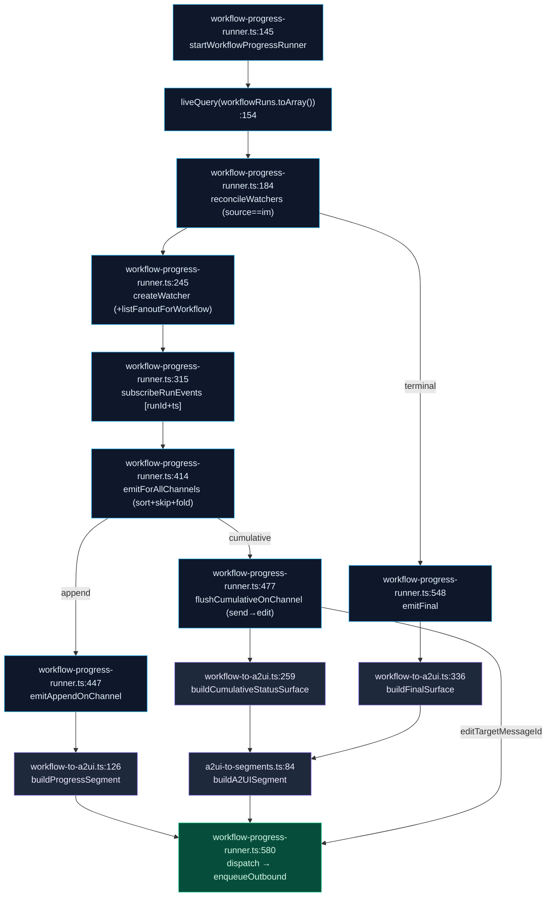

# IM Connector Bridge

<Status variant="experimental" />

<TLDR>
  A2UI emits a declarative React component tree, but an IM platform (Lark / Telegram / Discord) can
  only render its own rich-content primitives — a card, a button row, an image, a link. This bridge
  is the lossy-but-faithful adapter layer between the two worlds. **Outbound**, it builds surfaces
  from plugin-facing factories (`surface-builder.ts`), turns assistant replies into outbound
  `MessageSegment[]` with a `plainTextMirror` fallback (`a2ui-to-segments.ts`), and scores each
  surface against the target adapter's capability matrix (`capability-evaluator.ts`). **Inbound**, it
  folds platform segments back into a single A2UI `Column` surface (`segments-to-a2ui.ts`) and routes
  button taps into an AI digest turn or a workflow-control handler. **Workflow projection** turns a
  live run into an approval card, per-step progress lines, an in-place cumulative status card, and a
  terminal summary — fanned out to every subscribed channel by an event-driven background runner
  (`workflow-progress-runner.ts`), with no polling timer.
</TLDR>

<StatGrid>
  <Stat label="Bridge modules" value="6 + 3" hint="lib/connectors/a2ui-bridge/ (6) + lib/a2ui/ handlers (3)" />
  <Stat label="Capability levels" value="4" hint="native · simulated · fallback · unsupported" />
  <Stat label="Surface factories" value="14" hint="a2uiComponent in surface-builder.ts:218" />
  <Stat label="Runner cadence" value="event-driven" hint="liveQuery fan-out, NO timer" />
</StatGrid>

## Why An IM Bridge Exists

A2UI's whole premise is that a model can emit **real UI**. That works in the webview because the
catalog renders a component tree directly into the React DOM. An IM platform has no such renderer —
Lark wants an interactive card schema, Telegram wants inline keyboards, Discord wants embeds. None of
them can execute an arbitrary `component: "Select"` node.

The bridge is therefore a **lossy, capability-aware projection layer**. It never assumes the surface
will render verbatim. Every path carries a `plainTextMirror` so the worst case is still a readable
text message, and every outbound surface is first scored against the adapter's declared capabilities
so the model can be told — in its own system prompt — what will and won't survive the trip.

<Files>
  - lib/connectors/a2ui-bridge/surface-builder.ts — plugin-facing pure surface builder (backs `ctx.connectors.a2ui`)
  - lib/connectors/a2ui-bridge/capability-evaluator.ts — surface vs adapter capability matrix
  - lib/connectors/a2ui-bridge/a2ui-to-segments.ts — assistant reply → outbound `MessageSegment[]`
  - lib/connectors/a2ui-bridge/segments-to-a2ui.ts — inbound platform segments → one A2UI `Column`
  - lib/connectors/a2ui-bridge/workflow-to-a2ui.ts — PURE workflow → A2UI builders
  - lib/connectors/a2ui-bridge/workflow-progress-runner.ts — background fan-out loop
  - lib/a2ui/connector-callback-handler.ts — generic callback → AI digest turn
  - lib/a2ui/workflow-approval-handler.ts — `wf_approve` / `wf_cancel` dispatcher
  - lib/a2ui/workflow-fanout-handler.ts — `wf_fanout_approve` / `wf_fanout_cancel` dispatcher
</Files>

## Outbound: Surface → Segments

### Building a surface (`surface-builder.ts`)

`createA2UIBuilder` (`surface-builder.ts:315`) is the pure, ungated builder behind
`ctx.connectors.a2ui` — a plugin assembles a flat list of components from 14 factories, and the
builder validates and id-keys them into a canonical `A2UISegmentContent`. The factory set
`a2uiComponent` (`surface-builder.ts:218`) covers `text`, `button`, `card`, `row`, `column`,
`alert`, `image`, `link`, `select`, `textField`, `list`, `divider`, and `badge` — each returning
`{ id, component: "<Kind>", … }`.

| Step | Fn (`surface-builder.ts`) | Behavior |
| --- | --- | --- |
| Validate refs | `validateA2UISurfaceComponents` (116) | empty → throw (120); missing `id` → throw (126); dup `id` → throw (129); resolve root (135); root absent → throw (136); dangling ref → throw (142) |
| Collect refs | `collectChildRefs` (87) | gathers `children` / `footer` / `actions` (90) + nested `tabs` / `items[].children` (97) |
| Id-key | `buildA2UISurfaceContent` (158) | validate (159) → build `Record<id, component>` (162-164) → assemble `{components, dataModel:{}, rootId}` (166) + optional `surfaceType` / `catalogId` / `widget` / `title` (171-174) |
| Wrap as segment | `buildA2UIMessageSegment` (182) | `buildA2UISurfaceContent` → `buildA2UISegment` (`a2ui-to-segments:84`) |
| One-shot request | `buildA2UIOutboundRequest` (195) | wraps into an `OutboundRequest`, appends a trailing `{type:"markdown"}` when `input.text` (199-201), mints a `surfaceId` + `idempotencyKey` via `newIdempotencyKey` (205) |

Root resolution (`surface-builder.ts:135`): explicit `rootId` → `"root"` if a component with that id
is present → `components[0].id`. The `A2USurfaceBuildError` class (`surface-builder.ts:48`) is the
single typed failure for all validation throws.

### Reply → segments + the text mirror (`a2ui-to-segments.ts`)

Once an assistant reply carries A2UI surfaces, `assistantReplyToSegments`
(`a2ui-to-segments.ts:52`) flattens it into ordered outbound segments:

- Order = `a2uiSurfaceOrder ?? Object.keys(surfaces)` (`:55`); each surface → `buildA2UISegment`
  (`:60`).
- A non-empty trailing `text` → `{type:"markdown", md:text}` (`:67`).
- Empty text **and** no surfaces → `{type:"text", text:""}` (`:72`) so the reply is never silent.

`buildA2UISegment` (`a2ui-to-segments.ts:84`) is the load-bearing primitive: it derives the
`plainTextMirror` from `widget.fallbackText` (trimmed, if a string — `:88-89`) and otherwise from
`generatePlainTextMirror(content)` (`:91`, mapper at `a2ui-mapper.ts:257`), then returns
`{type:"a2ui", surfaceId, content, plainTextMirror}` (`:92-97`). That mirror is what a
capability-poor adapter ultimately shows.

## Capability Downgrade Ladder

`capability-evaluator.ts` scores a surface against an adapter so the model knows what it can rely on.
Four levels form a worst-case ladder: **`native` → `simulated` → `fallback` → `unsupported`** (each
strictly worse than the last; `A2UIComponentSupport` at `capability.ts:124`).

`evaluateSurfaceAgainstCapability` (`capability-evaluator.ts:55`):

1. Collect present kinds via `walkA2UISurface(surface, node => presentKinds.add(node.component))`
   (`:60-62`, walker at `a2ui-mapper.ts:50`).
2. Unknown kind → `continue` / skipped (`:71-74`).
3. Known kind → `matrix[kind] ?? "fallback"` (`:76`).
4. Bucket into the `CapabilityEvaluation` (`:28`) and ratchet `worstCase`: `native` (77),
   `simulated` bumps from native (79-81), `fallback` bumps from native/simulated (82-84),
   `unsupported` sets the hard floor (85-87).

`buildCapabilityPromptSection` (`capability-evaluator.ts:106`) then renders a system-prompt paragraph:
it derives per-level kind lists via `componentKindsByLevel` (`:111-114`), emits one bullet per level
(`:119-134`), plus a skill bullet (`:135-142`). This paragraph is consumed by
`lib/claude/build-options.ts:resolveSendOptions` (header `:6-16`) — the per-channel A2UI capability
prompt the model sees before composing.

| Level | Meaning | Model guidance |
| --- | --- | --- |
| `native` | Adapter renders the kind directly | Use freely |
| `simulated` | Approximated with another primitive | Acceptable; expect minor fidelity loss |
| `fallback` | Only the `plainTextMirror` survives | Prefer text-friendly content |
| `unsupported` | Hard floor — drop or rethink | Avoid for this channel |

`A2UICapabilityMatrix` (`capability.ts:126`) is produced by `buildA2UICapabilityMatrix`
(`capability.ts:133`); `isKnownKind` (`capability-evaluator.ts:147`) and `A2UI_COMPONENT_KINDS`
guard against unrecognized component strings.

## Inbound: Segments → Surface + Callbacks

### Folding platform segments into one Column (`segments-to-a2ui.ts`)

`segmentsToA2UI` (`segments-to-a2ui.ts:48`) turns an inbound platform message back into a single A2UI
`Column` surface. Each segment kind maps to one component via the switch at `:67-144`:

| Segment kind | → Component (id prefix) | Notes (`segments-to-a2ui.ts`) |
| --- | --- | --- |
| `text` (68) | `Text` (`text-`) | also pushed to `textParts` |
| `markdown` (75) | `Text` (`text-`) | |
| `image` (82) | `Image` `src/alt/width/height` (`img-`) | |
| `card` (96) | `Card` `title=card.kind` (`card-`) | |
| `video` / `voice` / `file` (112) | `Link` labelled `[file]` / `[voice]` / `[video]` (`link-`) | |
| `location` (127) | `Text` 📍 label (`text-`) | glyph at `:130` |
| `a2ui` (135) | returned **unchanged** | already a surface |
| default (142) | folded into text | `mention` / `emoji` / `code` / `reply` / `poll` |

`nextSurfaceId` (`segments-to-a2ui.ts:27`) mints `inbound:<platform>:<adapterId>:<messageId>:<n>`
(`:29`, off module-level `surfaceCounter` at `:25`). Empty input → `null` (`:54`); no mapped children
→ `null` (`:147`). The root `Column` carries `children: childIds`, id `"root"` (`:149-150`); the
content is `{components, dataModel:{}, rootId, surfaceType:"inline"}` (`:152-157`), and
`plainTextMirror = textParts.join("\n")` (`:163`).

### Button tap → AI digest turn (`connector-callback-handler.ts`)

`defaultConnectorCallbackHandler` (`connector-callback-handler.ts:35`) is the generic callback path —
a user taps a button in a rendered surface, and the bridge converts it into a fresh AI turn:

1. **History.** `appendA2UIEventHistory(event)` (`:40`) writes a row id `cb:<triggerId>`, type
   `"userAction"`, `payload.source "connector"` (`:64-80`), then cap-evicts the oldest rows by
   timestamp (`EVENT_HISTORY_CAP = 1000` at `:28`; eviction at `:83-90` via
   `orderBy("timestamp").limit().primaryKeys()` + `bulkDelete`).
2. **Digest.** `conversationKey = boundConversationKey ?? event.conversationKey`; `null` → return
   (`:43-44`). Otherwise `synthesizeCallbackPrompt` (`:45`) builds
   `[A2UI <platform> callback] surface=… component=… action=… value=… payload=<json>` (`:99-108`),
   and `runConnectorDigestTurn` runs with `sourceTaskId cb:<triggerId>` (`:46-55`, fn in
   `lib/connectors/scheduled-outbound`).

<Callout type="warn">
  **Bus routing split.** `lib/connectors/bus.ts:dispatchConnectorCallback` is the single inbound
  entry point. It does **not** send everything to the generic digest handler — it special-cases
  `wf_approve` / `wf_cancel` → `workflow-approval-handler`, and `wf_fanout_approve` /
  `wf_fanout_cancel` → `workflow-fanout-handler`. Everything else (including ordinary button taps)
  falls through to `defaultConnectorCallbackHandler`'s digest turn.
</Callout>

## Workflow Projection

A live workflow run has to surface inside an IM thread. `workflow-to-a2ui.ts` holds the **pure**
builders; `workflow-progress-runner.ts` is the **background loop** that decides when and where to
emit them.

### Pure builders (`workflow-to-a2ui.ts`)

| Builder (`workflow-to-a2ui.ts`) | Produces |
| --- | --- |
| `buildApprovalSurface` (63) | `Card` + `Row` + 2 `Button`s; mirror adds `回复 1 同意 / 2 取消`. Action ids = `WF_APPROVE_PREFIX` (`"wfapp:"`, 40) + `bindingId` / `WF_CANCEL_PREFIX` (`"wfcan:"`, 41) + `bindingId` (64-65); button value carries the action id (81 / 87) |
| `buildProgressSegment` (126) | one markdown line per step event (`null` for non-step): started ▶…开始 (136); completed ✓…完成 (dur) (137-145); failed ✗…失败：msg (147-153); skipped ⊘…跳过 (155) |
| `buildCumulativeStatusSurface` (259) | one `Card` edited in place: header by `state.status` (261-276), per-step `Text` `step_<i>` (288-293), optional `Divider` + body (298-302), trailing `openLink` `Link` (303) |
| `buildFinalSurface` (336) | terminal summary `Card`: status icon/text (339-347), body = error (failed) / output (succeeded) (350-355), deep link (357) |

Supporting types: `CumulativeStepStatus` (182, `running|succeeded|failed|skipped`),
`CumulativeStepEntry` (184), `CumulativeStatusState` (196); helpers `statusIcon` (220, `▶✓✗⊘`),
`statusLine` (233), `truncate` (392), `pickErrorMessage` (397), `stringifyOutput` (404),
`formatDuration` (414). Deep link `buildWorkflowRunDeepLink` (173) →
`cognia://workflow-run/<wf>/<run>`. Caps: `OUTPUT_SUMMARY_MAX = 500` (37), `ERROR_MESSAGE_MAX = 280`
(38), `CUMULATIVE_TERMINAL_BODY_MAX = 500` (218); every surface is `surfaceType: "inline"`.

<Callout type="info">
  There is **no time-interval constant** anywhere in these builders. The cadence is entirely
  event-driven — one emission per new workflow event batch per channel. The runner never wakes on a
  timer.
</Callout>

### The fan-out runner (`workflow-progress-runner.ts`)

`startWorkflowProgressRunner` (`workflow-progress-runner.ts:145`) subscribes a Dexie
`liveQuery(workflowRuns.toArray())` (`:154`) and reconciles per-run watchers. It only follows runs
whose `triggeredBy.source === "im"` carrying an `adapterId` + `conversationKey`
(`reconcileWatchers:192-195`); watchers are created once via a `creatingWatchers` promise dedup
(`:203-219`), torn down on terminal status via `emitFinal` then `delete` (`:225-233`), and
GC'd when a run vanishes (`:236-242`). `ACTIVE_STATUSES` (63) and `TERMINAL_STATUSES` (64) gate the
lifecycle.

Each watcher (`createWatcher:245`) sets up its channel set and subscribes per-run events via
`subscribeRunEvents` (`:315`) — a `liveQuery` over `workflowRunEvents.where("[runId+ts]")`
(`:316-321`) that feeds `emitForAllChannels` (`:414`). That router sorts by `ts` (`:419`), skips
`ts <= lastEmittedTs` (`:425`), folds each event into state (`foldEventIntoState:337`, `:427`),
advances `lastEmittedTs` (`:431`), then dispatches per channel: cumulative mode →
`flushCumulativeOnChannel` (`:437`), append mode → `emitAppendOnChannel` (`:440`).

**Two emission modes:**

- **Append** (`emitAppendOnChannel:447`) — one segment per event:
  `buildProgressSegment` (`workflow-to-a2ui:126`) → `dispatch` (`:580`). Idempotency
  `progress:…:<ev.id>` (`:467`).
- **Cumulative** (`flushCumulativeOnChannel:477`) — a single card **sent then edited in place**,
  reentrancy-serialized via `channel.flushing` / `flushQueued` (`:482-485, 521-527`). First event =
  entry send, caches `entryJobId` (`:493-503`); subsequent events resolve the `platformMessageId`
  from `outboundQueue.get(entryJobId)` (`:506-509`) and dispatch with `editTargetMessageId`
  (`:511-519`). Builders: `buildStateSnapshot` (395) → `buildCumulativeStatusSurface`
  (`workflow-to-a2ui:259`) → `buildA2UISegment` (`a2ui-to-segments:84`) → `dispatch`. Surface
  templates: `wf-status:<run>:<chan>` (`:490`), entry idempotency `wf-status-entry:…` (`:498`),
  update `wf-status:…:<lastEmittedTs>` (`:515`).

`emitFinal` (`:548`): cumulative → bump `lastEmittedTs` then re-flush (`:559-560`); append →
`buildFinalSurface` → `buildA2UISegment` → `dispatch` (`:562-573`), idempotency `wf-final:…`
(`:563`). `dispatch` (`:580`) builds an `OutboundRequest` and calls `enqueueOutbound`
(`lib/db/outbound-jobs`) with `editTargetMessageId` when set (`:603`), `source: "workflow"` +
`sourceWorkflow {workflowId, runId, nodeId}` (`:605-610`). `defaultSupportsEdit` (136) probes
`getBus().getAdapter(adapterId).edit` to pick the mode; the channel fan-out reads
`listFanoutForWorkflow` (`lib/db/workflow-fanout-subscriptions`) in `createWatcher` (`:291`).

## Workflow-Control Handlers

The two bus-side handlers close the loop when a user taps an approval or subscription button. Both
read their payload, require an IM origin, push a single text acknowledgement, and delete the sibling
bindings (so the buttons can't be tapped twice).

### Approve / Cancel (`workflow-approval-handler.ts`)

`handleWorkflowApprovalCallback` (`workflow-approval-handler.ts:84`):

- Malformed / missing key → delete siblings + abort (`:88-99`); `readPayload` (`:40`) requires
  `triggeredFrom.source === "im"` (`:43`).
- **Cancel** (`:110`) → push `⊘…已取消`, idempotency `wfcan:<surfaceId>` (`:116`) + delete siblings.
- **Approve** (`:122`) → `startWorkflowFromIM({workflowId, runParams, triggeredFrom})`
  (`lib/workflow/runtime/start-from-im`). `!ok` → push `✗ 无法启动`, idempotency `wferr:`
  (`:129-139`); `ok` → push `✅ … 已启动 (runId=…)`, idempotency `wfok:` (`:142-148`) + delete.

`deleteSiblingBindings` (`:53`) drops both Approve and Cancel by their shared `surfaceId`;
`pushOutboundText` (`:65`) enqueues a single `{type:"text"}` outbound with `source "workflow"`.

### Fan-out subscribe / cancel (`workflow-fanout-handler.ts`)

`handleWorkflowFanoutCallback` (`workflow-fanout-handler.ts:91`):

- Malformed / missing → delete + abort (`:94-104`); `readPayload` (`:38`) validates the `target`
  shape (`:42-48`), `createdBy` defaults to `"claude-tool"` (`:54`).
- **Cancel** (`:115`) → push `⊘ 已取消订阅`, idempotency `wf-fanout-cancel:` (`:121`) + delete.
- **Approve** (`:127`) → `createFanoutSubscription({workflowId, adapterId: target.adapterId,
  conversationKey: target.conversationKey, createdBy})` + push `✅ 已订阅`, idempotency
  `wf-fanout-ok:` (`:133-139`) + delete.

`createFanoutSubscription` writes the **same** `workflow-fanout-subscriptions` table that
`workflow-progress-runner.createWatcher` reads — subscribing here is what makes a future run fan out
to this channel. Permission is enforced **upstream** at the tool layer: the target is pinned to the
current IM session, so the handler never accepts a cross-channel target.

## Next

<Cards>
  <Card title="A2UI System" href="./index" description="The protocol, parser, catalog, renderer, and store this bridge projects from" />
  <Card title="Platform connectors" href="../platform-connectors" description="The adapters, bus, and outbound queue the bridge plugs into" />
  <Card title="Visual workflows" href="../visual-workflows" description="The workflow runtime and run-events stream the progress runner projects" />
</Cards>
