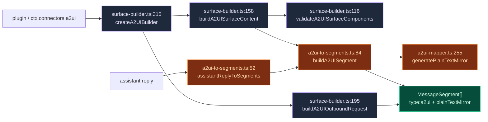
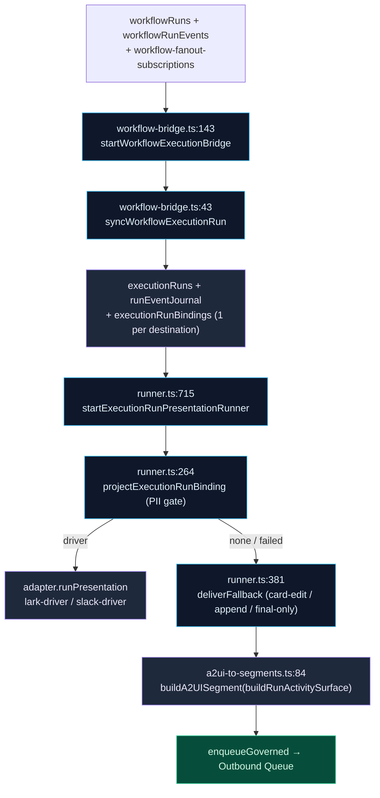

# IM Connector Bridge

<Status variant="experimental" />

<TLDR>
  A2UI emits a declarative React component tree, but an IM platform (Lark / Telegram / Discord) can
  only render its own rich-content primitives — a card, a button row, an image, a link. This bridge
  is the lossy-but-faithful adapter layer between the two worlds. **Outbound**, it builds surfaces
  from plugin-facing factories (`surface-builder.ts`), turns assistant replies into outbound
  `MessageSegment[]` with a `plainTextMirror` fallback (`a2ui-to-segments.ts`), and tells the model —
  in its system prompt — which A2UI kinds the target adapter's capability matrix will carry
  (`capability-evaluator.ts`). **Inbound**, it projects platform-rich content into an
  `InboundA2UIBlock` for the Inbox renderer (`projectInboundToA2UI` → per-platform
  `inbound-to-a2ui.ts`) and routes button taps into an AI digest turn or a workflow-control handler.
  **Workflow projection** in this bridge is the approval card only (`workflow-to-a2ui.ts`); live
  progress and terminal cards come from the durable execution-run pipeline —
  `lib/execution/workflow-bridge.ts` + `lib/connectors/run-presentation/runner.ts` — not from a
  bridge-local loop.
</TLDR>

<StatGrid>
  <Stat label="Bridge modules" value="4 + 3" hint="lib/connectors/a2ui-bridge/ (4) + lib/a2ui/ handlers (3)" />
  <Stat label="Capability levels" value="4" hint="native · simulated · fallback · unsupported" />
  <Stat label="Surface factories" value="14" hint="a2uiComponent in surface-builder.ts:218" />
  <Stat label="Live run cards" value="run-presentation" hint="lib/connectors/run-presentation/runner.ts, coalesced 2 s" />
</StatGrid>

## Why An IM Bridge Exists

A2UI's whole premise is that a model can emit **real UI**. That works in the webview because the
catalog renders a component tree directly into the React DOM. An IM platform has no such renderer —
Lark wants an interactive card schema, Telegram wants inline keyboards, Discord wants embeds. None of
them can execute an arbitrary `component: "Select"` node.

The bridge is therefore a **lossy, capability-aware projection layer**. It never assumes the surface
will render verbatim. Every path carries a `plainTextMirror` so the worst case is still a readable
text message, and the adapter's declared capability matrix is rendered into the model's own system
prompt so it is told up front what will and won't survive the trip.

<Files>
  - lib/connectors/a2ui-bridge/surface-builder.ts — plugin-facing pure surface builder (backs `ctx.connectors.a2ui`)
  - lib/connectors/a2ui-bridge/capability-evaluator.ts — adapter capability matrix → system-prompt section
  - lib/connectors/a2ui-bridge/a2ui-to-segments.ts — assistant reply → outbound `MessageSegment[]`
  - lib/connectors/adapters/_shared/inbound-a2ui-dispatch.ts — `projectInboundToA2UI`: inbound platform payload → `InboundA2UIBlock`
  - lib/connectors/a2ui-bridge/workflow-to-a2ui.ts — PURE approval-surface builder (`buildApprovalSurface`)
  - lib/connectors/run-presentation/runner.ts — live run cards (not part of the bridge; documented in Platform Connectors)
  - lib/a2ui/connector-callback-handler.ts — generic callback → AI digest turn
  - lib/a2ui/workflow-approval-handler.ts — `wf_approve` / `wf_cancel` dispatcher
  - lib/a2ui/workflow-fanout-handler.ts — `wf_fanout_approve` / `wf_fanout_cancel` dispatcher
</Files>

## Outbound: Surface → Segments

### Building a surface (`surface-builder.ts`)

`createA2UIBuilder` (`surface-builder.ts:315`) is the pure, ungated builder behind
`ctx.connectors.a2ui` — a plugin assembles a flat list of components from 14 factories, and the
builder validates and id-keys them into a canonical `A2UISegmentContent`. The factory set
`a2uiComponent` (`surface-builder.ts:218`) covers `text`, `button`, `card`, `row`, `column`,
`alert`, `image`, `link`, `select`, `textField`, `list`, `divider`, and `badge` — each returning
`{ id, component: "<Kind>", … }`.

| Step | Fn (`surface-builder.ts`) | Behavior |
| --- | --- | --- |
| Validate refs | `validateA2UISurfaceComponents` (116) | empty → throw (120); missing `id` → throw (126); dup `id` → throw (129); resolve root (135); root absent → throw (136); dangling ref → throw (142) |
| Collect refs | `collectChildRefs` (87) | gathers `children` / `footer` / `actions` (90) + nested `tabs` / `items[].children` (97) |
| Id-key | `buildA2UISurfaceContent` (158) | validate (159) → build `Record<id, component>` (162-164) → assemble `{components, dataModel:{}, rootId}` (166) + optional `surfaceType` / `catalogId` / `widget` / `title` (171-174) |
| Wrap as segment | `buildA2UIMessageSegment` (182) | `buildA2UISurfaceContent` → `buildA2UISegment` (`a2ui-to-segments:84`) |
| One-shot request | `buildA2UIOutboundRequest` (195) | wraps into an `OutboundRequest`, appends a trailing `{type:"markdown"}` when `input.text` (199-201), mints a `surfaceId` + `idempotencyKey` via `newIdempotencyKey` (205) |

Root resolution (`surface-builder.ts:135`): explicit `rootId` → `"root"` if a component with that id
is present → `components[0].id`. The `A2USurfaceBuildError` class (`surface-builder.ts:48`) is the
single typed failure for all validation throws.

### Reply → segments + the text mirror (`a2ui-to-segments.ts`)

Once an assistant reply carries A2UI surfaces, `assistantReplyToSegments`
(`a2ui-to-segments.ts:52`) flattens it into ordered outbound segments:

- Order = `a2uiSurfaceOrder ?? Object.keys(surfaces)` (`:55`); each surface → `buildA2UISegment`
  (`:60`).
- A non-empty trailing `text` → `{type:"markdown", md:text}` (`:67`).
- Empty text **and** no surfaces → `{type:"text", text:""}` (`:72`) so the reply is never silent.

`buildA2UISegment` (`a2ui-to-segments.ts:84`) is the load-bearing primitive: it derives the
`plainTextMirror` from `widget.fallbackText` (trimmed, if a string — `:88-89`) and otherwise from
`generatePlainTextMirror(content)` (`:91`, mapper at `a2ui-mapper.ts:255`), then returns
`{type:"a2ui", surfaceId, content, plainTextMirror}` (`:92-97`). That mirror is what a
capability-poor adapter ultimately shows.

## Capability Downgrade Ladder

`capability-evaluator.ts` tells the model what it can rely on for a given adapter. Four levels form a
worst-case ladder: **`native` → `simulated` → `fallback` → `unsupported`** (each strictly worse than
the last; `A2UIComponentSupport` at `capability.ts:150`).

There is deliberately **no** per-surface evaluator left in this module — adapters branch on their own
`A2UICapabilityMatrix` inside their outbound mappers at render time, and the `plainTextMirror`
guarantees a floor for whatever a mapper cannot draw. (The former `evaluateSurfaceAgainstCapability`
/ `CapabilityEvaluation` walker had no runtime consumer and was removed on 2026-08-18.) What remains
is the prompt-side half, `buildCapabilityPromptSection(platform, matrix, skillCapabilities?)`
(`capability-evaluator.ts:30`):

1. Derive per-level kind lists via `componentKindsByLevel(matrix, level)` (`:35-38`, helper at
   `capability.ts:177`) — one pass over `A2UI_COMPONENT_KINDS`, so unknown kinds never appear.
2. Emit one bullet per non-empty level (`:43-58`): renders natively / available via multi-step UX (do
   not assume a same-turn reply) / degrades to plain text / NOT supported — do not emit.
3. Append an optional built-in-skills bullet from `skillCapabilities` (`:59-67`).

This paragraph is consumed by `lib/claude/build-options.ts:resolveSendOptions` (`:1929-1935`) — the
per-channel A2UI capability prompt the model sees before composing.

| Level | Meaning | Model guidance |
| --- | --- | --- |
| `native` | Adapter renders the kind directly | Use freely |
| `simulated` | Approximated with another primitive | Acceptable; expect minor fidelity loss |
| `fallback` | Only the `plainTextMirror` survives | Prefer text-friendly content |
| `unsupported` | Hard floor — drop or rethink | Avoid for this channel |

`A2UICapabilityMatrix` (`capability.ts:152`) is produced by `buildA2UICapabilityMatrix`
(`capability.ts:159`) from each adapter's `../<platform>/capability.ts`; `A2UI_COMPONENT_KINDS` is the
closed set of component strings both sides iterate.

## Inbound: Platform Payload → InboundA2UIBlock + Callbacks

### Projecting a platform payload into an `InboundA2UIBlock` (`inbound-a2ui-dispatch.ts`)

> A previous version of this doc described a `segmentsToA2UI` (`segments-to-a2ui.ts`) module that
> folded inbound segments into a single A2UI `Column` surface. That module was **removed as dead
> code** — it had zero callers. The real inbound projection does **not** reuse the outbound A2UI
> surface shape; it produces a focused `InboundA2UIBlock` tree for the Inbox renderer.

`projectInboundToA2UI` (`inbound-a2ui-dispatch.ts:26`) is the bus-side dispatcher. The bus calls it
once per inbound `create` event with the platform kind and the raw platform payload; it switches to
the matching per-platform mapper (`../<platform>/inbound-to-a2ui.ts`, one for each of `slack`,
`lark`, `discord`, `telegram`, `onebot`, `wecom`, `wechat-personal`, `wechat-oa`, `matrix`,
`qq-official`, `dingtalk`) and returns an `InboundA2UIBlock` (`inbound-a2ui-types.ts:50`) or `null`.
Mappers are **best-effort**: a nullish payload, an unmapped platform, or a mapper that throws all
resolve to `null` (`:40`, `:66`, `:68-76`), and the bus falls through to plaintext rendering.

The resulting `InboundA2UIBlock` is persisted onto `StoredMessage.metadata.inboundA2UI` and walked by
`components/chat/message-parts/inbound-a2ui-renderer.tsx` so the Inbox shows the platform's native
rich structure. The block is a deliberately narrow subset of the full `A2UISurface` — a `source`
chip, an optional `title`, and a `body` array of `InboundA2UINode`:

| Node kind (`inbound-a2ui-types.ts`) | Renders as |
| --- | --- |
| `text` (emphasis `muted`/`bold`/`italic`/`code`) | inline text |
| `heading` (level 1–3) | heading |
| `image` (`url/alt/width/height`) | image |
| `link` (`href/label`) | hyperlink |
| `button` (`url` or `actionId`, `style`) | action button |
| `divider` | rule |
| `row` / `column` / `list` (`ordered?`) | layout containers |
| `card` (`title/subtitle/children`) | card |
| `alert` (tone `info`/`warning`/`success`/`error`) | callout |
| `mention` / `reply_context` / `raw_json` | mention · reply preview · raw escape hatch |

Anything the mapper can't express in `body` is stashed on `raw` and surfaced behind a `
` for
debugging. Note this inbound path is **not** the inverse of the outbound `assistantReplyToSegments`
(`a2ui-to-segments.ts`) — outbound flattens an assistant surface into transferable
`MessageSegment[]`, while inbound lifts a raw platform payload into a compact `InboundA2UIBlock`; the
two are independent projections, not a matched pair.

### Button tap → AI digest turn (`connector-callback-handler.ts`)

`defaultConnectorCallbackHandler` (`connector-callback-handler.ts:35`) is the generic callback path —
a user taps a button in a rendered surface, and the bridge converts it into a fresh AI turn:

1. **History.** `appendA2UIEventHistory(event)` (`:40`) writes a row id `cb:<triggerId>`, type
   `"userAction"`, `payload.source "connector"` (`:64-80`), then cap-evicts the oldest rows by
   timestamp (`EVENT_HISTORY_CAP = 1000` at `:28`; eviction at `:83-90` via
   `orderBy("timestamp").limit().primaryKeys()` + `bulkDelete`).
2. **Digest.** `conversationKey = boundConversationKey ?? event.conversationKey`; `null` → return
   (`:43-44`). Otherwise `synthesizeCallbackPrompt` (`:45`) builds
   `[A2UI <platform> callback] surface=… component=… action=… value=… payload=<json>` (`:99-108`),
   and `runConnectorDigestTurn` runs with `sourceTaskId cb:<triggerId>` (`:46-55`, fn in
   `lib/connectors/scheduled-outbound`).

<Callout type="warn">
  **Bus routing split.** `lib/connectors/bus.ts:dispatchConnectorCallback` is the single inbound
  entry point. It does **not** send everything to the generic digest handler — it special-cases
  `wf_approve` / `wf_cancel` → `workflow-approval-handler`, and `wf_fanout_approve` /
  `wf_fanout_cancel` → `workflow-fanout-handler`. Everything else (including ordinary button taps)
  falls through to `defaultConnectorCallbackHandler`'s digest turn.
</Callout>

## Workflow Projection

A live workflow run has to surface inside an IM thread. This bridge owns only the **approval
handshake**: `workflow-to-a2ui.ts` holds the pure `buildApprovalSurface` builder. Live progress and
terminal cards are **not** built here any more — they come from the durable execution-run pipeline
described below.

### Pure builder (`workflow-to-a2ui.ts`)

| Builder (`workflow-to-a2ui.ts`) | Produces |
| --- | --- |
| `buildApprovalSurface` (48) | `Card` + `Row` + 2 `Button`s; mirror adds `回复 1 同意 / 2 取消`. Action ids = `WF_APPROVE_PREFIX` (`"wfapp:"`, 25) + `bindingId` / `WF_CANCEL_PREFIX` (`"wfcan:"`, 26) + `bindingId` (49-50); button value carries the action id; `surfaceType: "inline"` |

The input is `ApprovalSurfaceInput { bindingId, workflowName, summary? }` (28); the surface is emitted
by the `wf_run_workflow_by_name` plugin tool as part of its tool result, and the caller owns Dexie I/O +
`recordCallbackBinding`. The former `buildProgressSegment` / `buildCumulativeStatusSurface` /
`buildFinalSurface` builders and the `buildWorkflowRunDeepLink` deep link were retired with the
`workflow-progress-runner` module on 2026-08-18.

<Callout type="info">
  There is still **no time-interval constant** in this builder — it is a pure function. Cadence for
  the live cards is owned by the run-presentation runner (`COALESCE_MS = 2 s`, immediate on
  `run.started` / `step.started` / terminal / interrupt events, 5 s elapsed-time heartbeat).
</Callout>

### Live cards: the execution bridge + run-presentation runner

Two runners started by the connector bootstrap (`install-connector-runtime.ts:738-739`) replace the
old bridge-local fan-out loop:

- `startWorkflowExecutionBridge` (`lib/execution/workflow-bridge.ts:143`) `liveQuery`-watches
  `workflowRuns` (+ `workflowRunEvents` + `listForWorkflow` fan-out subscriptions) and, per run,
  `syncWorkflowExecutionRun` (`:43`) creates one durable `executionRuns` row
  (`execution:workflow:<runId>`), journals `plan.created` / `run.started` / mapped step events, and
  writes one `executionRunBindings` row per destination — the triggering `triggeredBy.{adapterId,
  conversationKey}` **plus every enabled fan-out subscription** (`:84-129`).
- `startExecutionRunPresentationRunner` (`lib/connectors/run-presentation/runner.ts:715`)
  `liveQuery`-watches `active` / `degraded` bindings and calls `projectExecutionRunBinding` (`:264`)
  when `latestSnapshot.revision > lastProjectedRevision`: PII gate (`projectImSafeSnapshot`, `:179`)
  → native `adapter.runPresentation` driver (`lark-driver.ts:320` / `slack-driver.ts:51`)
  `open` / `update` / `finish` on one card → on failure or no driver, `deliverFallback` (`:381`) with
  `resolveCapabilityAwareFallbackDeliveryMode` (`:223`) choosing `card-edit` / `append` /
  `final-only`, `buildA2UISegment`-wrapping `buildRunActivitySurface` and enqueueing through the
  delivery gateway with `source: "workflow"`.

The full mechanism — coalescing, cursor commits, degraded audits, the native kill switch — is
documented in [Platform Connectors › AI loop & A2UI bridge](../platform-connectors/ai-and-a2ui).

## Workflow-Control Handlers

The two bus-side handlers close the loop when a user taps an approval or subscription button. Both
read their payload, require an IM origin, push a single text acknowledgement, and delete the sibling
bindings (so the buttons can't be tapped twice).

### Approve / Cancel (`workflow-approval-handler.ts`)

`handleWorkflowApprovalCallback` (`workflow-approval-handler.ts:84`):

- Malformed / missing key → delete siblings + abort (`:88-99`); `readPayload` (`:40`) requires
  `triggeredFrom.source === "im"` (`:43`).
- **Cancel** (`:110`) → push `⊘…已取消`, idempotency `wfcan:<surfaceId>` (`:116`) + delete siblings.
- **Approve** (`:122`) → `startWorkflowFromIM({workflowId, runParams, triggeredFrom})`
  (`lib/workflow/runtime/start-from-im`). `!ok` → push `✗ 无法启动`, idempotency `wferr:`
  (`:129-139`); `ok` → push `✅ … 已启动 (runId=…)`, idempotency `wfok:` (`:142-148`) + delete.

`deleteSiblingBindings` (`:53`) drops both Approve and Cancel by their shared `surfaceId`;
`pushOutboundText` (`:65`) enqueues a single `{type:"text"}` outbound with `source "workflow"`.

### Fan-out subscribe / cancel (`workflow-fanout-handler.ts`)

`handleWorkflowFanoutCallback` (`workflow-fanout-handler.ts:91`):

- Malformed / missing → delete + abort (`:94-104`); `readPayload` (`:38`) validates the `target`
  shape (`:42-48`), `createdBy` defaults to `"claude-tool"` (`:54`).
- **Cancel** (`:115`) → push `⊘ 已取消订阅`, idempotency `wf-fanout-cancel:` (`:121`) + delete.
- **Approve** (`:127`) → `createFanoutSubscription({workflowId, adapterId: target.adapterId,
  conversationKey: target.conversationKey, createdBy})` + push `✅ 已订阅`, idempotency
  `wf-fanout-ok:` (`:133-139`) + delete.

`createFanoutSubscription` writes the **same** `workflow-fanout-subscriptions` table that the
execution bridge reads via `listForWorkflow` (`lib/execution/workflow-bridge.ts:152`) — every enabled
subscription becomes an extra `executionRunBindings` row for the run, which is what makes a future
run's card fan out to this channel. Permission is enforced **upstream** at the tool layer: the target is pinned to the
current IM session, so the handler never accepts a cross-channel target.

## Next

<Cards>
  <Card title="A2UI System" href="./index" description="The protocol, parser, catalog, renderer, and store this bridge projects from" />
  <Card title="Platform connectors" href="../platform-connectors" description="The adapters, bus, and outbound queue the bridge plugs into" />
  <Card title="Visual workflows" href="../visual-workflows" description="The workflow runtime and run-events stream the execution bridge mirrors into durable execution runs" />
</Cards>
