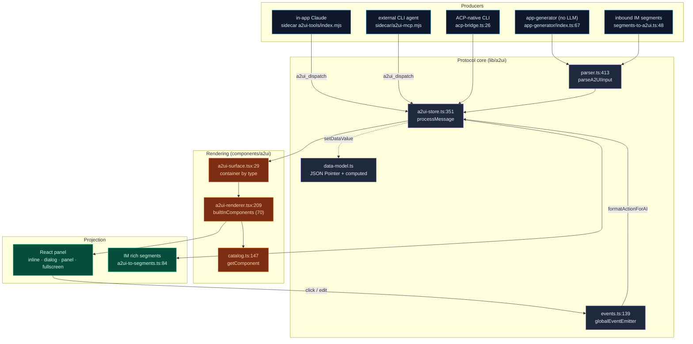
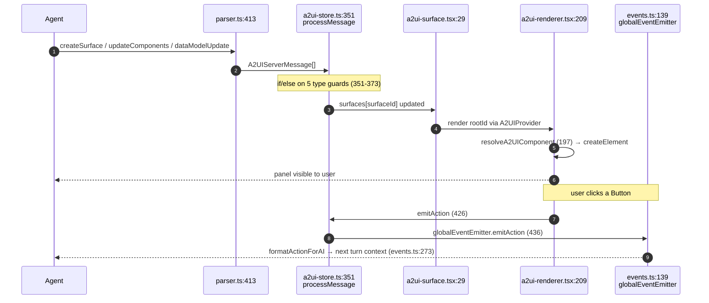

# A2UI System

<Status variant="experimental" />

<TLDR>
  A2UI (Agent-to-UI) lets a model output **real interactive UI** — a form, a chart, a dashboard —
  instead of markdown. The agent calls MCP tools that emit a declarative component tree; the
  browser renderer turns it into a live React panel; user clicks flow back to the agent as
  `userAction` events. The protocol is shared across three runtimes — the in-app Claude session,
  external CLI agents (Cursor / Codex / Gemini / Claude Code), and IM connectors (Lark / Telegram /
  Discord …) — through one schema (`types/a2ui/schema.ts`, v0.9) and one Zustand store
  (`stores/a2ui/a2ui-store.ts:processMessage`).
</TLDR>

<StatGrid>
  <Stat label="Server messages" value="5" hint="createSurface · updateComponents · dataModelUpdate · deleteSurface · surfaceReady" />
  <Stat label="MCP tools" value="5 / 4" hint="schema declares 5 · sidecar implements 4" />
  <Stat label="Component types" value="70" hint="builtInComponents dispatch map · 61 in standard catalog" />
  <Stat label="Output profiles" value="22" hint="lib/a2ui/output-profiles.ts" />
  <Stat label="Built-in templates" value="13" hint="lib/a2ui/templates/" />
  <Stat label="Schema version" value="v0.9" hint="types/a2ui/schema.ts:3" />
</StatGrid>

## What It Solves

Models can do more than emit markdown — they can emit **UI**. A2UI standardizes that loop:

1. Agent calls `a2ui_create_surface` → a panel appears in the webview.
2. Agent calls `a2ui_update_components` → the component tree is (re)built; the renderer diffs the DOM.
3. User clicks a button or edits a field → the renderer emits a `userAction` / `dataModelChange` to the event bus.
4. The chat loop folds those events into the next turn → the agent continues orchestrating.

Everything below is one declarative contract (`types/a2ui/schema.ts`) realized by one parser, one
catalog, one renderer, and one store — then projected onto whichever runtime the agent lives in.

## Module Map

Read the per-module page for line-accurate internals. Each box below is a documentation page.

<Cards>
  <Card title="Protocol core" href="./protocol-core" description="Schema v0.9, parser, JSON-Pointer data model + computed fields, the in-process event bus" />
  <Card title="Catalog & rendering" href="./catalog-rendering" description="Type→React registry (70 types), surface containers, context/binding, error isolation, component families" />
  <Card title="MCP tools & bridge" href="./mcp-bridge" description="The tool schemas and the 3 cross-process dispatch paths (socket, in-process SDK, ACP stdout)" />
  <Card title="Output profiles & rich output" href="./output-profiles" description="22 intent→strategy routes, the rich-output renderer, thumbnails, academic surfaces" />
  <Card title="App generator & templates" href="./app-generator" description="Natural-language → component tree with no LLM, 13 built-in templates, the A2UI Hub page" />
  <Card title="IM connector bridge" href="./im-bridge" description="A2UI ⇄ platform-segment mapping, capability downgrade, workflow progress projection" />
  <Card title="State & persistence" href="./state-persistence" description="The Zustand store (message entry point), undo/redo, localStorage LRU, the 4 Dexie tables" />
</Cards>

## Architecture at a Glance

## The Canonical Round-Trip

This is the loop every runtime shares — `processMessage` is the single ingest point and
`globalEventEmitter` is the single egress point.

## Five Server Messages

The contract is five message types (`types/a2ui/schema.ts`), not four. Each maps 1:1 to a store
action through a parser type guard.

| Message `type` | Guard (`parser.ts`) | Store action (`a2ui-store.ts`) | Effect |
| --- | --- | --- | --- |
| `createSurface` | `isCreateSurfaceMessage` (43) | `createSurface` (219) | Allocate a surface (inline / dialog / panel / fullscreen) |
| `updateComponents` | `isUpdateComponentsMessage` (47) | `updateComponents` (266) | Replace the component tree (pushes an undo snapshot) |
| `dataModelUpdate` | `isUpdateDataModelMessage` (53) | `updateDataModel` (298) | Merge (default) or replace the data model |
| `deleteSurface` | `isDeleteSurfaceMessage` (59) | `deleteSurface` (241) | Tear down the surface |
| `surfaceReady` | `isSurfaceReadyMessage` (63) | `setSurfaceReady` (453) | Flip `ready` so the renderer reveals the panel |

A "simplified" shorthand `{ surface, components, dataModel }` is auto-expanded into this 4-message
sequence by `parseSimplifiedA2UI` (`parser.ts:301`).

## Three Ways In, One Store

A2UI has three independent dispatch paths, and they all terminate at
`useA2UIStore.getState().processMessage`:

| Path | Producer | Transport | Lands at |
| --- | --- | --- | --- |
| **Standalone MCP** | external CLI agent | local socket / named pipe → Rust `a2ui_bridge` → `a2ui://dispatch` | `ipc.ts:38` |
| **In-process SDK** | in-app Claude session | sidecar stdout `emit({type:"a2ui_dispatch"})` → Tauri emit | `ipc.ts:38` |
| **ACP stdout sniff** | ACP-native CLI | stdout line scan | `acp-bridge.ts:46` |

The full plumbing, env vars (`COGNIA_BRIDGE_SOCKET`), and socket paths are on the
[MCP tools & bridge](./mcp-bridge) page.

## What Changed Since the Old Doc

This subsystem grew well past the original single-page description. Concrete corrections:

| Claim in the old doc | Reality | Source |
| --- | --- | --- |
| "4 MCP tools" | Schema declares **5** (`a2ui_handle_connector_action` added); sidecar implements 4 | `mcp-tool-schemas.ts:53` |
| "50+ components" | **70** registered in the dispatch map; 61 in the standard catalog | `a2ui-renderer.tsx:112`, `catalog.ts:32` |
| "21 output intents" | **22** profiles | `output-profiles.ts:91` |
| "14 built-in templates" | **13** | `templates/index.ts:48` |
| "Dexie v13" | a2ui tables were introduced in v13; the schema is now at **v65** | `lib/db/schema.ts:573`, `:1692` |
| (unmentioned) | A whole **IM connector bridge** + workflow progress projection now exists | `lib/connectors/a2ui-bridge/` |

## Security Model

A2UI components render **directly into the main React tree** (unlike Artifacts, which use iframe
isolation). The safety boundary is therefore the catalog:

- Only **pre-registered** component types render. Unknown `component` strings fall to `A2UIFallback`
  (`a2ui-renderer.tsx:197`) — never interpreted as code.
- `Text` renders as plain text, never `dangerouslySetInnerHTML`.
- Agent-supplied action strings are routed through the event bus; they are **never executed**.
- When `widget.hostStrategy` is `sandboxed-html` / `artifact-preview`, content is diverted to an
  iframe-isolated artifact panel instead of inline rendering ([output profiles](./output-profiles)).

When extending the catalog, audit every new component for XSS surface (rich text, `iframe`, SVG
`foreignObject`, `data:` URLs all need whitelist filtering).

## Next

<Cards>
  <Card title="Sidecar MCP server" href="../mcp-server-sidecar" description="Tool table and protocol for a2ui-mcp.mjs" />
  <Card title="External bridge" href="../external-bridge" description="Exposing tools to external agents" />
  <Card title="Artifacts / sandbox" href="../artifacts-sandbox" description="The other UI path: iframe-isolated one-shot content" />
  <Card title="Platform connectors" href="../platform-connectors" description="Where the IM bridge plugs in" />
</Cards>
