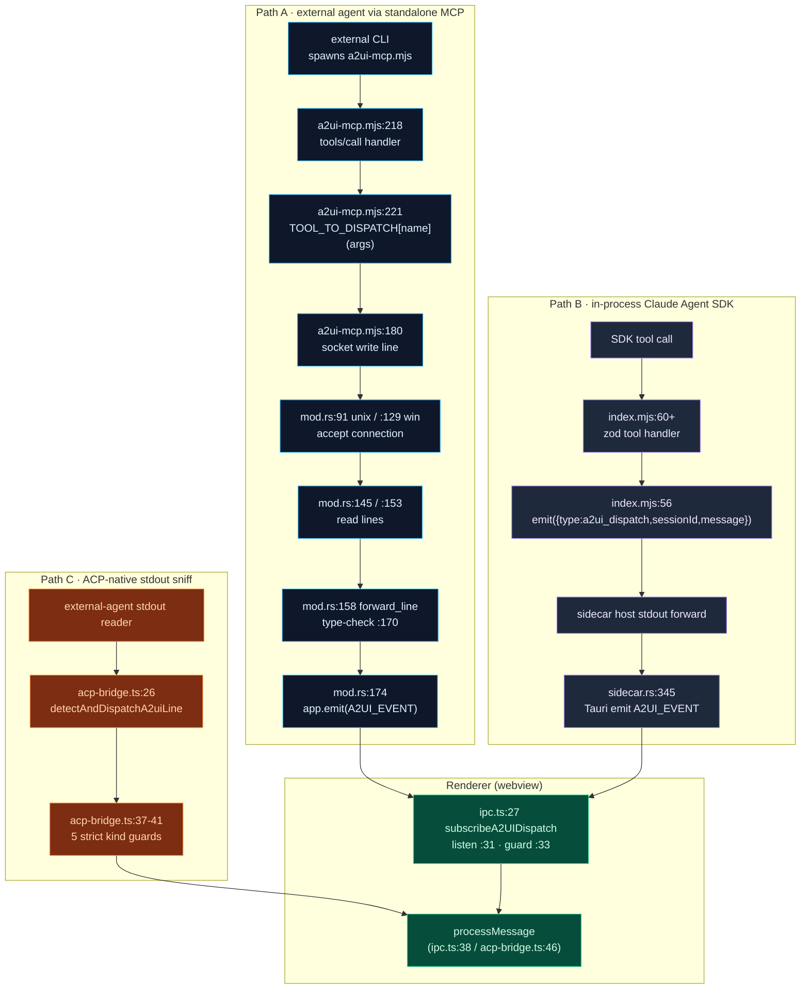
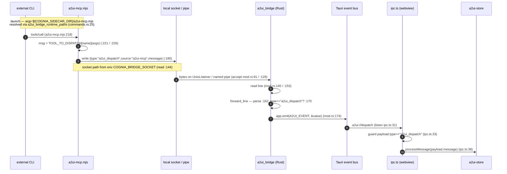

# MCP Tools & Bridge

<Status variant="experimental" />

<TLDR>
  A2UI is produced by **agents that live in other processes** — external CLIs, the bundled Claude
  Agent SDK session, ACP-native tools — yet it must render in **one** webview React tree. This page
  documents the bridge that makes that work: the MCP **tool schemas** (`lib/a2ui/mcp-tool-schemas.ts`),
  the standalone stdio MCP server (`sidecar/a2ui-mcp.mjs`), the in-process SDK server
  (`sidecar/a2ui-tools/index.mjs`), and the Rust local-IPC listener (`src-tauri/src/a2ui_bridge/`).
  Three independent dispatch paths converge on `useA2UIStore.getState().processMessage`. The wire
  envelope is always `{ type: "a2ui_dispatch", message }`; the Tauri channel is always
  `a2ui://dispatch`; tools are always namespaced `mcp__a2ui-bridge__*`.
</TLDR>

<StatGrid>
  <Stat label="Tools (schema)" value="5" hint="mcp-tool-schemas.ts:53 — adds a2ui_handle_connector_action" />
  <Stat label="Tools (sidecar)" value="4" hint="a2ui-mcp.mjs:56 · a2ui-tools/index.mjs — the 5th is unimplemented" />
  <Stat label="Dispatch paths" value="3" hint="socket/pipe · in-process SDK · ACP stdout sniff" />
  <Stat label="Bridge version" value="0.9.0" hint="mcp-tool-schemas.ts:15 · MCP protocolVersion 2024-11-05" />
</StatGrid>

## What It Solves

A2UI's renderer, parser, and store all live in the **webview**. But the *producer* of A2UI
messages is almost never the webview — it is a model running inside a sidecar Node process, an
external CLI in its own OS process, or an ACP tool streaming JSON on stdout. The bridge's job is to
get a declarative component-tree message from any of those producers to exactly one ingest point,
`useA2UIStore.getState().processMessage`, without the producer needing to know which transport it
is on.

It does this with **one envelope shape** and **one Tauri channel**:

| Constant | Value | Defined / used at |
| --- | --- | --- |
| Dispatch envelope `type` | `"a2ui_dispatch"` | `ipc.ts:17` / `:33`, `a2ui-mcp.mjs:180`, `index.mjs:56`, `mod.rs:170` |
| Tauri event channel | `"a2ui://dispatch"` | `ipc.ts:14`, `sidecar.rs:23` |
| Tool namespace prefix | `mcp__a2ui-bridge__` | `mcp-tool-schemas.ts:229`, `index.mjs:190` |
| Server name | `a2ui-bridge` | `mcp-tool-schemas.ts:14`, `a2ui-mcp.mjs:30`, `index.mjs:15` |
| Server id | `builtin:a2ui-bridge` | `mcp-tool-schemas.ts:13` |
| Bridge / schema version | `0.9.0` ("A2UI v0.9") | `mcp-tool-schemas.ts:15`, `a2ui-mcp.mjs:29`, `index.mjs:16` |
| MCP `protocolVersion` | `2024-11-05` | `a2ui-mcp.mjs:206` |
| Socket source tag | `a2ui-mcp` | `a2ui-mcp.mjs:180` |

## The Tool Schema Set

`lib/a2ui/mcp-tool-schemas.ts` is the **canonical JSON-Schema declaration** of the bridge tools
(`A2UI_BRIDGE_TOOLS`, a readonly array at `:53`). It declares **five** tools. Each tool name is
projected into the MCP namespace by `namespacedA2UIToolNames` (`:228`), which maps every tool to
`` mcp__${A2UI_BRIDGE_SERVER_NAME}__${t.name} `` at `:229`.

| Tool | Required inputs | Optional inputs | Defined at |
| --- | --- | --- | --- |
| `a2ui_create_surface` | `surfaceId`, `surfaceType` (enum `inline` / `dialog` / `panel` / `fullscreen`) | `catalogId`, `title`, `widget` | `:55` |
| `a2ui_update_components` | `surfaceId`, `components` (array, min 1) | — | `:75` |
| `a2ui_data_model_update` | `surfaceId`, `data` | `merge` (bool, default `true`) | `:93` |
| `a2ui_delete_surface` | `surfaceId` | — | `:111` |
| `a2ui_handle_connector_action` | `surfaceId`, `actionType` (enum `button` / `select` / `checkbox` / `input` / `submit` / `dismiss` / `platform_specific`) | `componentId`, `value`, `payload`, `platform` (`telegram` / `discord` / `slack` / `lark` / `onebot`), `triggerId`, `conversationKey` | `:121` |

The shared sub-schemas — `componentSchema` (`:27`) and `widgetSchema` (`:37`, with
`hostStrategy` / `sizing` / `theme` / `showChrome` / `fallbackText` / `minHeight`) — are referenced
by `a2ui_create_surface` and `a2ui_update_components`.

<Callout type="warn">
  **4-vs-5 drift.** The TS schema (`mcp-tool-schemas.ts`) declares **5** tools — it adds
  `a2ui_handle_connector_action` (`:121`) for injecting IM-channel actions back into a surface. But
  **both** sidecar runtimes — `sidecar/a2ui-mcp.mjs` (`TOOLS` at `:56`) and
  `sidecar/a2ui-tools/index.mjs` (zod tools `:60`–`:171`) — implement only the original **4**
  (`create_surface`, `update_components`, `data_model_update`, `delete_surface`). The fifth tool is
  **declared-but-unimplemented at the sidecar layer**: it exists in the schema row that the agent
  sees, but no runtime handler will fire for it yet.
</Callout>

## The McpServer Projection Row

So the bridge appears in the app's MCP-server registry, `buildA2UIBridgeMcpRow` (`:197`) projects
the tool set into a `McpServer` Dexie row. This row is seeded by `lib/db/seed.ts` (the v13 upsert)
and recognized by `isA2UIBridgeRow` (`:218`).

<TypeTable
  type={{
    enabled: {
      type: "false",
      description: "Seeded disabled — the bridge is opt-in; the row is a wiring template, not an auto-started server.",
    },
    transport: {
      type: '"stdio"',
      description: "Spawned as a child process over stdin/stdout JSON-RPC.",
    },
    args: {
      type: "string[]",
      description: "`${COGNIA_SIDECAR_DIR}/a2ui-mcp.mjs` (:204) — the placeholder is resolved at launch.",
    },
    id: {
      type: "13",
      description: "A2UI_BRIDGE_SERVER_ID = \"builtin:a2ui-bridge\".",
    },
    version: {
      type: '"0.9.0"',
      description: "A2UI_BRIDGE_VERSION (:15).",
    },
  }}
/>

The `${COGNIA_SIDECAR_DIR}` token is the const `SIDECAR_DIR_PLACEHOLDER` (`:18`); it is **not** a
real path. At launch time the renderer asks Rust for the concrete paths via the
`a2ui_bridge_runtime_paths` command and substitutes the placeholder. `defaultA2UIAppsEnabled`
(`:175`) gates whether the bridge is offered at all.

## Three Ways In, One Store

There are three independent dispatch paths. They differ entirely in transport but are identical in
destination — `useA2UIStore.getState().processMessage(message)`.



### Path A — external agent via standalone socket MCP

This is the long path: an external CLI runs `sidecar/a2ui-mcp.mjs` as its own MCP server, and the
A2UI message travels over a **local socket / named pipe** into Rust, which re-emits it on the Tauri
event bus.



The standalone server is self-contained — it depends on Node `readline` / `net` / `crypto` only.
`connectIpc` (`a2ui-mcp.mjs:143`) reads `process.env.COGNIA_BRIDGE_SOCKET` (`:144`) and opens the
connection with `net.createConnection(path)` (`:150`); if the socket is unavailable it retries every
2 s via `scheduleReconnect` (`:169`). `TOOL_TO_DISPATCH` (`:108`) maps each tool name to a
protocol-message builder (`createSurface` `:109`, `updateComponents` `:117`, `dataModelUpdate`
`:122`, `deleteSurface` `:128`). The wire line written at `:180` is:

```js
ipcSocket.write(JSON.stringify({ type: "a2ui_dispatch", source: "a2ui-mcp", message }) + "\n")
```

### Path B — in-process Claude Agent SDK

For the in-app Claude session there is **no socket and no Rust forward**. `buildA2UIBridgeServer`
(`sidecar/a2ui-tools/index.mjs:54`) builds an SDK MCP server via `createSdkMcpServer` whose inner
`dispatch` simply emits the same envelope to the **sidecar parent's stdout** (`:56`):

```js
emit({ type: "a2ui_dispatch", sessionId, message })
```

The sidecar host forwards that, and Tauri emits `A2UI_EVENT` at `sidecar.rs:345` — landing on the
identical `ipc.ts:27` subscriber and `processMessage` at `ipc.ts:38`. The four tools
(`create_surface` `:60`, `update_components` `:93`, `data_model_update` `:119`, `delete_surface`
`:150`) are kept resident when `alwaysLoad` is set (`:178`).

### Path C — ACP-native stdout sniff

The shortest path bypasses MCP **and** the socket. ACP-native external CLIs emit A2UI JSON-lines
directly on stdout. The stdout reader pipes every line through `detectAndDispatchA2uiLine`
(`lib/a2ui/acp-bridge.ts:26`): it trims, requires a leading `{` (`:28`), `JSON.parse`s (`:31`), then
strictly guards the candidate against the **five A2UI server-message kinds** (`:37`–`:41`:
`isCreateSurfaceMessage`, `isUpdateComponentsMessage`, `isUpdateDataModelMessage`,
`isDeleteSurfaceMessage`, **`isSurfaceReadyMessage`**). A recognized line is dispatched to
`useA2UIStore.getState().processMessage` (`:46`) and the function returns `true` so the caller does
not also re-forward it as an ordinary ACP event.

<Callout>
  Path C's fifth guard is **`surfaceReady`** — not `handle_connector_action`. The "five" in the ACP
  sniffer refers to the five *server-message kinds* in the protocol, which is a different set from
  the five *MCP tools* in the schema.
</Callout>

The renderer-side subscriber `subscribeA2UIDispatch` (`lib/a2ui/ipc.ts:27`) is the common landing
zone for Paths A and B: it is a no-op outside Tauri (`:29`), calls `listen(A2UI_EVENT)` (`:31`),
shape-guards `payload.type === "a2ui_dispatch"` (`:33`), and then calls `processMessage`
(`:38`). Its envelope type `A2UIDispatchEnvelope` (`:16`) is
`{ type: "a2ui_dispatch", sessionId?, message: A2UIServerMessage }`.

## Environment & Path Resolution

The placeholder-and-socket dance is driven by two values that Rust owns and surfaces to the
renderer.

| Name | Written by | Read / resolved by |
| --- | --- | --- |
| `COGNIA_BRIDGE_SOCKET` (env) | Rust `set_var` (`mod.rs:82`); also `RuntimePaths.socket_path` (`commands.rs:31`) | sidecar `a2ui-mcp.mjs:144` |
| `${COGNIA_SIDECAR_DIR}` (argv placeholder) | const `SIDECAR_DIR_PLACEHOLDER` (`mcp-tool-schemas.ts:18`), used in args at `:204` | `RuntimePaths.sidecar_dir` (`commands.rs:30`, from `sidecar_dir(&app)` `commands.rs:26`) |
| socket / pipe path | `socket_path()` (`mod.rs:34`) | surfaced via `a2ui_bridge_runtime_paths` (`commands.rs:25`) |

`a2ui_bridge_runtime_paths` (`src-tauri/src/a2ui_bridge/commands.rs:25`) is the `#[tauri::command]`
that returns a `RuntimePaths` struct (`:19`) with snake_case wire keys `sidecar_dir` and
`socket_path` (asserted by the test `runtime_paths_serialize_uses_snake_case_keys` at `:40`). The
renderer calls it once at launch to resolve `${COGNIA_SIDECAR_DIR}` in the MCP row's `args` and to
learn the socket path.

## The Rust Local-IPC Listener

`src-tauri/src/a2ui_bridge/mod.rs` is the receiving end of Path A. `socket_path(app)` (`:34`)
branches by platform:

| Platform | Path | Defined at |
| --- | --- | --- |
| Windows | named pipe `\\.\pipe\cognia-next-a2ui-bridge` | `mod.rs:48` |
| Unix | `<app_local_data>/a2ui-bridge.sock` | `mod.rs:56` |

`spawn(app)` (`:62`) resolves the path (`:63`), removes a stale socket (`:74`), **sets the
`COGNIA_BRIDGE_SOCKET` env var** (`:82`) so the spawned MCP server can find it, then binds — a
`UnixListener` on Unix (`:87`) or `named_pipe::ServerOptions` on Windows (`:118`) — and runs an
accept loop per connection. Each connection is read line-by-line: `handle_unix_stream` (`:143`) and
`handle_named_pipe` (`:151`) both funnel into `forward_line(app, line)` (`:158`), which parses the
JSON (`:162`), checks `type == "a2ui_dispatch"` (`:170`, otherwise warns and ignores at `:171`), and
emits it onto the Tauri bus with `app.emit(A2UI_EVENT, &value)` (`:174`). `A2UI_EVENT` is imported
from `crate::claude::sidecar` (`:28`), where it is defined as
`pub const A2UI_EVENT: &str = "a2ui://dispatch"` (`sidecar.rs:23`).

## Graceful Degradation

The bridge is designed so a missing or unbound socket **never fails the tool call**. In Path A,
`a2ui-mcp.mjs` always returns a successful `tools/call` response after building and writing the
dispatch line; the socket write is fire-and-forget, and `connectIpc` reconnects on a 2 s timer
(`scheduleReconnect` `:169`) if the connection was not yet established. From the external agent's
perspective the tool simply succeeds — the UI shows up once the renderer is listening. The Rust
side likewise drops malformed or non-`a2ui_dispatch` lines with a warning (`mod.rs:171`) rather than
tearing down the connection. This keeps headless external runs (no webview attached) from erroring
out: the agent gets `ok`, and the surface materializes if and when a renderer is present.

## Bridge Files

<Files>
  <Folder name="lib/a2ui" defaultOpen>
    <File name="mcp-tool-schemas.ts — 5 JSON-Schema tool defs + buildA2UIBridgeMcpRow (197) + namespacedA2UIToolNames (228)" />
    <File name="ipc.ts — subscribeA2UIDispatch (27) · A2UIDispatchEnvelope (16) · A2UI_EVENT (14)" />
    <File name="acp-bridge.ts — detectAndDispatchA2uiLine (26) · 5 kind guards (37-41)" />
  </Folder>
  <Folder name="sidecar">
    <File name="a2ui-mcp.mjs — standalone stdio JSON-RPC 2.0 MCP server · 4 tools (56) · socket write (180)" />
    <File name="a2ui-tools/index.mjs — in-process SDK MCP · buildA2UIBridgeServer (54) · inner emit (56)" />
  </Folder>
  <Folder name="src-tauri/src/a2ui_bridge">
    <File name="mod.rs — socket_path (34) · spawn (62) · forward_line → app.emit (158-174)" />
    <File name="commands.rs — a2ui_bridge_runtime_paths (25) · RuntimePaths (19)" />
  </Folder>
  <Folder name="src-tauri/src/claude">
    <File name="sidecar.rs — A2UI_EVENT const (23) · in-process Tauri emit (345)" />
  </Folder>
</Files>

## Next

<Cards>
  <Card title="A2UI System" href="./index" description="Overview, the canonical round-trip, the five server messages" />
  <Card title="Protocol core" href="./protocol-core" description="Schema v0.9, parser, data model, the in-process event bus" />
  <Card title="MCP System" href="../mcp" description="The broader sidecar MCP host, built-in tools, and tool dispatch" />
  <Card title="External bridge" href="../external-bridge" description="Exposing tools to external agents" />
</Cards>
