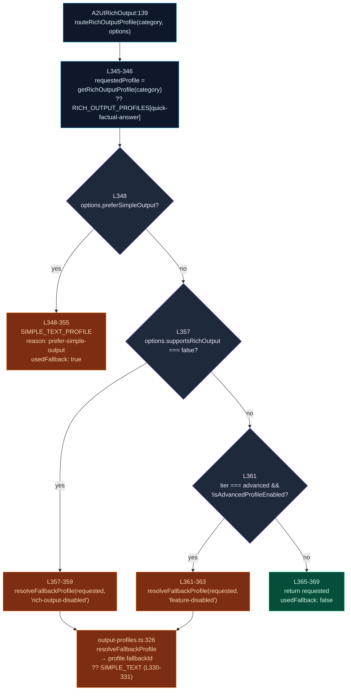
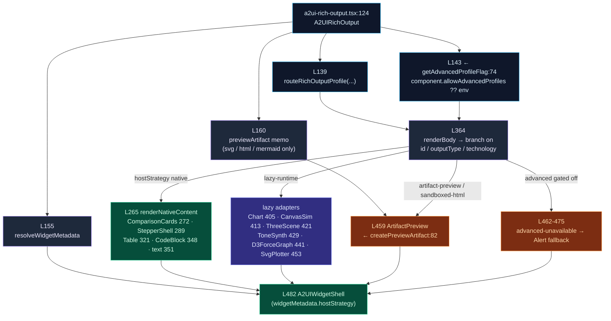

# Output Profiles & Rich Output

<Status variant="experimental" />

<TLDR>
  When an agent wants to "show" something — a diagram, a chart, a 3D scene, a warm message — it
  picks an **intent category**, not a renderer. An **output profile** is the lookup that turns that
  intent into a concrete **render strategy**: inline A2UI native components, a lazy-loaded runtime
  adapter (Chart.js / Three.js / Tone.js / d3 / canvas), or an iframe-isolated artifact preview.
  `routeRichOutputProfile` (`output-profiles.ts:341`) is the router; it runs a 5-step fallback
  ladder over the **22**-entry profile registry. The renderer
  `A2UIRichOutput` (`a2ui-rich-output.tsx:124`) consumes the routing result and dispatches the body.
</TLDR>

<StatGrid>
  <Stat label="Output profiles" value="22" hint="RICH_OUTPUT_PROFILES · output-profiles.ts:91" />
  <Stat label="Host strategies" value="4" hint="native · artifact-preview · sandboxed-html · lazy-runtime" />
  <Stat label="Advanced-tier profiles" value="7" hint="feature-flag gated, default ON" />
  <Stat label="Lazy runtime adapters" value="6" hint="ChartJs · CanvasSim · ThreeScene · ToneSynth · D3ForceGraph · SvgPlotter" />
</StatGrid>

## What an Output Profile Is

A2UI's base renderer turns a declarative component tree into inline React. But some intents need a
*different* substrate: a Chart.js canvas, a sandboxed `<iframe>`, a Three.js scene. Rather than make
the agent name a renderer, the agent names an **intent category** (`how-it-works-physical`,
`trends-over-time`, `3d-visualization`, `emotional-support`, …) and the profile registry maps that
intent onto the right rendering strategy.

A `RichOutputProfile` (`output-profiles.ts:56`) carries everything the renderer needs to make that
decision:

<TypeTable
  type={{
    id: {
      description: "Stable profile identifier; equals its intent category literal.",
      type: "RichOutputRequestCategory",
    },
    title: {
      description: "Human-readable label for the profile.",
      type: "string",
    },
    outputType: {
      description: "What kind of artifact this produces (svg · html · mermaid · chart · canvas · plain-text · code · warm-text).",
      type: "RichOutputType",
    },
    technology: {
      description: "Render technology (svg · html · mermaid · chartjs · canvas · threejs · tonejs · d3 · none).",
      type: "RichOutputTechnology",
    },
    hostStrategy: {
      description: "Where the body renders — native · artifact-preview · sandboxed-html · lazy-runtime.",
      type: "RichOutputHostStrategy",
    },
    artifactType: {
      description: "Artifact kind to build when diverted to the preview panel.",
      type: "ArtifactType",
    },
    fallbackId: {
      description: "Profile to degrade to when this one can't render. Resolved by resolveFallbackProfile.",
      type: "RichOutputRequestCategory | undefined",
    },
    rolloutTier: {
      description: '"core" (always available) or "advanced" (feature-flag gated, default ON).',
      type: "RichOutputRolloutTier",
    },
  }}
/>

The type vocabulary lives alongside the registry: `RichOutputType` (27, **8** kinds at L28-35),
`RichOutputTechnology` (37, **9** values at L38-46), `RichOutputHostStrategy` (48, **4** values at
L49-52), and `RichOutputRolloutTier` (54). The only external dependency is `ArtifactType` from
`@/types/artifact` (L1).

<Callout type="warn">
  Two counts that drifted in older docs: there are **22 profiles / 22 intent categories** (not 21),
  and there are exactly **4 host strategies** — `native`, `artifact-preview`, `sandboxed-html`,
  `lazy-runtime`. `none` is a *technology*, not a host strategy.
</Callout>

## The 22 Profiles

`RICH_OUTPUT_PROFILES` (`output-profiles.ts:91`) is a 22-entry record (L92-311). Each row maps an
intent to a render strategy and a fallback.

| # | id (intent category) | line | outputType | technology | hostStrategy | tier |
| --- | --- | --- | --- | --- | --- | --- |
| 1 | `how-it-works-physical` | 92 | svg | svg | artifact-preview | core |
| 2 | `how-it-works-abstract` | 102 | html | html | sandboxed-html | core |
| 3 | `process-steps` | 112 | svg | svg | artifact-preview | core |
| 4 | `architecture-containment` | 122 | svg | svg | artifact-preview | core |
| 5 | `database-schema-erd` | 132 | mermaid | mermaid | artifact-preview | core |
| 6 | `trends-over-time` | 142 | chart | chartjs | lazy-runtime | **advanced** |
| 7 | `category-comparison` | 152 | chart | chartjs | lazy-runtime | **advanced** |
| 8 | `part-of-whole` | 162 | chart | chartjs | lazy-runtime | **advanced** |
| 9 | `kpis-metrics` | 172 | html | html | sandboxed-html | core |
| 10 | `design-a-ui` | 182 | html | html | sandboxed-html | core |
| 11 | `choose-between-options` | 192 | html | html | sandboxed-html | core |
| 12 | `cyclic-process` | 202 | html | html | sandboxed-html | core |
| 13 | `physics-math-simulation` | 212 | canvas | canvas | lazy-runtime | **advanced** |
| 14 | `function-equation-plotter` | 222 | svg | svg | artifact-preview | core |
| 15 | `data-exploration` | 232 | html | html | sandboxed-html | core |
| 16 | `creative-decorative-art` | 242 | svg | svg | artifact-preview | core |
| 17 | `3d-visualization` | 252 | html | threejs | lazy-runtime | **advanced** |
| 18 | `music-audio` | 262 | html | tonejs | lazy-runtime | **advanced** |
| 19 | `network-graph` | 272 | html | d3 | lazy-runtime | **advanced** |
| 20 | `quick-factual-answer` | 282 | plain-text | none | native | core |
| 21 | `code-solution` | 292 | code | none | native | core |
| 22 | `emotional-support` | 302 | warm-text | none | native | core |

The **7** advanced-tier profiles (`trends-over-time`, `category-comparison`, `part-of-whole`,
`physics-math-simulation`, `3d-visualization`, `music-audio`, `network-graph`) are exactly the ones
that pull a heavy runtime adapter — which is why they share the `lazy-runtime` host strategy and sit
behind a feature flag.

Accessors over this record: `listRichOutputProfiles` (L314) returns all rows;
`getRichOutputProfile` (L318) looks one up by category. The private constant
`SIMPLE_TEXT_PROFILE_ID` (L89) pins the universal fallback to `"quick-factual-answer"`.

## Host Strategies

The `hostStrategy` field decides *where* the body renders. There are four (`output-profiles.ts:49-52`):

| Host strategy | line | Substrate | Profiles | Technologies |
| --- | --- | --- | --- | --- |
| `native` | 49 | Inline A2UI React components | `quick-factual-answer`, `code-solution`, `emotional-support` | plain-text / code / warm-text |
| `artifact-preview` | 50 | iframe-isolated artifact panel | the svg + mermaid profiles | svg, mermaid |
| `sandboxed-html` | 51 | iframe-isolated artifact panel | the html profiles | html |
| `lazy-runtime` | 52 | Lazy-loaded runtime adapter | the 7 advanced profiles | chartjs / canvas / threejs / tonejs / d3 |

`native` and the two iframe strategies trade off **trust vs. capability**: native content renders
straight into the main React tree (cheap, safe, limited); `artifact-preview` / `sandboxed-html`
divert to the iframe-isolated artifact panel (see [Artifacts / sandbox](../artifacts-sandbox));
`lazy-runtime` keeps the body inline but defers a heavyweight charting/3D/audio bundle until the
profile is actually selected.

## The Router: `routeRichOutputProfile`

`routeRichOutputProfile` (`output-profiles.ts:341`) is the single decision point. It first resolves
the requested profile (falling back to `quick-factual-answer` if the category is unknown), then runs
a 5-step ladder. The first match wins.

The router returns a `RichOutputRoutingResult` (`output-profiles.ts:82`) with
`requestedProfile`, the resolved `profile`, a `usedFallback` flag, and a
`RichOutputRoutingReason` (L77) — one of `feature-disabled`, `prefer-simple-output`, or
`rich-output-disabled`. Supporting helpers:

| Helper | line | Role |
| --- | --- | --- |
| `resolveFallbackProfile` | 326 | Resolves `profile.fallbackId`; if absent, falls to `SIMPLE_TEXT_PROFILE_ID` (L330-331). |
| `isAdvancedProfileEnabled` | 322 | Default-**ON**: returns `true` unless the flag is *exactly* `false` (L323). |
| `RichOutputRoutingOptions` | 71 | Input knobs: `preferSimpleOutput`, `supportsRichOutput`, `featureFlags`. |

## The Renderer: `A2UIRichOutput`

`A2UIRichOutput` (`components/a2ui/display/a2ui-rich-output.tsx:124`) is the React side. It calls the
router, reads the advanced flag, then `renderBody` (L364) branches on the resolved profile's
`id` / `outputType` / `technology` to pick a render path: inline native components, one of six lazy
adapters, or an `ArtifactPreview` built by `createPreviewArtifact` (L82).

The six lazy adapters are dynamically imported (L28-55) so their runtimes never enter the base
bundle: `ChartJs` (28), `CanvasSimulation` (31), `ThreeScene` (36), `ToneSynth` (41), `D3ForceGraph`
(46), `SvgPlotter` (51).

### The Advanced Feature Flag

Two layers gate advanced-tier output, and both default to **ON**:

- **Router layer** — `isAdvancedProfileEnabled` (`output-profiles.ts:322`) returns `true` unless the
  flag is *exactly* `false`. When an advanced profile is requested with the flag off, the router
  degrades via `resolveFallbackProfile(..., "feature-disabled")`.
- **Renderer layer** — `getAdvancedProfileFlag` (`a2ui-rich-output.tsx:74`) reads
  `component.allowAdvancedProfiles`, falling back to the env switch
  `NEXT_PUBLIC_ENABLE_ADVANCED_RICH_OUTPUT_PROFILES !== "false"` (L79). If a profile slips through as
  advanced-but-unavailable, the renderer shows the Alert fallback (L462-475) rather than a heavy
  adapter.

The resolved `hostStrategy` is threaded into `A2UIWidgetShell` via `resolveWidgetMetadata` (L155) so
the shell knows whether the body is inline or iframe-diverted.

## Native Content Dispatch

When `hostStrategy` is `native`, `renderNativeContent` (`a2ui-rich-output.tsx:265`) picks a concrete
inline renderer:

| Branch | line | Component | Notes |
| --- | --- | --- | --- |
| Comparison | 272 | `A2UIComparisonCards` | Responsive 2-col grid (`a2ui-comparison-cards.tsx:13`), empty-state at 23, click 71-85 |
| Stepper | 289 | `A2UIStepperShell` | Step shell for `process-steps`-style content |
| Table | 321 | `A2UITable` | Tabular native render |
| Code | 348 | `CodeBlock` | For `code-solution` |
| Text | 351 | plain `div` | The `warm-text` / `plain-text` floor |

Path resolution for native data uses the shared data-model helpers
(`getValueByPath` / `resolveArrayOrPath` / `resolveStringOrPath` from `@/lib/a2ui/data-model`,
imported at L15).

## Thumbnails

`lib/a2ui/thumbnail.ts` (350) captures live A2UI surfaces into cached preview images using
`html2canvas` plus a `localStorage` cache.

```mermaid
flowchart LR
  CAP["thumbnail.ts:137<br/>captureSurfaceThumbnail"]
  SEL["L142<br/>querySelector([data-surface-id])"]
  GEN["L150 → generateThumbnail:49<br/>html2canvas"]
  FIT["L84-102<br/>aspect-fit scale → new canvas"]
  DRAW["L109 ctx.drawImage<br/>L113 toDataURL(mime, quality)"]
  Q["L116-119<br/>> 50KB? re-encode @ quality 0.2"]
  RES["L121 ThumbnailResult"]
  SAVE["L278 saveThumbnail<br/>→ saveThumbnailCache:241"]
  CLEAN["L256 cleanupOldThumbnails<br/>drop > 7 days (L258)"]

  CAP --> SEL --> GEN --> FIT --> DRAW --> Q --> RES
  RES --> SAVE
  SAVE -->|"quota error"| CLEAN

  classDef cap fill:#0f172a,stroke:#38bdf8,color:#e0f2fe
  classDef gen fill:#1e293b,stroke:#a78bfa,color:#ede9fe
  classDef store fill:#064e3b,stroke:#34d399,color:#d1fae5
  class CAP,SEL cap
  class GEN,FIT,DRAW,Q,RES gen
  class SAVE,CLEAN store
```

Key constants and surface:

| Symbol | line | Detail |
| --- | --- | --- |
| `DEFAULT_OPTIONS` | 32 | width 280 / height 180 / quality 0.8 / format `webp` / bg `#ffffff` / scale 1 (L34-38) |
| `THUMBNAIL_STORAGE_KEY` | 41 | `"a2ui-app-thumbnails"` |
| `MAX_THUMBNAIL_SIZE` | 42 | `50 * 1024` (50KB) — quality auto-reduces above it (L116) |
| `generatePlaceholderThumbnail` | 160 | Canvas gradient + circle first-letter + truncated title when no DOM exists |
| `saveThumbnailCache` | 241 | On failure → `cleanupOldThumbnails` (drops entries older than 7 days, L258) |
| `syncThumbnailsWithApps` | 335 | Prunes orphaned `appId`s |

Other cache methods: `loadThumbnailCache` (224), `getThumbnail` (290), `deleteThumbnail` (298),
`isThumbnailStale` (307), `getAllThumbnails` (320), `clearAllThumbnails` (327). Deps: `html2canvas`
(L6), loggers from `@/lib/logging` (L7).

## Academic Surfaces

`lib/a2ui/academic-templates.ts` (798) is a set of **pure** A2UI server-message builders for
research surfaces — no rendering, no side effects. Each builder assembles components + a data model,
then emits **4** `A2UIServerMessage`s (`createSurface` → `updateComponents` → `dataModelUpdate` →
`surfaceReady`) and returns `{ surfaceId, messages }`.

| Builder | line | Surface |
| --- | --- | --- |
| `createPaperCardSurface` | 41 | Single-paper card (emits messages at 194-197) |
| `createSearchResultsSurface` | 206 | Search-results list |
| `createAnalysisPanelSurface` | 365 | Analysis panel |
| `createPaperComparisonSurface` | 529 | Side-by-side paper comparison |
| `createReadingListSurface` | 649 | Reading list |

`AcademicTemplateType` (L16) enumerates 7 surface kinds. i18n flows through bilingual bundles
(`academicTemplateMessages` L25, `getAcademicTemplateMessages` L30, `formatTemplateMessage` L34 with
`{key}` interpolation); ids come from `generateTemplateId` (e.g. L46). The `academicTemplates` object
(L790) is the default export (L798). Deps: `A2UIComponent` / `A2UIServerMessage` from
`@/types/a2ui/schema` (L6), `Paper` / `LibraryPaper` / `PaperAnalysisType` from `@/types/academic`
(L7), `defaultLocale` / `Locale` from `@/i18n/config` (L8), the bundled `a2ui.json` message sets
(L9-10), and `generateTemplateId` from `./templates` (L11).

The matching React components live under `components/a2ui/academic/` — the barrel `index.ts`
re-exports `AcademicPaperCard` (L6), `AcademicSearchResults` (L7), and `AcademicAnalysisPanel` (L8).
`A2UIAnalysisAdapter` (`a2ui-analysis-adapter.tsx:17`) is **not** in the barrel; it is bridged into
the catalog at renderer load as `"AcademicAnalysis"`.

## Fixtures

`lib/a2ui/rich-output-fixtures.ts` (42) ships 4 sample fixtures (`richOutputFixtures`, L8) for tests
and previews — one per representative strategy:

| Fixture | line | Category |
| --- | --- | --- |
| `directResponse` | 9 | `quick-factual-answer` (native) |
| `svgDiagram` | 15 | `how-it-works-physical` (artifact-preview) |
| `mermaidSchema` | 22 | `database-schema-erd` (artifact-preview) |
| `htmlDashboard` | 29 | `kpis-metrics` (sandboxed-html) |

`RichOutputFixtureKey` (L38) keys the record; `getRichOutputFixture` (L40) looks one up. No external
imports.

## File Map

<Files>
  <Folder name="lib/a2ui" defaultOpen>
    <File name="output-profiles.ts" annotation="370 — registry + router (22 profiles)" />
    <File name="rich-output-fixtures.ts" annotation="42 — 4 sample fixtures" />
    <File name="thumbnail.ts" annotation="350 — html2canvas + localStorage cache" />
    <File name="academic-templates.ts" annotation="798 — pure 4-message academic builders" />
  </Folder>
  <Folder name="components/a2ui/display">
    <File name="a2ui-rich-output.tsx" annotation="124 — strategy-dispatch renderer" />
    <File name="a2ui-comparison-cards.tsx" annotation="13 — responsive 2-col grid" />
    <File name="a2ui-widget-status.tsx" annotation="24 — ready/loading/fallback/error icon" />
    <File name="a2ui-interactive-guide.tsx" annotation="79 — stepper guide (≤8 dots)" />
  </Folder>
  <Folder name="components/a2ui/academic">
    <File name="index.ts" annotation="barrel — PaperCard / SearchResults / AnalysisPanel" />
    <File name="a2ui-analysis-adapter.tsx" annotation="17 — bridged as AcademicAnalysis (not in barrel)" />
  </Folder>
</Files>

## Next

<Cards>
  <Card title="A2UI System" href="./index" description="The protocol overview, round-trip, and module map" />
  <Card title="Catalog & rendering" href="./catalog-rendering" description="Type→React registry, surface containers, error isolation" />
  <Card title="Artifacts / sandbox" href="../artifacts-sandbox" description="The iframe-isolated path that artifact-preview / sandboxed-html divert into" />
</Cards>
