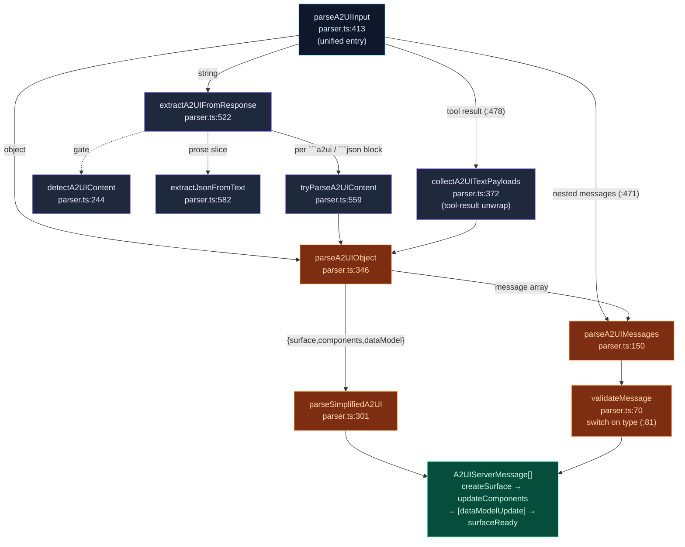
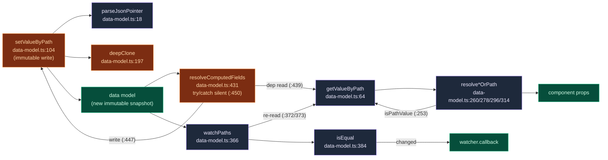
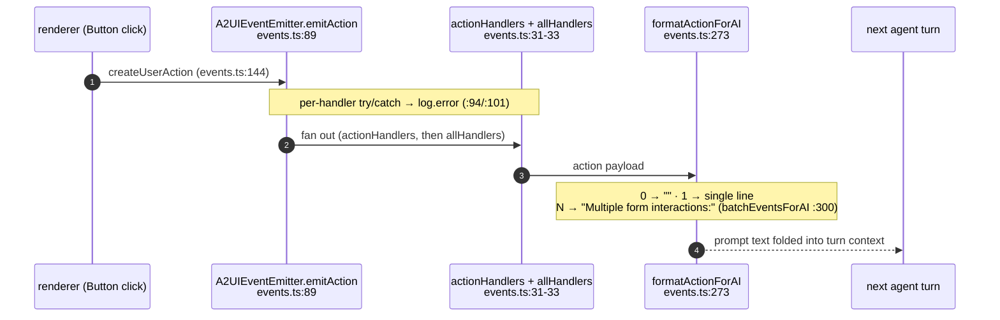

# Protocol Core

<Status variant="experimental" />

<TLDR>
  The protocol core is the runtime-agnostic layer of `lib/a2ui` — no React, no store, no MCP. It is
  four cooperating modules: `parser.ts` turns raw agent output (strings, code blocks, tool results)
  into a typed `A2UIServerMessage[]`; `data-model.ts` binds component props to a data model through
  RFC 6901 JSON Pointers and resolves computed fields; `events.ts` is the in-process bus that fans
  user actions back out and formats them for the next agent turn; and a set of leaf utilities
  (`constants.ts`, `format.ts`, `list-utils.ts`) plus the `index.ts` barrel. Everything is keyed to
  one schema — `types/a2ui/schema.ts`, header "Based on A2UI Protocol v0.9".
</TLDR>

<StatGrid>
  <Stat label="Schema version" value="v0.9" hint="types/a2ui/schema.ts:3 header · version field at :910" />
  <Stat label="Server messages" value="5" hint="createSurface · updateComponents · dataModelUpdate · deleteSurface · surfaceReady" />
  <Stat label="parser.ts" value="656 lines" hint="parseA2UIInput (413) is the unified entry" />
  <Stat label="data-model.ts" value="528 lines" hint="JSON Pointer get/set + 6 computed-field helpers" />
</StatGrid>

## The Schema-v0.9 Contract

Every module in the cluster is typed against `types/a2ui/schema.ts`. The file header (`:3`) reads
"Based on A2UI Protocol v0.9" and the `version` field lives at `schema.ts:910`. The schema is still
v0.9 — the protocol core has not moved off it.

The contract is **five** server-message types. The parser validates each through a dedicated type
guard, and the union it produces (`A2UIServerMessage[]`) is the only thing downstream consumers ever
see.

| Message `type` literal | Guard (`parser.ts`) | Line | Role |
| --- | --- | --- | --- |
| `createSurface` | `isCreateSurfaceMessage` | 43 | Allocate a surface; default `surfaceType` is `"inline"` |
| `updateComponents` | `isUpdateComponentsMessage` | 47 | Carry the component tree |
| `dataModelUpdate` | `isUpdateDataModelMessage` | 53 | Carry / merge the data model (guards `type === "dataModelUpdate"`) |
| `deleteSurface` | `isDeleteSurfaceMessage` | 59 | Tear down a surface |
| `surfaceReady` | `isSurfaceReadyMessage` | 63 | Signal the surface may be revealed |

The five type literals are emitted at roughly `parser.ts:82, 96, 106, 117, 126`. The default
`surfaceType` `"inline"` appears at `:90`, `:311`, `:631`; a freshly minted surface id is
`surface-${Date.now()}` (`:310`) with a `"default"` fallback (`:566`).

### Simplified shorthand

Agents rarely hand-write the four-message dance. A compact `{ surface, components, dataModel }`
object is expanded into the canonical sequence by `parseSimplifiedA2UI` (`parser.ts:301`):

```text
{ surface, components, dataModel }
   └─ parseSimplifiedA2UI (301)
        ├─ createSurface
        ├─ updateComponents
        ├─ dataModelUpdate      (only when dataModel present)
        └─ surfaceReady
```

`createA2UISurface` (`parser.ts:617`) mirrors the same expansion programmatically for callers that
already hold typed objects instead of JSON.

## Parser Pipeline

`parser.ts` (656 lines) is the funnel: arbitrary agent output in, typed `A2UIServerMessage[]` out.
The single unified entry is `parseA2UIInput` (`:413`). It imports only `type` declarations from
`@/types/a2ui/schema` (`:6-16`) — no other `lib/a2ui` modules, no external libraries.

### Public surface

| Symbol | Line | Role |
| --- | --- | --- |
| `parseA2UIInput` | 413 | **Unified entry** — accepts string / object / tool-result, recurses |
| `extractA2UIFromResponse` | 522 | String branch: pull A2UI out of fenced code blocks or raw JSON |
| `parseA2UIMessage` | 143 | Single-message parse |
| `parseA2UIMessages` | 150 | Array parse → per-element `validateMessage` |
| `parseA2UIString` | 191 | Parse a JSON string |
| `parseA2UIJsonl` | 208 | Parse newline-delimited JSON |
| `detectA2UIContent` | 244 | Cheap gate: does this text plausibly contain A2UI? |
| `createA2UISurface` | 617 | Programmatic shorthand → 4-message sequence |
| `A2UIParseResult` / `A2UIUnifiedParseResult` / `A2UIParseInputOptions` | 21 / 30 / 36 | Result + option types |

### Internal stages

| Symbol | Line | Role |
| --- | --- | --- |
| `validateMessage` | 70 | `switch` on `message.type` (`:81`) → narrow to a server message |
| `parseSimplifiedA2UI` | 301 | `{surface,components,dataModel}` → 4-message sequence |
| `parseA2UIObject` | 346 | Object dispatch: simplified vs. message-array |
| `resolveSurfaceId` | 361 | Pick / synthesize a surface id |
| `collectA2UITextPayloads` | 372 | Tool-result unwrap (`text` / `result` / `content[].text` / `resource.text`) |
| `tryParseA2UIContent` | 559 | Per code-block attempt |
| `extractJsonFromText` | 582 | Bracket-depth scan to slice JSON out of prose |

### Flow

`parseA2UIInput` (`:413`) dispatches by input shape. A **string** is routed to
`extractA2UIFromResponse` (`:522`), which walks every ` ```a2ui ` / ` ```json ` fenced block (regexes
at `:524` / `:534`), tries each through `tryParseA2UIContent` (`:559`), and falls back to raw-JSON.
A raw payload is gated by `detectA2UIContent` (`:244`) and, if still embedded in prose, sliced out by
`extractJsonFromText` (`:582`) via a bracket-depth scan. An **object** goes straight to
`parseA2UIObject` (`:346`). `parseA2UIInput` also recurses on a nested `messages` array (`:471`) and
unwraps tool-result envelopes through `collectA2UITextPayloads` (`:478` → `:372`).



## Data Model — JSON Pointer Binding

`data-model.ts` (528 lines) implements the binding layer: RFC 6901 JSON Pointers, immutable
get/set, the `*OrPath` resolvers that let any prop be either a literal or a pointer, and computed
fields. It imports only `type` declarations from `@/types/a2ui/schema` (`:6-12`) — `A2UIPathValue`,
`A2UIStringOrPath`, `A2UINumberOrPath`, `A2UIBooleanOrPath`, `A2UIArrayOrPath`. No other deps.

### Pointer primitives

| Symbol | Line | Role |
| --- | --- | --- |
| `parseJsonPointer` | 18 | RFC 6901 split; handles `~0` / `~1` escapes (`:39`) |
| `encodeJsonPointerSegment` | 46 | Escape a segment (`:48`) |
| `createJsonPointer` | 54 | Join segments into a pointer |
| `getValueByPath` | 64 | Read a value at a pointer |
| `setValueByPath` | 104 | **Immutable** write — deep-clones, auto-creates intermediates |
| `deleteValueByPath` | 154 | Immutable delete |
| `deepClone` | 197 | Structural clone |
| `deepMerge` | 218 | Recursive merge — **arrays are REPLACED, not merged** |

`setValueByPath` (`:104`) is the load-bearing mutator: it calls `parseJsonPointer` (`:18`) and
`deepClone` (`:197`), then decides whether each missing intermediate should be an array `[]` or an
object `{}` by testing whether the *next* segment is numeric (`:124`).

### Resolvers — literal or pointer

Any component prop can be a literal value or a `{ path }` reference. The `resolve*OrPath` family
collapses that union by probing `isPathValue` (`:253` guard) and reading through `getValueByPath`.

| Resolver | Line | Reads |
| --- | --- | --- |
| `resolveStringOrPath` | 260 | string \| `{path}` |
| `resolveNumberOrPath` | 278 | number \| `{path}` |
| `resolveBooleanOrPath` | 296 | boolean \| `{path}` |
| `resolveArrayOrPath` | 314 | array \| `{path}` |
| `getBindingPath` | 332 | extract the pointer from a binding |
| `createRelativePathResolver` | 342 | resolver scoped to a sub-path (reads at `:349` / `:354`) |

### Computed fields

`resolveComputedFields` (`:431`) walks a `ComputedFieldRegistry` (`:425`): for each field it reads
its dependency via `getValueByPath` (`:439`), runs `field.compute`, and writes the result with
`setValueByPath` (`:447`). Failures are **silently skipped** — the whole `compute` is wrapped in a
`try/catch` (`:450`) so one bad field never poisons the model. `computedHelpers` (`:461`) is a set
of factories for the common reductions:

| Helper | Behavior | Notes |
| --- | --- | --- |
| `sum` | add numbers at a path | — |
| `count` | length of an array | — |
| `countWhere` | conditional count | — |
| `currency` | format as money | default symbol `"$"`, decimals `2` (`:481`) |
| `concat` | join values | — |
| `percentage` | part / total → % | `Math.round((p/t)*100)` (`:498`) |

### Watching paths

`watchPaths` (`:366`) wires reactive watchers: on each model change it re-reads each watched path
through `getValueByPath` (`:372` / `:373`), compares against the previous value with the internal
`isEqual` (`:384`), and only fires `watcher.callback` on a genuine change. `extractReferencedPaths`
(`:506`) recursively traverses a component tree (`:509`) and collects every `.path` (`:512`) into a
`Set` — used to compute the minimal watch set for a surface.



## The Event Bus

`events.ts` (399 lines) is the in-process egress: user interactions in the renderer flow into the
`A2UIEventEmitter` and come out formatted for the next agent turn. It holds the cluster's single
intra-module code import: `getValueByPath` and `parseJsonPointer` from `@/lib/a2ui/data-model`
(`:12`). It also imports `loggers` from `@/lib/logging` (`:13`), aliased to `log = loggers.ui`
(`:15`), and `type` declarations from the schema (`:6-11`).

### Emitter API

| Member | Line | Role |
| --- | --- | --- |
| `A2UIEventEmitter` (class) | 30 | The bus |
| private `actionHandlers` / `dataChangeHandlers` / `allHandlers` (Sets) | 31-33 | Subscriber sets |
| `maxListeners = 50` | 34 | Leak threshold |
| private `checkListenerLeak` | 39 | Dev-only `>maxListeners` warning |
| `listenerCount` | 55 | Count across sets |
| `onAction` | 62 | Subscribe to actions → returns unsubscribe closure |
| `onDataChange` | 71 | Subscribe to data changes → unsubscribe closure |
| `onAny` | 80 | Subscribe to both → unsubscribe closure |
| `emitAction` | 89 | Fan an action out |
| `emitDataChange` | 109 | Fan a data change out |
| `clear` | 129 | Drop all handlers |
| `globalEventEmitter` | 139 | Process singleton |

`emitAction` (`:89`) iterates `actionHandlers` then `allHandlers`, each handler wrapped in its own
`try/catch` → `log.error` (`:94` / `:101`), so one throwing subscriber cannot break the fan-out.
`emitDataChange` (`:109`) does the same (`:114` / `:121`). The `on*` subscriptions (`:62` / `:71` /
`:80`) each call `checkListenerLeak` (`:39`) → `listenerCount` (`:55`) and warn (dev only) past
`maxListeners`; each returns an unsubscribe closure.

### Action → AI formatting

| Symbol | Line | Role |
| --- | --- | --- |
| `createUserAction` | 144 | Build an action (`+ timestamp: Date.now()`) |
| `createDataModelChange` | 163 | Build a data-model change event |
| `ActionTypes` | 180 | ~30 action-type literals (`:180-226`) |
| `getComponentAction` | 231 | Probe `action` / `clickAction` / `closeAction` / `dismissAction` |
| `buildActionData` | 250 | Read `component.component` / `value` / `text` |
| `formatActionForAI` | 273 | One action → prompt text |
| `formatDataChangeForAI` | 293 | One change → prompt text |
| `batchEventsForAI` | 300 | N events → batched prompt text |
| `collectFormData` | 326 | Gather a form's values |
| `validateFormData` / `ValidationResult` | 353 / 348 | Form validation |

`batchEventsForAI` (`:300`) routes through `formatActionForAI` (`:273`) / `formatDataChangeForAI`
(`:293`): zero events → `""`, one → the single formatted line, N → a `"Multiple form interactions:"`
header with bullets. The batching is **count-based, not time-based** — there is no batch-window-ms
and no history cap in this module. `collectFormData` (`:326`) reuses the data-model primitives:
`parseJsonPointer` (`:333`) + `getValueByPath` (`:335`).



<Callout type="warn">
  **`dataModelUpdate` (server message) ≠ `dataModelChange` (client event).** The server message that
  carries a model patch uses the literal `"dataModelUpdate"`. The client-side change event emitted
  when a user edits a field uses a **different** literal, `"dataModelChange"` (`events.ts:169`).
  They are intentionally distinct strings flowing in opposite directions — agent→UI vs. UI→agent.
  Comparing against the wrong one silently drops events.
</Callout>

## Leaf Utilities

Three dependency-light helpers round out the core.

| File | Lines | Exports (line) | Notes |
| --- | --- | --- | --- |
| `format.ts` | 33 | `formatRelativeTime` (9), `formatAbsoluteTime` (25) | `"just now"` / `"Nm/h/d ago"` else locale date; thresholds `60000` / `3600000` / `86400000` / `604800000` (`:14-17`); no imports |
| `list-utils.ts` | 27 | `getItemKey` (9), `getItemDisplayText` (19) | key = `item.id` else index; display = string/number/bool passthrough, object → `label`\|`text`\|`name`\|`title` else `JSON.stringify`; no imports |
| `constants.ts` | 93 | `CATEGORY_KEYS` (12), `surfaceStyles` (29), `ANALYSIS_TYPE_VALUES` (80) | pure data |

`constants.ts` carries the shared UI data: `CATEGORY_KEYS` (`:12`,
`["productivity","data","form","utility","social"]`), `CATEGORY_I18N_MAP` (`:14`), per-`surfaceType`
container CSS in `surfaceStyles` (`:29`, inline / dialog / panel / fullscreen) and `contentStyles`
(`:39`), `ANALYSIS_TYPE_ICONS` (`:50`), `ANALYSIS_TYPE_I18N_KEYS` (`:65`), and `ANALYSIS_TYPE_VALUES`
(`:80`, 12 entries). Its only dependency is a `type` import of `PaperAnalysisType` from
`@/types/academic` (`:6`).

## The Barrel

`index.ts` (203 lines) re-exports the whole of `lib/a2ui` so consumers import from one place. The
core modules surface at: `parser` (`:7`), `data-model` (`:27`), `events` (`:74`), `format` (`:147`),
`constants` (`:156`), `list-utils` (`:167`). The remaining re-exports cover the rendering and
projection layers documented elsewhere: `catalog` (`:53`), `templates` (`:93`), `app-generator`
(`:118`), `thumbnail` (`:131`), `animation` (`:150`), `chart-constants` (`:153`),
`academic-templates` (`:170`), `output-profiles` (`:181`), `rich-output-fixtures` (`:198`).

## Cluster Files

<Files>
  <Folder name="lib/a2ui" defaultOpen>
    <File name="parser.ts — 656 lines · parseA2UIInput (413)" />
    <File name="data-model.ts — 528 lines · JSON Pointer + computed fields" />
    <File name="events.ts — 399 lines · A2UIEventEmitter + globalEventEmitter (139)" />
    <File name="constants.ts — 93 lines · shared UI constants" />
    <File name="format.ts — 33 lines · relative/absolute time" />
    <File name="list-utils.ts — 27 lines · list key/display helpers" />
    <File name="index.ts — 203 lines · barrel re-export" />
  </Folder>
  <Folder name="types/a2ui">
    <File name="schema.ts — header v0.9 (:3) · version field (:910)" />
  </Folder>
</Files>

## Related

<Cards>
  <Card title="A2UI System" href="./index" description="The subsystem overview — producers, the round-trip, the security model" />
  <Card title="Catalog & rendering" href="./catalog-rendering" description="Where parsed messages become a live React tree" />
  <Card title="MCP tools & bridge" href="./mcp-bridge" description="How agent output reaches parseA2UIInput across three transports" />
  <Card title="State & persistence" href="./state-persistence" description="The Zustand store that ingests A2UIServerMessage[]" />
</Cards>
