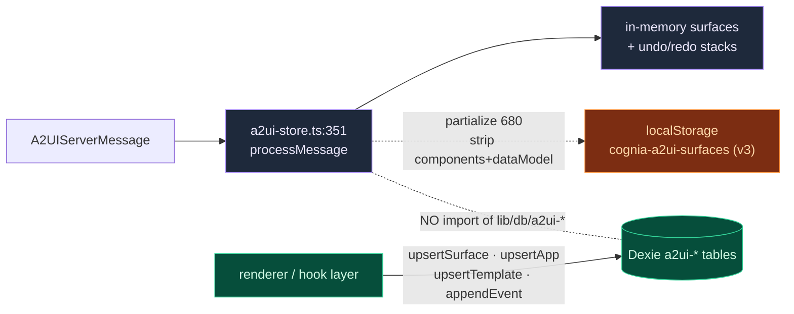
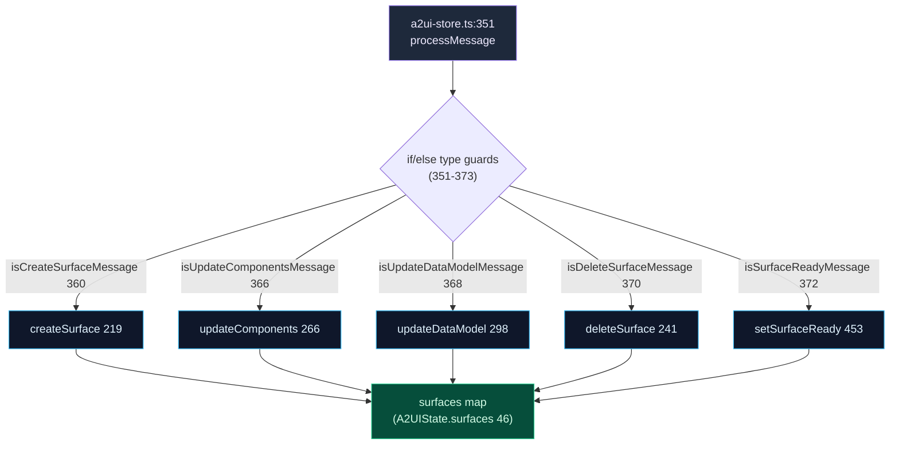
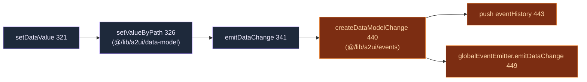

# State & Persistence

<Status variant="experimental" />

<TLDR>
  A2UI keeps state in **two independent layers**, and they do not call each other. The Zustand store
  (`stores/a2ui/a2ui-store.ts`) is the single ingest point for every server message and the source of
  truth at runtime — but it persists **metadata only** to `localStorage` (key `cognia-a2ui-surfaces`,
  LRU-capped at 20 surfaces, with `components` + `dataModel` stripped). The four Dexie tables
  (`a2uiApps`, `a2uiSurfaces`, `a2uiTemplates`, `a2uiEventHistory`) are a **separate durable layer**
  invoked from the renderer/hook layer, never from the store. Undo/redo lives in-memory only
  (50-entry stacks, 300 ms debounce).
</TLDR>

<StatGrid>
  <Stat label="Persistence layers" value="2" hint="zustand→localStorage (metadata) · Dexie (durable rows)" />
  <Stat label="localStorage LRU cap" value="20" hint="MAX_PERSISTED_SURFACES, ready surfaces only" />
  <Stat label="Undo history" value="50" hint="MAX_HISTORY_ENTRIES, 300 ms debounce" />
  <Stat label="Event-history cap" value="1000" hint="Dexie a2uiEventHistory, trims 100 oldest" />
</StatGrid>

## Two Persistence Layers (read this first)

<Callout type="warn">
  The Zustand store and the Dexie `a2ui-*` tables are **two separate persistence layers**. The store
  persists **metadata only** to `localStorage` (`partialize` at `a2ui-store.ts:680` LRU-caps to 20
  ready surfaces and **strips `components` + `dataModel`** at line 692 — they are "regenerated from
  templates"). The Dexie tables (`lib/db/a2ui-*.ts`) are a **distinct durable layer** that is **never
  imported by the store**; surface/app/template persistence into Dexie is invoked from the
  renderer/hook layer. Do not assume writing the store persists rows to Dexie, or vice-versa.
</Callout>

| Concern | Zustand store (`a2ui-store.ts`) | Dexie tables (`lib/db/a2ui-*.ts`) |
| --- | --- | --- |
| Medium | `localStorage` (zustand `persist`) | IndexedDB (Dexie) |
| Key / name | `cognia-a2ui-surfaces` (version 3) | tables `a2uiApps` / `a2uiSurfaces` / `a2uiTemplates` / `a2uiEventHistory` |
| Stores | surface **metadata only** (no components/dataModel) | full rows: components, dataModel, rootId, audit |
| Scope | runtime truth + last-session restore | user-saved apps, panel/fullscreen surfaces, templates, audit trail |
| Cap / eviction | LRU 20 ready surfaces, sorted `updatedAt` desc | event-history trims to 1000 rows |
| Called from | every server message + UI action | renderer/hook layer (NOT the store) |
| Undo/redo | in-memory only (excluded from persist) | — |



## The Store as Message Entry Point

`useA2UIStore` (`a2ui-store.ts:212`) is created once via `create` and holds the entire runtime A2UI
state. Every server message — from any of the three dispatch paths — funnels through
`processMessage` (`351`).

### State shape

`A2UIState` (`44-65`):

<TypeTable
  type={{
    surfaces: { type: "Record<string, A2UISurfaceState>", description: "46 — each {id,type,catalogId,title,widget,components:Record<id,Component>,dataModel,rootId,createdAt,updatedAt,ready}" },
    activeSurfaceId: { type: "string | null", description: "47 — re-derived on rehydrate" },
    eventHistory: { type: "A2UIEvent[]", description: "50 — userAction + dataModelChange, capped" },
    maxEventHistory: { type: "number", description: "51 — init 100 (@129)" },
    loadingSurfaces: { type: "Set / Record", description: "54" },
    streamingSurfaces: { type: "Set / Record", description: "57" },
    errors: { type: "Record<string, string>", description: "60" },
    "undoStacks / redoStacks": { type: "Record<string, A2UIHistoryEntry[]>", description: "63-64 — NOT persisted" },
  }}
/>

Supporting types and consts: `A2UIHistoryEntry` (`30`, an undo/redo snapshot of `components` +
`dataModel`); `A2UIActions` (`70`); `initialState` (`125`); `MAX_HISTORY_ENTRIES = 50` (`38`);
`HISTORY_DEBOUNCE_MS = 300` (`39`). Legacy migration helpers: `migrateLegacyComponent` (`144`,
`DataExplorer → Table`), `migrateComponentMap` (`154`), `normalizePersistedSurfaces` (`167`).

### Action table

| Action | Line | Notes |
| --- | --- | --- |
| `createSurface` | 219 | allocate a surface |
| `deleteSurface` | 241 | tear down |
| `setActiveSurface` | 261 | |
| `updateComponents` | 266 | `pushSnapshot` (268) + `migrateLegacyComponent` (276) |
| `getComponent` | 292 | |
| `updateDataModel` | 298 | snapshot (300) + `deepMerge`/`deepClone` (306) |
| `setDataValue` | 321 | `setValueByPath` (326) then `emitDataChange` |
| `getDataValue` | 344 | `getValueByPath` (347) |
| `processMessage` | 351 | **single ingest point** (routing below) |
| `processMessages` | 377 | batch |
| `processMessageStream` | 384 | streaming |
| `setSurfaceStreaming` | 413 | |
| `emitAction` | 426 | `createUserAction` (427) → eventHistory (sliced to `maxEventHistory`, 431) → `globalEventEmitter.emitAction` (436) |
| `emitDataChange` | 439 | `createDataModelChange` (440) → eventHistory (443) → `globalEventEmitter.emitDataChange` (449) |
| `setSurfaceReady` | 453 | |
| `setSurfaceLoading` | 474 | |
| `setError` | 484 | |
| `pushSnapshot` | 500 | 300 ms debounce (509) |
| `undo` / `redo` | 540 / 580 | |
| `canUndo` / `canRedo` | 620 / 624 | |
| `getSurface` | 629 | |
| `clearEventHistory` | 633 | |
| `reset` | 637 | |

### `processMessage` routing

`processMessage` (`351-373`) destructures the relevant actions from `get()` (`352-358`), then runs an
`if/else` chain of five type guards (imported from `@/lib/a2ui/parser`):

| Guard | Line | Calls |
| --- | --- | --- |
| `isCreateSurfaceMessage` | 360 | `createSurface(surfaceId, surfaceType, {catalogId, title, widget})` (361) |
| `isUpdateComponentsMessage` | 366 | `updateComponents(surfaceId, components)` (367) |
| `isUpdateDataModelMessage` | 368 | `updateDataModel(surfaceId, data, merge)` (369) |
| `isDeleteSurfaceMessage` | 370 | `deleteSurface(surfaceId)` (371) |
| `isSurfaceReadyMessage` | 372 | `setSurfaceReady(surfaceId)` (373) |



### The egress path

The store is also the single egress point: user mutations flow out through `globalEventEmitter`.



`emitAction` (`426`) follows the symmetric path: `createUserAction` (`427`) → push `eventHistory`
sliced to `maxEventHistory` (`431`) → `globalEventEmitter.emitAction` (`436`). `updateDataModel`
(`298`) merges via `deepMerge` / `deepClone` (`306`, from `@/lib/a2ui/data-model`).

### Selectors

The barrel `stores/a2ui/index.ts` re-exports `useA2UIStore` plus nine selectors (`1-12`):
`selectSurface` (`710`), `selectActiveSurface` (`712`), `selectSurfaceComponents` (`715`),
`selectSurfaceDataModel` (`718`), `selectIsSurfaceLoading` (`721`), `selectSurfaceError` (`724`),
`selectEventHistory` (`727`), `selectRecentEvents` (`729`), `selectIsSurfaceStreaming` (`732`).

## Undo / Redo

Undo/redo is **in-memory only** — `undoStacks` / `redoStacks` (`63-64`) are excluded from the
persist `partialize`. A snapshot captures `components` + `dataModel` (`A2UIHistoryEntry`, `30`).

- `pushSnapshot` (`500`) is **debounced 300 ms** (`HISTORY_DEBOUNCE_MS`, line `509`) so rapid edits
  collapse into one history step.
- Stacks are capped at `MAX_HISTORY_ENTRIES = 50` (`38`).
- `updateComponents` (`266`) and `updateDataModel` (`298`) push a snapshot before mutating.
- `undo` (`540`) / `redo` (`580`) restore a snapshot; `canUndo` (`620`) / `canRedo` (`624`) gate the UI.

## localStorage Persist Config

The zustand `persist` config (`641-702`):

| Aspect | Line | Behavior |
| --- | --- | --- |
| `name` | 642 | `cognia-a2ui-surfaces` — **localStorage**, not Dexie |
| `version` | 643 | `3` |
| `migrate` | 644 | → `normalizePersistedSurfaces` (653) |
| `onRehydrateStorage` | 666 | re-normalize surfaces, re-derive `activeSurfaceId` |
| `partialize` | 680 | LRU cap + strip (below) |

`partialize` (`680`) is the load-bearing part:

1. LRU-cap to `MAX_PERSISTED_SURFACES = 20` (`682`).
2. Keep **only `ready` surfaces** (`685`), sorted by `updatedAt` descending.
3. **Strip `components` + `dataModel`** (`692`) — the comment notes they are "regenerated from
   templates".
4. Persist `{ surfaces: metadataOnly, activeSurfaceId }`; undo/redo stacks are excluded.

This is why the store layer alone cannot rehydrate a full surface — the heavy payload is intentionally
dropped and must be regenerated (from templates) or re-fetched from the Dexie layer.

## The Four Dexie Tables

The durable layer lives in `lib/db/`. These tables were first introduced in Dexie `version(13)`
(`schema.ts:553` block, defs `573-576`); the **current** schema version is `version(65)`
(`schema.ts:1692`). Table classes are declared at `schema.ts:114-117`.

### Row types (`lib/db/a2ui-types.ts`)

| Table | Row type | Purpose |
| --- | --- | --- |
| `a2uiApps` | `A2UIAppRow` (35) | user-saved mini-apps |
| `a2uiSurfaces` | `A2UISurfaceRow` (65) | runtime panel/fullscreen surfaces (inline stays in-memory) |
| `a2uiTemplates` | `A2UITemplateRow` (86) | user-defined templates on top of built-ins |
| `a2uiEventHistory` | `A2UIEventHistoryRow` (105) | capped audit trail for the Debugger |

<TypeTable
  type={{
    "A2UISurfaceRow": { type: "interface (65)", description: "id 66 · appId? 68 · sessionId? 70 · type 71 · components 72 · dataModel 73 · rootId 74 · catalogId? 75 · widget? 76 · createdAt 77 · updatedAt 78" },
    "A2UIAppRow": { type: "extends A2UIAppInstance (35)", description: "components 37 · dataModel 39 · rootId 41 · catalogId? 43 · widget? 45 · isBuiltIn? 47 · isFavorite? 49 · sortOrder? 51 · usageCount? 53 · lastUsedAt? 55 · updatedAt 57" },
    "A2UITemplateRow": { type: "interface (86)", description: "id 87 · name 88 · category 89 · description? 90 · components:A2UIComponent[] 91 · dataModel 92 · rootId 93 · isBuiltIn:false 94 · source:\"user\"|\"imported\" 95 · thumbnailUrl? 96 · createdAt 97 · updatedAt 98" },
    "A2UIEventHistoryRow": { type: "interface (105)", description: "id 106 · surfaceId 107 · type:\"userAction\"|\"dataModelChange\" 108 · payload 109 · timestamp 110" },
  }}
/>

### Index strings (unchanged since v13)

| Table | Declared | Index string (`schema.ts`) |
| --- | --- | --- |
| `a2uiApps` | 114 | `id, name, updatedAt, createdAt, isBuiltIn, category, isFavorite, sortOrder` (573) |
| `a2uiSurfaces` | 115 | `id, appId, sessionId, updatedAt, createdAt, type` (574) |
| `a2uiTemplates` | 116 | `id, name, category, updatedAt, source` (575) |
| `a2uiEventHistory` | 117 | `id, surfaceId, [surfaceId+timestamp], timestamp, type` (576) |

The `[surfaceId+timestamp]` compound index on `a2uiEventHistory` powers the reverse-chronological,
per-surface event query. The `version(13)` block also upserts the in-process `a2ui-bridge` MCP server
row and backfills `a2uiEnabled = false` (`schema.ts:550`, `583`).

### CRUD functions

| Module | Function | Line | Notes |
| --- | --- | --- | --- |
| `a2ui-apps.ts` | `listApps` | 7 | |
| | `getApp` | 11 | |
| | `upsertApp` | 15 | |
| | `bulkUpsertApps` | 19 | empty guard |
| | `deleteApp` | 24 | **THROWS** `"Cannot delete built-in app"` if `isBuiltIn` (26-28) |
| | `deleteAllUserApps` | 32 | built-ins survive (filters `!isBuiltIn`, 35) |
| | `touchApp` | 41 | bumps `lastUsedAt` + `usageCount` |
| `a2ui-surfaces.ts` | `listSurfaces` | 8 | |
| | `getSurface` | 12 | |
| | `listSurfacesForSession` | 16 | |
| | `upsertSurface` | 20 | **EXCLUDES inline** — `if type === "inline" return` (22) |
| | `deleteSurface` | 26 | |
| | `deleteAllSurfaces` | 30 | |
| `a2ui-templates.ts` | `listTemplates` | 8 | |
| | `getTemplate` | 12 | |
| | `listTemplatesByCategory` | 16 | |
| | `upsertTemplate` | 20 | |
| | `bulkUpsertTemplates` | 24 | empty guard |
| | `deleteTemplate` | 29 | |
| | `deleteAllUserTemplates` | 33 | |
| `a2ui-event-history.ts` | `appendEvent` | 13 | best-effort (try/catch swallow, 22); when `count > MAX` deletes oldest 100 by timestamp (17-21) |
| | `listEvents` | 33 | limit clamped 1..1000 (34); uses `[surfaceId+timestamp]` compound index when `surfaceId` given (38-41); reverse-chrono; post-filters by `type` (44) |
| | `clearEvents` | 47 | |

### Durable-layer invariants

- **Built-in protection** — `deleteApp` (`a2ui-apps.ts:24`) throws `"Cannot delete built-in app"`
  when `isBuiltIn` is set (26-28); `deleteAllUserApps` (32) and `deleteAllUserTemplates`
  (`a2ui-templates.ts:33`) filter built-ins out so they survive a bulk clear.
- **Inline exclusion** — `upsertSurface` (`a2ui-surfaces.ts:20`) early-returns for
  `type === "inline"` (22): inline surfaces are runtime-only and never written to Dexie. Only
  `panel` / `fullscreen` (and `dialog`) surfaces are durable.
- **Event-history cap** — `a2ui-event-history.ts` caps at `MAX_ROWS = 1000` (`9`) and trims
  `TRIM_BATCH = 100` (`11`) oldest rows when exceeded; `appendEvent` swallows failures so audit never
  breaks a UI action.

## Schema Version Reality

<Callout type="info">
  The a2ui tables were **introduced in Dexie `version(13)`** (`lib/db/schema.ts:553` block, defs
  `573-576`) and have not changed their index strings since. The **current/latest** schema version is
  `version(65)` (`schema.ts:1692`). The old documentation's "Dexie v13" conflated the
  *introduction* version (13) with the *current* version (65) — they are different numbers. Cite v13
  for "when a2ui tables appeared", v65 for "the live schema".
</Callout>

## Files

<Files>
```
stores/a2ui/
  a2ui-store.ts          # Zustand store — processMessage (351), persist (641-702), undo/redo
  index.ts               # barrel: useA2UIStore + 9 selectors

lib/db/
  schema.ts              # table decls 114-117; v13 block 553 (defs 573-576); current v65 @1692
  a2ui-types.ts          # A2UIAppRow 35 · A2UISurfaceRow 65 · A2UITemplateRow 86 · A2UIEventHistoryRow 105
  a2ui-apps.ts           # listApps 7 … deleteApp 24 (throws on built-in) … touchApp 41
  a2ui-surfaces.ts       # listSurfaces 8 … upsertSurface 20 (excludes inline) … deleteAllSurfaces 30
  a2ui-templates.ts      # listTemplates 8 … upsertTemplate 20 … deleteAllUserTemplates 33
  a2ui-event-history.ts  # MAX_ROWS 1000 (9), TRIM_BATCH 100 (11), appendEvent 13, listEvents 33
```
</Files>

## Next

<Cards>
  <Card title="A2UI System" href="./index" description="Subsystem overview — five server messages, three dispatch paths, the round-trip" />
  <Card title="Protocol core" href="./protocol-core" description="Schema v0.9, parser, the JSON-Pointer data model and the in-process event bus" />
  <Card title="Data & storage" href="../../data/storage" description="The wider Dexie schema and storage architecture" />
</Cards>
