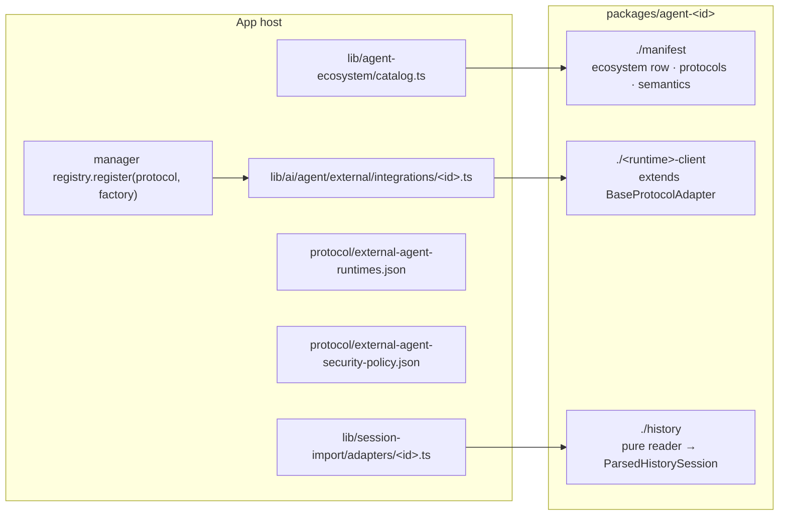

# Adding an agent

An integration is a package that knows one runtime's protocol and formats. It
never touches the machine itself, never decides policy and never stores
anything. `@cognia/agent-dsh`, `@cognia/agent-codex`, `@cognia/agent-aider` and
`@cognia/agent-pi` are the reference implementations; copy their layout.



## 1. Decide whether it needs a package

- **A plain ACP agent needs no package of its own.** It is a row in the runtime
  catalog run by the ACP client in `@cognia/agent-acp`. If it deviates from
  the protocol (its own mode names, a tool identity in metadata, a capability
  it advertises but ignores), add an `AcpVendorProfile` under
  `packages/agent-acp/src/vendors/` and list it in `vendor-profiles.ts`, or
  pass it from the host as `vendorProfiles`; the client has no vendor
  branches.
- **A runtime with its own protocol** (an RPC dialect, an SDK, a CLI per turn)
  or **its own session store** gets a package.

## 2. Create the package

`packages/agent-<id>/` with:

| File | Contents |
| --- | --- |
| `package.json` | `"private": true`, `"license": "AGPL-3.0-only"`, dist-only `exports` (`types` / `import` / `require` / `default`) per entry, dependencies `@cognia/agent-contracts` and `@cognia/agent-runtime-kit` as `workspace:*`, nothing else from `@cognia` |
| `tsconfig.json` | `paths` naming only the packages above, so an `@/…` import fails to compile |
| `tsup.config.ts` | every non-test module under `src/` as a public subpath, ESM + CJS, `dts: true` as the standalone compile check, sibling `@cognia/*` packages external |
| `LICENSE` | AGPL-3.0-only, like its siblings |
| `src/*.ts` + `src/*.test.ts` | each module with a co-located test |

Then wire the workspace: a `workspace:*` dependency in the root
`package.json` (and its `pnpm-lock.yaml` importer), the `@cognia/agent-<id>`
paths in the root `tsconfig.json`, the Jest `moduleNameMapper` in
`jest.config.ts`, `cli/tsconfig.json` if the CLI imports it, and a spec in
`scripts/build/pack-test-agent-package.mjs` listing every entry and a smoke
program.

## 3. The manifest

`./manifest` is pure data; importing it must load no runtime, process or
transport module (the pack test checks this). It exports an
`AgentIntegrationManifest` (`packages/agent-contracts/src/ecosystem.ts:81`):

- `ecosystem`: the `AgentEcosystemEntry` row: runtime ids, session source ids,
  migration vendor, root keys, plugin ecosystem, subagent and memory ids.
  `lib/agent-ecosystem/catalog.ts` lists this row instead of copying it
  (see `codexManifest.ecosystem` and `deepseekHarnessManifest.ecosystem`).
- `protocols`: for each protocol the package's adapter speaks, its
  `AgentExecutionSemantics`.

Declare semantics honestly (`packages/agent-contracts/src/semantics.ts`):

| Field | Ask |
| --- | --- |
| `cancel.scope` | Does stopping a turn end only the turn (`turn`), the session (`session`) or the process (`process`)? |
| `cancel.reconnectsAfterCancel` | Must the session be reopened after a cancel? |
| `resume` | `native`, `relaunch-with-session`, `history-replay` or `unsupported` |
| `fork` | `native`, `native-turn-boundary`, `before-entry` or `unsupported` |
| `approvals` | `per-tool-call`, `profile-fixed` or `none` |
| `processModel` | `shared`, `per-session`, `per-turn` or `remote` |

These are not decoration. The manager drops a cached session whose cancel
requires a reconnect (`cancel` in `lib/ai/agent/external/manager.ts`), and the Agent
Team never reports a session-ending cancel as a pause
(`ExternalAgentManager.cancelRetiresSession`). An adapter
that declares nothing reads as `UNDECLARED_EXECUTION_SEMANTICS`: a cancel may
take the process down, nothing resumes or forks, and approvals are asked.

## 4. The runtime client

Extend `BaseProtocolAdapter` (`packages/agent-runtime-kit/src/base-adapter.ts:123`)
and take everything machine-facing from the constructor:

- `AgentProcessHost` (`packages/agent-contracts/src/host.ts:51`) to spawn,
  write, kill, probe a command and subscribe to stdout, stderr and exit;
- `AgentFileHost` (`host.ts:81`) when the runtime keeps state in workspace
  files: every read, write and delete names its allowed roots, and
  `isWithinRoot` rejects a path before an agent process could open it outside
  the plane (Aider's chat files and context files);
- `AgentFetch` when the runtime is reached over HTTP (OpenCode services, A2A
  peers, remote ACP agents): the host's streaming fetch, never the global one;
- `AgentWebSocketFactory` for a WebSocket transport (remote ACP agents): the
  host's socket carries auth headers and obeys the proxy policy, which a bare
  `WebSocket` cannot;
- `AgentTerminalHost` when the agent asks the host to run commands in
  terminals it owns (ACP `terminal/*`, terminal authentication);
- `AgentOutboundGate`, **required**, called on every prompt or
  payload the adapter sends;
- a runtime-specific services interface for questions only the host can
  answer, typed in the package and implemented by the host (Pi's
  `PiHostServices`: verify the bundled extension, list stored sessions), never
  a string command the package invokes;
- `AgentLaunchEnvironmentResolver`, `AgentApprovalPolicy`,
  `AgentDiagnosticRedactor` (credential redaction for process output) and
  `AgentLogger` when the runtime needs them.

Implement `ExternalAgentAdapterCore`. Optional abilities (resume, fork,
steering, session models, model catalog, authentication, compaction, session
listing) are separate capabilities with guards (`supportsResume(adapter)` and
so on). Implement one only when the runtime really supports it.

Vendor-specific controls that hosts need are a typed extension, not a class
check:

```ts
export const acmeControls = defineAdapterExtension<AcmeAdapter>(
  "acme.controls",
  (adapter) => (adapter instanceof AcmeAdapter ? adapter : undefined)
)
// host side
const acme = manager.getAdapterExtension(agentId, acmeControls)
```

## 5. The history reader (when the runtime keeps sessions)

`./history` turns file content into `ParsedHistorySession`
(`packages/agent-contracts/src/history.ts:85`): neutral `HistoryPart`s, turn
usage, canonical state and an explicit list of what it dropped. Build parts
with the runtime kit's `historyText` / `historyTool` / … helpers
(`packages/agent-runtime-kit/src/history.ts`).

A reader never reads the filesystem, never builds host rows and never stores
anything. Every diagnostic string passes through `HistoryReaderHost.redactText`
(required); use `boundedDiagnostic` for records it cannot map. The host adapter
under `lib/session-import/adapters/` does discovery and maps the result with
`lib/session-import/history-to-stored.ts`.

Settings, commands, subagent and memory migration readers stay in the
migration subsystem (ADR-0107); they are not part of the package.

## 6. Register it in the host

1. **Adapter factory**: `lib/ai/agent/external/integrations/<id>.ts` (with a
   test) builds the factory with the app's process host
   (`createAgentTransportProcessHost`), its file host when needed
   (`createAgentTransportFileHost`), `hasNoLeakingPiiDeep` as the outbound
   gate and `redactCredentialText` as the diagnostic redactor (see
   `integrations/dsh.ts` and `integrations/aider.ts`). The manager registers
   it under its protocol in `registerBuiltinProtocolAdapters`.
2. **Runtime and preset rows**: author the package's catalog rows in its
   manifest (`runtimes`, one per `ecosystem.runtimeIds` entry, plus any
   `unpinnedLaunchWaivers`), add the manifest to `INTEGRATION_MANIFESTS` in
   `lib/agent-ecosystem/catalog.ts`, and run `pnpm gen:external-agent-runtimes`
   to write them into `protocol/external-agent-runtimes.json`.
   `pnpm audit:external-agent-runtimes` fails if the file drifts from the
   manifests, then checks pinning, waivers and launch parity.
3. **Capability rows**: export an `AgentCapabilityContribution` from the
   manifest (the protocol's complete row in `protocols`, preset refinements in
   `presetRefinements`), add it to `INTEGRATION_CAPABILITIES` in
   `lib/agent-ecosystem/capability-catalog.ts`, and run
   `pnpm gen:agent-capabilities` to write `protocol/agent-capabilities.json`.
   `pnpm audit:agent-capabilities` fails on drift before checking the
   manifest itself.
4. **Authorization, separately**: the spawn allowlist and approval defaults in
   `protocol/external-agent-security-policy.json` and the host's permission
   guard. Registering the package or declaring a need in its manifest
   authorizes nothing.
5. **The CLI** needs nothing per agent. It installs its external-agent host at
   boot (`installCliExternalAgentHost`, `cli/src/runtime/external/host-branch.ts`),
   so the ports built in step 1 reach its Node process backend, PTY terminals and
   hook policy. A launch command the CLI should admit goes into its spawn
   allowlist, which is authorization, not registration.

## 7. Verify

```bash
pnpm test -- packages/agent-<id>
```

```bash
node scripts/build/pack-test-agent-package.mjs agent-<id>
```

```bash
pnpm audit:external-agent-runtimes
```

```bash
pnpm audit:agent-capabilities
```

Add a manager-level test for the semantics you declared, for example that
cancelling a `process`-scoped session drops it from the cache.
