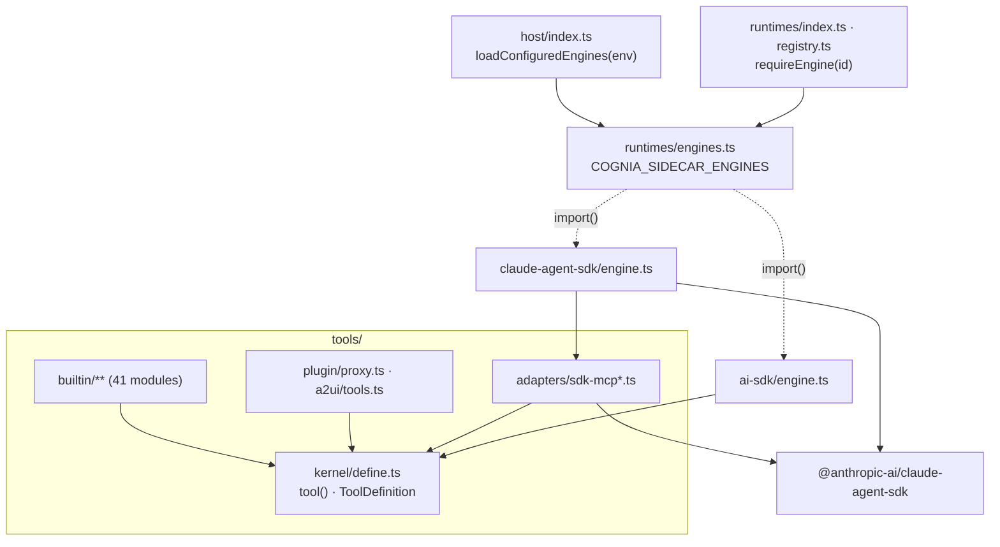

# Engines and tools

The sidecar hosts two built-in engines: the **Claude Agent SDK** engine
(`sidecar/src/runtimes/claude-agent-sdk/`) and the provider-neutral **AI SDK**
engine (`sidecar/src/runtimes/ai-sdk/`). The AI SDK engine, the host and the
builtin tools run without the Claude Agent SDK. The SDK loads only when a host
loads the Claude engine.



## Engine loading

`sidecar/src/runtimes/engines.ts` owns the engine table:

- `COGNIA_SIDECAR_ENGINES` (`ENGINES_ENV`, `engines.ts:24`) is a comma list of
  `claude-agent-sdk` and `ai-sdk`. Unset or blank loads both, which is what
  every host does today. An unknown id stops the host before it reads a frame
  (`enginesFromEnv`, `engines.ts:27`; the entry logs it and exits 1).
- `loadEngines` (`engines.ts:48`) imports each engine's facade dynamically
  (`claude-agent-sdk/engine.ts`, `ai-sdk/engine.ts`), once.
- `requireEngine(id)` (`engines.ts:61`) is how the router reaches an engine
  (`runtimes/index.ts:50`, `runtimes/registry.ts:26`). An engine the host did
  not load fails closed with `runtime engine "<id>" is not loaded on this
  host`. The turn ends with that error and no other engine stands in.
- `loadConfiguredEngines(env)` (`host/index.ts:91`) runs before the host
  accepts frames (`entry/agent-host.ts`).
- `session_api` (list, read and fork stored sessions) is a Claude Agent SDK
  feature. A host without that engine answers `session API requires the
  "claude-agent-sdk" engine, which this host did not load`.

The capability tables (`runtimes/capabilities.ts`, `runtimes/registry.ts`)
stay importable without loading any engine, so routing decisions and
capability checks do not load an engine.

Engines are not retried behind the caller's back. Each engine keeps its own
retry rules, and loading or selecting an engine adds none.

## Tools

A builtin tool is defined once, engine-neutral (illustrative):

```ts
import { tool } from "../../kernel/define.ts"

export const gitDiff = tool(
  "git_diff",
  "Show the working-tree diff",
  { path: z.string().optional() },
  async (args) => toolText(await diff(args.path)),
  { searchHint: "diff changes", alwaysLoad: false }
)
```

`tool()` (`sidecar/src/tools/kernel/define.ts:61`) returns a `ToolDefinition`
with neutral fields only (`alwaysLoad`, `searchHint`). Each engine translates
them:

| Engine | Translation |
| --- | --- |
| Claude Agent SDK | `toSdkMcpToolDefinition` (`tools/adapters/sdk-mcp.ts:77`) writes `_meta["anthropic/alwaysLoad"]` and `_meta["anthropic/searchHint"]`; `buildPluginToolsServer` and `buildA2UIBridgeServer` (`tools/adapters/sdk-mcp-{plugin,a2ui}.ts`) wrap the neutral plugin and A2UI definitions in SDK MCP servers |
| AI SDK | reads `def.alwaysLoad` and the zod schema directly |
| External agents | the MCP tool bridge serves the same definitions; `parseToolArgs` / `toolInputJsonSchema` (`tools/kernel/args.ts`) derive the advertised JSON Schema and validate arguments from the same zod shape |

The plugin round trip (`tools/plugin/proxy.ts`, `buildPluginToolDefinitions`)
and the A2UI tools (`tools/a2ui/tools.ts`, `buildA2UIToolDefinitions`) are
neutral. Only the adapters build SDK servers from them.

## The wire is SDK-free

The sidecar's `SendOptions` (`sidecar/src/shared/wire/inbound.ts`) reads its
run-mode fields from the renderer's own contract rather than from the SDK's
`Options`:

| Field | Type |
| --- | --- |
| `permissionMode` | `AgentPermissionMode` (`@cognia/agent-config-types/agent-modes`) |
| `settingSources` | `AgentSettingSource[]` |
| `effort` | `AgentEffortLevel` |
| `agents` | `Record<string, AgentDefinition>` (`@cognia/agent-config-types/claude-agent-sdk-options`) |
| `mcpServers` | `Record<string, McpServerWireConfig>` |

The renderer and the sidecar therefore share one definition. The Claude
engine's hand-off of these values to SDK `Options` is a checked assignment:
when the SDK changes a union, that hand-off stops compiling instead of the
wire quietly following the SDK.

The ledger gate is split the same way. `runtimes/common/call-ledger-gate.ts`
is engine-neutral; the envelope-mode hook that has the SDK's shape
(`buildLedgerToolHooks`) lives in `runtimes/claude-agent-sdk/ledger.ts`.

## The vendor gate

`pnpm audit:sidecar-architecture` enforces the split
(`scripts/gates/sidecar-architecture.json`, `vendorIsolation`):

- **Runtime closure.** From `entry/agent-host.ts`, `runtimes/ai-sdk/engine.ts`,
  `tools/kernel/define.ts`, `tools/plugin/proxy.ts` and `tools/a2ui/tools.ts`,
  no static value import reaches `@anthropic-ai/claude-agent-sdk`. Dynamic
  imports (the engine loader) and type-only imports do not count here.
- **`allowedIn`.** Outside `runtimes/claude-agent-sdk/`,
  `tools/adapters/sdk-mcp*`, `hooks/events*`, `hooks/native-executor*` and the
  Claude engine's test harness, nothing references the SDK at all, type-only
  imports included. The two hook modules are reached only through the
  Claude engine's `options.ts` (via `hooks/agent-hooks.ts`).

`sidecar/src/runtimes/engines.test.ts` proves it at runtime. It spawns the
real host with the SDK made unresolvable (`test-support/block-claude-agent-sdk.ts`)
and checks three things: an AI SDK turn completes against a scripted
OpenAI-compatible provider; an Anthropic turn and `session_api` are refused
with the errors above; a host asked to load the Claude engine fails to start.

## Limits

- **The engines are not npm packages.** They live in the sidecar, a separate
  Node project with its own lockfile, run unbuilt (ADR-0197) and typechecked
  and tested on its own (`pnpm sidecar:typecheck`, `pnpm sidecar:test`). Hosts consume it as
  a process: the desktop app spawns it, and the Agent SDK ships its agent host
  as `@cognia/agent-host-*` binaries.
- **The tool kernel stays in the sidecar.** `parseToolArgs` and
  `toolInputJsonSchema` call `z.object` and `z.toJSONSchema` on schemas built
  with the sidecar's own zod. A `link:` package resolves its real path into
  the root `node_modules`, so it would see a second zod copy, and the
  conversion fails open by design (an unrepresentable schema advertises an
  empty object). A copy mismatch would therefore quietly strip every tool's
  schema. Other hosts already reuse the tools through the MCP tool bridge.
- **A host built without the SDK still needs its types to typecheck the whole
  sidecar.** The engine loader's table is typed from the Claude engine's
  facade. Every module outside the allowlist above is free of SDK types.
