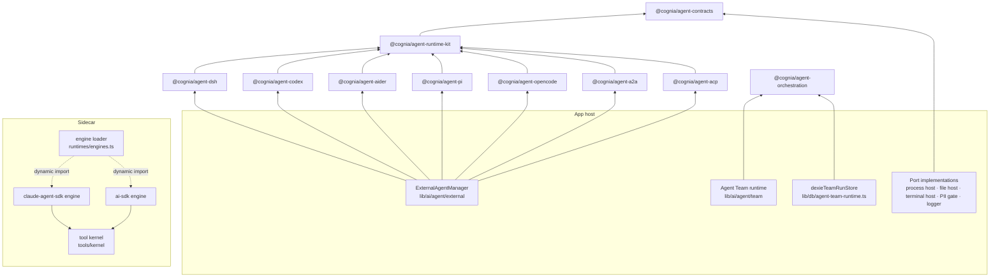

# Agent packages

# ADR-0217 · workspace packages under `packages/agent-*` · sidecar engines under `sidecar/src/runtimes/`

Agent code used to be app-private. Integrations lived next to the manager that
runs them and imported Tauri wrappers, the logger, the PII gate and the
task-workspace store directly; the durable Agent Team coordinator wrote
straight to Dexie; the AI SDK engine could not load without the Claude Agent
SDK. A second host could only reuse any of it by copying it or by swapping
modules at bundle time.

ADR-0217 moves that code behind contracts. Packages own protocols, formats and
orchestration rules; the host owns the machine, policy and persistence.

## Package structure and dependency direction

```
@cognia/agent-contracts        types and tiny pure helpers; no runtime dependency
        ▲                      (the ACP SDK is a type-only dependency, pinned exactly)
@cognia/agent-runtime-kit      BaseProtocolAdapter, JSON-RPC peer, LF frame decoder,
        ▲                      spawn reclaim, content blocks, history builders
@cognia/agent-<integration>    ./manifest, the runtime client(s), ./history when the
        ▲                      runtime keeps its own session store
        │                      (today: agent-dsh, agent-codex, agent-aider,
        │                      agent-pi, agent-opencode, agent-a2a,
        │                      agent-acp)
host (app, CLI, headless)      registers integrations, implements the ports, owns policy,
                               PII, sandbox, persistence and the mapping into its own rows

@cognia/agent-orchestration    durable team run records, the TeamRunStore port, the
                               coordinator behind host ports, decision and evidence
                               ledgers, replay safety, fair scheduling; zero dependencies

sidecar engines                claude-agent-sdk and ai-sdk under sidecar/src/runtimes/,
                               loaded per host; engine-neutral tool kernel in
                               sidecar/src/tools/kernel/
```



| Package | Entry points | Depends on |
| --- | --- | --- |
| `@cognia/agent-contracts` | `./ecosystem`, `./adapter`, `./adapter-extension`, `./semantics`, `./host`, `./history`, `./external-agent`, `./canonical-event`, … | type-only `@agentclientprotocol/sdk` |
| `@cognia/agent-runtime-kit` | `./base-adapter`, `./json-rpc-peer`, `./history`, `./prompt-gate`, `./elicitation`, `./sse`, `./config-options`, `./plugin-compat`, … | contracts |
| `@cognia/agent-dsh` | `./manifest`, `./sdk-client`, `./transport`, `./managed-launch`, … | contracts, runtime kit |
| `@cognia/agent-aider` | `./manifest`, `./cli-client`, `./history` | contracts, runtime kit |
| `@cognia/agent-pi` | `./manifest`, `./rpc-client`, `./rpc-peer`, `./rpc-events`, `./permission`, `./auth` | contracts, runtime kit |
| `@cognia/agent-opencode` | `./manifest`, `./v2-client`, `./v2-events`, `./v2-launcher`, `./discovery`, `./client` | contracts, runtime kit; peers `@opencode/client`, `@opencode-ai/sdk` |
| `@cognia/agent-a2a` | `./manifest`, `./client` | contracts, runtime kit |
| `@cognia/agent-acp` | `./manifest`, `./client`, `./devin-adapter`, `./devin-model-axis`, `./registry`, `./vendor-profile`, `./vendor-profiles`, `./vendors/<id>`, `./wire-codec`, `./feature-profile`, `./permission-input` | contracts, runtime kit, type-only `@agentclientprotocol/sdk` |
| `@cognia/agent-codex` | `./manifest`, `./app-server-client`, `./history`, `./mcp-config`, … | contracts, runtime kit |
| `@cognia/agent-orchestration` | `./coordinator`, `./store`, `./memory-store`, `./store-contract`, `./decision-ledger`, `./evidence`, … | none |

Rules every package holds:

1. **No host imports.** Never `@/…`, React, Tauri, Dexie or zustand. Each
   package's `tsconfig.json` lists only the packages it may depend on in
   `paths`, so a stray import fails to compile.
2. **Integrations depend on contracts and the runtime kit only**, never on each
   other.
3. **`./manifest` and `./history` load no runtime, process or transport
   module.** The pack test proves it through the CommonJS module cache of an
   installed tarball.
4. **Installable as an artifact.** Every package is `private`,
   AGPL-3.0-only and dist-only (`types` / `import` / `require` / `default`).
   `pnpm agent:packages:pack-test` packs it with its `@cognia` dependencies,
   installs the tarballs outside the workspace, loads every entry through ESM
   and CJS, runs a smoke program and typechecks a strict NodeNext consumer.
5. **Declaring a capability grants nothing.** A manifest says what an
   integration needs; the host's spawn allowlist, sandbox, placement,
   permission guard and audit decide what it gets.

## Who owns what

| Concern | Owner |
| --- | --- |
| Agent identity | existing sources, reused: `lib/agent-ecosystem` (rows exported by integration manifests), `protocol/external-agent-runtimes.json` (runtimes and presets), `ExternalAgentConfig.id` (instances). No new registry. |
| Protocol, session store format, execution semantics | the integration package |
| Process plane, workspace files, host terminals, network fetch and WebSockets, credentials, approval policy, PII gate, diagnostic redaction, logging | the host, through ports in `@cognia/agent-contracts/host` |
| Mapping a neutral transcript into stored messages | the host (`lib/session-import/history-to-stored.ts`) |
| Team run state | the host's `TeamRunStore` (Dexie in the app); the coordinator holds no state that survives a restart |
| Engine selection | the host process (`COGNIA_SIDECAR_ENGINES`) |

## Migration status

| Area | State |
| --- | --- |
| Contracts, runtime kit | Done: `@cognia/agent-contracts`, `@cognia/agent-runtime-kit` |
| DeepSeek Harness | Done: `@cognia/agent-dsh`; process-scoped cancel respected by the manager and the team coordinator |
| Codex | Done: `@cognia/agent-codex` (app-server adapter, history reader); native resume binds its configuration |
| Plugin adapters | Done: read against the adapter core when created (`./plugin-compat`) |
| Aider | Done: `@cognia/agent-aider` (CLI adapter over the process and file ports, history reader); per-turn semantics declared, so a cancelled Aider session is kept rather than retired |
| Pi | Done: `@cognia/agent-pi` (RPC adapter, peer, event mapping, tool table, auth probes) over the process port plus `PiHostServices`; per-session semantics with a turn-scoped `abort`. The Pi session-history reader is still in `lib/session-import` |
| OpenCode | Done: `@cognia/agent-opencode` (V2 service adapter, events, session-owned launcher, discovery, session-history reader; the legacy server adapter, which Cognia does not register) over `AgentFetch`, the process port and a placement policy |
| A2A | Done: `@cognia/agent-a2a` over `AgentFetch`; remote, task-scoped cancel. Cognia's own remote-host run plane stays in the app (scope decision in ADR-0217) |
| ACP and Devin | Done: `@cognia/agent-acp` (client, wire codec, feature profile, permission input, ACP Registry v1, the per-conversation Devin adapter) over the process, file, terminal, fetch and WebSocket ports; a turn-scoped `session/cancel` is declared, so a cancelled ACP session is kept. Vendor quirks (Kimi, Cline, Qoder, Goose, Devin, OpenCode over ACP) are `AcpVendorProfile` data the client applies; a host can supply its own profiles |
| Claude Code and session readers for the other runtimes | Not done yet (Phase 3 in progress) |
| Manager vendor branches | Done: the manager imports no vendor class; vendor controls are typed extensions (`codexAppServerExtension`, `openCodeServerExtension`, `openCodeV2Extension`, `piRpcExtension`, `acpClientExtension`, `devinAcpExtension`) and native Devin isolation lives in `integrations/acp.ts` |
| Runtime catalog rows | Done: Aider, Codex, DeepSeek Harness, OpenCode and Pi author their rows (and waivers) in `./manifest`; `pnpm gen:external-agent-runtimes` writes `protocol/external-agent-runtimes.json` and `audit:external-agent-runtimes` fails on drift. Runtimes without a package stay authored in the file |
| Protocol capability rows | Done: every protocol row of `protocol/agent-capabilities.json` and the preset refinements (`devin`, `deepseek-harness-acp`, `opencode-v2-service`) are `AgentCapabilityContribution`s in the packages' manifests; `pnpm gen:agent-capabilities` writes the file and `audit:agent-capabilities` fails on drift |
| CLI port injection | Done: the CLI installs an external-agent host at boot (`lib/ai/agent/external/host/installed-host.ts`, `installCliExternalAgentHost`); the process, terminal and hook modules delegate to it, and the esbuild aliases are deleted |
| Engines and tools | Done: the AI SDK engine and the host run without the Claude Agent SDK; the wire and shared runtime modules do not reference it, even for types |
| Orchestration | Done for run state, ledgers, coordinator, scheduling and recovery; team gates, teammate pool, wave runner and the synthesized workflow stay in the app (they are typed against the app's `AgentTeam` model) |

The full matrix, per ecosystem and satellite registry, is in
`docs/plans/2026-10-05-agent-package-architecture.md`.

## Compatibility

- **Old import paths re-export their new home**: `types/agent/external-agent.ts`,
  `types/agent/external-agent-lifecycle.ts`, `lib/agent-ecosystem/types.ts`,
  `lib/ai/agent/external/protocol-adapter.ts`, and
  `@cognia/agent-config-types/{agent-execution,canonical-session,ref-safety,external-agent-capability}`.
  `AgentPermissionMode` and `AGENT_PERMISSION_MODES` still export from the
  `@cognia/agent-config-types` root; they are declared in `./agent-modes`.
- **Stored data is unchanged.** Configurations, sessions, imported bindings and
  team run tables keep their shape; `runtimeBinding.agentConfigId` is optional
  and a binding without it resolves as before.
- **Plugin adapters** register through the same overlay; one missing a core
  member is reported when it is created, not when the manager first calls it.
- **Hosts that set nothing** load both sidecar engines, as before.
- **Upgrading a package is not a native update.** An integration package
  changes protocol handling only; the host still ships the process plane, the
  security policy, the sandbox and the Tauri commands.

## Gates

| Gate | Holds |
| --- | --- |
| `pnpm agent:packages:pack-test` (in `check-all`) | every package installs from a tarball and loads through ESM, CJS and a NodeNext consumer; manifest and history entries load no runtime code |
| `pnpm audit:sidecar-architecture` | sidecar layers; vendor isolation: the host, the AI SDK engine and the neutral tools never load the Claude Agent SDK, and only the Claude engine, its MCP adapters and the native hook executor reference it at all |
| `pnpm sidecar:typecheck`, `pnpm sidecar:test` | strict sidecar types; a spawned host with the SDK unresolvable runs an AI SDK turn and refuses Claude-only work |
| `pnpm audit:external-agent-runtimes` | the runtime and preset catalog, generated rows included (`--check`) |
| `pnpm audit:agent-capabilities` | the capability manifest, generated rows included (`--check`), against the vocabulary, the registered protocols and the Rust allowlists |
| `pnpm check:acp-v1-contract` | the pinned ACP v1 schema and SDK, and that the ACP client (`packages/agent-acp/src/client.ts`) and the companion's handler cover every stable method |
| `lib/workflow/nodes/teams/team-runtime-port.test.ts` | `lib/workflow` imports nothing from the Agent Team |
| `pnpm test` | package suites run co-located in Jest's `node` project; `audit:colocated-tests` does not scan `packages/`, so that convention is held by review, not by a gate |
