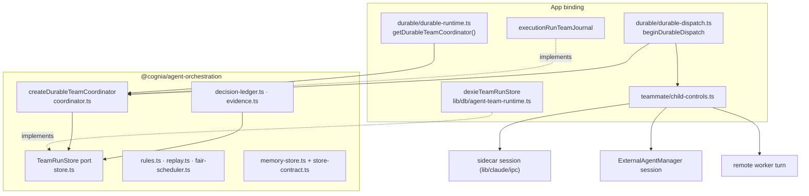

# Orchestration

`@cognia/agent-orchestration` is the host-independent core of the durable
Agent Team. It has no dependencies. It owns the run records, the persistence
rules, the coordinator (admission, fair scheduling, workspace leases,
steering, pause, takeover and recovery), the decision and evidence ledgers
and the replay-safety rules. The app supplies the database, the journal, PII
redaction, path semantics and the agents themselves.

## Who holds state

**The store is the only authority.** `TeamRunStore`
(`packages/agent-orchestration/src/store.ts`) holds runs, child runs,
dispatch leases and attempt fencing, the monotonic trajectory, checkpoints,
the steering queue, evidence, decisions and verified content.

- **Atomic changes.** `atomically(operation)` runs related writes as one unit.
  The app's `dexieTeamRunStore` (`lib/db/agent-team-runtime.ts:607`) maps it
  to a Dexie read-write transaction over every team table.
- **Compare-and-set writes.** `updateRunIfCurrent` and `updateChildIfCurrent`
  write only when the row is still what the caller read. Lease claims
  (`claimDispatchLease`, `renewDispatchLease`, `settleDispatchLease`) fence a
  dispatch attempt, so a stale executor cannot overwrite a newer one.
- **Conformance.** `store-contract.ts` is the conformance suite. The reference
  `createMemoryTeamRunStore` and the Dexie store both pass it, and a new host
  store must too.

**The coordinator holds only process-local, rebuildable state**
(`coordinator.ts:239`–`250`): live child controls, per-child writer queues,
in-flight file ownership, scheduler queues, admission waiters and the set of
paused runs. None of it survives a restart, and none needs to:
`recover()` (`coordinator.ts:664`) rebuilds from the store. For every run in
`listRecoveryCandidates()` it reads each unfinished child's latest checkpoint
and the run trajectory, then:

- replays the run (`recovering`) only when every child is replay-safe;
- otherwise parks it as `needs_input` with `uncertain_side_effect`.

It never re-runs a step that may already have had a side effect.

## Ports a host implements

`createDurableTeamCoordinator(options)` (`coordinator.ts:87`):

| Option | Contract | App binding (`lib/ai/agent/team/durable/durable-runtime.ts`) |
| --- | --- | --- |
| `store` | `TeamRunStore` | `dexieTeamRunStore` |
| `journal` | `TeamRunJournal.runPrepared` — note a run's start or resumption | `executionRunTeamJournal`, keyed by `agentTeamExecutionRunId` so the bridge and the coordinator converge on one execution row |
| `redactForPersistence` | **required**; redacted text, or `undefined` to refuse the write | `redactTeamTextForPersistence` (`@cognia/redact`) |
| `paths` | `TeamPathPolicy` — normalize, is-within-root | `appTeamPathPolicy` (`lib/files/permissions`) |
| `remoteSessions` | `TeamRemoteSessions.release` after a remote child terminates | `fleetTeamRemoteSessions` |
| `now`, `globalConcurrency`, `agingIntervalMs` | clock and scheduler tuning | defaults |

The coordinator's input is a `DurableTeamSpec`, never the app's `AgentTeam`.
`durableTeamSpec(team)` is the one mapping, so there is no second team model
to keep in sync.

## How orchestration calls agents

The coordinator never launches an agent. The app's Agent Team runtime picks
the next task, and `beginDurableDispatch`
(`lib/ai/agent/team/durable/durable-dispatch.ts:66`) wraps one teammate turn:

1. **Register.** Admission and the child row are written atomically (attempt,
   lease, ownership), through the coordinator's store.
2. **Launch.** The backend is started: a built-in engine session in the
   sidecar, an external agent session through the `ExternalAgentManager`, or
   a turn on a remote worker.
3. **Attach control.** `attachControl(control, sessionId)` hands the
   coordinator a `DurableChildControl` (`steer`, `pause`, `resume`,
   `terminate`) built for that backend by `teammate/child-controls.ts`.
4. **Capture, checkpoint, settle.** Trajectory events are captured as the
   turn streams, checkpoints are recorded, and the lease is settled when the
   turn ends.

Controls from the UI or the lead go through the coordinator:

- **Steer** persists a redacted receipt and a trajectory entry before calling
  the live control. A child with no live session, or a delivery that fails,
  keeps the receipt queued for its next turn.
- **Pause** first records the child as `pausing` (compare-and-set) and stops
  new admissions. It is cooperative and never kills an in-flight tool call.
  It then calls the control and settles the child as `paused` or
  `needs_input`.
- **Terminate** aborts admission, calls the control, records `terminated` and
  releases a remote session through `TeamRemoteSessions`.

## Execution semantics: pause is not always pause

Each backend's control is honest about what its stop reaches:

| Builder | Pause |
| --- | --- |
| `sidecarSessionControl` (`child-controls.ts:61`) | interrupt; the session survives and the child is `paused` |
| `externalSessionControl` (`child-controls.ts:32`) | asks `manager.cancelRetiresSession` **before** cancelling. If the runtime's cancel retires the session (a `process`- or `session`-scoped cancel that needs a reconnect, such as DeepSeek Harness), the session is released and the pause answers to the checkpoint |
| `remoteTurnControl` (`child-controls.ts:86`) | ends the remote turn and answers to the checkpoint; command ids derive from the dispatch lease so a replayed command is recognised |

"Answers to the checkpoint" means:

- the child is parked `paused` only when it is safe to replay;
- with an unfinished tool call it is parked `needs_input`, its session id
  cleared.

A session that no longer exists is never reported as cleanly paused. This is
pinned by a mixed built-in and external team test on one durable run
(`child-controls.test.ts`).

## Workflow composition

`lib/workflow` registers the team node kinds but runs them through an
installable port (`lib/workflow/nodes/teams/team-runtime-port.ts`). The
implementations live in `lib/ai/agent/team/workflow-nodes`, installed by the
desktop workflow provider, the headless brain and the team lifecycle. A
boundary test (`team-runtime-port.test.ts`) keeps `lib/workflow` free of
Agent Team imports, so the Team↔Workflow import cycle stays broken.

## What is still in the app

These modules are typed against the app's `AgentTeam` model
(`types/agent/agent-team.ts`, 2,165 lines, which imports twin, editor,
external-preset and PR-observe types):

- the team gates, budget guard included (`lib/ai/agent/team/gates/`);
- the teammate pool;
- the wave runner;
- the synthesized workflow.

Several of them also reach Dexie, stores or the approval bus. Moving them
means splitting that type family first. A neutral copy of it would be a
second model to keep in sync by hand, so it was not added. Launching a
teammate is likewise still app code (`dispatch-teammate.ts`). The package
sees a running teammate only through `DurableChildControl`, not through a
`TeammateExecutor` port.
