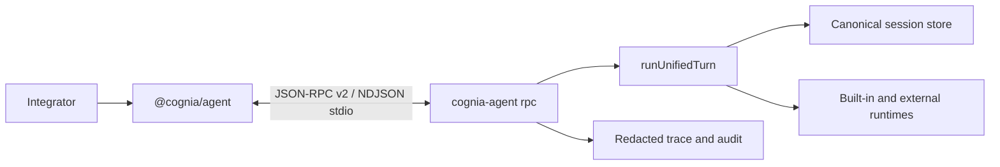

# External Agent SDK

`@cognia/agent` is a typed Node.js client for applications that want to run Cognia agents without embedding Cognia's application graph. Provider credentials, model adapters, persistence, permissions, plugins, MCP, sandbox policy, and audit data remain inside the local `cognia-agent rpc` host.



The package contains no model runtime and accepts no provider key. It discovers a version-matched optional host package for macOS arm64, Linux x64, or Windows x64, then falls back to `cognia-agent` on `PATH`. An explicit executable path and connected streams are available for managed deployments and tests. No executable is downloaded during installation or startup.

```ts
import { createCogniaClient } from "@cognia/agent"

await using client = await createCogniaClient()
await using session = await client.sessions.create({ name: "release-fix" })

const events = session.events()
const outcome = await session.run("Diagnose and fix the failing build")
```

The host advertises the methods it actually implements during initialization. A method absent from that list fails with `unsupported_capability`; the host does not return a success-shaped placeholder.

## Implementation map

| Responsibility | Authority |
| --- | --- |
| Public client and reverse callbacks | `packages/agent/src/client.ts` |
| Protocol schemas and method map | `packages/agent/src/rpc/protocol.ts` |
| Host discovery | `packages/agent/src/host.ts` |
| RPC framing, negotiation, limits | `cli/src/agent/rpc/server.ts` |
| Session/runtime composition | `cli/src/agent/rpc/runtime-service.ts` |
| Canonical persistence and branching | `cli/src/agent/session-store/store.ts` |
| Durable actions and receipts | `cli/src/agent/rpc/durable-state.ts` |

This is separate from the plugin-only `ctx.agent` API. The external SDK crosses a process boundary and owns reconnect, replay, host discovery, and protocol compatibility.
