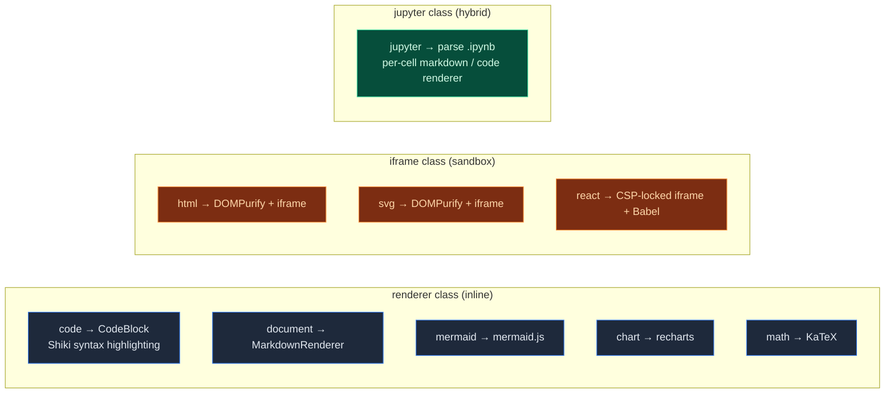

# Artifacts / Sandbox

<Status variant="stable" />

<TLDR>
  When the model generates HTML / SVG / React / Mermaid / Chart / Math / Jupyter, cognia-next wraps it into an
  `Artifact` row written to the Zustand store, then renders it in the UI through one of 9 renderers. HTML / SVG / React go through iframe +
  DOMPurify + CSP triple isolation; the rest go through a React inline renderer. `lib/sandbox/`
  is a standalone code-execution sandbox surface — currently a stub on the Web side; the desktop Python path is implemented in [./canvas](./canvas).
</TLDR>

<StatGrid>
  <Stat
    label="Artifact Types"
    value="9"
    hint="code · document · svg · html · react · mermaid · chart · math · jupyter"
  />
  <Stat label="Iframe Sandbox Types" value="3" hint="html · svg · react" />
  <Stat label="Preview-Friendly Types" value="8" hint="PREVIEWABLE_TYPES" />
  <Stat label="Designable Types" value="3" hint="html · react · svg" />
</StatGrid>

## Conceptual Distinctions

There are three related but distinct concepts in cognia-next. Let's clarify them first:

| Concept      | Role                                        | Isolation Mechanism                               |
| ------------ | ------------------------------------------- | ------------------------------------------------- |
| **Artifact** | One-shot model output (HTML / React / SVG…) | iframe + CSP + DOMPurify (varies by type)         |
| **Canvas**   | User-editable code / documents              | Monaco inside the main React tree; no isolation   |
| **A2UI**     | Interactive declarative UI assembled by the model via MCP tools | Directory whitelist + no inline script strings |
| **Sandbox**  | Runtime for executing code (Python / JS / …) | Web stub / real subprocess on desktop (see below) |

Artifacts and Canvas often connect: the user sees an artifact in chat, clicks "Open in Canvas", and the artifact is promoted to an editable document (`lib/artifacts/reveal.ts`). See [./canvas](./canvas) for details.

## Code Locations

<Files>
  <Folder name="lib/artifacts/" defaultOpen>
    <File name="index.ts — barrel exports" />
    <File name="constants.ts — 9 types, extensions, colors, language mappings, detection regexes" />
    <File name="preview-utils.ts — DOMPurify sanitization + React iframe shell HTML" />
    <File name="diff.ts — Artifact version diff" />
    <File name="source-metadata.ts — Content fingerprint (FNV-1a), message deduplication" />
    <File name="reveal.ts — revealArtifactInWorkspace (Artifact → Canvas)" />
    <File name="renderer-registry.ts — Plugin renderer registration (PluginArtifactRenderer)" />
    <File name="utils.ts — General utilities" />
  </Folder>
  <Folder name="lib/sandbox/">
    <Folder name="web/">
      <File name="index.ts — getWebSandboxService() (currently a stub; executeCode returns ok:false)" />
    </Folder>
  </Folder>
  <Folder name="components/artifacts/">
    <File name="artifact-panel.tsx — Right-side Sheet container, Tabs switch between preview/code/version/designer" />
    <File name="artifact-preview.tsx — 9-type dispatch renderer" />
    <File name="artifact-renderers.tsx — Inline renderer for non-iframe types + plugin host" />
    <File name="runtime-adapters.ts — Per-type transport / sandbox / export format table" />
    <File name="artifact-card.tsx · artifact-list.tsx — In-message card + list view" />
    <File name="artifact-create-button.tsx — Manual creation" />
    <File name="artifact-icons.tsx — Icons for all 9 types" />
    <File name="chart-renderer.tsx — recharts driver" />
    <File name="jupyter-renderer.tsx — .ipynb cell + output rendering" />
    <File name="panel-version-history.tsx · version-diff-view.tsx — Version history" />
    <File name="panel-designer-wrapper.tsx — Designer entry point (not enabled in cognia-next)" />
  </Folder>
  <Folder name="stores/artifact/">
    <File name="artifact-store.ts — useArtifactStore (holds both artifacts and canvasDocuments)" />
  </Folder>
  <Folder name="types/">
    <File name="artifact/artifact.ts — Artifact / ArtifactType / Metadata interfaces" />
    <File name="system/sandbox.ts — SandboxExecutionResult interface" />
  </Folder>
</Files>

## Nine Artifact Types



Authoritative table from `lib/artifacts/runtime-adapters.ts:ARTIFACT_RUNTIME_ADAPTERS`:

| Type       | transport | sandbox property    | Previewable | Designable |
| ---------- | --------- | ------------------- | :---------: | :--------: |
| `code`     | renderer  | —                   |     No      |     No     |
| `document` | renderer  | —                   |    Yes      |     No     |
| `svg`      | iframe    | `allow-same-origin` |    Yes      |    Yes     |
| `html`     | iframe    | `allow-same-origin` |    Yes      |    Yes     |
| `react`    | iframe    | `allow-scripts`     |    Yes      |    Yes     |
| `mermaid`  | renderer  | —                   |    Yes      |     No     |
| `chart`    | renderer  | —                   |    Yes      |     No     |
| `math`     | renderer  | —                   |    Yes      |     No     |
| `jupyter`  | jupyter   | —                   |    Yes      |     No     |

Note that `react` uses `allow-scripts` but **not** `allow-same-origin` — deliberately cutting off the iframe's access to the parent page's DOM; communication goes through `postMessage`.

## Type Detection

`lib/artifacts/constants.ts:DETECTION_PATTERNS` uses regexes to classify code blocks:

```ts
html:    [/<!DOCTYPE\s+html/i, /<html[\s>]/i, /<head[\s>]/i, /<body[\s>]/i]
react:   [/import\s+(?:React|{[^}]*})\s+from\s+['"]react['"]/, /<[A-Z]\w*[\s/>]/, ...]
svg:     [/<svg[\s>]/i, /xmlns="http:\/\/www\.w3\.org\/2000\/svg"/]
mermaid: [/^(graph|flowchart|sequenceDiagram|classDiagram|...)/m]
chart:   [/\[\s*{\s*"name"\s*:\s*"[^"]+"\s*,\s*"value"\s*:/, ...]
math:    [/\$\$[\s\S]+?\$\$/, /\\begin\{(equation|align|...)/, ...]
jupyter: [/"cells"\s*:\s*\[/, /"cell_type"\s*:\s*"(code|markdown)"/, /"nbformat"\s*:/]
```

When a chat message arrives, `useChatStore` routes code blocks and inline content to `useArtifactStore`. A detection hit creates an artifact automatically. `ALWAYS_CREATE_TYPES` forces creation (e.g. mermaid, chart) regardless of line count; other types have a minimum line threshold.

## HTML / SVG Security

`lib/artifacts/preview-utils.ts:renderHTML` and `renderSVG`:

```ts title="lib/artifacts/preview-utils.ts (excerpt)"
export function renderHTML(doc: Document, content: string): void {
  const sanitized = DOMPurify.sanitize(content, {
    WHOLE_DOCUMENT: true,
    ADD_TAGS: ["style", "link", "meta"],
    ADD_ATTR: ["target", "rel", "class", "id", "style"],
    ALLOW_DATA_ATTR: true,
  })
  doc.open()
  doc.write(sanitized)
  doc.close()
}

export function renderSVG(doc: Document, content: string): void {
  const sanitized = DOMPurify.sanitize(content, {
    USE_PROFILES: { svg: true, svgFilters: true },
    ADD_TAGS: ["style"],
  })
  // Writes a centered container + injects the sanitized SVG
}
```

Key points:

- **DOMPurify** removes all event handlers (`onload`, `onclick`…), `javascript:` URLs, inline scripts, and other known XSS vectors.
- **iframe `sandbox="allow-same-origin"`** still lets the iframe read its own document, but **does not allow top navigation** — even if the sanitizer misses a `<a target="_top">`, it cannot break out.
- We deliberately omit `allow-scripts` — HTML and SVG artifacts are for **static display only**.

## React Preview (CSP + postMessage)

React artifacts are the trickiest — they need to run JSX while remaining isolated. The solution is to pass code **through postMessage**, never string-interpolating it into HTML:

```ts title="lib/artifacts/preview-utils.ts:getReactShellHtml (core)"
<meta http-equiv="Content-Security-Policy" content="
  default-src 'none';
  script-src 'unsafe-inline' 'unsafe-eval' https://unpkg.com https://cdn.tailwindcss.com;
  style-src 'unsafe-inline' https://cdn.tailwindcss.com;
  img-src data: blob:;
  font-src data:;
">
<script src="https://unpkg.com/react@19/umd/react.development.js"></script>
<script src="https://unpkg.com/react-dom@19/umd/react-dom.development.js"></script>
<script src="https://unpkg.com/@babel/standalone/babel.min.js"></script>
<script src="https://cdn.tailwindcss.com"></script>

window.addEventListener("message", (event) => {
  if (event.data?.type !== "render-component") return
  const code = event.data.code
  // Inject code as <script type="text/babel">, Babel transpiles, then ReactDOM.render
})
```

Four layers of defense:

1. **`allow-scripts` but NOT `allow-same-origin`** — the iframe cannot read the parent DOM, access cookies, or touch localStorage.
2. **CSP `default-src 'none'`** — prevents any code inside the iframe from `fetch()`ing other origins; only the explicitly listed unpkg + tailwindcss CDNs can load.
3. **postMessage code injection** — code never enters HTML through template literals (eliminating the possibility of injecting a new `<script>` via template strings). The parent constructs messages with JSON.stringify + `</` escaping, preventing any "close script tag" attack.
4. **CDN load watchdog** — if React fails to load within 15 seconds, a "CDN load failed" message is shown, making it easy to diagnose offline / restricted-network scenarios.

Error bubbling: iframe internal error → `postMessage({type: "artifact-preview-error", message})` → parent `setError` → red Alert + retry button.

## Mermaid / Chart / Math — Why No iframe?

All three are **deterministic** verified outputs:

- **Mermaid** — DSL text; the renderer (`mermaid.js`) guarantees SVG output.
- **Chart** — Our own recharts wrapper, accepting only declarative JSON.
- **Math** — KaTeX rendering, pure string-to-MathML conversion.

There is no possibility of arbitrary JS execution, so an iframe sandbox would be wasteful. Inline rendering makes interactions (hover tooltips, chart zoom, math selection) smoother.

## Jupyter

`.ipynb` is a JSON array where each cell has a `cell_type` and `outputs[]`.
`jupyter-renderer.tsx`:

1. JSON parse, validate that `cells` is an array — failure shows a "Unable to parse notebook" error.
2. Each cell is handled according to `cell_type`:
   - `markdown` → `MarkdownRenderer` (inherits the chat message markdown pipeline; KaTeX + Shiki are already wired).
   - `code` → `CodeBlock` shows the source, with `outputs[]` below:
     - `stream` → terminal-style `<pre>`.
     - `display_data` / `execute_result` → pick the best mime (`image/png` → ``, `text/html` → restricted rendering, `text/plain` → `<pre>`).
3. **No** "click to execute cell" support — cognia-next delegates editable notebooks to Canvas (`Open in Canvas` promotes .ipynb to an executable document).

## Plugin Renderer Extensions

`lib/artifacts/renderer-registry.ts:registerArtifactRenderer()` lets [plugins](./plugin-system) register their own renderers:

```ts title="lib/artifacts/renderer-registry.ts"
interface PluginArtifactRenderer {
  id: string // stable id scoped to the plugin
  type?: string // used as UI label (namespaced "<pluginId>:<type>")
  name?: string
  canRender(artifact: Artifact): boolean
  render(artifact: Artifact, container?: HTMLElement): ReactElement | null
  priority?: number // higher wins when multiple renderers compete
}
```

`resolveRegisteredArtifactRenderer()` asks the registry before falling back to built-in renderers in `ArtifactPreview` — if a plugin claims it, the plugin path is used; otherwise it falls back to the built-in renderer.

cognia-next's main process currently **does not enable** the plugin runtime (`registerArtifactRenderer` always returns empty), but the interface is compatible with upstream Cognia; when the plugin path is added later, this is already wired. See [./plugin-system](./plugin-system) — that sandbox model (one Web Worker per plugin, postMessage RPC) can coexist with the iframe model on this page.

## `lib/sandbox/` (Code Execution)

This is a **separate** sandbox from artifact rendering — for "running code":

```ts title="lib/sandbox/web/index.ts (current state)"
const stub: WebSandboxService = {
  isAvailable: () => false,
  isLanguageSupported: () => false,
  execute: async (req) => ({
    ok: false,
    error: `Web sandbox is not yet available; cannot execute ${req.language}.`,
    durationMs: 0,
  }),
}
```

The Web side is currently a **placeholder stub** — returning `ok: false` rather than throwing `Cannot find module`, so the upper layer ([plugin system](./plugin-system)'s `executeCode` API) can produce a meaningful error message.

The desktop code-execution path splits into two:

1. **Python** — `src-tauri/src/canvas/python_exec.rs:canvas_run_python` actually spawns a system `python` subprocess. See [./canvas](./canvas).
2. **JavaScript / TypeScript** — goes through the react/html artifact iframe, essentially "preview" rather than "run".

To add Pyodide / WebContainer / Worker paths in the future, replace the body of `lib/sandbox/web/index.ts`; the type signature (`SandboxExecutionResult`) remains compatible.

## Artifact Storage

`stores/artifact/artifact-store.ts:useArtifactStore` is the single source of truth:

```ts
interface ArtifactStoreState {
  artifacts: Record<string, Artifact>       // id-keyed dictionary
  canvasDocuments: Record<string, CanvasDocument>  // canvas promotion path
  activeArtifactId: string | null
  recentArtifactIds: string[]               // LRU
  // ...
  createArtifact, updateArtifact, removeArtifact, ...
}
```

- **LRU capacity cap** — `MAX_PERSISTED_ARTIFACTS`; evicts the least recently accessed when exceeded.
- **Persistence** — `persist` middleware writes to the `cognia-artifacts` localStorage key (inherits upstream Cognia namespace).
- **Rehydrate hook** — `rehydrateArtifact()` fills in missing fields and deserializes Dates on restore.
- **Fingerprint deduplication** — `lib/artifacts/source-metadata.ts:buildArtifactSourceFingerprint()` uses FNV-1a hashing on content from the same message, preventing a single code block from being detected twice and creating duplicate artifact rows.

`reveal.ts:revealArtifactInWorkspace(id)` is the unified entry point for "open the right panel + switch to the artifact tab + set active" — used by chat cards, version history, and CLI commands alike.

## ArtifactPanel UI

`components/artifacts/artifact-panel.tsx`:

- **Sheet container** — slides out from the right, width is resizable. Title / Actions / Content three-part layout.
- **Tabs** — `preview` / `code` / `versionHistory` / `designer` (designer is not wired in cognia-next; button is hidden).
- **Code tab** — Monaco editor (lazy-loaded), infers `getMonacoLanguage()` from artifact type, uses `vs-dark` in dark mode.
- **Preview tab** — `<ArtifactPreview artifact={...} />` dispatches to the correct renderer.
- **Runtime health badge** — iframe loading / error / ready states shown in the top-right corner for easy debugging.
- **Copy / Download / Show in file manager** — limited by `runtime-adapters.ts:exportFormats` (html can "download as html", code can only do "raw").
- **Plugin extension slot** — `PluginExtensionSlot` lets plugins append custom action buttons.

## Tests

| File                                                  | Coverage                                      |
| ----------------------------------------------------- | --------------------------------------------- |
| `lib/artifacts/constants.test.ts`                     | Type mappings, detection regexes              |
| `lib/artifacts/preview-utils.test.ts`                 | DOMPurify config, React shell HTML generation |
| `lib/artifacts/diff.test.ts`                          | Version diff edge cases                       |
| `lib/artifacts/source-metadata.test.ts`               | Fingerprint stability                         |
| `lib/artifacts/reveal.test.ts`                        | Reveal behavior / fallback on missing id      |
| `lib/artifacts/renderer-registry.test.ts`             | Register / unregister / priority / canRender error protection |
| `lib/artifacts/utils.test.ts` `preview-utils.test.ts` | Pure utility function tests                   |
| `lib/sandbox/web/index.test.ts`                       | Stub return values; executeCode error paths   |
| `components/artifacts/artifact-preview.test.tsx`      | All 9 type renderings + error fallback        |
| `components/artifacts/artifact-renderers.test.tsx`    | Plugin host collaboration                     |
| `components/artifacts/jupyter-renderer.test.tsx`      | Broken JSON / empty cell / mime selection     |

## Where to Start

| Goal                                          | Files                                                                                                            |
| --------------------------------------------- | ---------------------------------------------------------------------------------------------------------------- |
| Add a new artifact type                       | `types/artifact/artifact.ts:ArtifactType` → `lib/artifacts/constants.ts` → `runtime-adapters.ts` → implement renderer |
| Adjust React iframe CSP                       | `lib/artifacts/preview-utils.ts:getReactShellHtml` `meta http-equiv`                                             |
| Change HTML/SVG to `allow-scripts`            | `runtime-adapters.ts` (strongly discouraged — removes a security layer)                                          |
| Add new Mermaid diagram types                 | `lib/artifacts/constants.ts:MERMAID_TYPE_NAMES` + `MERMAID_TYPE_I18N_KEYS`                                       |
| Actually implement Web sandbox                | Replace `lib/sandbox/web/index.ts` body, keep `SandboxExecutionService` interface                                |
| Let plugins register custom renderers         | `lib/artifacts/renderer-registry.ts` + plugin API ([plugin-system](./plugin-system))                             |

## Next

<Cards>
  <Card title="Canvas" href="./canvas" description="Editable document form; the promotion target for Artifacts" />
  <Card
    title="Plugin System"
    href="./plugin-system"
    description="Worker sandbox + custom artifact renderer"
  />
  <Card title="Chat & Skills" href="./chat-and-skills" description="How the message stream drives artifact creation" />
</Cards>
