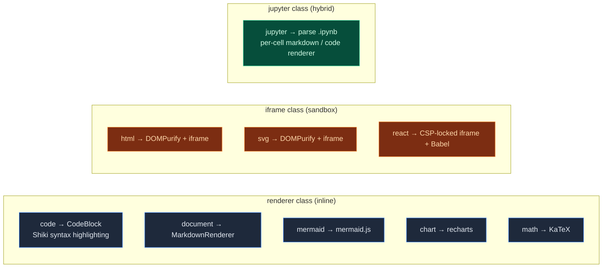

# Artifacts / Sandbox

<Status variant="stable" />

<Callout type="info">
  This page covers the **rendering sandbox** — the iframe + CSP + DOMPurify isolation for one-shot
  model artifacts. It is one of four sandbox families in cognia-next. For the execution sandbox
  (ADR-0028 OS / microVM tiers), the CUA remote desktop sandbox, and plugin isolation, see the
  [Sandbox System](./sandbox) section.
</Callout>

<TLDR>
  When the model generates HTML / SVG / React / Mermaid / Chart / Math / Jupyter, cognia-next wraps
  it into an `Artifact` row written to the Zustand store, then renders it in the UI through one of 9
  renderers. HTML / SVG / React go through iframe + DOMPurify + CSP triple isolation; the rest go
  through a React inline renderer. Running code is a different surface entirely —
  `lib/native/code-execution-strategy.ts`, described below and in [./canvas](./canvas).
</TLDR>

<StatGrid>
  <Stat
    label="Artifact Types"
    value="9"
    hint="code · document · svg · html · react · mermaid · chart · math · jupyter"
  />
  <Stat label="Iframe Sandbox Types" value="3" hint="html · svg · react" />
  <Stat label="Preview-Friendly Types" value="8" hint="PREVIEWABLE_TYPES" />
  <Stat label="Designable Types" value="3" hint="html · react · svg" />
</StatGrid>

## Conceptual Distinctions

There are three related but distinct concepts in cognia-next. Let's clarify them first:

| Concept      | Role                                                            | Isolation Mechanism                               |
| ------------ | --------------------------------------------------------------- | ------------------------------------------------- |
| **Artifact** | One-shot model output (HTML / React / SVG…)                     | iframe + CSP + DOMPurify (varies by type)         |
| **Canvas**   | User-editable code / documents                                  | Monaco inside the main React tree; no isolation   |
| **A2UI**     | Interactive declarative UI assembled by the model via MCP tools | Directory whitelist + no inline script strings    |
| **Sandbox**  | Runtime for executing code (Python / JS / …)                    | `sandbox="allow-scripts"` iframe everywhere; Python subprocess on desktop |

Artifacts and Canvas often connect: the user sees an artifact in chat, clicks "Open in Canvas", and the artifact is promoted to an editable document (`lib/artifacts/reveal.ts`). See [./canvas](./canvas) for details.

## Code Locations

<Files>
  <Folder name="lib/artifacts/" defaultOpen>
    <File name="index.ts — barrel exports" />
    <File name="constants.ts — 9 types, extensions, colors, language mappings, detection regexes" />
    <File name="preview-utils.ts — DOMPurify sanitization + React iframe shell HTML" />
    <File name="diff.ts — Artifact version diff" />
    <File name="source-metadata.ts — Content fingerprint (FNV-1a), message deduplication" />
    <File name="reveal.ts — revealArtifactInWorkspace (Artifact → Canvas)" />
    <File name="renderer-registry.ts — Plugin renderer registration (PluginArtifactRenderer)" />
    <File name="utils.ts — General utilities" />
  </Folder>
  <Folder name="components/artifacts/">
    <File name="artifact-panel.tsx — Right-side Sheet container, Tabs switch between preview/code/version/designer" />
    <File name="artifact-preview.tsx — 9-type dispatch renderer" />
    <File name="artifact-renderers.tsx — Inline renderer for non-iframe types + plugin host" />
    <File name="runtime-adapters.ts — Per-type transport / sandbox / export format table" />
    <File name="artifact-card.tsx · artifact-list.tsx — In-message card + list view" />
    <File name="artifact-create-button.tsx — Manual creation" />
    <File name="artifact-icons.tsx — Icons for all 9 types" />
    <File name="chart-renderer.tsx — recharts driver" />
    <File name="jupyter-renderer.tsx — .ipynb cell + output rendering" />
    <File name="panel-version-history.tsx · version-diff-view.tsx — Version history" />
    <File name="panel-designer-wrapper.tsx — Designer entry point (not enabled in cognia-next)" />
  </Folder>
  <Folder name="stores/artifact/">
    <File name="artifact-store.ts — useArtifactStore (holds both artifacts and canvasDocuments)" />
  </Folder>
  <Folder name="types/">
    <File name="artifact/artifact.ts — Artifact / ArtifactType / Metadata interfaces" />
    <File name="system/sandbox.ts — SandboxExecutionResult interface" />
  </Folder>
</Files>

## Nine Artifact Types



Authoritative table from `lib/artifacts/runtime-adapters.ts:ARTIFACT_RUNTIME_ADAPTERS`:

| Type       | transport | sandbox property    | Previewable | Designable |
| ---------- | --------- | ------------------- | :---------: | :--------: |
| `code`     | renderer  | —                   |     No      |     No     |
| `document` | renderer  | —                   |     Yes     |     No     |
| `svg`      | iframe    | `allow-same-origin` |     Yes     |    Yes     |
| `html`     | iframe    | `allow-same-origin` |     Yes     |    Yes     |
| `react`    | iframe    | `allow-scripts`     |     Yes     |    Yes     |
| `mermaid`  | renderer  | —                   |     Yes     |     No     |
| `chart`    | renderer  | —                   |     Yes     |     No     |
| `math`     | renderer  | —                   |     Yes     |     No     |
| `jupyter`  | jupyter   | —                   |     Yes     |     No     |

Note that `react` uses `allow-scripts` but **not** `allow-same-origin` — deliberately cutting off the iframe's access to the parent page's DOM; communication goes through `postMessage`.

## Type Detection

`lib/artifacts/constants.ts:DETECTION_PATTERNS` uses regexes to classify code blocks:

```ts
html:    [/<!DOCTYPE\s+html/i, /<html[\s>]/i, /<head[\s>]/i, /<body[\s>]/i]
react:   [/import\s+(?:React|{[^}]*})\s+from\s+['"]react['"]/, /<[A-Z]\w*[\s/>]/, ...]
svg:     [/<svg[\s>]/i, /xmlns="http:\/\/www\.w3\.org\/2000\/svg"/]
mermaid: [/^(graph|flowchart|sequenceDiagram|classDiagram|...)/m]
chart:   [/\[\s*{\s*"name"\s*:\s*"[^"]+"\s*,\s*"value"\s*:/, ...]
math:    [/\$\$[\s\S]+?\$\$/, /\\begin\{(equation|align|...)/, ...]
jupyter: [/"cells"\s*:\s*\[/, /"cell_type"\s*:\s*"(code|markdown)"/, /"nbformat"\s*:/]
```

When a chat message arrives, `useChatStore` routes code blocks and inline content to `useArtifactStore`. A detection hit creates an artifact automatically. `ALWAYS_CREATE_TYPES` forces creation (e.g. mermaid, chart) regardless of line count; other types have a minimum line threshold.

### The model can also just ask (ADR-0158)

Detection is the fallback, not the only path. Eight tools —
`artifact_{create,update,read,delete}` and `canvas_{create,update,read,open}` —
are published through the host-routed builtin-tool relay
(`lib/claude/artifact-builtin-tools.ts`, executed by `lib/claude/plugin-tool-ipc.ts`),
which is what lets a chart artifact carry its `chartType` and a real title:
neither is recoverable from a fenced block by regex.

Three rules worth knowing before touching this:

- **The `ArtifactPart` is emitted from `tool_result`, never `tool_use`.** A
  `tool_use` block arrives before the row exists, so a part built from it points
  at an id that does not resolve — which is what rendered the "content cleared"
  placeholder. `lib/artifacts/tool-part.ts` is the single converter both message
  paths call.
- **`types/agent/tool.ts` is a pinned contract.** A test asserts the union equals
  what `buildArtifactManifestEntries()` + `buildCanvasManifestEntries()` publish,
  so a declared-but-unimplemented name is a red test rather than a wish list.
- **The manifest and ADR-0139's routing prompt share one gate.** Both are hoisted
  off the same predicate in `lib/claude/build-options.ts`, so the resident prompt
  can never advertise a surface whose tools are absent. IM-bound sessions get
  neither; `settings.artifacts.agentAuthoring: false` opts out.

`artifact_update` passes through the same "Review before apply" gate a heuristic
revision does, and `artifact_delete` is the one name registered as `ask`.

### Diagram Design renderer profile

HTML fences containing `<meta name="cognia-renderer" content="diagram-design-v1">` remain normal `html` artifacts, but detection persists `metadata.rendererProfile = "diagram-design-v1"`. The field is additive, so existing and unmarked HTML artifacts need no migration; unknown markers receive no special behavior.

The profile adds two preview guarantees:

- `ArtifactPreview` mirrors the active `background`, `card`, `foreground`, `muted-foreground`, `primary`, `primary-foreground`, `border`, `info`, and `chart-1` through `chart-5` CSS variables into the iframe. Theme and custom-theme changes update only the iframe root variables; the generated HTML is not rewritten.
- The sanitizer removes `<link>`, CSS `@import`, and network-capable `src`, `href`, `srcset`, `poster`, `background`, `data`, and `url()` values. Fragment URLs such as `url(#arrow)` / `url(#shadow)` and safe `data:image/*` values remain available for inline SVG.

The bundled `Diagram Design` Skill produces this profile as complete HTML with inline SVG. It is enabled for compact implicit discovery by default, while its full instructions and 27 type references remain behind `load_skill` / `load_skill_resource`.

## HTML / SVG Security

`lib/artifacts/preview-utils.ts:renderHTML` and `renderSVG`:

```ts title="lib/artifacts/preview-utils.ts (excerpt)"
export function renderHTML(doc: Document, content: string): void {
  const sanitized = DOMPurify.sanitize(content, {
    WHOLE_DOCUMENT: true,
    ADD_TAGS: ["style", "link", "meta"],
    ADD_ATTR: ["target", "rel", "class", "id", "style"],
    ALLOW_DATA_ATTR: true,
  })
  doc.open()
  doc.write(sanitized)
  doc.close()
}

export function renderSVG(doc: Document, content: string): void {
  const sanitized = DOMPurify.sanitize(content, {
    USE_PROFILES: { svg: true, svgFilters: true },
    ADD_TAGS: ["style"],
  })
  // Writes a centered container + injects the sanitized SVG
}
```

Key points:

- **DOMPurify** removes all event handlers (`onload`, `onclick`…), `javascript:` URLs, inline scripts, and other known XSS vectors.
- **iframe `sandbox="allow-same-origin"`** still lets the iframe read its own document, but **does not allow top navigation** — even if the sanitizer misses a `<a target="_top">`, it cannot break out.
- We deliberately omit `allow-scripts` — HTML and SVG artifacts are for **static display only**.

## React Preview (CSP + postMessage)

React artifacts are the trickiest — they need to run JSX while remaining isolated. The solution is to pass code **through postMessage**, never string-interpolating it into HTML:

<Callout>
  **Everything the frame runs is local.** A sandboxed `about:srcdoc` child
  inherits the packaged shell's CSP (measured — see
  [ADR-0158](../adr/0158-artifacts-and-canvas)), which grants neither
  `'unsafe-inline'` nor `'unsafe-eval'` and names no third-party origin. Only a
  same-origin `<script src>` and a `blob:` script run there, so the shell is
  built out of exactly those two. The bundles are committed under
  `public/artifact-runtime/` by `scripts/build/build-artifact-runtime.mjs`, the
  way `public/monaco` is.
</Callout>

```ts title="lib/artifacts/preview-utils.ts:getReactShellHtml (core)"
<meta http-equiv="Content-Security-Policy" content="
  default-src 'none';
  script-src <shell-origin> blob:;   // intersects with the inherited policy
  style-src 'unsafe-inline';
  img-src data: blob:;
  font-src data:;
  connect-src 'none';
">
<script src="<shell-origin>/artifact-runtime/react-runtime.js"></script>
<script src="<shell-origin>/artifact-runtime/artifact-shell.js"></script>

// The host compiles JSX in a Worker and posts plain JS in; the bootstrap runs it
// as a blob: script and calls render() on ONE long-lived root.
window.addEventListener("message", (event) => {
  if (event.data?.type !== "render-component") return
})
```

Four layers of defense:

1. **`allow-scripts` but NOT `allow-same-origin`** — the iframe cannot read the parent DOM, access cookies, or touch localStorage.
2. **CSP `default-src 'none'` with `connect-src 'none'`** — no code inside the iframe can reach the network at all; the only loadable scripts are the two same-origin bundles and the `blob:` the bootstrap creates.
3. **postMessage code injection** — code never enters HTML through template literals (eliminating the possibility of injecting a new `<script>` via template strings). The parent constructs messages with JSON.stringify + `</` escaping, preventing any "close script tag" attack.
4. **Immediate failure when the runtime is missing** — if the local runtime cannot be fetched the preview says "the artifact runtime failed to initialize" and names `pnpm artifact-runtime:build`, instead of waiting out a 15-second CDN timeout.

Error bubbling: iframe internal error → `postMessage({type: "artifact-preview-error", message})` → parent `setError` → red Alert + retry button.

## Mermaid / Chart / Math — Why No iframe?

All three are **deterministic** verified outputs:

- **Mermaid** — DSL text; the renderer (`mermaid.js`) guarantees SVG output.
- **Chart** — Our own recharts wrapper, accepting only declarative JSON.
- **Math** — KaTeX rendering, pure string-to-MathML conversion.

There is no possibility of arbitrary JS execution, so an iframe sandbox would be wasteful. Inline rendering makes interactions (hover tooltips, chart zoom, math selection) smoother.

## Jupyter

`.ipynb` is a JSON array where each cell has a `cell_type` and `outputs[]`.
`jupyter-renderer.tsx`:

1. JSON parse, validate that `cells` is an array — failure shows a "Unable to parse notebook" error.
2. Each cell is handled according to `cell_type`:
   - `markdown` → `MarkdownRenderer` (inherits the chat message markdown pipeline; KaTeX + Shiki are already wired).
   - `code` → `CodeBlock` shows the source, with `outputs[]` below:
     - `stream` → terminal-style `<pre>`.
     - `display_data` / `execute_result` → pick the best mime (`image/png` → ``, `text/html` → restricted rendering, `text/plain` → `<pre>`).
3. **No** "click to execute cell" support — cognia-next delegates editable notebooks to Canvas (`Open in Canvas` promotes .ipynb to an executable document).

## Plugin Renderer Extensions

`lib/artifacts/renderer-registry.ts:registerArtifactRenderer()` lets [plugins](./plugin-system) register their own renderers:

```ts title="lib/artifacts/renderer-registry.ts"
interface PluginArtifactRenderer {
  id: string // stable id scoped to the plugin
  type?: string // used as UI label (namespaced "<pluginId>:<type>")
  name?: string
  canRender(artifact: Artifact): boolean
  render(artifact: Artifact, container?: HTMLElement): ReactElement | null
  priority?: number // higher wins when multiple renderers compete
}
```

`resolveRegisteredArtifactRenderer()` asks the registry before falling back to built-in renderers in `ArtifactPreview` — if a plugin claims it, the plugin path is used; otherwise it falls back to the built-in renderer.

cognia-next's main process currently **does not enable** the plugin runtime (`registerArtifactRenderer` always returns empty), but the interface is compatible with upstream Cognia; when the plugin path is added later, this is already wired. See [./plugin-system](./plugin-system) — that sandbox model (one Web Worker per plugin, postMessage RPC) can coexist with the iframe model on this page.

## Code execution — a separate surface

Running code is **not** artifact rendering, and it does not live under `lib/sandbox/`. It is
`lib/native/code-execution-strategy.ts:executeCodeWithSandboxPriority`, reached from
`hooks/canvas/use-code-execution.ts` → `components/canvas/code-execution-panel.tsx`:

1. **JavaScript / TypeScript / JSX / HTML / CSS** — a `sandbox="allow-scripts"` `srcdoc` iframe that
   posts its result back. This works on **every** shell, desktop and web alike.
2. **Python** — `src-tauri/src/canvas/python_exec.rs:canvas_run_python` spawns a real `python`
   subprocess. Desktop only; see [./canvas](./canvas).

`lib/sandbox/web/index.ts` used to hold a `getWebSandboxService()` stub whose `execute` always
returned `ok: false`. Its header described a caller in the plugin system's `executeCode` API — no such
caller has ever existed in this tree — so it was removed rather than kept as a placeholder.

## Artifact Storage

`stores/artifact/artifact-store.ts:useArtifactStore` is the single source of truth:

```ts
interface ArtifactStoreState {
  artifacts: Record<string, Artifact>       // id-keyed dictionary
  canvasDocuments: Record<string, CanvasDocument>  // canvas promotion path
  activeArtifactId: string | null
  recentArtifactIds: string[]               // LRU
  // ...
  createArtifact, updateArtifact, removeArtifact, ...
}
```

- **Persistence** — the Dexie `artifacts` / `artifactVersions` tables (schema v206), written
  through by `lib/artifacts/dexie-bridge.ts`. The store is the in-memory working copy; Dexie is
  authoritative.
- **What localStorage still holds** — only the dock's preferences under the `cognia-artifacts` key
  (inherits the upstream Cognia namespace): the workspace filters, the per-session tab strip, and
  which artifact each conversation was parked on.
- **No capacity cap or content truncation** — until v206 `partialize` cut each artifact's content at
  100 KB and evicted everything past the 200 most recent (`MAX_PERSISTED_ARTIFACTS`) to fit the
  ~5 MB localStorage ceiling. Both losses were silent and permanent, because the truncated copy was
  what the next reload read back. Neither limit exists now.
- **Legacy migration** — the first boot after the upgrade carries whatever the old blob still holds
  into Dexie. `lib/artifacts/localstorage-migration.ts` parks a copy first and clears it only once
  the write lands, so an interrupted migration replays instead of losing rows.
- **Rehydrate hook** — `rehydrateArtifact()` fills in missing fields and deserializes Dates on restore.
- **Fingerprint deduplication** — `lib/artifacts/source-metadata.ts:buildArtifactSourceFingerprint()` uses FNV-1a hashing on content from the same message, preventing a single code block from being detected twice and creating duplicate artifact rows.

`reveal.ts:revealArtifactInWorkspace(id)` is the unified entry point for "open the right panel + switch to the artifact tab + set active" — used by chat cards, version history, and CLI commands alike.

## ArtifactPanel UI

`components/artifacts/artifact-panel.tsx`:

- **Sheet container** — slides out from the right, width is resizable. Title / Actions / Content three-part layout.
- **Tabs** — `preview` / `code` / `versionHistory` / `designer` (designer is not wired in cognia-next; button is hidden).
- **Code tab** — Monaco editor (lazy-loaded), infers `getMonacoLanguage()` from artifact type, uses `vs-dark` in dark mode.
- **Preview tab** — `<ArtifactPreview artifact={...} />` dispatches to the correct renderer.
- **Runtime health badge** — iframe loading / error / ready states shown in the top-right corner for easy debugging.
- **Copy / Download / Export as** — driven by `runtime-adapters.ts:exportFormats`. `raw` is always offered; `html`/`svg` add their own source form; `png` and `pdf` are real since ADR-0158 (`lib/artifacts/export/`). `react` offers all three, but its `png`/`pdf` need a MOUNTED preview: an off-screen capture of unexecuted JSX is a blank rectangle, so the exporter asks the live frame for a snapshot of its rendered DOM instead (`lib/artifacts/frame-capture-registry.ts`). Rasterising a `chart`/`mermaid`/`math` artifact needs its preview mounted, and says `ArtifactPreviewNotMountedError` when it is not, rather than returning an empty image. Everything downloads through `exportArtifact`, replacing the three paths that disagreed (one of which named a chart `chart.chart`).
- **Plugin extension slot** — `PluginExtensionSlot` lets plugins append custom action buttons.

## Tests

| File                                                  | Coverage                                                      |
| ----------------------------------------------------- | ------------------------------------------------------------- |
| `lib/artifacts/constants.test.ts`                     | Type mappings, detection regexes                              |
| `lib/artifacts/preview-utils.test.ts`                 | DOMPurify config, React shell HTML generation                 |
| `lib/artifacts/diff.test.ts`                          | Version diff edge cases                                       |
| `lib/artifacts/source-metadata.test.ts`               | Fingerprint stability                                         |
| `lib/artifacts/reveal.test.ts`                        | Reveal behavior / fallback on missing id                      |
| `lib/artifacts/renderer-registry.test.ts`             | Register / unregister / priority / canRender error protection |
| `lib/artifacts/utils.test.ts` `preview-utils.test.ts` | Pure utility function tests                                   |
| `components/artifacts/artifact-preview.test.tsx`      | All 9 type renderings + error fallback                        |
| `components/artifacts/artifact-renderers.test.tsx`    | Plugin host collaboration                                     |
| `components/artifacts/jupyter-renderer.test.tsx`      | Broken JSON / empty cell / mime selection                     |

## Where to Start

| Goal                                  | Files                                                                                                                 |
| ------------------------------------- | --------------------------------------------------------------------------------------------------------------------- |
| Add a new artifact type               | `types/artifact/artifact.ts:ArtifactType` → `lib/artifacts/constants.ts` → `runtime-adapters.ts` → implement renderer |
| Adjust the scripted-frame CSP         | `lib/artifacts/preview-utils.ts:buildArtifactFrameCsp` (shared by React and interactive HTML)                          |
| Rebuild the offline React runtime     | `scripts/build/build-artifact-runtime.mjs` → `pnpm artifact-runtime:build`                                            |
| Change HTML/SVG to `allow-scripts`    | `runtime-adapters.ts` (strongly discouraged — removes a security layer)                                               |
| Add new Mermaid diagram types         | `lib/artifacts/constants.ts:MERMAID_TYPE_NAMES` + `MERMAID_TYPE_I18N_KEYS`                                            |
| Let plugins register custom renderers | `lib/artifacts/renderer-registry.ts` + plugin API ([plugin-system](./plugin-system))                                  |

## Next

<Cards>
  <Card
    title="Canvas"
    href="./canvas"
    description="Editable document form; the promotion target for Artifacts"
  />
  <Card
    title="Plugin System"
    href="./plugin-system"
    description="Worker sandbox + custom artifact renderer"
  />
  <Card
    title="Chat & Skills"
    href="../chat/chat-and-skills"
    description="How the message stream drives artifact creation"
  />
</Cards>
