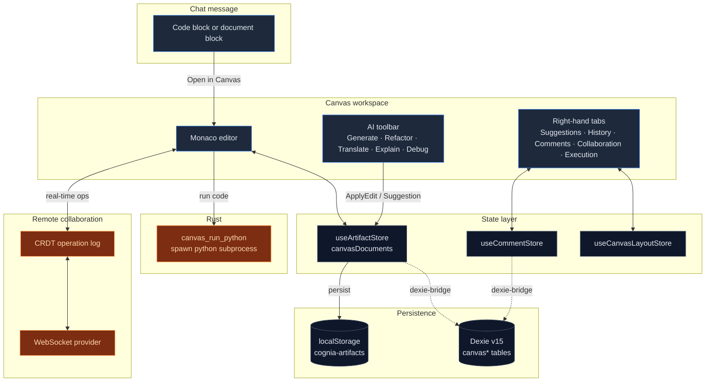
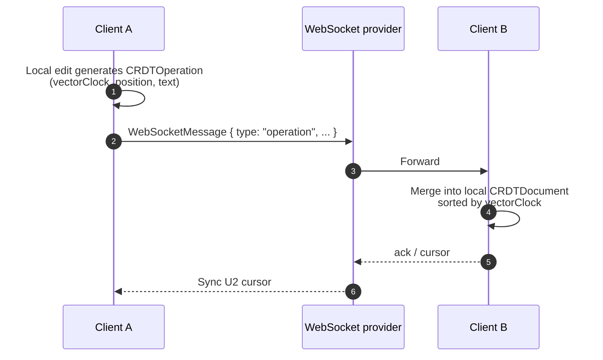

# Canvas

<Status variant="stable" />

<TLDR>
  Canvas is a code / rich-text workspace embedded in the cognia-next main shell: Monaco editor core
  + AI action toolbar (Generate / Refactor / Translate / Explain) + right-hand side panel
  (Suggestions / History / Comments / Collaboration / Execution). Documents live primarily in
  Zustand+localStorage, with a write-through to Dexie for backup; CRDT + WebSocket provide optional
  real-time collaboration; Python code is executed by spawning a real interpreter on the Rust side
  (sandboxed + timeout).
</TLDR>

<StatGrid>
  <Stat label="Dexie tables" value="4" hint="documents · versions · comments · sessions" />
  <Stat
    label="Sidebar tabs"
    value="5"
    hint="Suggestions · History · Comments · Collaboration · Execution"
  />
  <Stat label="Feature flag" value="2" hint="aiWorkbench.v1 · collaboration.v1" />
  <Stat label="Supported languages" value="15+" hint="Monaco language mapping" />
</StatGrid>

## What It Is

Canvas is Cognia's take on the "Workspace" experience: a user initiates a code / document generation from chat, clicks "Open in Canvas," and a real Monaco editor opens on the right. From there:

- AI can **continue rewriting** the current document (generate new versions, offer suggestions, batch refactor).
- Documents have **version history** — any AI change or manual save creates a `CanvasDocumentVersion` snapshot.
- Multiple clients can **collaboratively edit** (via WebSocket + CRDT).
- The embedded **Python execution panel** lets users run code next to the editor and see results immediately.
- **Comments + reactions** work like Google Docs — comment on a line or selection.

Canvas and [Artifacts](./artifacts-sandbox) are two distinct paths:

- **Artifact** — one-shot generated content artifact, rendered in a sandboxed iframe.
- **Canvas** — a document meant for continuous editing, with Monaco mounted directly in the main React tree.

In practice the two are tightly linked: users often "upgrade" from an Artifact to Canvas, taking the model's first draft and iterating on it.

## Code Locations

<Files>
  <Folder name="lib/canvas/" defaultOpen>
    <File name="index.ts — barrel export" />
    <File name="dexie-bridge.ts — Zustand ↔ Dexie write-through bridge" />
    <File name="monaco-loader.ts — offline Monaco asset configuration (Tauri)" />
    <File name="large-file-optimizer.ts — large-file chunking strategy" />
    <File name="feature-flags.ts — aiWorkbench / collaboration toggles" />
    <File name="utils.ts — common utilities" />
    <Folder name="ai/">
      <File name="context-analyzer.ts — assembles context for AI (symbols, imports, cursor)" />
    </Folder>
    <Folder name="collaboration/">
      <File name="crdt-store.ts — simplified CRDT with vector clocks" />
      <File name="websocket-provider.ts — WS client + reconnection + heartbeat" />
    </Folder>
    <Folder name="snippets/">
      <File name="snippet-registry.ts — code snippet registry" />
    </Folder>
    <Folder name="symbols/">
      <File name="symbol-parser.ts — extracts symbols by language (function/class/...)" />
    </Folder>
    <Folder name="themes/">
      <File name="theme-registry.ts — Monaco theme registry" />
    </Folder>
    <Folder name="plugins/">
      <File name="plugin-manager.ts — Monaco plugin mounting inside Canvas" />
    </Folder>
  </Folder>
  <Folder name="components/canvas/">
    <File name="canvas-panel.tsx — editor body (Monaco + AI toolbar)" />
    <File name="canvas-shell.tsx — routing entry point + document tabs + side panels orchestration" />
    <File name="canvas-workspace.tsx — cross-platform layout (mobile / desktop)" />
    <File name="canvas-side-panels.tsx — five-tab right sidebar" />
    <File name="canvas-document-list.tsx — left-hand document list / rail" />
    <File name="canvas-document-tabs.tsx — top document tabs" />
    <File name="canvas-empty-state.tsx" />
    <File name="canvas-error-boundary.tsx" />
    <File name="code-execution-panel.tsx — Python execution + terminal output" />
    <File name="comment-panel.tsx — comment threads + reactions" />
    <File name="collaboration-panel.tsx — multi-user status + invite link" />
    <File name="suggestions-panel.tsx — AI suggestion accept / reject" />
    <File name="version-history-panel.tsx + version-diff-view.tsx — version snapshots + diff" />
    <File name="suggestion-item.tsx · rename-dialog.tsx · keybinding-settings.tsx" />
  </Folder>
  <Folder name="src-tauri/src/canvas/">
    <File name="mod.rs — module entry" />
    <File name="python_exec.rs — subprocess spawn + timeout, canvas_run_python command" />
  </Folder>
  <Folder name="app/canvas/">
    <File name="join/page.tsx — /canvas/join?session=... accepts collaboration invite links" />
  </Folder>
  <Folder name="lib/db/">
    <File name="canvas-types.ts — row types" />
    <File name="canvas-documents.ts · canvas-versions.ts · canvas-comments.ts · canvas-sessions.ts — CRUD" />
  </Folder>
  <Folder name="stores/">
    <File name="artifact/artifact-store.ts — canvasDocuments + versions (CanvasDocument nests versions[])" />
    <File name="canvas/comment-store.ts — comments" />
    <File name="canvas/canvas-layout-store.ts — right-hand tab state" />
    <File name="canvas/canvas-settings-store.ts — user preferences (auto-save, collaboration URL)" />
    <File name="canvas/chunked-document-store.ts — large-file chunking" />
    <File name="canvas/keybinding-store.ts — custom keybindings" />
  </Folder>
</Files>

## Workflow



## Editor Core

`components/canvas/canvas-panel.tsx` wraps `@monaco-editor/react`:

- **Lazy load** — Monaco is a large bundle, loaded on-demand in the client via `next/dynamic`.
- **Offline Monaco (Tauri)** — `lib/canvas/monaco-loader.ts:configureMonacoLoader()` points the loader to `public/monaco/vs/`, avoiding CDN (Tauri's strict CSP forbids cross-origin scripts). A `prebuild` script copies `node_modules/monaco-editor/min/vs` before the build.
- **Themes** — `useTheme()` syncs `vs` / `vs-dark` to Monaco; custom themes are registered via `lib/canvas/themes/theme-registry.ts`.
- **Keybindings** — `useCanvasKeyboardShortcuts()` handles `Cmd+S`, `Cmd+K` (AI invocation), etc.; `stores/canvas/keybinding-store.ts` allows user customization.
- **Large files** — `lib/canvas/large-file-optimizer.ts` chunks files above 100 KB to avoid blocking the main thread.

## AI Actions

The toolbar exposes actions (`useCanvasActions`) mapped to `CanvasActionType` in `lib/ai/generation/canvas-actions.ts`:

| Action      | Input                   | Output                                                     |
| ----------- | ----------------------- | ---------------------------------------------------------- |
| `generate`  | Natural language prompt | Full generation or selection replacement                   |
| `refactor`  | Selection + prompt      | Replace selection                                          |
| `translate` | Target language         | Replace with another programming language                  |
| `explain`   | Selection               | Write to right-hand Suggestions (does not modify document) |
| `debug`     | Selection or full text  | List potential issues + fix suggestions                    |
| `apply`     | Select a suggestion     | Apply the suggestion to the editor                         |

Every action first assembles context via `lib/canvas/ai/context-analyzer.ts:analyzeContext()`:

- Extract symbols (function / class / interface / type / enum / import).
- The function / class / block the current cursor belongs to.
- File imports / exports / dependencies.
- Complexity estimate (low / medium / high).

This information is packed into the prompt so the model can give localized suggestions like "inside function X."

## Version History

`CanvasDocument.versions: CanvasDocumentVersion[]` is the document's vertical timeline:

- Every AI change → new version, description `"AI refactor"`, `"Generate function"`...
- Every manual save → new version, `isAutoSave: false`.
- Auto-save trigger (user-configurable) → `isAutoSave: true`.

Storage has two layers:

1. Primary store: `useArtifactStore`'s `canvasDocuments[id].versions[]`, persisted with Zustand to localStorage (key `cognia-artifacts`).
2. Mirror: `lib/canvas/dexie-bridge.ts` flattens versions into the `canvasVersions` table, indexed by `documentId`. This is because the v3 backup format reads from Dexie — flattening ensures full history is available during cross-device restore.

`version-diff-view.tsx` renders per-version diffs using Monaco's `DiffEditor`.

## Comments

`useCommentStore` buckets comments by `documentId`:

```ts title="types/canvas/collaboration.ts (excerpt)"
interface CanvasComment {
  id: string
  documentId: string
  parentId?: string  // reply to another comment
  authorId: string
  body: string
  range?: { startLine, endLine, ...}  // selection anchor
  reactions?: Record<string, string[]>  // emoji → user ids
  resolvedAt?: Date
}
```

- Selection comments are anchored to line numbers — if the selection becomes invalid after editing, the UI marks it as "stale."
- Comments are stored flat; replies are linked via `parentId`; the UI folds them into threads at render time.
- `dexie-bridge.ts` also mirrors comments to the `canvasComments` table for backup export.

## Collaboration (CRDT + WebSocket)

`lib/canvas/collaboration/` provides optional real-time multi-user collaboration:



- **CRDT implementation** — `lib/canvas/collaboration/crdt-store.ts`, a simplified RGA: operations carry a `vectorClock`, sorted by timestamp + origin, guaranteeing eventual consistency.
- **WS client** — `websocket-provider.ts` handles reconnection (exponential backoff), heartbeat, message queue, and presence.
- **Sessions** — metadata lands in the `canvasSessions` table (owner, permissions, share link). `/canvas/join?session=<base64-payload>` is the entry point for accepting invites.
- **Feature flag** — `canvas.collaboration.v1` controls the master switch; it defaults to on, but only connects when the user has explicitly configured a WebSocket server URL — avoiding accidental connections to unknown servers.

For broader remote control / screen sharing, see [./remote-control](./remote-control); Canvas only covers **multi-user co-editing of the same document**.

## Python Sandbox Execution

`src-tauri/src/canvas/python_exec.rs:canvas_run_python` is the desktop code execution channel:

```rust title="src-tauri/src/canvas/python_exec.rs (core)"
let mut child = Command::new(bin)            // "python" on Windows, "python3" elsewhere
    .arg("-")
    .stdin(Stdio::piped())
    .stdout(Stdio::piped())
    .stderr(Stdio::piped())
    .kill_on_drop(true)
    .spawn()?;

// Write code to stdin → close → wait
match tokio::time::timeout(limit, child.wait_with_output()).await {
    Ok(Ok(out)) => Ok(PythonExecResult { stdout, stderr, exit_code, ... }),
    Err(_)      => Ok(PythonExecResult { exit_code: 124, stderr: "timeout: ..." })
}
```

- **Timeout** — default 30 seconds (`DEFAULT_TIMEOUT_MS = 30_000`), then SIGKILL.
- **Isolation** — only spawns a subprocess; no networking, no extra filesystem mounts. For stronger isolation in production deployments, configure firejail / sandboxd / Docker — cognia-next currently assumes a trusted local machine.
- **Web mode** — no Tauri means no Python execution; `lib/sandbox/web/` is a placeholder stub. See [./artifacts-sandbox](./artifacts-sandbox) for details.
- Other languages (JS, TS) go through iframe-based artifact preview, not Rust.

## Dexie Schema (v15)

```ts title="lib/db/schema.ts (excerpt)"
canvasDocuments: "id, title, language, type, updatedAt, createdAt"
canvasVersions: "id, documentId, [documentId+createdAt], isAutoSave"
canvasComments: "id, documentId, [documentId+createdAt], parentId, resolvedAt"
canvasSessions: "id, documentId, ownerId, createdAt"
```

`lib/canvas/dexie-bridge.ts:startCanvasDexieBridge()` runs once at app startup:

1. **Hydrate** — reads documents from Dexie that are not yet in memory, injecting them back into the Zustand store. This path mainly serves "restore from v3 backup" — a device that just imported a backup has data in Dexie but localStorage is still empty.
2. **Subscribe** — hooks `useArtifactStore.subscribe`, diffs on every memory change, and writes to Dexie (documents → upsert, versions flattened → bulkPut, evicted rows → delete).
3. **Graceful degradation** — any Dexie write failure only warns, never blocks the UI; local edits continue through Zustand.

## Settings & Feature Flags

`lib/canvas/feature-flags.ts` exposes two flags:

- `canvas.aiWorkbench.v1` — AI toolbar + suggestions feature.
- `canvas.collaboration.v1` — collaboration panel and WebSocket client.

Read order: default value → `NEXT_PUBLIC_CANVAS_*` environment variable → localStorage (user disabled in Settings overrides).

`stores/canvas/canvas-settings-store.ts` stores user preferences: auto-save interval, indentation, font, collaboration server URL, vim mode enablement, etc.

## How the Model Drives Canvas

The model does not call Canvas directly — it drives it indirectly through either of these paths:

1. **Code blocks embedded in chat messages** — the user clicks `Open in Canvas` on a message, and `lib/artifacts/reveal.ts:revealArtifactInWorkspace()` upgrades the artifact into a canvas document (type mapping, language fill, initial version write).
2. **`apply`-class AI actions** — when Canvas is already open, the model goes through prompt templates in `lib/ai/generation/canvas-actions.ts` to generate editor directives (insert / replace / delete), which the renderer applies to Monaco.
3. **Suggestion stream** — the model writes multiple candidate changes to `aiSuggestions[]`; the user sees them in the right-hand Panel and clicks accept before they land in the document.

## Tests

| File                                                  | Coverage                                             |
| ----------------------------------------------------- | ---------------------------------------------------- |
| `lib/canvas/dexie-bridge.test.ts`                     | hydration + write-through consistency                |
| `lib/canvas/large-file-optimizer.test.ts`             | chunking strategy boundaries                         |
| `lib/canvas/monaco-loader.test.ts`                    | offline / online / override three paths              |
| `lib/canvas/ai/context-analyzer.test.ts`              | symbol extraction, cursor context                    |
| `lib/canvas/collaboration/crdt-store.test.ts`         | vector clock merge, conflict resolution              |
| `lib/canvas/collaboration/websocket-provider.test.ts` | reconnection, heartbeat, message queue               |
| `lib/canvas/snippets/snippet-registry.test.ts`        | registration + retrieval                             |
| `lib/canvas/symbols/symbol-parser.test.ts`            | per-language symbol extraction                       |
| `components/canvas/*.test.tsx`                        | render + interaction for each panel component        |
| `src-tauri/src/canvas/python_exec.rs`                 | rejects_empty_input / timeout_returns_124 / real run |

## Where to Start

| Goal                          | File                                                                                     |
| ----------------------------- | ---------------------------------------------------------------------------------------- |
| Add new language support      | `lib/artifacts/constants.ts:MONACO_LANGUAGE_MAP` + `lib/canvas/symbols/symbol-parser.ts` |
| Adjust AI context             | `lib/canvas/ai/context-analyzer.ts`                                                      |
| Add new AI action             | `lib/ai/generation/canvas-actions.ts` + `hooks/canvas/use-canvas-actions.ts`             |
| Change collaboration protocol | `lib/canvas/collaboration/`                                                              |
| Add Monaco theme              | `lib/canvas/themes/theme-registry.ts`                                                    |
| Run Python in a real sandbox  | Replace the spawn implementation in `src-tauri/src/canvas/python_exec.rs`                |
| Debug Dexie write-through     | `lib/canvas/dexie-bridge.ts` (loggers.canvas)                                            |

## Next

<Cards>
  <Card
    title="Artifacts / Sandbox"
    href="./artifacts-sandbox"
    description="One-shot UI artifacts: iframe isolation + DOMPurify"
  />
  <Card
    title="Chat & Skills"
    href="./chat-and-skills"
    description="The entry point for upgrading code to Canvas"
  />
  <Card
    title="Remote Control"
    href="./remote-control"
    description="Cross-device session and document sharing"
  />
</Cards>
