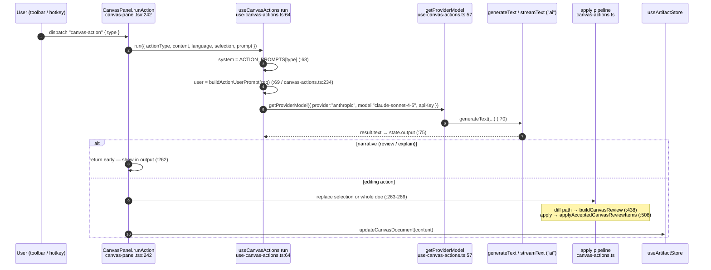
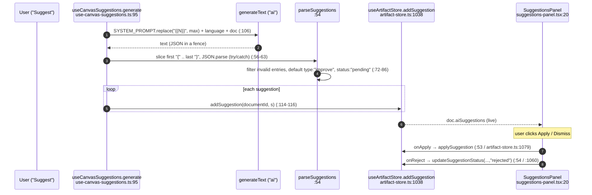

# AI Actions & Suggestions

<Status variant="stable" />

<TLDR>
  Two independent AI surfaces drive Canvas. **Actions** (`useCanvasActions`,
  `hooks/canvas/use-canvas-actions.ts:52`) run one of ten prompts from `ACTION_PROMPTS`
  (`lib/ai/generation/canvas-actions.ts:47`) and write the result back as a reviewable diff
  (`buildCanvasReview:438` → `applyAcceptedCanvasReviewItems:508`). **Suggestions**
  (`useCanvasSuggestions`, `hooks/canvas/use-canvas-suggestions.ts:89`) ask the model for a JSON list
  and push each into `useArtifactStore.addSuggestion` for accept/reject in the side panel. A built-in
  `ContextAnalyzer` exists but is **not wired** into either hook today.
</TLDR>

## The Ten Actions

`ACTION_PROMPTS` (`canvas-actions.ts:47`) maps each `CanvasActionType` to a system prompt:

| Action | Line | Behavior |
| --- | --- | --- |
| `custom` | `:48` | free-form instruction |
| `review` | `:52` | narrative — written to output, does **not** replace content |
| `fix` | `:60` | fix bugs in selection / document |
| `improve` | `:68` | improve quality / readability |
| `explain` | `:76` | narrative — explanation only |
| `simplify` | `:84` | reduce complexity |
| `expand` | `:92` | add detail / completeness |
| `translate` | `:100` | translate to a target language |
| `format` | `:106` | reformat (temperature 0.3, like `fix`) |
| `run` | `:114` | execution-oriented prompt |

`review` and `explain` are narrative actions — `CanvasPanel.runAction` returns early for them so they
populate the output panel without mutating the document (`canvas-panel.tsx:262`).

## The Action Pipeline

Editor write-back has two implementations in `canvas-actions.ts`:

- **`applyCanvasActionResult` (`:256`)** — no selection → full replace; with a selection → splice the
  result into the located span.
- **`buildCanvasReview` (`:438`) + `applyAcceptedCanvasReviewItems` (`:508`)** — the diff-review path.
  `generateDiffPreview` (`:345`) produces line-level `added`/`removed`/`unchanged` rows;
  `buildCanvasReview` groups them into review items tagged `insert` / `delete` / `replace`; accepted
  items are applied **bottom-up** (sorted desc by start line, `:515`) via `lines.splice(...)` (`:522`)
  so earlier edits don't shift later line numbers.

## The Suggestion Stream

`useCanvasSuggestions.generate` (`use-canvas-suggestions.ts:95`) asks the model for a strict JSON
payload and parses it defensively:

The `CanvasSuggestion` type (`types/artifact/artifact.ts:324`) carries `{ id, type, range,
originalText, suggestedText, explanation, status }`. Accept (`applySuggestion`, `artifact-store.ts:1079`)
splices `suggestedText` into `doc.content` over `[range.startLine .. range.endLine+1]`; reject sets
`status:"rejected"`.

## The Five-Tab Side Panel

`CanvasSidePanels` (`canvas-side-panels.tsx:49`) is a Radix `Tabs` whose value is bound to
`useCanvasLayoutStore.activeRightTab`. A `ResizeObserver` collapses tab labels to icon-only below
`CANVAS_SIDE_PANELS_ICON_ONLY_BREAKPOINT = 280` px (`:47`). Each tab shows a live badge count:

| Tab | Host | Renders | Badge |
| --- | --- | --- | --- |
| Suggestions | `SuggestionsHost` (`:279`) | `SuggestionsPanel` (`:299`) | pending suggestions (`:80`) |
| History | `HistoryHost` (`:308`) | recent-3 + `VersionHistoryPanel` sheet (`:359`) | versions length (`:81`) |
| Comments | `CommentsHost` (`:382`) | `CommentPanel` sheet (`:406`) | unresolved comments (`:82`) |
| Collaboration | `CollaborationHost` (`:423`) | `CollaborationPanel` (`:436`) | `0` (`:83`) |
| Execution | `ExecutionHost` (`:456`) | `CodeExecutionPanel` (`:460`) | `0` (`:84`) |

`SuggestionsHost` reads `doc.aiSuggestions` directly (`:283`), which is the live link from
`addSuggestion`; `SuggestionsPanel` (`suggestions-panel.tsx:20`) filters to `status === "pending"` and
renders a `SuggestionItem` (`suggestion-item.tsx:32`) per suggestion with a collapsible original-vs-
suggested diff.

## The Standalone Context-Analyzer

`ContextAnalyzer` (`lib/canvas/ai/context-analyzer.ts:61`, singleton `:340`) is a fully-built,
regex-based code analyzer: `analyzeContext` (`:79`) extracts symbols, imports, exports, cursor scope
(`inFunction` / `inClass` / `inBlock`), patterns (react-component, async-await, try-catch, …), bare
dependencies, and a `low`/`medium`/`high` complexity estimate. `generateContextualPrompt` (`:299`)
formats that into a prompt summary.

> **Implementation note.** Neither `useCanvasActions` nor `useCanvasSuggestions` calls the analyzer
> today — both send the raw document text to the model. The analyzer is an independent utility ready
> to be wired into the prompt builders; treat it as latent capability, not the active path.

## Next

<Cards>
  <Card title="Editor core" href="./editor-core" description="The toolbar host and keybinding dispatch" />
  <Card title="Collaboration" href="./collaboration" description="The next side-panel tab: real-time co-editing" />
</Cards>
