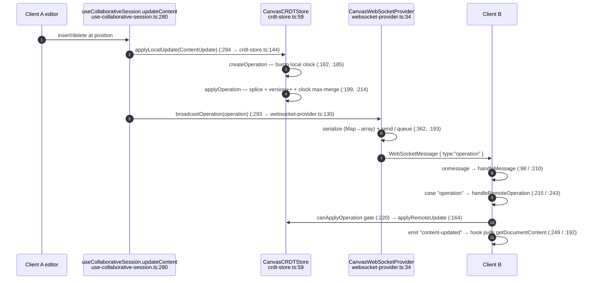
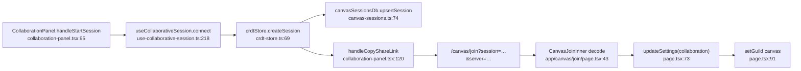

# Collaboration

<Status variant="experimental" />

<TLDR>
  `lib/canvas/collaboration/` adds optional real-time co-editing. `CanvasCRDTStore`
  (`crdt-store.ts:59`) keeps each document as `content` + a `vectorClock: Map` + an append-only
  operation log; remote ops are admitted through a causal-delivery gate (`canApplyOperation:220`) and
  merged with element-wise clock max (`applyOperation:214`). `CanvasWebSocketProvider`
  (`websocket-provider.ts:34`) is the transport — fixed-interval reconnect (default 1000 ms, **no
  backoff**, capped at 5), a 30 s heartbeat, and a message queue. `useCollaborativeSession`
  (`use-collaborative-session.ts:83`) wires store ⇄ provider ⇄ React state. It never auto-connects:
  the WebSocket opens only when collaboration is enabled with a server URL.
</TLDR>

<StatGrid>
  <Stat label="Wire message types" value="6" hint="operation · cursor · selection · presence · sync · error" />
  <Stat label="Reconnect" value="fixed 1000ms" hint="capped at 5 attempts — no exponential backoff" />
  <Stat label="Heartbeat" value="30000ms" hint="presence frames; not consumed inbound" />
  <Stat label="Conflict model" value="vector clock" hint="causal gate only — no OT/index rebasing" />
</StatGrid>

## The Edit Round-Trip

### CRDT details

- **Operation** (`crdt-store.ts:42`) — `{ id, type:"insert"|"delete", position, text?, length?, origin,
  timestamp, vectorClock: Map }`. Created in `createOperation` (`:182`): clone the doc's clock,
  increment the local participant's entry (`:185`), id = `op-${Date.now()}-${random}` (`:188`). Note a
  `"replace"` content update collapses to `"insert"` (`:189`).
- **Merge** — `applyOperation` (`:199`) splices `content`, increments `version`, appends to the log,
  and merges the clock with element-wise `Math.max` (`:214-217`).
- **Causal gate** — `canApplyOperation` (`:220`): for each clock entry (skipping the op's own origin),
  reject if `value > localValue + 1`, i.e. an op that would skip a causally-prior update. Rejected ops
  are **silently dropped** — there is no buffering/retry and **no operational transform**, so the gate
  is the only conflict mechanism.
- **Persistence side-effects** — `createSession` / `joinSession` / `leaveSession` persist session
  metadata to Dexie (`:98`, `:115`, `:135`); `restoreRecentSessions` (`:293`) reloads metadata but
  explicitly does **not** reopen sockets.

### WebSocket provider details

| Concern | Behavior | Lines |
| --- | --- | --- |
| Config defaults | `reconnectAttempts: 5`, `reconnectInterval: 1000`, `heartbeatInterval: 30000` | `:47-55` |
| Connect | `onopen` → reset attempts, start heartbeat, flush queue, send `presence/join` | `:57-82` |
| Reconnect | `handleDisconnect` — fixed `reconnectInterval` delay, **no backoff**, stops at cap | `:306-330`, `:326` |
| Heartbeat | `setInterval(heartbeatInterval)` sends `presence/heartbeat` | `:332-344` |
| Message queue | `send` queues when not OPEN; `flushMessageQueue` drains FIFO on open | `:193-208` |
| Inbound routing | `handleMessage` switch → operation / cursor / selection / presence / sync / error | `:210-241` |
| Sync | `requestSync` ⇄ `handleSync` → `crdtStore.deserializeState` | `:166`, `:298`, `crdt-store.ts:326` |

The local event bus (`on` `:178`, `emitEvent` `:353`) is distinct from the wire protocol — it fans
`participant-joined` / `cursor-moved` / `content-updated` / `connected` etc. to the hook.

## The Session Hook

`useCollaborativeSession` (`use-collaborative-session.ts:83`) holds the singleton `crdtStore` and a
per-session provider, and maps all eight provider events through one handler
(`handleCollaborationEvent:123`). Lifecycle:

- `connect(documentId, content)` (`:218`) — create session, join as local participant, set local
  participant id, construct + connect the provider.
- `updateContent` (`:280`) / `updateCursor` (`:299`) / `updateSelection` (`:312`) — local apply +
  broadcast.
- `disconnect` (`:261`) — close provider, leave + close session, clear state. The unmount effect calls
  `disconnect()` (`:431-435`).
- `shareSession` (`:322`) returns `crdtStore.serializeState`; `importSharedSession` (`:377`) hydrates
  from a serialized payload with no transport.

`DEFAULT_CONFIG` (`:75-81`) defaults the URL to `ws://localhost:8080/canvas` with `autoReconnect:true`
and 5 attempts.

## The Invite / Join Flow

- **Create** — `connect` → `createSession` mints `session-${Date.now()}-${random}` (`crdt-store.ts:70`)
  and persists metadata.
- **Share** — `handleCopyShareLink` (`collaboration-panel.tsx:120`) builds
  `${origin}/canvas/join?session=${encodeURIComponent(serializeState)}` (`:128`).
- **Join** — `app/canvas/join/page.tsx` reads `?session` / `?server` (`:37-38`), decodes a base64url
  payload (`:43`), writes collaboration settings if a server is present (`:73-84`), switches the shell
  to the canvas guild (`:91`), and shows success. The page intentionally does **not** itself call
  `joinSession` — real-time sync resumes only if collaboration is enabled in Settings.

> **Implementation note (format mismatch).** The panel emits `encodeURIComponent(serializeState)` whose
> JSON shape is `{ session, document }` (`collaboration-panel.tsx:128`), while the join page decodes a
> base64url payload of `{ sessionId, documentId, ownerId, shareUrl, permissions }`
> (`app/canvas/join/page.tsx:46`). The two encodings are not round-trippable in the current code — the
> join route relies on settings + in-app `joinSession` to resume a session, not on re-hydrating the
> shared payload.

## Connection States

The provider's `ConnectionState` (5 values: disconnected / connecting / connected / reconnecting /
error, `websocket-provider.ts:32`) is a subset of the UI-layer `CollaborationConnectionState` (8
values incl. `degraded-local`, `ended`, `types/canvas/collaboration.ts:117`). The recovery state
`live` / `local-copy` / `snapshot-only` / `degraded-local` (`:126`) is derived in the hook's
state-change effect (`use-collaborative-session.ts:409-429`).

## Next

<Cards>
  <Card title="AI actions & suggestions" href="./ai-actions" description="The sibling side-panel tab" />
  <Card title="Execution & comments" href="./execution-comments" description="Python sandbox + comment threads" />
</Cards>
