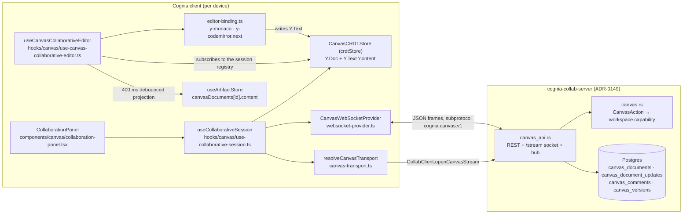

# Collaboration

<Status variant="experimental" />

<TLDR>
  `lib/canvas/collaboration/` adds optional real-time co-editing on **Yjs**. Each document is a
  `Y.Doc`; Monaco and CodeMirror write into its `Y.Text` (`editor-binding.ts`), and a document-level
  update bus sends every local change, including AI applies, model-tool writes and plugin writes. While
  a binding is live the artifact store's `content` is a debounced projection of the `Y.Text`. The
  transport is the collaboration server (ADR-0149, `crates/cognia-collab-server/src/canvas_api.rs`),
  which stores opaque updates in order, deduplicates by `(document_id, operation_id)`, never decodes
  them, and re-resolves the caller's workspace role on every inbound edit frame. A joining client
  takes the plane's state before its editor binds, and only initializes an empty document. Clients transmit cursors
  through y-protocols awareness. Membership follows the workspace roles: viewer reads, member edits and
  comments, maintainer compacts and deletes. Off by default behind `COLLAB_CANVAS_ENABLED` and
  `canvas.collaboration.enabled`.
</TLDR>

<StatGrid>
  <Stat label="CRDT" value="Yjs" hint="Y.Doc per document; awareness for cursors and presence" />
  <Stat label="Server" value="collab plane" hint="opaque ordered updates; yrs not linked (ADR-0158)" />
  <Stat label="Authorization" value="per frame" hint="workspace role re-resolved on every write" />
  <Stat label="Default" value="off" hint="COLLAB_CANVAS_ENABLED + canvas.collaboration.enabled" />
</StatGrid>

## Architecture

```mermaid
flowchart LR
  subgraph Client["Cognia client (per device)"]
    direction TB
    Panel["CollaborationPanel<br/>components/canvas/collaboration-panel.tsx"]
    Session["useCollaborativeSession<br/>hooks/canvas/use-collaborative-session.ts"]
    Store["CanvasCRDTStore (crdtStore)<br/>Y.Doc + Y.Text 'content'"]
    EditorHook["useCanvasCollaborativeEditor<br/>hooks/canvas/use-canvas-collaborative-editor.ts"]
    Binding["editor-binding.ts<br/>y-monaco · y-codemirror.next"]
    Provider["CanvasWebSocketProvider<br/>websocket-provider.ts"]
    Transport["resolveCanvasTransport<br/>canvas-transport.ts"]
    Artifact["useArtifactStore<br/>canvasDocuments[id].content"]
  end

  subgraph Plane["cognia-collab-server (ADR-0149)"]
    direction TB
    Api["canvas_api.rs<br/>REST + /stream socket + hub"]
    Caps["canvas.rs<br/>CanvasAction → workspace capability"]
    PG[("Postgres<br/>canvas_documents · canvas_document_updates<br/>canvas_comments · canvas_versions")]
  end

  Panel --> Session
  Session --> Store
  Session --> Provider
  Session --> Transport
  EditorHook -- "subscribes to the session registry" --> Store
  EditorHook --> Binding
  Binding -- "writes Y.Text" --> Store
  EditorHook -- "400 ms debounced projection" --> Artifact
  Transport -- "CollabClient.openCanvasStream" --> Api
  Provider <-- "JSON frames, subprotocol cognia.canvas.v1" --> Api
  Api --> Caps
  Api --> PG
```

The session is owned by the collaboration panel (through `useCollaborativeSession`); the editor finds
it by subscribing to the store's registry rather than by holding it. That split is recorded in the
2026-09-05 amendments to [ADR-0158](../../adr/0158-artifacts-and-canvas).

## Modules

| File | Role |
| --- | --- |
| `lib/canvas/collaboration/crdt-store.ts` | `CanvasCRDTStore` and the `crdtStore` singleton: one `Y.Doc` and one `Awareness` per document, the session registry (with pending sessions), the local-update and local-awareness buses, remote apply, snapshots, `encodeSeedUpdate` |
| `lib/canvas/collaboration/editor-binding.ts` | `bindMonacoEditor` (y-monaco), `codeMirrorCollabExtensions` (y-codemirror.next), the awareness user, the presence stylesheet |
| `lib/canvas/collaboration/websocket-provider.ts` | `CanvasWebSocketProvider`: the socket factory, reconnect and catch-up, heartbeat, in-memory queue, frame routing, the last applied sequence |
| `lib/canvas/collaboration/canvas-transport.ts` | `resolveCanvasTransport`, `publishCanvasDocument`, `resolveCanvasShareTarget`, and the plane-side sync: `catchUpCanvasDocument` (paged) and `hydrateCanvasSession` (join or seed) |
| `lib/canvas/collaboration/relative-anchor.ts` | `encodeCrdtAnchor` / `resolveCrdtAnchor`: comment anchors as Yjs relative positions |
| `lib/canvas/collaboration/share-link.ts` | `buildCanvasSharePath` / `parseCanvasShareLink`: an ids-only join link |
| `hooks/canvas/use-canvas-collaborative-editor.ts` | Binds the active editor to the live session and projects the `Y.Text` back to the artifact store |
| `hooks/canvas/use-collaborative-session.ts` | Creates, hydrates, connects and tears down a session for the panel |
| `hooks/canvas/use-canvas-comment-anchors.ts` | Encodes and resolves comment anchors against the live document |
| `lib/collab/client.ts` | `CollabClient`: the Canvas REST methods and `openCanvasStream` |
| `crates/cognia-collab-server/src/canvas_api.rs` | Routes, stream tickets, the per-document hub, frame handling |
| `crates/cognia-collab-server/src/canvas.rs` | `CanvasAction`, its capability mapping and audit names |
| `crates/cognia-collab-server/src/canvas_store.rs` | `CanvasStore` trait, `InMemoryCanvasStore`, the Postgres implementation |
| `crates/cognia-collab-server/migrations/0010_canvas.sql` | The four Canvas tables and their row-level security |

Client dependencies: `yjs`, `y-monaco`, `y-codemirror.next`, `y-protocols` (awareness) and `lib0`.
The server links no Yjs crate.

## The Edit Round-Trip

```mermaid
sequenceDiagram
  autonumber
  participant Ed as Monaco / CodeMirror (A)
  participant YA as Y.Doc "content" (A)
  participant PA as CanvasWebSocketProvider (A)
  participant S as collab server /stream
  participant DB as canvas_document_updates
  participant PB as CanvasWebSocketProvider (B)
  participant YB as Y.Doc (B)
  participant AS as useArtifactStore (B)

  Ed->>YA: y-monaco / yCollab write into Y.Text
  YA-->>PA: doc "update" (origin is not the remote sentinel) → onLocalUpdate → broadcastOperation
  PA->>S: frame type "operation", data = id + base64 update
  Note over PA: queued in memory while the socket is not connected
  S->>S: may_edit: re-resolve the caller's workspace role
  S->>DB: append_update (dedupe on document_id + operation_id)
  DB-->>S: stored row with its sequence
  S-->>PB: broadcast "operation" with its sequence (the sender's own echo is skipped)
  PB->>YB: applyRemoteUpdate → Y.applyUpdate(..., CANVAS_REMOTE_ORIGIN); note the sequence
  Note over YB: the sentinel origin keeps it off the local bus
  YB->>AS: Y.Text observe → 400 ms debounce → updateCanvasDocument
```

## The Document and Its Session

`CanvasCRDTStore.ensureDocument` creates one `Y.Doc` per document id and reads its text as
`doc.getText(CANVAS_TEXT_KEY)`, where `CANVAS_TEXT_KEY = "content"`. One `text.observe` keeps the
record's `content` and `version` in step.

- **Sessions.** `createSession(documentId, content, { pending })` mints
  `session-<timestamp>-<random>`, marks the creator's permissions and persists the session's
  metadata to the Dexie `canvasSessions` table through `lib/db/canvas-sessions.ts`. Only metadata is
  stored there. Yjs state is not persisted locally; the plane holds it. `joinSession`,
  `leaveSession`, `adoptSession` and `closeSession` complete the lifecycle, and `closeSession`
  destroys the awareness and the `Y.Doc`.
- **Pending sessions.** With `pending: true` (what `connect` uses) the document starts empty and
  `sessionIdForDocument` does not return it until `markSessionReady`. The editor binds to whatever
  that returns, so binding before the plane has answered would show an empty buffer and project it
  over the stored document. Without `pending` the content is inserted on this device and the document
  is marked `seededLocally`; `seedLocally` does the same for a pending session that stays local. A
  locally seeded document never joins the plane, because its Yjs items exist nowhere else and merging
  them with the plane's would insert the text twice.
- **The registry.** `onSessionsChanged(listener)` and `sessionIdForDocument(documentId)` are what
  the editor hook feeds to `useSyncExternalStore`. `sessionIdForDocument` returns a string on
  purpose, because that is what a snapshot comparison can compare.
- **Awareness.** `getAwareness(sessionId)` returns the document's one `y-protocols` `Awareness`,
  created on first use (it runs an interval for its idle cutoff). `onLocalAwarenessUpdate` fires only
  for changes to this client's own state, encoded for the wire; remote states are applied with
  `applyRemoteAwareness` under the remote sentinel, `removeRemoteAwareness(participantId)` drops a
  peer that left (matched through the `user.participantId` the binding publishes), and
  `encodeLocalAwareness` is what a newcomer is sent.
- **The local-update bus.** The store listens to `doc.on("update")` once per document. Any
  transaction whose origin is not `CANVAS_REMOTE_ORIGIN` (`"cognia:canvas:remote"`) is local: it is
  wrapped as a `CRDTOperation` (`id`, base64 `update`, `origin`, `timestamp`) and handed to
  `onLocalUpdate` subscribers. Filtering on the one remote sentinel, instead of on a list of local
  origins, is what makes an AI apply, a model-tool write and a plugin write leave the same way as
  typing.
- **Remote apply.** `applyRemoteUpdate` decodes the base64 update and calls `Y.applyUpdate` under the
  remote sentinel. A malformed update is logged (`crdt remote update rejected`) and dropped rather
  than thrown.
- **Snapshots.** `encodeSnapshot` returns `Y.encodeStateAsUpdate(doc)` as base64; `applySnapshot`
  merges one under the remote sentinel. State only ever arrives as opaque bytes that merge into a
  session the client is already in. The old `deserializeState` JSON sink is gone, and a test pins that
  it stays gone.

## Editor Binding

`useCanvasCollaborativeEditor({ documentId, enabled })` is used by `components/canvas/canvas-panel.tsx`.
It returns `active`, `bindMonaco(editor)` and `codeMirrorExtensions`.

1. `useSessionId` subscribes to the registry and yields the live session for the document, only when
   both the hook's `enabled` (the `canvas.collaboration.v1` feature flag) and
   `CanvasSettings.collaboration.enabled` are on.
2. For that session it reads the store's `Awareness` (it never creates one: a second instance would
   be a client the socket does not carry), publishes the local user as the awareness `user` field
   (`name`, `color`, `participantId`), applies the presence timeout and builds the CodeMirror
   extensions. When the editor leaves the document it clears its local state, which tells peers the
   caret is gone; the store destroys the awareness with the session.
3. **Monaco** (desktop): `bindMonacoEditor` creates a `MonacoBinding(ytext, model, editors, awareness)`
   inside Monaco's `onMount`; the teardown runs when the active document changes or the editor
   unmounts.
   **CodeMirror** (the mobile `LightCodeEditor`): `codeMirrorCollabExtensions` returns
   `yCollab(ytext, awareness)`.
4. **Projection.** A `text.observe` debounced by `CANVAS_PROJECTION_DEBOUNCE_MS = 400` writes the
   text back with `updateCanvasDocument`, skipping identical content, and flushes on cleanup. While a
   binding is live, the panel's own `handleEditorChange` commit returns early so the two writers do
   not race. Preview, export, AI actions, the outline and version history keep reading `content`.

### Presence settings

| Setting | Read by | Effect |
| --- | --- | --- |
| `enabled` | `useCanvasCollaborativeEditor` | Gates the editor binding |
| `showCursors` | `presenceStylesheet` | Hides remote carets (`.yRemoteSelectionHead`, `.cm-ySelectionCaret`) |
| `showSelections` | `presenceStylesheet` | Makes remote selection backgrounds transparent |
| `cursorSmoothing` | `presenceStylesheet` | Adds a 90 ms `left` / `top` transition to remote carets |
| `presenceTimeout` | `applyPresenceTimeout` | Sets `awareness.outdatedTimeout`, clamped to 5 s to 600 s |
| `showAvatars` | `CollaborationPanel` | Shows avatars in the participant list |

Defaults (`types/canvas/settings.ts`): `enabled: false`, the four booleans `true`,
`presenceTimeout: 60000`. The stylesheet is injected once as `#cognia-canvas-presence`; hiding in CSS
rather than withholding awareness means turning a setting back on shows the peer's current position.
`serverUrl` and `syncInterval` were removed: where the plane lives is `lib/collab/connection.ts`, and
Yjs pushes each transaction, so there is no polling interval.

## Transport

### Opening the socket

`resolveCanvasTransport(documentId)` answers `null` unless the document belongs to a workspace
(`getCanvasDocumentForWorkspace(...).projectId`) and a collaboration context exists
(`resolveCurrentCollabContext`: the per-account plane address from `lib/collab/connection.ts`, the
signed-in org and user binding, and an access token). Otherwise it returns the ids, the
`CollabClient`, and an `openSocket` factory over `client.openCanvasStream(orgId, documentId, handlers)`.

`openCanvasStream` first mints a ticket (`POST .../stream-tickets`), then opens
`wss://<plane>/v1/orgs/<org>/canvas-documents/<doc>/stream` with the subprotocols
`["cognia.canvas.v1", ticket]`. The socket comes from `createPlatformWebSocket`, which on Tauri goes
through the Rust proxy path and so honours the desktop proxy settings. Before connecting,
`publishCanvasDocument` gets the document on the plane and creates it on a 404, with operation id
`canvas-create:<documentId>`; a 403 or 404 on create means no write access.

### Joining a document

`useCollaborativeSession.connect(documentId, content)` opens a pending session and
`attachTransport` brings it onto the plane in a fixed order:

1. Resolve the transport and publish the document row. With no plane, or no write access to create
   the row, the session is settled on this device (`seedLocally`, then `markSessionReady`), seeded with
   the text as it is at that moment rather than when `connect` was called. A document that was
   already seeded on this device never joins the plane.
2. Build the provider and subscribe it to the local-update and local-awareness buses **before** the
   socket opens, so nothing this device does while connecting goes unsent.
3. Open the socket, so an update written during the catch-up arrives live instead of falling into
   the gap.
4. `hydrateCanvasSession` pages the plane's state in with `catchUpCanvasDocument`. If the plane holds
   nothing, the local copy is published as the seed. It is read from the artifact store at that moment,
   after `flushPendingCanvasEdits` (`lib/canvas/pending-edits.ts`) has made the editor commit the
   keystrokes still waiting on its debounce, so text typed while connecting is included. The seed is built in a scratch `Y.Doc` by `encodeSeedUpdate` and posted
   with the operation id `canvas-seed:<documentId>`. Two devices racing to seed collide on that id,
   and the server returns the first seed to the second, so both converge on one baseline instead of
   two copies of the text. A viewer who finds the plane empty gets `CanvasSeedForbiddenError`.
5. `adoptPlaneContent` compares the shared text with the artifact store. If they differ and the local
   copy is not empty, the local copy is saved as a version ("This device's copy, before joining the
   shared document") before the shared text replaces it. Then the session is marked ready and the
   editor binds.

After every await, `attachTransport` checks that the session is still the one the hook holds: "End
session" is offered as soon as the session exists, and closing the panel tab unmounts it, so the user
can end it at any point. If it has ended, the call tears down only what it built (its subscriptions
and its provider) and touches neither the artifact store nor the plane. `adoptPlaneContent` also
refuses a session that no longer has a document rather than treating that as empty text. If a step
fails while the session is still current, the same teardown runs, the session is closed and the state
becomes `error`; the session never became visible to the editor, so the local document is untouched.
When a binding goes live, the canvas panel cancels any keystroke batch still waiting, because it
belongs to the text the shared document has just replaced. Calling `joinSession` for a session with
no live provider closes it and runs `connect` again rather than attaching it in place.

### `CanvasWebSocketProvider`

| Concern | Behavior |
| --- | --- |
| Construction | Takes an `openSocket` factory, never a URL or token. Without one, `connect` throws `CanvasTransportUnavailableError` (`CANVAS_REMOTE_AUTH_REQUIRED`): the transport fails closed |
| Connect | Calls the factory, sets `connected`, starts the heartbeat, sends `presence` `join` with the real participant, then flushes the queue. A socket that finishes opening after `disconnect()` is closed instead of kept |
| Reconnect | `handleDisconnect` retries after a fixed `reconnectInterval` (1000 ms), up to `reconnectAttempts` (5), calling the factory again each time so a fresh single-use ticket is minted. It rejoins as the stored participant, then runs the `catchUp` callback (the paged HTTP catch-up) from its last applied sequence, falling back to a socket `sync` request from that sequence if the catch-up fails. There is no exponential backoff |
| Sequence | Every relayed `operation` and every `sync` response names its server sequence. The provider keeps a watermark: every sequence at or below it has been applied. `noteSequence` records one update and only advances over a contiguous run, because the server relays each update from the request that wrote it and 6 can arrive before 5; `noteCaughtUpTo` covers everything below a catch-up or a snapshot frame (`snapshot: true`). The client's own updates are never echoed, so the watermark stops at its first edit and a resume refetches a little it has, which Yjs ignores |
| Heartbeat | `presence` `heartbeat` every 30 000 ms while connected |
| Queue | `dispatch` queues frames while the socket is not connected or a send fails; `flushMessageQueue` drains them in order after the join frame. `cursor`, `selection` and `awareness` are volatile and never queued. The queue is in memory and does not survive a reload |
| Awareness | After joining, renews this client's awareness under a new clock (`renewLocalAwareness`), since peers that dropped it ignore a resend under the old one; sends it again whenever another participant joins; removes a departed participant's awareness on `presence` `leave` |
| Errors | A socket error, a factory throw or a server `error` frame report `error`; `disconnected` is reported only for a deliberate `disconnect()` or exhausted retries |

### Frames

Every frame is JSON text of the shape `type`, `sessionId` (the document id on the server),
`participantId`, `data`, `timestamp`.

| `type` | Client sends | Server does |
| --- | --- | --- |
| `operation` | `data` is the `CRDTOperation` | Re-checks edit rights, appends, broadcasts after the write is durable, adding the row's `sequence` |
| `presence` | `join`, `heartbeat`, `leave` | `join` records presence with the ticket's user id and replays the roster to the joiner; `heartbeat` refreshes it; `leave` closes |
| `sync` | `action: "request"`, `since` (the watermark) | Replies with the snapshot (when the caller is behind it, flagged `snapshot: true`) and each later update, one `sync` `response` frame per payload with its `sequence`, from participant `"server"`, paging until the log is exhausted (at most 64 pages of 512) |
| `awareness` | `update`: base64 y-protocols awareness update | Relayed to the room under the participant id the connection joined as (not the one the frame names), not stored, no per-frame role check; dropped before a join, when empty, or above 64 KiB |
| `cursor`, `selection` | cursor / line range | Relayed to the room, not stored, no per-frame role check. The client no longer sends these; carets travel as awareness |
| `error` | none | Surfaced by the provider as `error` |

## The Server Side

The routes are merged only when the server runs with `COLLAB_CANVAS_ENABLED` (CLI default `false`);
`/health` then lists `canvas` among its features. `D` below is
`/v1/orgs/{org_id}/canvas-documents/{document_id}`.

| Route | Action | Notes |
| --- | --- | --- |
| `GET` / `POST /v1/orgs/{org_id}/workspaces/{workspace_id}/canvas-documents` | Read / Create | Create requires `id` and `operationId` |
| `GET` / `PATCH` / `DELETE D` | Read / Rename / Delete | `PATCH` carries `baseRevision`; a stale one is 409 |
| `GET D/updates?since=` | Read | Catch-up page: snapshot, updates, `latestSequence`, `hasMore` |
| `POST D/updates` | Edit | The HTTP write path, deduplicated like the socket path |
| `POST D/snapshots` | Compact | `snapshot` + `coversSequence` |
| `GET` / `POST D/comments`, `PATCH` / `DELETE D/comments/{comment_id}` | Read / Comment | An empty anchor is 422 |
| `GET` / `POST D/versions` | Read / Edit | Named versions |
| `GET D/presence` | Read | The hub's in-memory roster |
| `POST D/stream-tickets`, `GET D/stream` | Read | Ticket, then the WebSocket upgrade |

### Membership and authorization

There is no per-document member table. `CanvasAction` maps onto the workspace ladder in `canvas.rs`:
`Read` needs workspace read (viewer); `Create`, `Edit`, `Comment` and `Rename` need write (member);
`Compact` and `Delete` need manage (maintainer). An org owner or admin enters as a maintainer through
`resolve_workspace_access`.

- **404, not 403.** `document_caller` answers 404 when the document is unknown *or* the caller cannot
  read its workspace, so an id cannot be probed. Only a reader who lacks the action's capability sees
  403.
- **Tickets.** A stream ticket (`ct_<uuid>`) lives 30 s in memory, is consumed on first use whether
  or not it is still valid, and binds org, document, workspace and user. The upgrade requires the
  `cognia.canvas.v1` subprotocol and the ticket; an expired or unknown ticket is 410.
- **Per-frame authorization.** Every `operation` frame calls `may_edit`, which re-resolves the
  caller's workspace role; a revoked role closes the socket at the next keystroke. Reads and presence
  are authorized once, when the ticket is minted.

### Ordering, deduplication, compaction

- **Opaque, ordered updates.** `append_update` locks the document row (`FOR UPDATE`), allocates
  `next_sequence`, and stores the payload undecoded. `UNIQUE (document_id, operation_id)` makes a
  resend return the stored row instead of recording the edit twice, which is what makes a replayed
  queue safe. Payloads are 1 byte to 1 MiB.
- **Hub.** One `tokio::sync::broadcast` channel of 512 per document. The writer skips a connection's
  own frames. A receiver that lags ends the writer, which closes the socket, and the read loop stops
  with it, so the client reconnects and catches up instead of staying open and hearing nothing.
- **Catch-up.** `catch_up(since, 512)` raises the floor to the snapshot sequence when `since` is
  behind it and includes the snapshot. The HTTP route reports `hasMore`, and the client's
  `catchUpCanvasDocument` follows it to the end; the socket `sync` reply walks the pages itself.
- **Compaction.** A maintainer's client posts `Y.encodeStateAsUpdate` with `coversSequence`. The
  store refuses a marker that moves backwards or past `latest_sequence` (403 `snapshot does not cover
  a stored range`), stores the snapshot, and deletes the updates it covers.
- **Tables.** `canvas_documents` (title, language, revision, `snapshot`, `snapshot_sequence`,
  `next_sequence`), `canvas_document_updates`, `canvas_comments` (`anchor`, `head`, `body`,
  `resolved`) and `canvas_versions`, each with forced row-level security on `app.tenant_id`.

## Comments Anchor to Characters

A canvas comment on a text range stores its absolute offsets and, when a live session exists, a
`crdt` anchor (`CanvasCrdtAnchor`: base64 `anchor` and `head`, `types/canvas/collaboration.ts`).

- `encodeCrdtAnchor(text, start, end)` creates two Yjs relative positions. The start uses association
  `0` and the end `-1`, so both ends stick outwards: text typed against either boundary lands outside
  the comment. Out-of-range input returns `null`.
- `resolveCrdtAnchor(doc, anchor)` returns absolute offsets, or `null` if either end no longer
  resolves.
- `useCanvasCommentAnchors` (in `canvas-side-panels.tsx`) encodes when a comment is created and passes
  `resolve` to `ContextCommentsPanel` as its `resolveAnchor` prop. A range that collapses where it used
  to cover text is read as deleted: the stored offsets are kept and the usual revision staleness
  applies, instead of pinning the comment to wherever the collapse landed.
- Without a live document, the stored offsets are what every device reads.

Comments still live in the local `contextComments` table. The plane's comment routes exist and store
the same `anchor` / `head` pair, but the client does not call them yet.

## Share Links and the Join Page

`buildCanvasSharePath` produces `/canvas/join?org=<org>&workspace=<workspace>&document=<document>`;
the panel prefixes `window.location.origin`. `parseCanvasShareLink` requires all three ids to match
`^[A-Za-z0-9_-]{1,128}$` and answers `missing` or `malformed` otherwise. The link carries no content,
participants, permissions or server URL.

`app/canvas/join/page.tsx` treats an old link (one carrying `session` or `server`) as `expired`. For a
valid link it resolves the document **locally** through `getCanvasDocumentForWorkspace`; if this
device has it, "Open Canvas" selects it and switches to the canvas view, otherwise the page reports
`not-found`. The page does not call the plane or start a session. Its code comment saying the server
routes "do not exist yet" predates `canvas_api.rs`.

## Gates

| Gate | Where | Default |
| --- | --- | --- |
| `COLLAB_CANVAS_ENABLED` | `cognia-collab-server` CLI / env; routes merged in `api.rs` | `false` |
| `canvas.collaboration.v1` feature flag | `lib/canvas/feature-flags.ts`; overridable by `NEXT_PUBLIC_CANVAS_COLLABORATION_V1` and localStorage | `true` |
| `CanvasSettings.collaboration.enabled` | Settings, Canvas; read only by `useCanvasCollaborativeEditor` | `false` |

The feature flag decides whether `CollaborationHost` renders the panel and whether the editor hook is
enabled. The setting only gates the editor binding: with it off, the panel can still start a session
and open a socket, but the editor does not bind to it.

## Connection States

The provider's `ConnectionState` has five values (`disconnected`, `connecting`, `connected`,
`reconnecting`, `error`). The UI type `CollaborationConnectionState` adds `degraded-local` and `ended`,
and `CanvasCollaborationRecoveryState` is `live`, `local-copy`, `snapshot-only` or `degraded-local`.
In practice the hook only reaches `connecting`, `connected`, `disconnected` and `error`; the recovery
state is derived as `live` or `local-copy` inside an `onStateChange` callback nothing consumes, and
`CollaborationHost` passes no `collaborationState`, so the panel's recovery badges are not reached.

## Known Gaps

These are read from the code, not observed in a two-machine run. The proposed 2026-09-30 amendment to
[ADR-0158](../../adr/0158-artifacts-and-canvas) lists what has to land before the default flips.

- **The replay queue is in memory**, so it covers a blip but not a reload.
- **Compaction, comments and versions are not on the plane.** `pushCanvasSnapshot`,
  `createCanvasComment`, `createCanvasVersion`, `readCanvasPresence`, rename and delete have no
  caller, so nothing compacts and comments stay in the local `contextComments` table.
- **A recipient can only open a document this device already has.** The join page resolves the
  document locally; it does not create a local copy from the plane.
- **Local edits made outside a session lose to the plane.** When the plane already holds the document
  and this device's copy differs, the plane's text wins and the local copy is kept only as a version.
  There is no three-way merge of offline edits.
- **Legacy cursor frames.** `useCollaborativeSession` still exposes `updateCursor` /
  `updateSelection` and a `remoteCursors` list fed by `cursor` / `selection` frames. Nothing calls or
  renders them; carets are drawn from awareness.

## Next

<Cards>
  <Card title="AI actions & suggestions" href="./ai-actions" description="The sibling side-panel tab" />
  <Card title="Execution & comments" href="./execution-comments" description="Python sandbox + comment threads" />
</Cards>
