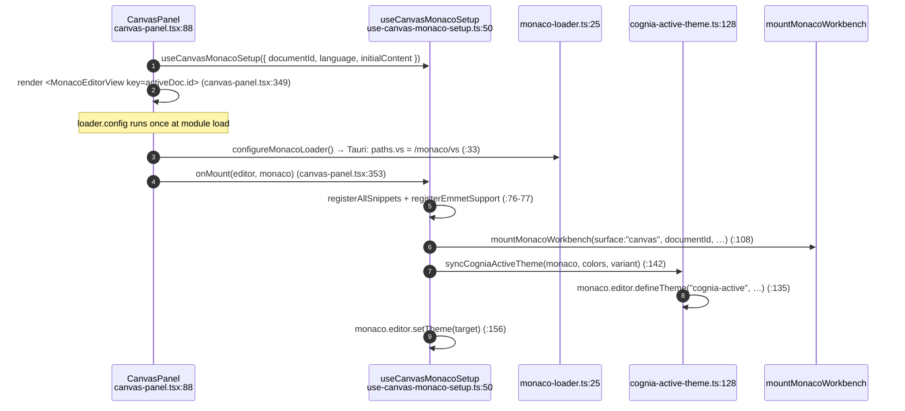

# Editor Core

<Status variant="stable" />

<TLDR>
  `CanvasPanel` (`components/canvas/canvas-panel.tsx:88`) mounts Monaco through a lazy
  `next/dynamic` import (`:69`, `ssr: false`) and configures it with `useCanvasMonacoSetup`
  (`hooks/canvas/use-canvas-monaco-setup.ts:50`). The loader is pointed at offline assets under Tauri
  by `configureMonacoLoader` (`lib/canvas/monaco-loader.ts:25`). Editor theming syncs the app palette
  into a single Monaco theme via `syncCogniaActiveTheme` (`lib/canvas/themes/cognia-active-theme.ts:128`).
  Layout is a resizable 3-pane `CanvasShell` (`canvas-shell.tsx:41`) persisted to
  `useCanvasLayoutStore`.
</TLDR>

## Mounting Monaco

Monaco is a large bundle, so it is never server-rendered. `CanvasPanel` imports the editor lazily and
shows a spinner until it loads:

```ts title="components/canvas/canvas-panel.tsx:69"
const MonacoEditorView = dynamic(
  () => import("@monaco-editor/react").then((mod) => mod.default),
  { ssr: false, loading: () => <EditorLoading /> },
)
```

The render path keys the editor by document id so it remounts cleanly per document, and wires the
`onMount` callback to capture the editor handle and hand it to the setup hook:



Two non-obvious fixes live in the panel:

- **Layout thrash** — a `ResizeObserver` debounced **60 ms** calls `editor.layout()` to defeat
  Monaco's flex-shrink bug (`canvas-panel.tsx:177-193`).
- **First-paint theme** — `resolvedMonacoTheme` resolves a concrete `vs` / `vs-dark` id before the
  custom theme registers, preventing an unknown-id flash (`canvas-panel.tsx:122-126`).


## Mobile: the light editor

On mobile viewports (and the Capacitor shell) Monaco is never mounted. Every code-editing
surface swaps in the shared **`LightCodeEditor`** (`components/editor/light-code-editor.tsx`)
— a CodeMirror 6 editor with syntax highlighting, line numbers, history, and find/replace.
Grammars lazy-load per language (`components/editor/load-language-support.ts`); the CM core
is already in the bundle via the workflow expression field, so the incremental cost is the
grammar of the language being opened. The light editor never calls `mountMonacoWorkbench`,
so no LSP affordance exists on mobile by construction.

| Surface   | Desktop                               | Mobile                                       |
| --------- | ------------------------------------- | -------------------------------------------- |
| Canvas    | Monaco (`canvas-panel.tsx`)           | `LightCodeEditor` (`useIsMobile`)            |
| Skills    | Monaco + resizable 3-pane (persisted) | `LightCodeEditor` + tree/validation Sheets   |
| Artifacts | Monaco + LSP workbench (edit mode)    | `LightCodeEditor` (`panelMode === "mobile"`) |

Canvas toolbar actions degrade to whole-document semantics without a Monaco ref: AI actions
operate on the full document, format actions append their scaffold, and auto-save reads the
store copy of the active document.

## Offline Loader (Tauri)

Tauri's strict CSP forbids loading Monaco from a CDN, so `configureMonacoLoader` is idempotent and
branches on platform:

| Mode | Behavior | Lines |
| --- | --- | --- |
| Tauri (`isTauri()`) | `loader.config({ paths: { vs: "/monaco/vs" } })` — bundled assets copied by the `prebuild` step | `monaco-loader.ts:33-36` |
| Web + override | reads `NEXT_PUBLIC_MONACO_VS_PATH`, configures that path | `monaco-loader.ts:40-44` |
| Web default | leaves the default jsdelivr CDN | (no-op) |

## Theme Sync

The editor has a single canonical theme id, `cognia-active` (`cognia-active-theme.ts:27`), rebuilt
from the live app appearance on every change:

- `buildCogniaActiveEditorTheme` (`cognia-active-theme.ts:62`) maps the 27-field appearance palette
  to a 20-field editor `ThemeColors`, deriving line-highlight and indent guides by lighten/darken and
  leaving `tokenColors` empty so the base theme's syntax highlighting is inherited.
- `syncCogniaActiveTheme` (`cognia-active-theme.ts:128`) registers it into the `ThemeRegistry`
  (`theme-registry.ts:203`) and calls `monaco.editor.defineTheme`.
- The setup hook re-runs the sync whenever the resolved theme or appearance changes
  (`use-canvas-monaco-setup.ts:130-146`) and applies the explicit user preference, or `cognia-active`
  when the preference is `"auto"` (`:151-160`).

Five built-in themes ship in `BUILTIN_THEMES` (`theme-registry.ts:93`): `vs-dark`, `vs`, `monokai`,
`github-dark`, `one-dark-pro`. `toMonacoTheme` (`:256`) converts a `ThemeColors` record into Monaco's
`colors` map plus token rules with `inherit: true`.

## Layout Shell

`CanvasShell` (`canvas-shell.tsx:41`) chooses `CanvasDesktopShell` (`:48`) or `CanvasMobileShell`
(`:138`). The desktop shell is a `ResizablePanelGroup` keyed by `layoutVersion` so a layout reset
forces a remount; sizes are clamped and rescaled to sum 100 % then persisted through
`useCanvasLayoutStore.setSizes`:

| Panel | Min | Max | Content |
| --- | --- | --- | --- |
| Left (`canvas-left`) | 12 | 32 | `CanvasDocumentRail` (`:99`) |
| Center (`canvas-center`) | 46 | — | `CanvasWorkspace` (`:110`) |
| Right (`canvas-right`) | 16 | 28 | `CanvasSidePanels` (`:130`) |

Clamp constants are exported from the file (`CANVAS_SHELL_LEFT_MIN = 12` … `CANVAS_SHELL_RIGHT_MAX = 28`,
`canvas-shell.tsx:34-39`). The mobile shell renders the rail and side panels inside left/right
`Sheet`s, with the editor full-width.

### Layout shortcuts

`useCanvasLayoutShortcuts` (`use-canvas-layout-shortcuts.ts:17`) binds `Cmd/Ctrl+B` (toggle left
rail) and `Cmd/Ctrl+J` (toggle right rail) — but **bails when focus is inside `.monaco-editor`**
(`:31-37`) so Monaco's own `Cmd+B` / `Cmd+J` keep working.

## Document Rail

`CanvasDocumentRail` (`canvas-document-rail.tsx:104`) reads the store directly and groups documents by
recency via `groupByTime` (`:65`) into pinned / today / yesterday / this-week / older buckets (24 h =
`86400000` ms, `:78`). Pinning is backed by `useCanvasLayoutStore.pinnedDocIds`. Per-row context menu
covers rename / duplicate / export (Blob → `${title}.md`, `:170-180`) / pin / delete.

`AnimatePresence` is intentionally omitted from the list (`:308-319`) because its exit animation broke
the jsdom search-filter test — only `STAGGER_CONTAINER` entry motion is used.

## Symbols and Snippets

These registries are mounted in `onMount` (`use-canvas-monaco-setup.ts:76-99`, each call guarded by
try/catch → `loggers.canvas.warn`):

- **Symbols** — `SymbolParser` (`symbol-parser.ts:45`) is a regex-driven parser for JS/TS/Python.
  `parseSymbols` (`:52`) computes line/block ranges via brace counting (`findBlockEnd`, `:149`, capped
  at `startLine + 20` on failure), recurses into children, and exposes lookups
  (`findSymbolAtLine` `:190`, `getSymbolBreadcrumb` `:246`).
- **Snippets** — `SnippetProvider` (`snippet-registry.ts:252`) merges built-in + custom snippets per
  language from `SNIPPET_REGISTRY` (`:244`); `applySnippet` (`:299`) strips `${n:default}` placeholders.
Plugins reach the editor through the **main** plugin system, not a canvas-local one:
`PluginExtensionSlot point="canvas.toolbar"` / `"canvas.sidebar"` (declared in
`lib/plugin/contracts/plugin-points.ts:465`, mounted at `canvas-panel.tsx`), plus the document /
selection / comment surface in `lib/plugin/api/canvas-api.ts`. A second, canvas-local
`CanvasPluginManager` existed in `lib/canvas/plugins/` with its own `CanvasPlugin` shape, completions,
diagnostics and hover hooks — it had no registration path and no consumer, and was removed rather than
documented as a competing plugin model.

## Large Documents

There is no JS-side chunking: Monaco already virtualises rendering, and a parallel chunk store fights
its model. `lib/canvas/large-file-optimizer.ts`, `stores/canvas/chunked-document-store.ts` and
`hooks/canvas/use-chunk-loader.ts` implemented one, had zero consumers, and were removed.

What remains is the degradation profile: `getCanvasPerformanceProfile` (`utils.ts:151`) picks
`standard` / `large` / `very-large` modes with per-mode symbol-parse debounce (500 / 900 / 1500 ms)
and feature toggles (`CANVAS_LARGE_DOCUMENT_THRESHOLDS`, `utils.ts:133`).

## Action Keybindings

`useCanvasKeyboardShortcuts` (`use-canvas-keyboard-shortcuts.ts:17`) is the runtime consumer of the
keybinding store. On a Cmd/Ctrl keydown it resolves the bound action through
`useKeybindingStore.getActionByKeybinding` (`:22`) and dispatches a `canvas-action` `CustomEvent`
(`:41-50`) which `CanvasPanel` listens for (`canvas-panel.tsx:141-149`). Fallbacks: `Ctrl+K` → inline
command, and `DEFAULT_KEY_ACTION_MAP[e.key]` (`constants.ts:83`). Bindings are edited in
`KeybindingSettings` (covered in [Execution & comments](./execution-comments#keybindings)).

## Next

<Cards>
  <Card title="State & persistence" href="./state-persistence" description="Where the editor's content actually lives" />
  <Card title="AI actions & suggestions" href="./ai-actions" description="The toolbar that wraps the editor" />
</Cards>
