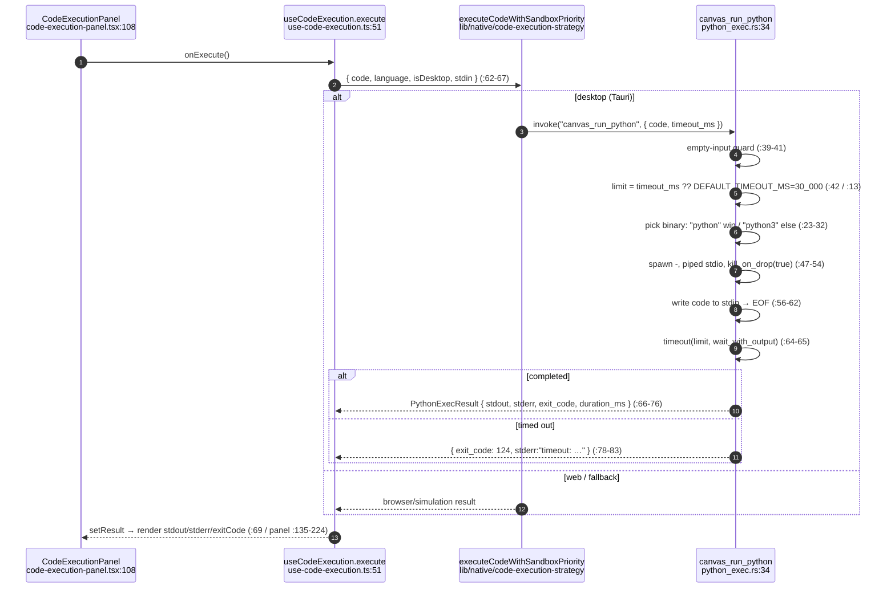
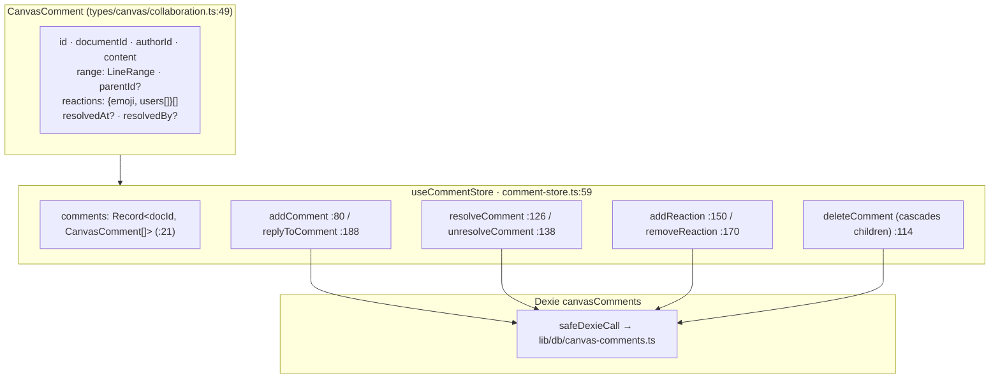
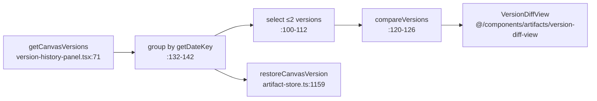

# Execution & Comments

<Status variant="stable" />

<TLDR>
  Three side-panel features share this page. **Execution** runs Python by spawning a real interpreter
  on the Rust side — `canvas_run_python` (`src-tauri/src/canvas/python_exec.rs:34`), 30 s timeout,
  `exit_code: 124` on timeout — reached through a sandbox-priority strategy, not a direct `invoke`.
  **Comments** are flat `CanvasComment` rows threaded by `parentId`, anchored to a `LineRange`, with
  emoji reactions and resolve, mirrored to Dexie (`comment-store.ts:59`). **Versioning** lists
  `CanvasDocumentVersion` snapshots grouped by date and renders a positional line-diff (not Monaco
  `DiffEditor`).
</TLDR>

## Python Sandbox

Key facts:

- The hook **does not** call `invoke("canvas_run_python")` directly — it delegates to
  `executeCodeWithSandboxPriority` in `lib/native/code-execution-strategy` (`use-code-execution.ts:62`),
  which holds the desktop-first / browser / simulation ladder; `isDesktop` comes from `useNativeStore`.
- The Rust result struct `PythonExecResult` (`python_exec.rs:15`) has `stdout`, `stderr`, `exit_code`,
  `duration_ms` — there is no `success` field; callers infer success from `exit_code`.
- **Isolation** is minimal: a subprocess bound only by the 30 s timeout and `kill_on_drop(true)`
  (`:52`). No firejail/Docker; Canvas assumes a trusted local machine.
- `cancel()` (`use-code-execution.ts:104`) is a cooperative UI flag — it stops the hook reporting the
  result but does not actively kill the Rust child; the child is bounded by the timeout + drop.
- Rust tests: `rejects_empty_input` (`:93`) and `timeout_returns_124` (`:99`, asserts `exit_code == 124`).

`CodeExecutionPanel` (`code-execution-panel.tsx:46`) is presentational — it combines stdout+stderr into
a terminal view (`:57`), colors `exitCode` green/red (`:135-144`), shows a `simulated` badge when the
result came from the fallback (`:95-99`), and a Run/Stop toggle (`:102-112`).

## Comments

Comments are stored flat per document and threaded only by `parentId`:

- **Threading** — `replyToComment` (`comment-store.ts:188`) creates a normal comment inheriting the
  parent's `range` and setting `parentId` (`:198-199`). The UI splits roots vs replies at render
  (`comment-panel.tsx:79`, `getReplies` `:86`). `deleteComment` cascades one level (`:114-124`).
- **Anchoring** — comments carry a `LineRange`; `getCommentsInRange` (`:215`) overlaps on
  `startLine`/`endLine` (`:219`).
- **Reactions** — `{ emoji, users[] }`; `addReaction` pushes the user (`:150`), `removeReaction` prunes
  empty groups (`:170`). Emoji set from `REACTION_EMOJIS` (`lib/canvas/constants.ts:95`).
- **Resolve** — sets/clears `resolvedAt` + `resolvedBy` (`:126` / `:138`); `getUnresolvedComments`
  (`:223`) returns only unresolved roots — the source of the side-panel badge count.
- **Persistence** — every mutation updates memory then fire-and-forgets to Dexie via `safeDexieCall`
  (`:53`); `loadCommentsForDocument` (`:64`) is idempotent. A one-shot localStorage→Dexie migration
  runs on import (`hydrateLegacyLocalStorage`, `:248`).

`CommentPanel` (`comment-panel.tsx:44`) is a right-side Sheet: a textarea + selected line-range badge,
a show/hide-resolved toggle, and `CommentThread` (`:266`) per root with author avatar, relative time,
an `L{startLine}` range badge, resolve toggle, reactions row, inline reply form, and nested
`ReplyItem`s (`:460`).

## Version Timeline

`VersionHistoryPanel` (`version-history-panel.tsx:52`) reads versions from `useArtifactStore` (not a
canvas-specific store): `getCanvasVersions` (`:71`) → grouped by date key (`:132-142`) → one
`VersionItem` (`:379`) per snapshot, with current / auto-save badges and a line count.

- **Diff** — the panel imports the **artifacts** copy of `VersionDiffView` (`:45`). A parallel
  canvas-local copy exists at `components/canvas/version-diff-view.tsx`; both implement a **positional**
  line walk (`computeLineDiff`, `version-diff-view.tsx:37`) emitting `added`/`removed`/`unchanged`/pair
  rows — neither is a Monaco `DiffEditor` nor a true LCS.
- **Restore** — `handleRestoreVersion` (`:79`) → `restoreCanvasVersion(documentId, versionId)`, which
  auto-saves the current content first (`artifact-store.ts:1159`).
- **Save / delete** — `saveCanvasVersion(documentId, desc, false)` for a manual snapshot (`:73`);
  delete behind an `AlertDialog` confirm (`:83-88`).

## Keybindings

`KeybindingSettings` (`keybinding-settings.tsx:48`) edits `useKeybindingStore`. A key-capture `Input`
records combos via `parseKeyEvent` (`handleKeyDown` `:76`, Enter commits `setKeybinding` `:89`, Escape
cancels). Conflicts are detected and badged (`:151-153`); bindings export to
`canvas-keybindings.json` (`:104`) and import back (`:117`). The same `parseKeyEvent` + store power the
runtime dispatcher `useCanvasKeyboardShortcuts` (see [Editor core](./editor-core#action-keybindings)),
so settings and runtime never drift.

## Tests

| File | Covers |
| --- | --- |
| `src-tauri/src/canvas/python_exec.rs` | `rejects_empty_input`, `timeout_returns_124` |
| `hooks/canvas/use-code-execution.test.ts` | strategy delegation, abort, error result |
| `stores/canvas/comment-store.test.ts` | threading, reactions, resolve, legacy migration |
| `components/canvas/comment-panel.test.tsx` | thread render, reply, reaction toggle |
| `components/canvas/version-history-panel.test.tsx` | grouping, compare, restore, delete |
| `components/canvas/version-diff-view.test.tsx` | positional line diff |

## Next

<Cards>
  <Card title="Collaboration" href="./collaboration" description="The real-time co-editing tab" />
  <Card title="State & persistence" href="./state-persistence" description="Where versions and comments are stored" />
</Cards>
